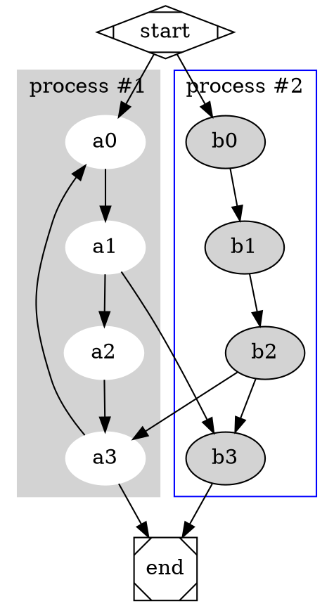
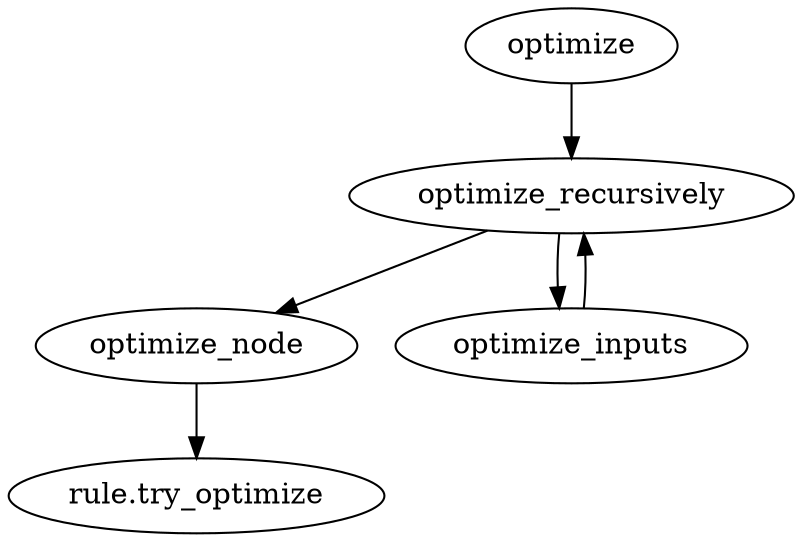

逻辑计划是dataframe中的主要结构，后续的优化和执行也都是围绕逻辑计划展开。从逻辑计划转成执行计划，最后转成输出流输出。逻辑相关操作包括生成逻辑计划和逻辑优化

## 逻辑计划 logical_plan
### 逻辑计划分类
LogicalPlan是一个枚举结构，包含了：
- Projection        (主体)
- Filter                 (Filter语句)
- Window            (Window)语句
- Aggregate        (聚合语句)
- Sort(Sort)                        # sort语句
- Join(Join)                        # join语句
- CrossJoin(CrossJoin)    
- Repartition(Repartition)
- Union(Union)
- TableScan(TableScan)
- EmptyRelation(EmptyRelation)
- Subquery(Subquery)
- SubqueryAlias(SubqueryAlias)
- Limit(Limit)
- CreateExternalTable(CreateExternalTable)
- CreateMemoryTable(CreateMemoryTable)
- CreateView(CreateView)
- CreateCatalogSchema(CreateCatalogSchema)
- CreateCatalog(CreateCatalog)
- DropTable(DropTable)
- DropView(DropView)
- Values(Values)
- Explain(Explain)
- Analyze(Analyze)
- Extension(Extension)
- Distinct(Distinct)
- SetVariable(SetVariable)
- Prepare(Prepare)
- Dml(DmlStatement)
- DescribeTable(DescribeTable)
- Unnest(Unnest)

**`具体数据结构`**：
![[logical-plan.png]]

#### 逻辑表达式
- Expr::Alias
- Expr::Column

## 逻辑优化过程 logical_optimize
- InlineTableScan                              # 优化表扫描和内联
- TypeCoercion                                 # 类型重写
- SimplifyExpressions                      # 简化表达式
- UnwrapCastInComparison            # 去掉cast 重写表达式
- ReplaceDistinctWithAggregate    # 把 Distinct 替换成 Aggregate
- DecorrelateWhereExists                # 重写子查询到join
- DecorrelateWhereIn                       # 子查询中where in 操作
- ScalarSubqueryToJoin                   # 标量子查询
- ExtractEquijoinPredicate               # 提炼equi-join
- SimplifyExpressions                       # 简化子表达式
- MergeProjection                              # merge语句优化
- RewriteDisjunctivePredicate          # 提取谓语重写，扁平化表达式
- EliminateDuplicatedExpr                # 排除重复的表达式
- EliminateFilter                                  # 排除Filter
- EliminateCrossJoin                          # 排除CrossJoin
- CommonSubexprEliminate             # Perform Common Sub-expression Elimination optimization. 
- EliminateLimit                                   # Optimization rule that bottom-up to eliminate plan by propagating empty_relation.
- PropagateEmptyRelation                # Optimization rule that bottom-up to eliminate plan by propagating empty_relation.
- FilterNullJoinKeys                            # FilterNullJoinKeys
- EliminateOuterJoin                          # Attempt to replace outer joins with inner joins.
- PushDownLimit                                # LIMIT下推
- PushDownFilter                                # Filter下推
- SingleDistinctToGroupBy                # single distinct to group by optimizer rule
- SimplifyExpressions                         # 进一步简化表达式
- UnwrapCastInComparison               # attempts to remove casts from comparisons to literals
- CommonSubexprEliminate              # Perform Common Sub-expression Elimination optimization.
- PushDownProjection                        # Optimizer that removes unused projections and aggregations from plans
- EliminateProjection                           # Optimization rule that eliminate unnecessary
- PushDownLimit                                 # Optimization rule that tries to push down LIMIT

逻辑优化调用关系

