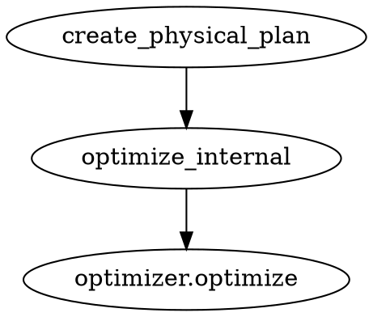

datafusion 的物理优化过程，逻辑计划优化后通过create_physical_plan 生成执行计划ExecutionPlan，最后还会对执行计划进行物理优化(physical_optimizer)
``` rust
async fn create_physical_plan(
	&self,
	logical_plan: &LogicalPlan,
	session_state: &SessionState,
) -> Result<Arc<dyn ExecutionPlan>> {
	match self.handle_explain(logical_plan, session_state).await? {
		Some(plan) => Ok(plan),
		None => {
			let plan = self
				.create_initial_plan(logical_plan, session_state)
				.await?;
			self.optimize_internal(plan, session_state, |_, _| {})
		}
	}
}
```

## 执行计划
### 执行计划定义：
``` rust
pub trait ExecutionPlan: Debug + Send + Sync {
    fn schema(&self) -> SchemaRef;
    fn output_partitioning(&self) -> Partitioning;
    fn unbounded_output(&self, _children: &[bool]) -> Result<bool> { Ok(false) }
    fn output_ordering(&self) -> Option<&[PhysicalSortExpr]>;
    fn required_input_distribution(&self) -> Vec<Distribution> {
        vec![Distribution::UnspecifiedDistribution; self.children().len()]
    }
    fn required_input_ordering(&self) -> Vec<Option<&[PhysicalSortExpr]>> {
        vec![None; self.children().len()]
    }
    fn maintains_input_order(&self) -> Vec<bool> {
        vec![false; self.children().len()]
    }
    fn benefits_from_input_partitioning(&self) -> bool {
        // By default try to maximize parallelism with more CPUs if
        // possible
        !self
            .required_input_distribution()
            .into_iter()
            .any(|dist| matches!(dist, Distribution::SinglePartition))
    }
    fn equivalence_properties(&self) -> EquivalenceProperties {
        EquivalenceProperties::new(self.schema())
    }
    fn children(&self) -> Vec<Arc<dyn ExecutionPlan>>;
    fn with_new_children(
        self: Arc<Self>,
        children: Vec<Arc<dyn ExecutionPlan>>,
    ) -> Result<Arc<dyn ExecutionPlan>>;
    fn execute(
        &self,
        partition: usize,
        context: Arc<TaskContext>,
    ) -> Result<SendableRecordBatchStream>;
    fn metrics(&self) -> Option<MetricsSet> { None }
    fn fmt_as(&self, _t: DisplayFormatType, f: &mut fmt::Formatter) -> fmt::Result {
        write!(f, "ExecutionPlan(PlaceHolder)")
    }
    fn statistics(&self) -> Statistics;
}
```

### 执行计划分类
- ProjectionExec
- AnalyzeExec
- CoalesceBatchesExec
- CoalescePartitionsExec
- EmptyExec
- ExplainExec
- FilterExec
- GlobalLimitExec
- LocalLimitExec
- UnnestExec
- UnionExec
- WindowAggExec
- BoundedWindowAggExec
- ValuesExec
- RepartitionExec
- SortExec
- 物理Join执行计划
	- CrossJoinExec
	- HashJoinExec
	- NestedLoopJoinExec
	- SortMergeJoinExec
	- SymmetricHashJoinExec

![[execution-join.png]]

#### 分区模式PartitionMode
- Partitioned  (左/右孩子使用左键和右键进行分区，左右两边都进行分区）
- CollectLeft  (左侧将收集到一个分区)
- Auto             (优化器JoinSelection将根据统计信息决定哪种 PartitionMode 模式（Partitioned/CollectLeft）。同时它还会考虑交换 Join 的左右输入)

#### Repartition执行计划
- 
#### 文件执行计划
![[file-execution-plan.png]]

## 物理优化

物理优化是基于代价（CBO）的优化，datafusion的物理优化过程
> Use SessionState::create_physical_plan or 
> Use DataFrame::create_physical_plan to ensure a consistent state for planning and execution



### 物理指标
物理优化是基于代价（CBO）的优化，因此需要先定义指标，根据各种指标来计算代价。datafusion定义的物理指标有：
- BaselineMetrics() => "baseline"
- MemTrackingMetrics() => "memtracking"

指标参考值有：
- Count(_) => "count"
- Gauge() => "gauge"
- Time() => "time"
- OutputRows(Count) => "output_rows"
- SpillCount(Count) => "spill_count"
- SpilledBytes(Count) => "spilled_bytes"
- CurrentMemoryUsage(Gauge) => "mem_used"
- ElapsedCompute(Time) => "elapsed_compute"
- StartTimestamp(Timestamp) => "start_timestamp"
- EndTimestamp(_) => "end_timestamp"

### 物理优化过程：
- AggregateStatistics     # Optimizer that uses available statistics for aggregate functions
- Repartition                    # The EnforceDistribution rule ensures that distribution requirements are met in the strictest way
- GlobalSortSelection
- EnforceDistribution
- EnforceSorting
- JoinSelection 
- AggregateStatistics
- Repartition
- PipelineChecker
- PipelineFixer
- CoalesceBatches


#### AggregateStatistics
	Utilizing exact statistics from sources to avoid scanning data(利用来源的精确统计数据来避免扫描数据)

```rust 
optimize(&self, plan: Arc<dyn ExecutionPlan>, config: &ConfigOptions) -> Result<Arc<dyn ExecutionPlan>>
	take_optimizable(node: &dyn ExecutionPlan) -> Option<Arc<dyn ExecutionPlan>>
	take_optimizable_column_count(agg_expr: &dyn AggregateExpr, stats: &Statistics) -> Option<(ScalarValue, String)>
	take_optimizable_max(agg_expr: &dyn AggregateExpr, stats: &Statistics) -> Option<(ScalarValue, String)>
	take_optimizable_min(agg_expr: &dyn AggregateExpr, stats: &Statistics) -> Option<(ScalarValue, String)>
	take_optimizable_table_count(agg_expr: &dyn AggregateExpr, stats: &Statistics) -> Option<(ScalarValue, &'static str)>
```

#### Repartition 
	Repartition optimizer that introduces repartition nodes to increase the level of parallelism available
	目标是通过进行重新分区增加分区数量以提高可用的并行度

```rust
optimize(&self, plan: Arc<dyn ExecutionPlan>, config: &ConfigOptions) -> Result<Arc<dyn ExecutionPlan>>
	plan_has_required_input_ordering(plan: &dyn ExecutionPlan) -> bool
	optimize_partitions(target_partitions: usize, plan: Arc<dyn ExecutionPlan>, is_root: bool, can_reorder: bool, would_benefit: bool, repartition_file_scans: bool, repartition_file_min_size: usize) -> Result<Arc<dyn ExecutionPlan>>
```

#### GlobalSortSelection
	Currently for a sort operator, if
	- there are more than one input partitions
	- and there's some limit which can be pushed down to each of its input partitions
	then [SortPreservingMergeExec] with local sort with a limit pushed down will be preferred;
	Otherwise, the normal global sort [SortExec] will be used.
	Later more intelligent statistics-based decision can also be introduced.
	For example, for a small data set, the global sort may be efficient enough

``` rust
optimize(&self, plan: Arc<dyn ExecutionPlan>, config: &ConfigOptions) -> Result<Arc<dyn ExecutionPlan>>
```

#### JoinSelection
	For hash join with the partition mode [PartitionMode::Auto], JoinSelection rule will make
	a cost based decision to select which PartitionMode mode(Partitioned/CollectLeft) is optimal
	based on the available statistics that the inputs have.
	If the statistics information is not available, the partition mode will fall back to [PartitionMode::Partitioned].
	
	JoinSelection rule will also reorder the build and probe phase of the hash joins
	based on the avaliable statistics that the inputs have.
	The rule optimizes the order such that the left (build) side of the join is the smallest.
	If the statistics information is not available, the order stays the same as the original query.
	JoinSelection rule will also swap the left and right sides for cross join to keep the left side
	is the smallest.

``` rust
optimize(&self, plan: Arc<dyn ExecutionPlan>, config: &ConfigOptions) -> Result<Arc<dyn ExecutionPlan>>
	partitioned_hash_join(hash_join: &HashJoinExec) -> Result<Arc<dyn ExecutionPlan>>
	should_swap_join_order(left: &dyn ExecutionPlan, right: &dyn ExecutionPlan) -> bool
	swap_hash_join( hash_join: &HashJoinExec, partition_mode: PartitionMode, ) -> Result<Arc<dyn ExecutionPlan>>
		swap_join_filter(filter: Option<&JoinFilter>) -> Option<JoinFilter>
		swap_join_type(join_type: JoinType) -> JoinType
	swap_reverting_projection( left_schema: &Schema, right_schema: &Schema, ) -> Vec<(Arc<dyn PhysicalExpr>, String)>
	try_collect_left( hash_join: &HashJoinExec, collect_threshold: Option<usize>, ) -> Result<Option<Arc<dyn ExecutionPlan>>>
		supports_collect_by_size( plan: &dyn ExecutionPlan, collection_size_threshold: usize, ) -> bool
		supports_swap(join_type: JoinType) -> bool
```

#### EnforceDistribution
	The EnforceDistribution rule ensures that distribution requirements are met
	in the strictest way. It might add additional [RepartitionExec] to the plan tree
	and give a non-optimal plan, but it can avoid the possible data skew in joins.
	
	For example for a HashJoin with keys(a, b, c), the required Distribution(a, b, c) can be satisfied by
	several alternative partitioning ways: [(a, b, c), (a, b), (a, c), (b, c), (a), (b), (c), ( )].
	
	This rule only chooses the exactly match and satisfies the Distribution(a, b, c) by a HashPartition(a, b, c).

``` rust
optimize(&self, plan: Arc<dyn ExecutionPlan>, config: &ConfigOptions) -> Result<Arc<dyn ExecutionPlan>>
	adjust_input_keys_ordering(requirements: PlanWithKeyRequirements) -> Result<Option<PlanWithKeyRequirements>>
	ensure_distribution(plan: Arc<dyn crate::physical_plan::ExecutionPlan>, target_partitions: usize) -> Result<Arc<dyn crate::physical_plan::ExecutionPlan>>
	expected_expr_positions(current: &[Arc<dyn PhysicalExpr>], expected: &[Arc<dyn PhysicalExpr>]) -> Option<Vec<usize>>
	extract_join_keys(on: &[(Column, Column)]) -> JoinKeyPairs
	map_columns_before_projection(parent_required: &[Arc<dyn PhysicalExpr>], proj_exprs: &[(Arc<dyn PhysicalExpr>, String)]) -> Vec<Arc<dyn PhysicalExpr>>
	new_join_conditions(new_left_keys: &[Arc<dyn PhysicalExpr>], new_right_keys: &[Arc<dyn PhysicalExpr>]) -> Vec<(Column, Column)>
	reorder_aggregate_keys(agg_plan: Arc<dyn ExecutionPlan>, parent_required: &[Arc<dyn PhysicalExpr>], group_by: &PhysicalGroupBy, aggr_expr: &[Arc<dyn AggregateExpr>], agg_input: Arc<dyn ExecutionPlan>, input_schema: &SchemaRef) -> Result<PlanWithKeyRequirements>
	reorder_current_join_keys(join_keys: JoinKeyPairs, left_partition: Option<Partitioning>, right_partition: Option<Partitioning>, left_equivalence_properties: &EquivalenceProperties, right_equivalence_properties: &EquivalenceProperties) -> Option<(JoinKeyPairs, Vec<usize>)>
	reorder_join_keys_to_inputs(plan: Arc<dyn crate::physical_plan::ExecutionPlan>) -> Result<Arc<dyn crate::physical_plan::ExecutionPlan>>
	reorder_partitioned_join_keys<F>(join_plan: Arc<dyn ExecutionPlan>, parent_required: &[Arc<dyn PhysicalExpr>], on: &[(Column, Column)], sort_options: Vec<SortOptions>, join_constructor: &F) -> Result<PlanWithKeyRequirements> where F: Fn((Vec<(Column, Column)>, Vec<SortOptions>)) -> Result<Arc<dyn ExecutionPlan>>
	shift_right_required(parent_required: &[Arc<dyn PhysicalExpr>], left_columns_len: usize) -> Option<Vec<Arc<dyn PhysicalExpr>>>
```

#### EnforceSorting
    EnforceSorting optimizer rule inspects the physical plan with respect
    to local sorting requirements and does the following:
    - Adds a [SortExec] when a requirement is not met,
    - Removes an already-existing [SortExec] if it is possible to prove
      that this sort is unnecessary
    The rule can work on valid *and* invalid physical plans with respect to
    sorting requirements, but always produces a valid physical plan in this sense.
    
    A non-realistic but easy to follow example for sort removals: Assume that we
    somehow get the fragment
    
    ```text
    SortExec: expr=[nullable_col@0 ASC]
      SortExec: expr=[non_nullable_col@1 ASC]
    ```
    
    in the physical plan. The first sort is unnecessary since its result is overwritten
    by another SortExec. Therefore, this rule removes it from the physical plan.

``` rust
optimize(&self, plan: Arc<dyn ExecutionPlan>, config: &ConfigOptions) -> Result<Arc<dyn ExecutionPlan>>
	plan_requirements.transform_up(&ensure_sorting)
	plan_with_coalesce_partitions.transform_up(&parallelize_sorts)
```
#### PipelineFixer
    The [PipelineFixer] rule tries to modify a given plan so that it can
    accommodate its infinite sources, if there are any. If this is not
    possible, the rule emits a diagnostic error message.

```rust
optimize(&self, plan: Arc<dyn ExecutionPlan>, config: &ConfigOptions) -> Result<Arc<dyn ExecutionPlan>>
	hash_join_convert_symmetric_subrule( input: PipelineStatePropagator, ) -> Option<Result<PipelineStatePropagator>>
		is_suitable_for_symmetric_hash_join(hash_join: &HashJoinExec) -> Result<bool>
			check_support(expr: &Arc<dyn PhysicalExpr>) -> bool
	hash_join_swap_subrule( input: PipelineStatePropagator, ) -> Option<Result<PipelineStatePropagator>>
		swap(hash_join: &HashJoinExec) -> Result<Arc<dyn ExecutionPlan>>
	apply_subrules_and_check_finiteness_requirements( mut input: PipelineStatePropagator, physical_optimizer_subrules: &Vec<Box<PipelineFixerSubrule>>, ) -> Result<Option<PipelineStatePropagator>>
		
```
#### CoalesceBatches
    CoalesceBatches optimizer that groups batches together rows
    in bigger batches to avoid overhead with small batches

``` rust
optimize(&self, plan: Arc<dyn crate::physical_plan::ExecutionPlan>, config: &ConfigOptions) -> Result<Arc<dyn crate::physical_plan::ExecutionPlan>>
```
#### PipelineChecker
    The [PipelineChecker] rule ensures that a given plan can accommodate its
    infinite sources, if there are any. It will reject non-runnable query plans
    that use pipeline-breaking operators on infinite input(s).

```rust
optimize( &self, plan: Arc<dyn ExecutionPlan>, _config: &ConfigOptions, ) -> Result<Arc<dyn ExecutionPlan>>
	pipeline.transform_up(&check_finiteness_requirements);
