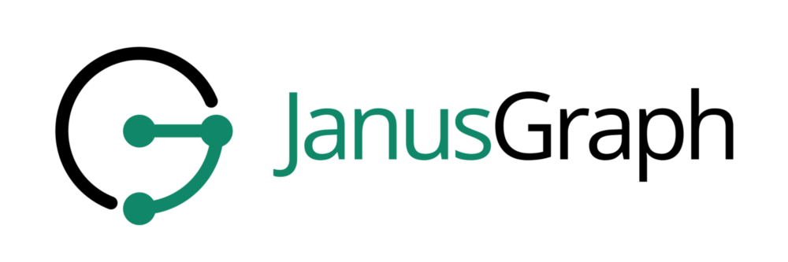

# 图数据库初见

随着互联网的发展，数据集变得越来越庞大的同时数据之间的相互关系也变得越来越复杂；机器学习和人工智能的兴起，除了数据本身外，数据之间的关系也隐藏着巨大的价值。这些都对数据存储提出了更复杂的要求，除了传统的关系型数据库和文档型数据库等面向数据本身的数据库以外，以数据之间的关系为核心的图数据库也在越来越广泛的领域发挥着作用。相比较建立在表的基础之上的关系型数据库，以节点和连接为基础的图数据库看上去更立体化。

相比起传统的关系型数据库，以及逐渐流行起来的文档型数据库和kv数据库，图数据库还处于探索实践的阶段。与传统数据逐条存储形式不同，图数据库更像是将数据平铺开来，以面的形式来呈现。其宽广强大的数据关系表达能力，或许会是互联网埋入下一阶段的基础建设。最近在各大顶级会议上对其的相关讨论逐渐火热，各大公司也都将视线投入到图数据库的研究中。

之前一直有在关注neo4j和ArangoDB的开发进程，现在看到ArangoDB出了一份[各个图数据库的性能对比测试](https://www.arangodb.com/2018/02/nosql-performance-benchmark-2018-mongodb-postgresql-orientdb-neo4j-arangodb/)。这个测试在ycombinator上引起了很大的讨论，自己本来对图数据库也很感兴趣，就想要基于这个测试出发来做一些深入的学习和研究。

## 图数据库的定义

维基百科的定义是这样的：[https://en.wikipedia.org/wiki/Graph\_database](https://en.wikipedia.org/wiki/Graph_database) 。是一个支持使用图数据结构（也就是支持节点的边）作为查询语句的数据库，其本质是一个数据库，因此也是包含计算处理引擎和数据存储引擎这两块，所以图数据库也就包含了这两块相关的特性，在存储上没什么特别的要求，可以将数据存成关系型数据库那种表，也可以将数据存成文档型和kv等类型；在计算引擎方面，针对图这种数据结构，提到了免索引邻接的实现方案（index-free adjancency），用于对图的遍历。（因为wiki上将这个免邻接方案认为是图数据库的一个特征。也引发了社区很大的讨论和疑问）

但是回归到实际的工程应用中，我们需要的是对图数据结构的操作，因此图数据库的核心是图模型，图模型实现的是图论的基本原理和基于图论的数据结构和算法，包括图的遍历和最短路径问题等，在实际应用中可以在社交网络，路径规划等项目中发挥作用。

另外，在实现Graph数据模型时候往往也会实现一些类似的数据模型，比如Document, Key-Value, RDF(知识图谱模型是一个有趣新颖的模型，在互联网维度越来越广的领域会发挥越来越大的作用)。因为这几个模型在实现上相互关联的，所以在实际工程中这些模型也可以做了考虑的因素。

### 图数据库的特点

图数据库本质上是围绕图模型建立的数据存储，作为数据库，查询语言，数据库索引，事务管理，文件系统存储结构等都是主要元素。面对图模型，有别于传统的数据库以行(row)为主，关系是图数据库中主咖。因此在上面这些主要元素方面，图数据库都做特定的设计，

## 几种主流图数据库

图数据库现在正处于探索，发展和推广的时期，之前一直有在关注ArangoDB的开发进程，现在看到ArangoDB出了一份[各个图数据库的性能对比测试](https://www.arangodb.com/2018/02/nosql-performance-benchmark-2018-mongodb-postgresql-orientdb-neo4j-arangodb/)。也在ycombinator上产生了很大的讨论。自己本来对图数据库也很感兴趣，就想要参考这个测试来做一些深入的学习和研究。

参考这个测试，加上自己平时对图数据库的关注。我选择了几个自己比较熟悉有相对主流的图数据库：

1. ArangoDB -- 一直在关注的图数据库 

   

   ArangoDB是一个支持key/value，document和graph模型的multi-model数据库ArangoDB使用了MMFiles和RocksDB两种存储引擎，RocksDB是在新的版本中添加进来，并且将此设为了默认存储引擎。因为底层设计是document的，因此针对graph模型定义的vertex和edge也都是存在document中，edge使用\_from和\_to来做关联。另外ArangoDB还实现了Pregel的分布式图计算，对于实际使用中需要做算法和数据分析等都能直接提供帮助。

2. Neo4j -- 目前使用最广的图数据库
  

  现在最流行的图数据库， 他们定义的Cypher查询语言，在社区中逐渐流行起来，他们也希望将Cypher推向为图查询语言的标准。neo4j从概念上将自己定义为原生图数据库，从宏观角度来看就是它的数据索引和存储模型设计直接是按照图模型结构来，而不依赖别的模型进行存储。neo4j中定义了node和relationship来表达图模型，因为是原生图数据库，所以在relationship的数据结构中就设计了关联指针，而不需要对这一部分构建索引，另外对于最后的数据落盘，针对图数据库中涉及到的node，label，property，relationship都做了独立的文件存储。

  另外neo4j的社区做的很好，不仅有官方文档，还很喜欢出书，书不仅是介绍neo4j，主要是介绍了图数据库以及图数据库的应用，然后结合neo4j来做实际例子，在社区可以直接免费获取电子稿。因为图数据库本身还算一个比较新的领域，大家的使用检验也比较少，这几本书对图数据库的普及和推广做了很大的贡献。

3. JanusGraph -- 是titan的一个分支，在titan停止维护之后发展出来。
  

  JanusGraph 可以说是一个站在巨人肩膀上的工程，他本身titan的一个分支，在titan停止更新后延续了titan的发展。在存储层，实现了cassandra，hbase，bigtable和BerkeleyDB的继承，在搜索方面，支持Elasticsearch, Solr and Lucene（几乎是涵盖了主流的搜索引擎）。在计算方面，又是套上了Apache TinkerPop的图计算框架，因此语法上也是遵守Apache的Germlin语法规范。从语法，计算，存储，搜索方面都使用了流行的先进方案，因此在使用过程中会遇到很多熟悉的用法。

4. RedisGraph/AgensGraph -- 基于redis和PostgreSQL之上视线的图数据库
  RedisGraph是一个Redis模块，基于redismodule api开发，在redis的基础数据结构之上定义除node和edge的数据结构，

  AgensGraph 因为是在PostgreSQL上实现的功能，从底层的存储和事务处理上都是利用PostgreSQL的原有功能，所以在支持GraphDB的同时，它还保留了PG的关系型数据库的功能。AG定义了vlabel和elabel来表示（vertex和edge），使用json document模型来存储，而edge中使用start和end来指示关联。因为PG的存在还可以使用PL/pgSQL和PL/Python来编写一些查询程序，具有一定的可编程性。

| GraphDB    | 查询语言               | 存储引擎                            |           模型           | 开发语言 | 全文搜索                                |
| ---------- | ---------------------- | :---------------------------------- | :----------------------: | -------- | --------------------------------------- |
| ArangoDB   | AQL                    | rocksdb,mmfiles                     | Graph,Document,Key-Value | c++      | 支持:依赖iResearch                      |
| neo4j      | Cypher                 | native graph storage                |          Graph           | java     | 支持:依赖lucence                        |
| JanusGraph | Gremlin                | cassandra,hbase,bigtable,BerkeleyDB |          Graph           | java     | 支持使用elasticsearch，solr和lucene     |
| RedisGraph | openCypher             | redis                               |          Graph,          | c        | 支持：依赖RediSearch（另一个redis模块） |
| AgensGraph | ANSI-SQL and openCyphe | postgre                             |     Graph,Relational     | c        | 依赖PG的支持                            |

上面这几个数据库各有特点，并且核心特点分明。比如neo4j是原生图处理和原生图存储；AgensGraph是建立在postgresql上的二次开发，底层是可靠的关系式存储，在提供图模型存储的同时也提供了RMDB可靠的ACID特性；ArangoDB是基于文档模型存储和文档型数据库，并且在索引设计上是采用了一种称为novel index（结合了hash和链表）的混合索引，跟图数据库中的原生图处理有很大的不同；JanusGraph是底层架设在新型分布式存储，上层使用gremlin的图计算框架，提供了很灵活，编程性很高的图计算方式，在开发和分布式扩展方面都容易实现。这四种图数据库的特点相互交织，通过对他们的原理，特点做对比分析，可以学习到很多图数据库系统的设计实现原理，面对不同应用场景的扬长避短，灵活运用相关的技术。

#### 总结

图数据库是一个包含了语言系统，搜索引擎，存储引擎，图处理计算引擎等的综合系统，实现数据存储的同时还需要支持查询计算等。

图数据在设计上包含了查询语言，索引设计和后端存储；从功能上包括节点和关系的查询，全文搜索，图算法支持；从系统架构和性能稳定性上会涉及到集群和分布式的架构，以及对监控方面的相关支持（提供监控指标，或许当前系统性能等接口）。因此想要对上面这几种数据库做深入的分析和比较的话，就需要从查询语言，索引实现，算法和搜索的支持，后端存储的设计，集群的实现方案以及是否提供了对监控的支持等方面进行对比；然后参照arangodb的性能测试，增加一些测试维度；最后再分析一个关键部分的代码实现；来全面 比较这几个主流的GraphDB的特点优劣，也可以对图数据库的设计实现有更深入的认知。
