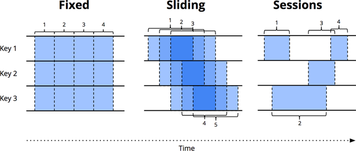

# Chapter1 流101

如今，流数据处理在大数据中是一件大事，而且有充分的理由；其中包括：

- 企业渴望更及时地洞察他们的数据，而切换到流媒体是实现更低延迟的好方法
- 在现代商业中越来越普遍的海量、无界数据集更容易使用专为此类永无止境的数据量设计的系统来驯服。
- 在数据到达时对其进行处理可以随着时间的推移更均匀地分散工作负载，从而产生更一致和可预测的资源消耗。

尽管这种业务驱动的对流媒体的兴趣激增，但与其批处理兄弟相比，流媒体系统长期以来仍然相对不成熟。直到最近，潮流才最终转向另一个方向。在我更加坎坷的时刻，我希望这可能是由于我最初在“Streaming 101”和“Streaming 102”博客文章中提供的大量刺激（本书的前几章相当显然基于）。但实际上，看到流媒体系统的成熟以及许多喜欢构建它们的聪明而活跃的人，也有很多行业兴趣。

尽管在我看来，流媒体宣传的斗争已经取得了有效的胜利，但我仍然会或多或少地原封不动地展示我在“流媒体 101”中的原始论点。一方面，它们在今天仍然非常适用，即使许多行业已经开始注意战斗口号。对于两个人来说，还有很多人还没有收到备忘录；本书是对这些观点的延伸尝试。

首先，我将介绍一些重要的背景信息，这些信息将有助于构建我想讨论的其余主题。我在三个特定部分执行此操作：

术语

​		要准确地谈论复杂的话题，需要对术语进行准确的定义。对于一些在当前使用中具有过多解释的术语，我会尽量准确地确定我所说的意思。

能力

​		我谈到了流媒体系统经常被察觉的缺点。我还提出了我认为数据处理系统构建者需要采用的思维框架，以满足未来现代数据消费者的需求。

时域

​		我介绍了与数据处理相关的两个主要时间域，展示了它们之间的关系，并指出了这两个域带来的一些困难。

### 术语：什么是流？

在继续之前，我想先弄清楚一件事：什么是流媒体？流式传输这个术语今天用于表示各种不同的事物（为了简单起见，到目前为止我一直在使用它有点松散），这可能会导致对流式传输的真正含义或流式传输系统的实际能力产生误解。因此，我更愿意稍微准确地定义这个词。

问题的症结在于，许多应该用它们的本质来描述的事情（无界数据处理、近似结果等），已经被通俗化地描述为它们在历史上是如何完成的（即通过流执行引擎） 。 术语缺乏精确性使流式传输的真正含义变得模糊，在某些情况下，它给流式传输系统本身带来负担，暗示它们的功能仅限于历史上描述为“流式传输”的特征，例如近似或推测结果。

鉴于精心设计的流式处理系统与任何现有批处理引擎一样能够（在技术上更是如此）产生正确、一致、可重复的结果，我更愿意将术语“流式处理”隔离为一个非常具体的含义：
流系统

​		一种在设计时考虑到无限数据集的数据处理引擎。[^1]

如果我想谈论低延迟、近似或推测结果，我会使用这些特定的词，而不是不准确地称它们为“流式传输”。
在讨论可能遇到的不同类型的数据时，精确的术语也很有用。 从我的角度来看，有两个重要的（和正交的）维度定义了给定数据集的形状：*基数和构成*。

数据集的基数决定了它的大小，基数最突出的方面是给定数据集是有限的还是无限的。 以下是我更喜欢使用的两个术语来描述数据集中的粗略基数：

有界数据

​		一种大小有限的数据集 。

无限数据

​		一种无限大的数据集（至少在理论上）。”

基数很重要，因为无限数据集的无限性质给使用它们的数据处理框架带来了额外的负担。 下一节将对此进行更多介绍。

另一方面，数据集的构成决定了它的物理表现。 因此，宪法定义了与相关数据交互的方式。 在第 6 章之前，我们不会深入研究宪法，但为了让您简要了解一下，有两个重要的主要宪法：

表

​	数据集在特定时间点的整体视图。 SQL 系统传统上处理表。

流 [^2]

​	数据集随时间演变的逐个元素视图。 数据处理系统的 MapReduce 沿袭传统上处理的是流。 

我们在第 6 章、第 8 章和第 9 章中深入研究了流和表之间的关系，在第 8 章中，我们还了解了将它们联系在一起的时变关系的统一基本概念。 但在那之前，我们主要处理流，因为这是开发人员在当今大多数数据处理系统（批处理和流）中直接与之交互的构成管道。 它也是最自然地体现了流处理所特有的挑战的宪法。

### 关于流的被大大夸大的局限性

关于这一点，接下来让我们谈谈流系统能做什么和不能做什么，重点是能做什么。 在本章中，我想了解的最重要的事情之一就是精心设计的流媒体系统的能力。 流媒体系统在历史上一直被归入一个提供低延迟、不准确或推测结果的小众市场，通常与功能更强大的批处理系统结合使用以提供最终正确的结果； 换句话说，就是 Lambda 架构。

对于那些还不熟悉 Lambda 架构的人来说，基本思想是在批处理系统旁边运行一个流系统，两者都执行基本相同的计算。流式传输系统为您提供低延迟、不准确的结果（因为使用了近似算法，或者因为流式传输系统本身不提供正确性），一段时间后批处理系统开始运行并为您提供正确的输出。它最初是由 Twitter 的 Nathan Marz（Storm 的创始人）提出的，最终获得了相当大的成功，因为事实上它在当时是一个绝妙的想法。流引擎在正确性方面有点让人失望，批处理引擎和你想象的一样笨拙，所以 Lambda 给了你一种方法来吃你的蛋糕。不幸的是，维护 Lambda 系统很麻烦：您需要构建、配置和维护管道的两个独立版本，最后还要以某种方式合并两个管道的结果。

作为一个花了数年时间致力于强一致性流引擎的人，我也发现 Lambda 架构的整个原理有点令人讨厌。 不出所料，当 Jay Kreps 的“质疑 Lambda 架构”一文发表时，我是它的忠实粉丝。 这是反对双模式执行必要性的第一个高度可见的声明之一。 愉快。 Kreps 在使用像 Kafka 这样的可重放系统作为流互连的背景下解决了可重复性问题，甚至提出了 Kappa 架构，这基本上意味着使用精心设计的系统运行单个管道，该系统是为 手头的工作。 我不相信这个概念需要自己的希腊字母名称，但我原则上完全支持这个想法。

老实说，我会更进一步。 我认为设计良好的流系统实际上提供了严格的批处理功能超集。 模数可能是一个效率增量，现在应该不需要批处理系统。 感谢 Apache Flink 的人们将这个想法铭记在心，并构建了一个在幕后始终保持全流式传输的系统，即使在“批处理”模式下也是如此； 我喜欢它。

> **批处理和流式处理的效率差异**
>
> 我提出的一个不是流系统的固有限制，而仅仅是迄今为止在大多数流系统中所做的设计选择的结果。批处理和流式传输之间的效率差异很大程度上是批处理系统中增加的捆绑和更有效的随机传输的结果。现代批处理系统不遗余力地实现复杂的优化，允许使用惊人的适度计算资源实现显着水平的吞吐量。没有理由不能将使批处理系统成为当今效率重量级的那些聪明的见解类型不能整合到为无限数据设计的系统中，从而为用户提供我们通常认为的高延迟、高效率之间的灵活选择“批处理和低延迟、低效率的“流”处理。这实际上是我们在 Google 使用 Cloud Dataflow 所做的，通过在相同的统一模型下提供批处理和流式运行程序。在我们的案例中，我们使用单独的运行器，因为我们碰巧有两个独立设计的系统针对它们的特定用例进行了优化。从长远来看，从工程的角度来看，我希望看到我们将两者合并为一个系统，该系统融合了两者的最佳部分，同时仍保持选择适当效率水平的灵活性。 但这不是我们今天所拥有的。 老实说，多亏了统一的数据流模型，这甚至不是绝对必要的； 所以它很可能永远不会发生。

所有这一切的必然结果是，流系统的广泛成熟与强大的无界数据处理框架相结合，将及时将 Lambda 架构降级为它所属的大数据历史。我相信是时候让这成为现实了。因为要做到这一点——也就是说，在自己的游戏中击败批次——你真的只需要两件事：

正确性

​		这使您与批次平价。在核心，正确性归结为一致的存储。流系统需要一种随着时间的推移能一直检查持久状态的方法（Kreps 在他的“为什么本地状态是流处理中的基本原语”一文中谈到了这一点），并且它必须设计得足够好，以在机器故障的情况下保持一致。几年前，当 Spark Streaming 首次出现在公共大数据场景中时，它是一个在原本黑暗的流媒体世界中保持一致性的灯塔。值得庆幸的是，从那以后情况有了很大的改善，但令人惊讶的是，仍有多少流媒体系统在没有强一致性的情况下勉强过关。

​		重申一下——因为这一点很重要：精确一次处理需要强一致性[^3]，这是正确性所必需的，这是任何有机会达到或超过批处理系统功能的系统的要求。除非你真的不关心你的结果，否则我恳请你避开任何不提供强一致性状态的流系统。批处理系统不需要您提前验证它们是否能够产生正确的答案；不要将时间浪费在无法满足相同标准的流媒体系统上。

​		如果您想了解更多关于如何在流系统中获得强一致性的信息，我建议您查看 MillWheel、Spark Streaming 和 Flink 快照论文。这三个人都花费了大量时间讨论一致性。 Reuven 将在第 5 章深入探讨一致性保证，如果您仍然发现自己渴望更多，那么在文献和其他地方有大量关于该主题的优质信息。

推理时间的工具

​		这让你超越批处理。 用于推理时间的好工具对于处理不同事件时间偏差的无界、无序数据至关重要。 越来越多的现代数据集表现出这些特征，而现有的批处理系统（以及许多流系统）缺乏必要的工具来应对它们所带来的困难（尽管现在这种情况正在迅速改变，即使在我写这篇文章时也是如此）。 我们将用本书的大部分内容来解释和关注这一点的各个方面。

​		首先，我们对时间域的重要概念有一个基本的了解，然后我们更深入地了解我所说的具有不同事件时间偏斜的无界、无序数据的含义。 然后，我们将在本章的其余部分研究使用批处理和流式系统进行有界和无界数据处理的常用方法。

### 事件时间与处理时间

要令人信服地谈论无限数据处理，需要清楚地了解所涉及的时间域。在任何数据处理系统中，我们通常关心两个时间域：
事件时间
		这是事件实际发生的时间。
处理时间
		这是在系统中观察到事件的时间。
并非所有用例都关心事件时间（如果您的用例不关心，万岁！您的生活会更轻松），但很多用例都关心。示例包括随时间表征用户行为、大多数计费应用程序和许多类型的异常检测，仅举几例。

在理想情况下，事件时间和处理时间总是相等的，事件发生时立即处理。然而，现实并非如此，事件时间和处理时间之间的偏差不仅非零，而且通常是底层输入源、执行引擎和硬件特征的高度可变函数。可能影响偏斜程度的因素包括：

- 共享资源限制，例如网络拥塞、网络分区或非专用环境中的共享 CPU
- 分布式系统逻辑、争用等软件原因
- 数据本身的特征，如密钥分布、吞吐量差异或无序差异（即，一架满载乘客的飞机在整个飞行过程中离线使用手机后将手机退出飞行模式）

因此，如果您在任何真实系统中绘制事件时间和处理时间的进度，您通常会得到一些看起来有点像图 1-1 中的红线的东西。

<i>图 1-1。 时域映射。 x 轴代表系统中的事件时间完整性； 即，事件时间中的时间 X，到该时间为止，事件时间小于 X 的所有数据都已被观察到。 y轴代表处理时间的进度； 也就是说，数据处理系统在执行时观察到的正常时钟时间。</i>

[^4]在图 1-1 中，斜率为 1 的黑色虚线代表理想情况，其中处理时间和事件时间完全相等； 红线代表现实。 在此示例中，系统在处理时间开始时稍有滞后，在中间更接近理想状态，然后在接近结束时再次滞后。 乍一看，该图中有两种类型的偏斜可见，每种都在不同的时域中：

处理时间
		理想和红线之间的垂直距离是处理时间域中的滞后。 该距离告诉您在给定时间的事件发生与处理时间之间观察到的延迟（处理时间）。 这可能是这两种偏差中更自然和更直观的一种。

事件时间
		理想线和红线之间的水平距离是此时管道中的事件时间偏移量。 它会告诉您当前的管道距离理想（事件时间）有多远。

实际上，任何给定时间点的处理时间延迟和事件时间偏差都是相同的； 它们只是看待同一件事的两种方式。[^5] 关于滞后/偏差的重要结论是：因为事件时间和处理时间之间的整体映射不是静态的（即滞后/偏差可以随时间任意变化） ，这意味着如果您关心数据的事件时间（即事件实际发生的时间），则不能仅在管道观察到数据的时间范围内分析数据。 不幸的是，这是许多为无限数据设计的系统历来的运作方式。 为了应对无界数据集的无限本质，这些系统通常提供一些对输入数据进行窗口化的概念。我们稍后会更深入地讨论窗口化，但它本质上意味着将数据集沿时间边界分割成有限的部分。 如果您关心正确性并且有兴趣在事件时间的上下文中分析您的数据，那么您不能像许多系统那样使用处理时间（即处理时间窗口）来定义这些时间边界； 由于处理时间和事件时间之间没有一致的相关性，您的一些事件时间数据最终会出现在错误的处理时间窗口中（由于分布式系统的固有滞后，许多类型的输入的在线/离线性质 来源等），就像把正确性扔到了窗外。 我们将在接下来的部分以及本书的其余部分中的一些示例中更详细地研究这个问题。

不幸的是，按事件时间窗口显示时，情况也不是很乐观。 在无限数据的上下文中，无序和变量偏斜会导致事件时间窗口的完整性问题：在处理时间和事件时间之间缺乏可预测的映射，如何确定何时观察到给定事件时间的所有数据 X？ 对于许多现实世界的数据源，您根本做不到。 但是当今使用的绝大多数数据处理系统都依赖于某种完整性概念，这使它们在应用于无界数据集时处于严重劣势。

我建议，与其试图将无限数据整理成最终变得完整的有限信息批次，不如设计工具让我们能够生活在这些复杂数据集所带来的不确定性世界中。 新数据将会到来，旧数据可能会被收回或更新，我们构建的任何系统都应该能够自行处理这些事实，完整性的概念是针对特定和适当用例的便捷优化，而不是跨语义的必要性 他们都是。

在详细了解这种方法可能是什么样子之前，让我们完成一个更有用的背景：常见的数据处理模式。

### 数据处理模式

在这一点上，我们已经建立了足够的背景，可以开始研究当今有界和无界数据处理中常见的核心使用模式类型。 我们研究这两种类型的处理，并在相关的情况下，在我们关心的两种主要引擎类型的上下文中（批处理和流处理，在这种情况下，我基本上将微批处理与流式处理混为一谈，因为两者之间的差异 在这个级别上并不是非常重要）。

#### 有界数据
处理有界数据在概念上非常简单，可能每个人都熟悉。在图 1-2 中，我们从左边的一个充满熵的数据集开始。我们通过一些数据处理引擎（通常是批处理，尽管设计良好的流引擎也可以工作）运行它，例如 MapReduce，并在右侧最终得到一个具有更大内在价值的新结构化数据集。

<i>图 1-2。 使用经典批处理引擎进行有界数据处理。 左侧有限的非结构化数据池通过数据处理引擎运行，从而在右侧产生相应的结构化数据。</i>

尽管作为该方案的一部分，您可以实际计算的内容当然有无限的变化，但整体模型非常简单。更有趣的是处理无界数据集的任务。现在让我们看看通常处理无界数据的各种方式，从传统批处理引擎使用的方法开始，然后是针对无界数据设计的系统（例如大多数流式引擎或微批处理引擎）可以采用的方法。

#### 无限数据：批处理

批处理引擎虽然没有明确地设计为考虑无界数据，但自从首次构思批处理系统以来，它一直被用于处理无界数据集。正如您所料，这些方法围绕着将无界数据分割成适合批处理的有界数据集的集合。

##### 固定窗户

使用重复运行批处理引擎来处理无界数据集的最常见方法是将输入数据窗口化为固定大小的窗口，然后将这些窗口中的每一个作为单独的“有界数据源”（有时也称为翻转窗口）处理，如在图 1-3 中。特别是对于像日志这样的输入源，其事件可以写入目录和文件层次结构，其名称编码它们对应的窗口，这种事情乍一看似乎很简单，因为您实际上已经执行了基于时间的随机播放来获取数据提前到适当的事件时间窗口。

然而，实际上，大多数系统仍然存在完整性问题需要处理（如果您的某些事件在发送到日志的途中由于网络分区而延迟怎么办？如果您的事件是在全球范围内收集的，并且必须转移到一个公共的 处理之前的位置？如果您的事件来自移动设备怎么办？），这意味着可能需要采取某种缓解措施（例如，延迟处理直到您确定所有事件都已收集或重新处理给定窗口的整个批次时数据 晚点到达）。

<i>图 1-3。 通过具有经典批处理引擎的临时固定窗口进行无界数据处理。 一个无界数据集被预先收集到有限的、固定大小的有界数据窗口中，然后通过经典批处理引擎的连续运行进行处理。</i>

##### 会话

当您尝试使用批处理引擎将无限数据处理为更复杂的窗口策略（如会话）时，这种方法会更加失败。会话通常被定义为由不活动间隙终止的活动时段（例如，对于特定用户）。使用典型的批处理引擎计算会话时，您通常会得到多个批处理拆分的会话，如图 1-4 中的红色标记所示。我们可以通过增加批量大小来减少拆分次数，但代价是延迟增加。另一种选择是添加额外的逻辑来拼接以前运行的会话，但代价是进一步的复杂性。

<i>图 1-4。通过带有经典批处理引擎的临时固定窗口将无限数据处理到会话中。无界数据集预先收集到有限的、固定大小的有界数据窗口中，然后通过连续运行经典批处理引擎将其细分为动态会话窗口。</i>

无论哪种方式，使用经典的批处理引擎来计算会话都不太理想。一个更好的方法是以流的方式建立会话，我们稍后会看到。

#### 无限数据：流式传输

与大多数基于批处理的无界数据处理方法的特殊性质相反，流系统是为无界数据构建的。 正如我们之前谈到的，对于许多现实世界的分布式输入源，您不仅会发现自己在处理无限数据，而且还会处理如下数据：

- 在事件时间方面高度无序，这意味着如果您想在数据发生的上下文中分析数据，您需要在管道中进行某种基于时间的洗牌。
- 不同的事件时间偏差，这意味着您不能只是假设您总是会在时间 Y 的某个恒定 epsilon 内看到给定事件时间 X 的大部分数据。

在处理具有这些特征的数据时，您可以采取多种方法。 我通常将这些方法分为四组：与时间无关、近似、按处理时间开窗和按事件时间开窗。
现在让我们花一点时间来看看这些方法中的每一种。

#### 与时间无关

与时间无关的处理用于时间基本上不相关的情况； 也就是说，所有相关逻辑都是数据驱动的。 因为有关此类用例的所有内容都取决于更多数据的到达，所以除了基本的数据交付之外，流引擎实际上没有什么特别需要支持的。 因此，基本上所有现有的流系统都支持开箱即用的与时间无关的用例（当然，如果您关心正确性，不同系同之间的差异就在一致性的保证上）。 批处理系统也非常适合与时间无关的无界数据源处理，只需将无界数据源切成任意序列的有界数据集并独立处理这些数据集。 我们将在本节中查看几个具体示例，但考虑到处理与时间无关的处理的直接性（至少从时间角度来看），除此之外我们不会花太多时间在它上面。

##### *过滤*

一种非常基本的与时间无关的处理形式是过滤，其示例如图 1-5 所示。 想象一下，您正在处理 Web 流量日志，并且您想要过滤掉所有并非来自特定域的流量。 您会在每条记录到达时查看它，看看它是否属于感兴趣的域，如果不属于则删除它。 因为这种事情在任何时候都只依赖于一个元素，所以数据源是无界的、无序的和不同的事件时间偏差这一事实是无关紧要的。

<i>图 1-5。 过滤无界数据。 不同类型的数据集合（从左到右流动）被过滤成一个包含单一类型的同质集合。</i>

##### *内连接*

另一个与时间无关的示例是内部连接，如图 1-6 所示。 连接两个无界数据源时，如果您只关心来自两个数据源的元素到达时的连接结果，则逻辑中没有时间元素。 从一个来源看到一个值后，您可以简单地将其缓冲为持久状态； 只有在来自其他来源的第二个值到达后，您才需要发出连接的记录。 （实际上，您可能需要某种针对未发出的部分连接的垃圾收集策略，这可能是基于时间的。但对于很少或没有未完成连接的用例，这样的事情可能不是问题。）

<i>图 1-6。 对无限数据执行内连接。 当观察到来自两个来源的匹配元素时，就会产生连接。</i>

将语义切换到某种外连接引入了我们讨论过的数据完整性问题：在你看到连接的一侧之后，你怎么知道另一侧是否会到达？ 说实话，你没有，所以你需要引入一些超时的概念，它引入了一个时间元素。 时间元素本质上是一种窗口形式，我们稍后会更仔细地研究它。

#### 近似算法

第二大类方法是近似算法，例如近似 Top-N、流式 k-means 等。 它们采用无限制的输入源并提供输出数据，如果你眯着眼睛看它们，它们看起来或多或少像你希望得到的东西，如图 1-7 所示。 近似算法的优势在于，通过设计，它们的开销很低，并且专为无限数据而设计。 缺点是它们的集合有限，算法本身通常很复杂（这使得很难想出新的算法），并且它们的近似性质限制了它们的实用性。

<i>图 1-7。 计算无限数据的近似值。 数据通过复杂的算法运行，产生的输出数据看起来或多或少像另一边的预期结果。</i>

值得注意的是，这些算法通常在其设计中确实包含一些时间元素（例如，某种内置衰减）。 并且因为它们在元素到达时对其进行处理，所以该时间元素通常是基于处理时间的。 这对于在其近似值上提供某种可证明的误差范围的算法尤其重要。 如果这些错误界限是基于按顺序到达的数据，那么当您向算法提供具有不同事件时间偏差的无序数据时，它们基本上没有任何意义。 要记住的事情。

近似算法本身是一个引人入胜的主题，但由于它们本质上是与时间无关的处理的另一个例子（以算法本身的时间特征为模），因此它们使用起来非常简单，因此不值得进一步关注，因为我们目前的关注点。

#### 窗口

剩下的两种无界数据处理方法都是开窗的变体。 在深入探讨它们之间的差异之前，我应该明确我所说的窗口是什么意思，因为我们在上一节中只是简单地谈到了它。 窗口化只是获取数据源（无界或有界）并将其沿时间边界分割成有限块进行处理的简单概念。 图 1-8 显示了三种不同的窗口模式。

<i>图 1-8。 窗口策略。 每个示例针对三个不同的键显示，突出显示对齐窗口（适用于所有数据）和未对齐窗口（适用于数据子集）之间的差异。
</i>

让我们仔细看看每个策略：

固定窗户（又名翻滚窗户）
       我们之前讨论了固定窗口。固定窗口将时间切成具有固定大小时间长度的片段。通常（如图 1-9 所示），固定窗口的段会均匀地应用于整个数据集，这是对齐窗口的一个示例。在某些情况下，需要为不同的数据子集（例如，每个键）对窗口进行相移，以便随着时间的推移更均匀地分散窗口完成负载，这是未对齐窗口的一个示例，因为它们在数据中有所不同。 [^6]

滑动窗（又名跳窗）

​        固定窗口的推广，滑动窗口由固定长度和固定周期定义。如果周期小于长度，则窗口重叠。如果周期等于长度，则您有固定的窗口。如果周期大于长度，你就会有一种奇怪的采样窗口，它只查看一段时间内的数据子集。与固定窗口一样，滑动窗口通常是对齐的，尽管在某些用例中它们可以不对齐作为性能优化。 注意，图 1-8 中的滑动窗口是按原样绘制的，是为了给人一种滑动的感觉；实际上，所有五个窗口都将应用于整个数据集。

会话
       动态窗口的一个示例，会话由一系列事件组成，这些事件由大于某个超时的不活动间隙终止。会话通常用于通过将一系列时间相关的事件（例如，一次观看的一系列视频）组合在一起来分析用户随时间的行为。会话很有趣，因为它们的长度不能先验地定义；它们取决于所涉及的实际数据。它们也是未对齐窗口的典型示例，因为会话在不同的数据子集（例如，不同的用户）之间实际上永远不会相同。

我们之前讨论的两个时间域（处理时间和事件时间）本质上是我们关心的两个域。[^7] 窗口化在这两个域中都有意义，所以让我们详细了解每个域，看看它们有何不同。因为处理时间窗口在历史上更为普遍，我们将从那里开始。

*按处理时间开窗*

当按处理时间开窗时，系统基本上将传入的数据缓冲到窗口中，直到经过一定量的处理时间。例如，在五分钟固定窗口的情况下，系统会将数据缓冲五分钟的处理时间，然后将在这五分钟内观察到的所有数据视为一个窗口，并将它们发送到下游进行处理.

当您需要以反映这些事件实际发生的时间的有限块中观察数据源时，您可以使用事件时间窗口。 这是开窗的黄金标准。 在 2016 年之前，大多数使用的数据处理系统都缺乏对它的原生支持（尽管任何具有良好一致性模型的系统，如 Hadoop 或 Spark Streaming 1.x，都可以作为构建此类窗口系统的合理基础）。 我很高兴地说，今天的世界看起来非常不同，有多个系统，从 Flink 到 Spark 到 Storm 到 Apex，它们原生支持某种事件时间窗口。

<i>图 1-9。 按处理时间加窗到固定窗口。 数据根据它们到达管道的顺序收集到窗口中。</i>

处理时间窗口有一些很好的特性：

- 这很简单。实现非常简单，因为您永远不用担心及时改组数据。您只需在它们到达时缓冲它们并在窗口关闭时将它们发送到下游。
- 判断窗口完整性很简单。因为系统完全了解是否已看到窗口的所有输入，所以它可以完美地决定给定窗口是否完整。这意味着在按处理时间开窗时，无需以任何方式处理“迟到”的数据。
- 如果您想在观察到的情况下推断有关源的信息，处理时间窗口正是您想要的。许多监控场景都属于这一类。想象一下，跟踪每秒发送到全球规模 Web 服务的请求数。为了检测中断而计算这些请求的速率是处理时间窗口的完美使用。

除了优点之外，处理时间窗口还有一个非常大的缺点：如果所讨论的数据具有与之关联的事件时间，那么如果处理时间窗口要反映时间的实际情况，那么这些数据必须按事件时间顺序到达这些事件确实发生了。不幸的是，事件时间有序数据在许多现实世界的分布式输入源中并不常见。

举个简单的例子，想象一下任何收集使用统计信息以供以后处理的移动应用程序。对于给定的移动设备在任何时间内离线的情况（短暂的连接中断、飞越全国时的飞行模式等），在此期间记录的数据将在设备再次上线之前不会上传.这意味着数据可能会以几分钟、几小时、几天、几周或更长时间的事件时间偏差到达。当以处理时间为窗口时，基本上不可能从这样的数据集中得出任何有用的推论。

作为另一个例子，当整个系统健康时，许多分布式输入源似乎提供事件时间有序（或非常接近）数据。不幸的是，输入源在健康时的事件时间偏差很低这一事实并不意味着它会一直保持这种状态。考虑一个处理在多个大洲收集的数据的全球服务。如果带宽受限的横贯大陆线路上的网络问题（遗憾的是，这种情况非常普遍）会进一步降低带宽和/或增加延迟，那么您的输入数据的一部分可能会突然开始以比以前更大的偏差到达。如果您按处理时间对这些数据进行窗口化，则您的窗口不再代表其中实际发生的数据；相反，它们代表事件到达“处理管道”时的时间窗口，这是旧数据和当前数据的任意混合。

在这两种情况下，我们真正想要的是通过事件时间以对事件到达顺序稳健的方式对数据进行窗口化。我们真正想要的是事件时间窗口。

*按事件时间开窗*

当您需要以反映这些事件实际发生的时间的有限块中观察数据源时，您可以使用事件时间窗口。 这是开窗的黄金标准。 在 2016 年之前，大多数使用的数据处理系统都缺乏对它的原生支持（尽管任何具有良好一致性模型的系统，如 Hadoop 或 Spark Streaming 1.x，都可以作为构建此类窗口系统的合理基础）。 我很高兴地说，今天的世界看起来非常不同，有多个系统，从 Flink 到 Spark 到 Storm 到 Apex，它们原生支持某种事件时间窗口。

<i>图 1-10 显示了一个将无界源窗口化为一小时固定窗口的示例。</i>

图 1-10 中的黑色箭头标出了两个特别有趣的数据。 每个到达的处理时间窗口与每一位数据所属的事件时间窗口不匹配。 因此，如果将这些数据窗口化到关注事件时间的用例的处理时间窗口中，则计算结果将是不正确的。 如您所料，事件时间正确性是使用事件时间窗口的一件好事。
无界数据源上的事件时间窗口化的另一个好处是，您可以创建动态大小的窗口，例如会话，而不会在固定窗口上生成会话时观察到任意拆分（正如我们之前在“无界数据”中的会话示例中看到的那样 : Streaming”），如图 1-11 所示。

<i>图 1-11。 按事件时间窗口化到会话窗口。 根据相应事件发生的时间，将数据收集到捕获活动突发的会话窗口中。 黑色箭头再次显示了将数据放入正确的事件时间位置所需的时间洗牌。</i>

当然，强大的语义很少是免费提供的，事件时间窗口也不例外。事件时间窗口有两个显着的缺点，因为窗口必须经常比窗口本身的实际长度长（处理时间）：

缓冲

 由于窗口生命周期的延长，需要更多的数据缓冲。值得庆幸的是，持久存储通常是大多数数据处理系统所依赖的资源类型中最便宜的（其他主要是 CPU、网络带宽和 RAM）。因此，当使用任何设计良好、具有强一致性持久状态和体面的内存缓存层的数据处理系统时，这个问题通常比您想象的要少得多。此外，许多有用的聚合不需要缓冲整个输入集（例如求和或平均），而是可以增量执行，将更小的中间聚合存储在持久状态中。

完整性

 鉴于我们通常无法知道何时查看给定窗口的所有数据，我们如何知道窗口的结果何时准备好实现？事实上，我们根本没有。对于许多类型的输入，系统可以通过类似于 MillWheel、Cloud Dataflow 和 Flink 中的水印（我们将在第 3 章和第 4 章中讨论）等方式给出窗口完成的相当准确的启发式估计。但是对于绝对正确性至关重要的情况（再次考虑计费），唯一真正的选择是为管道构建者提供一种方式来表达他们何时希望实现窗口的结果以及如何随着时间的推移改进这些结果。处理窗口完整性（或缺乏完整性）是一个引人入胜的话题，但最好在具体示例的背景下进行探索，我们接下来会看。

## 总结

哇！那是很多信息。如果你做到了这一点，你将受到表扬！但我们才刚刚开始。在继续详细研究 Beam 模型方法之前，让我们先简要回顾一下到目前为止我们所学到的知识。在本章中，我们完成了以下工作：

- 澄清术语，将“流”的定义集中在以无限数据为基础构建的系统，同时使用更具描述性的术语，例如通常归类为“流”的不同概念的近似/推测结果。此外，我们强调了大规模数据集的两个重要维度：基数（即有界与无界）和编码（即表与流），后者将占用本书后半部分的大部分内容。
- 评估了精心设计的批处理和流系统的相对能力，假定流实际上是批处理的严格超集，并且像 Lambda 架构这样基于流不如批处理的概念注定要作为流系统退休成熟。
- 提出了流系统赶上并最终超越批处理所必需的两个高级概念，分别是正确性和时间推理工具。
- 确定了事件时间和处理时间之间的重要差异，描述了这些差异在分析数据发生时所带来的困难，并建议将方法从完整性概念转变为简单地适应数据随时间的变化.
- 通过批处理和流引擎查看当今常用的有界和无界数据的主要数据处理方法，将无界方法大致分为：时间不可知、近似、按处理时间开窗和按事件时间开窗。

接下来，我们深入研究 Beam 模型的细节，从概念上了解我们如何在四个相关轴上分解数据处理的概念：什么、在哪里、何时以及如何。我们还详细研究了在多个场景中处理一个简单、具体的示例数据集，突出了 Beam 模型支持的多个用例，以及一些具体的 API 来让我们在现实中扎根。这些示例将有助于深入理解本章中介绍的事件时间和处理时间的概念，同时探索水印等新概念。

[^1]：为了完整起见，也许值得指出这个定义包括真正的流式处理和微批处理实现。 对于那些不熟悉微批处理系统的人来说，它们是流式系统，使用批处理引擎的重复执行来处理无限数据。 Spark Streaming 是业界的典范。

[^2]：熟悉我最初的 ["Streaming 101"](https://oreil.ly/2JBfN7X) 文章的读者可能还记得，我非常强调在提及数据集时放弃术语“流”。 这从来没有流行起来，我最初认为这是由于它的吸引力和普遍存在的使用。 然而，回想起来，我认为我完全错了。 区分两种不同类型的数据集结构实际上有很大的价值：表和流。 事实上，本书后半部分的大部分内容都致力于理解这两者之间的关系。

[^3]：如果您不熟悉我所说的 *exactly-once* 的意思，它指的是某些数据处理框架提供的特定类型的一致性保证。 一致性保证通常分为三个主要类别：至多一次处理、至少一次处理和恰好一次处理。 请注意，此处使用的名称指的是在管道生成的输出中观察到的有效语义，而不是管道可能处理（或尝试处理）任何给定记录的实际次数。 出于这个原因，有时会使用术语 *effectively-once* 而不是 exactly-once，因为它更能代表事物的基本性质。 Reuven 在 [第5章](Chapter5.恰好一次和副作.md#exactly_once_and_side_effects)中更详细地介绍了这些概念。

[^4]：自从“Streaming 101”最初发布以来，许多人向我指出，将处理时间放在 x 轴上，将事件时间放在 y 轴上会更直观。 我确实同意交换两个轴最初会感觉更自然，因为事件时间似乎是处理时间自变量的因变量。 然而，因为这两个变量都是单调的并且密切相关，所以它们实际上是相互依赖的变量。 所以我认为从技术角度来看，你只需要选择一个轴并坚持下去。 数学令人困惑（尤其是在北美以外的地区，它突然变成了复数形式并联合起来攻击你）。

[^5]：这个结果真的不应该令人惊讶（但对我来说，因此我指出它的原因），因为我们在测量两种类型的偏斜时有效地创建了一个带有理想线的直角三角形/ 落后。 数学很酷。

[^6]: 我们在[第2章](Chapter2.数据处理的内容、地点、时间和方式.md#the_what_where_when_and_how){data-type="xref"}中详细查看对齐的固定窗口，以及未对齐的固定窗口 在[第4章](Chapter4.高级窗口.md#Chapter4.高级窗口){data-type="xref"}。

[^7]：如果您在学术文献或基于 SQL 的流系统中仔细研究，您还会遇到第三个窗口时间域：*基于元组的窗口*（即，其大小以数量计算的窗口 元素）。 然而，基于元组的窗口本质上是一种处理时间窗口形式，其中元素在到达系统时被分配单调递增的时间戳。 因此，我们不会进一步详细讨论基于元组的窗口。
