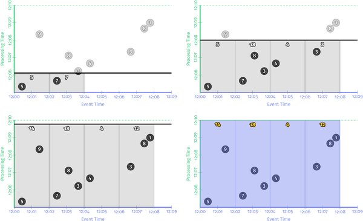
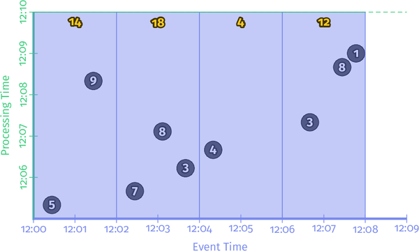
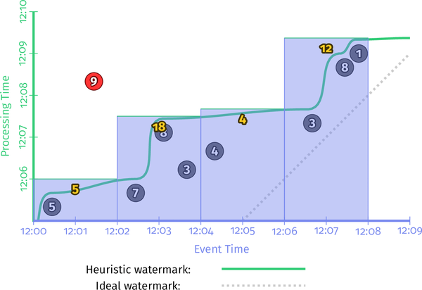

# Chapter2 数据处理的内容、地点、时间和方式

好吧，派对的人，是时候变得具体了！

第 1 章重点关注三个主要领域：术语，准确定义我使用“流媒体”等重载术语时的意思； 批处理与流式比较，比较这两种系统的理论能力，并假设流式系统超越批处理系统只需要两件事：正确性和时间推理工具； 和数据处理模式，研究批处理和流式系统在处理有界和无界数据时采用的概念方法。

在本章中，我们现在将进一步关注第 1 章中的数据处理模式，但更详细，并在具体示例的背景下进行。 当我们完成时，我们将涵盖我认为是稳健的无序数据处理所需的核心原则和概念； 这些是推理时间的工具，真正让你超越了经典的批处理。

为了让您了解实际情况，我使用了 Apache Beam 代码片段，并结合延时图 1 来提供概念的可视化表示。 Apache Beam 是一个用于批处理和流处理的统一编程模型和可移植层，具有一组不同语言（例如 Java 和 Python）的具体 SDK。 然后，使用 Apache Beam 编写的管道可以在任何受支持的执行引擎（Apache Apex、Apache Flink、Apache Spark、Cloud Dataflow 等）上可移植地运行。

我在这里使用 Apache Beam 作为示例不是因为这是一本 Beam 书（它不是），而是因为它最完整地体现了本书中描述的概念。 回到最初编写“Streaming 102”的时候（当它仍然是来自 Google Cloud Dataflow 的 Dataflow 模型而不是来自 Apache Beam 的 Beam 模型时），它实际上是唯一存在的系统，它提供了所有必要的表达量 我们将在这里介绍的示例。 一年半之后，我很高兴地说发生了很大的变化，大多数主要系统已经或正在转向支持一个看起来很像本书中描述的模型。 因此请放心，我们在此介绍的概念虽然是通过 Beam 镜头了解的，但将同样适用于您将遇到的大多数其他系统。

### 路线图

为了帮助为本章奠定基础，我想列出五个主要概念，这些概念将成为其中所有讨论的基础，实际上，对于第一部分其余部分的大部分内容。我们已经介绍了其中的两个。

在第 1 章中，我首先确定了事件时间（事件发生的时间）和处理时间（在处理过程中被观察到的时间）之间的关键区别。 这为本书提出的一个主要论点奠定了基础：如果你关心正确性和事件实际发生的上下文，你必须分析与它们固有的事件时间相关的数据，而不是它们所处的处理时间。 在分析过程中遇到。

然后，我介绍了窗口化的概念（即，沿时间边界划分数据集），这是一种常用方法，用于处理技术上无限数据源可能永远不会结束的事实。 一些更简单的窗口策略示例是固定窗口和滑动窗口，但更复杂的窗口类型，例如会话（其中窗口由数据本身的特征定义；例如，捕获每个用户的活动会话，然后是间隙 不活动的）也看到广泛的使用。

除了这两个概念之外，我们现在将仔细研究另外三个概念：

- 触发器

  触发器是一种机制，用于声明窗口的输出何时应相对于某些外部信号实现。触发器在选择何时发出输出时提供了灵活性。从某种意义上说，您可以将它们视为一种流控制机制，用于指示何时实现结果。另一种看待它的方式是，触发器就像相机上的快门释放按钮，允许您在计算结果时声明何时拍摄快照。

  触发器还可以在窗口演变时多次观察窗口的输出。这反过来又为随着时间的推移细化结果打开了大门，允许在数据到达时提供推测结果，以及处理上游数据（修订）随时间的变化或延迟到达的数据（例如，移动场景，其中某人的电话会在此人离线时记录各种操作及其事件时间，然后继续上传这些事件以在重新连接时进行处理）。

- 水印

  水印是关于事件时间的输入完整性的概念。 时间值为 X 的水印表示：“已观察到事件时间小于 X 的所有输入数据。” 因此，当观察一个没有已知终点的无界数据源时，水印作为进度指标。 我们在本章中介绍了水印的基础知识，然后 Slava 在第 3 章中深入探讨了该主题。

- 积累

  累积模式指定在同一窗口中观察到的多个结果之间的关系。 这些结果可能完全脱节； 也就是说，随着时间的推移表示独立的增量，或者它们之间可能存在重叠。 不同的累积模式具有不同的语义和与之相关的成本，因此可以在各种用例中找到适用性。

此外，因为我认为它可以更容易地理解所有这些概念之间的关系，所以我们在回答四个问题的结构中重新审视旧的并探索新的，我提出的所有这些对于每个无界数据处理问题都至关重要：

- 计算什么结果？ 管道中的转换类型回答了这个问题。 这包括计算总和、构建直方图、训练机器学习模型等。 本质上也是经典批处理回答的问题
- 事件时间在哪里计算结果？ 这个问题是通过在管道中使用事件时间窗口来回答的。 这包括第 1 章中常见的窗口示例（固定、滑动和会话）； 似乎没有窗口概念的用例（例如，与时间无关的处理；经典的批处理通常也属于这一类）； 以及其他更复杂的窗口类型，例如限时拍卖。 另请注意，如果您将进入时间分配为记录到达系统时的事件时间，它也可以包括处理时间窗口。
- 在处理时间内，结果何时实现？ 这个问题是通过使用触发器和（可选）水印来回答的。 这个主题有无限的变化，但最常见的模式是那些涉及重复更新的模式（即物化视图语义），那些仅在认为相应的输入完成后才利用水印为每个窗口提供单个输出的模式（即 ，基于每个窗口应用的经典批处理语义），或两者的某种组合。
- 结果的细化如何关联？ 这个问题由所使用的累积类型来回答：丢弃（其中结果都是独立且不同的），累积（其中后来的结果建立在先前的结果之上），或累积和收回（其中累积值加上收回 发出先前触发的值）。

在本书的其余部分，我们将更详细地研究这些问题中的每一个。 而且，是的，我将把这个配色方案放在地上，试图清楚地说明哪些概念与 What/Where/When/How 成语中的哪个问题相关。 不客气<winky-smiley/>。

### 批处理基础：what和where

好的，让我们开始这个派对。 第一站：批处理。

#### *What*：Transformations

经典批处理中应用的转换回答了这个问题：“计算出什么结果？” 即使您可能已经熟悉经典的批处理，我们还是要从那里开始，因为它是我们添加所有其他概念的基础。

在本章的其余部分（实际上，贯穿本书的大部分内容），我们只看一个例子：在一个由九个值组成的简单数据集上计算键控整数和。 假设我们已经编写了一个基于团队的手机游戏，并且我们想要构建一个管道，通过汇总用户手机报告的个人分数来计算团队分数。 如果我们要在名为“UserScores”的 SQL 表中捕获我们的九个示例分数，它可能看起来像这样：

```sql
SELECT * FROM UserScores ORDER BY EventTime;
------------------------------------------------
| Name  | Team  | Score | EventTime | ProcTime |
------------------------------------------------
| Julie | TeamX |     5 |  12:00:26 | 12:05:19 |
| Frank | TeamX |     9 |  12:01:26 | 12:08:19 |
| Ed    | TeamX |     7 |  12:02:26 | 12:05:39 |
| Julie | TeamX |     8 |  12:03:06 | 12:07:06 |
| Amy   | TeamX |     3 |  12:03:39 | 12:06:13 |
| Fred  | TeamX |     4 |  12:04:19 | 12:06:39 |
| Naomi | TeamX |     3 |  12:06:39 | 12:07:19 |
| Becky | TeamX |     8 |  12:07:26 | 12:08:39 |
| Naomi | TeamX |     1 |  12:07:46 | 12:09:00 |
------------------------------------------------
```

请注意，此示例中的所有分数均来自同一团队的用户； 这是为了使示例保持简单，因为我们在随后的图表中具有有限数量的维度。 因为我们是按团队分组的，所以我们真的只关心最后三列：

- 分数

  与此事件关联的个人用户分数

- 事件时间

  得分的事件时间； 即得分发生的时间

- 处理时间

  分数的处理； 即管道观察到分数的时间

对于每个示例管道，我们将查看一个延时图，该图突出了数据如何随时间演变。 这些图表在我们关心的两个时间维度上绘制了我们的九个分数：x 轴上的事件时间和 y 轴上的处理时间。 图 2-1 展示了输入数据的静态图。


<center><i>图 2-1。 九个输入记录，同时绘制事件时间和处理时间</i></center>
随后的延时图是动画 (Safari) 或一系列帧（打印和所有其他数字格式），让您可以看到数据是如何随着时间的推移而处理的（在我们第一次延时后不久将详细介绍 图表）。

在每个示例之前都是一小段 Apache Beam Java SDK 伪代码，以使管道的定义更加具体。 从某种意义上说，它是伪代码，我有时会改变规则以使示例更清晰、省略细节（例如使用具体的 I/O 源）或简化名称（Beam Java 2.x 和更早版本中的触发器名称非常冗长） ; 为了清楚起见，我使用更简单的名称）。 除了诸如此类的小事之外，它还是真实世界的 Beam 代码（本章中所有示例的真实代码都可以在 GitHub 上找到）。

如果您已经熟悉 Spark 或 Flink 之类的东西，那么您应该可以相对轻松地了解 Beam 代码在做什么。 但是为了给你一个速成课程，Beam 中有两个基本的原语：

- PCollections

  这些代表可以执行并行转换的数据集（可能是大量数据集）（因此名称开头的“P”）。

- PTransformas

  这些应用于 PCollections 以创建新的 PCollections。 PTransform 可以执行元素转换，它们可以将多个元素组合/聚合在一起，或者它们可以是其他 PTransform 的复合组合，如图 2-2 所示。


<center><i>图 2-2。 转换类型</i></center>
出于我们示例的目的，我们通常假设我们从名为“input”的预加载 PCollection<KV<Team, Integer>> 开始（即，由 Teams 和 Integer 的键/值对组成的 PCollection，其中 团队就像代表团队名称的字符串，而整数是相应团队中任何个人的分数）。 在现实世界的管道中，我们会通过从 I/O 源读取原始数据（例如日志记录）的 PCollection\<String\>，然后将其转换为 PCollection<KV<Team, Integer> 来获取输入 > 通过将日志记录解析为适当的键/值对。 为了清楚起见，在第一个示例中，我包含所有这些步骤的伪代码，但在后续示例中，我省略了 I/O 和解析。

因此，对于一个简单地从 I/O 源读取数据、解析团队/分数对并计算每个团队的分数总和的管道，我们将得到类似于示例 2-1 中所示的内容。

示例 2-1。 求和管道

```java
PCollection<String> raw = IO.read(...);
PCollection<KV<Team, Integer>> input = raw.apply(new ParseFn());
PCollection<KV<Team, Integer>> totals =
  input.apply(Sum.integersPerKey());
```

从 I/O 源读取键/值数据，以 Team（例如，团队名称的字符串）作为键，以 Integer（例如，单个团队成员的分数）作为值。 然后将每个键的值相加在一起，以在输出集合中生成每个键的总和（例如，团队总得分）。

对于接下来的所有示例，在看到描述我们正在分析的管道的代码片段之后，我们将查看一个延时图，该图显示了该管道在我们的具体数据集上针对单个键的执行。 在真实的管道中，您可以想象类似的操作会在多台机器上并行发生，但为了我们的示例，保持简单会更清楚。

如前所述，Safari 版本将完整执行呈现为动画电影，而印刷和所有其他数字格式使用关键帧的静态序列，以提供管道如何随时间进展的感觉。 在这两种情况下，我们还在 www.streamingbook.net 上提供了一个完整动画版本的 URL。

每个图表都绘制了两个维度的输入和输出：事件时间（在 x 轴上）和处理时间（在 y 轴上）。 因此，流水线观察到的实时从下到上进展，如粗水平黑线所示，随着时间的推移在处理时间轴上上升。 输入是圆圈，圆圈内的数字代表该特定记录的值。 它们从浅灰色开始，随着管道观察它们而变暗。

当管道观察值时，它会将它们累积在中间状态，并最终将聚合结果具体化为输出。 状态和输出由矩形表示（灰色表示状态，蓝色表示输出），聚合值靠近顶部，矩形覆盖的区域表示累积到结果中的事件时间和处理时间的部分。 对于示例 2-1 中的管道，在经典批处理引擎上执行时，它看起来类似于图 2-3 中所示的内容。


<center><i>图 2-3。 经典批处理</i></center>
因为这是一个批处理管道，它会累积状态，直到看到所有输入（由顶部的绿色虚线表示），此时它产生其单个输出 48。在此示例中，我们正在计算总和 在整个事件时间，因为我们没有应用任何特定的窗口转换； 因此状态和输出的矩形覆盖了整个 x 轴。 但是，如果我们要处理无限数据源，经典的批处理是不够的； 我们不能等待输入结束，因为它实际上永远不会。 我们想要的概念之一是窗口化，我们在第 1 章中介绍了它。因此，在我们的第二个问题的上下文中——“结果是在哪里计算的？”——我们现在将简要地重新讨论窗口化。

#### *Where*：Windowing

正如第 1 章所讨论的，窗口化是沿时间边界对数据源进行切片的过程。常见的窗口策略包括固定窗口、滑动窗口和会话窗口，如图 2-4 所示。


<center><i>图 2-4。示例窗口策略。每个示例针对三个不同的键显示，突出显示对齐窗口（适用于所有数据）和未对齐窗口（适用于数据子集）之间的区别。</i></center>
*例2-2. 窗口化求和代码*

```java
 PCollection<KV<Team, Integer>> totals = input
 .apply(Window.into(FixedWindows.of(TWO_MINUTES)))
  .apply(Sum.integersPerKey());
```

回想一下，Beam 提供了一个适用于批处理和流式传输的统一模型，因为从语义上讲，批处理实际上只是流式传输的一个子集。因此，让我们首先在批处理引擎上执行此管道；机制更简单，当我们切换到流引擎时，它会给我们一些直接比较的东西。图 2-5 显示了结果。



<center><i>图 2-5。批处理引擎上的窗口求和</i></center>
和之前一样，输入在状态中累积，直到它们被完全消耗，然后产生输出。然而，在这种情况下，我们得到四个而不是一个输出：一个输出，用于四个相关的两分钟事件时间窗口中的每一个。

至此，我们重新审视了我在第 1 章中介绍的两个主要概念：事件时间域和处理时间域之间的关系，以及窗口化。如果我们想更进一步，我们需要开始添加本节开头提到的新概念：触发器、水印和累积。

### 进入流：When and How

我们刚刚观察了批处理引擎上窗口管道的执行。但是，理想情况下，我们希望我们的结果具有更低的延迟，并且我们还希望本机处理无限数据源。切换到流引擎是朝着正确方向迈出的一步，但我们之前等待输入完全消耗后生成输出的策略不再可行。输入触发器和水印。

#### When: 触发器的奇妙之处在于触发器是奇妙的事物！

触发器为以下问题提供了答案：“在处理时间内，结果何时实现？”触发器声明窗口的输出何时应该在处理时间内发生（尽管触发器本身可能会根据其他时间域中发生的事情做出这些决定，例如在事件时间域中进行的水印，正如我们将在一些时刻）。窗口的每个特定输出称为窗口的窗格。

尽管可以想象相当广泛的可能触发语义3，但从概念上讲，只有两种通常有用的触发器类型，“而实际应用几乎总是归结为使用一种或两者的组合：

- 重复更新触发器

  随着内容的发展，这些会定期为窗口生成更新的窗口。这些更新可以与每条新记录一起实现，或者它们可以在一些处理时间延迟之后发生，例如每分钟一次。重复更新触发器的周期选择主要是为了平衡延迟和成本。

- 完整性触发器

  这些只有在该窗口的输入被认为已完成某个阈值之后，才会为该窗口具体化一个窗格。这种类型的触发器最类似于我们熟悉的批处理：只有在输入完成后，我们才会提供结果。基于触发器的方法的不同之处在于，完整性的概念仅限于单个窗口的上下文，而不是总是被绑定到整个输入的完整性。

重复更新触发器是流系统中最常见的触发器类型。它们易于实现且易于理解，并且为特定类型的用例提供有用的语义：重复（并且最终一致）更新物化数据集，类似于您在数据库世界中使用物化视图获得的语义。

完整性触发器不太常见，但提供的流语义更接近经典批处理世界的语义。它们还提供了用于推理缺失数据和延迟数据等事物的工具，我们将在探索驱动完整性触发器的底层原语（水印）时很快（以及在下一章中）讨论这两者。

但首先，让我们从简单的开始，看看一些基本的重复更新触发器的实际操作。为了让触发器的概念更具体一点，让我们继续在示例管道中添加最简单的触发器类型：每条新记录都会触发的触发器，如示例 2-3 所示。

*例2-3.每条记录重复触发*

```java
 PCollection<KV<Team, Integer>> totals = input
  .apply(Window.into(FixedWindows.of(TWO_MINUTES))
                .triggering(Repeatedly(AfterCount(1))));
  .apply(Sum.integersPerKey())
```

如果我们要在流引擎上运行这个新管道，结果将类似于图 2-6 所示。


<center><i>图 2-6。流引擎上的每条记录触发</i></center>
您可以看到我们现在如何为每个窗口获得多个输出（窗格）：每个相应的输入一次。当输出流被写入某种表时，这种触发模式效果很好，您可以简单地轮询结果。每当您查看表格时，您都会看到给定窗口的最新值，并且这些值会随着时间的推移趋于正确。

每条记录触发的一个缺点是它很健谈。在处理大规模数据时，求和之类的聚合提供了一个很好的机会，可以在不丢失信息的情况下减少流的基数。这在您拥有大量键的情况下尤其明显；对于我们的示例，拥有大量活跃玩家的大型团队。想象一个大型多人游戏，其中玩家被分成两个派系之一，并且您希望按每个派系计算统计数据。可能没有必要用给定派系中每个玩家的每条新输入记录来更新你的计数。相反，您可能会很高兴在处理时间延迟后更新它们，比如每秒或每分钟。使用处理时间延迟的一个很好的副作用是它具有跨大容量键或窗口的均衡效果：生成的流最终在基数方面更加统一。

触发器中的处理时间延迟有两种不同的方法：对齐延迟（延迟将处理时间分割成跨键和窗口对齐的固定区域）和未对齐延迟（延迟与给定窗口内观察到的数据相关） ）。具有未对齐延迟的流水线可能类似于示例 2-4，其结果如图 2-7 所示。

*示例 2-4。触发对齐的两分钟处理时间边界*

```java
  PCollection<KV<Team, Integer>> totals = input
  .apply(Window.into(FixedWindows.of(TWO_MINUTES))
               .triggering(Repeatedly(AlignedDelay(TWO_MINUTES)))
  .apply(Sum.integersPerKey());
```


<center><i>图 2-7。两分钟对齐的延迟触发器（即微批处理）</i></center>

这种对齐的延迟触发器实际上是您从 Spark Streaming 等微批处理流系统中获得的。它的好处是可预测性。您可以同时在所有修改后的窗口中获得定期更新。这也是不利的一面：所有更新都同时发生，这会导致突发性工作负载，通常需要更大的峰值配置才能正确处理负载。另一种方法是使用未对齐的延迟。这看起来像 Beam 中的示例 2-5。图 2-8 显示了结果。 

*示例 2-5。触发未对齐的两分钟处理时间边界*

```java
  PCollection<KV<Team, Integer>> totals = input
  .apply(Window.into(FixedWindows.of(TWO_MINUTES))
               .triggering(Repeatedly(UnalignedDelay(TWO_MINUTES))
  .apply(Sum.integersPerKey()); 
```


<center><i>图 2-8。两分钟未对齐延迟触发器</i></center>

对比图 2-8 中未对齐的延迟和图 2-6 中的对齐延迟，很容易看出未对齐的延迟如何在时间上更均匀地分布负载。任何给定窗口所涉及的实际延迟在两者之间有所不同，有时更多，有时更少，但最终平均延迟将基本保持不变。从这个角度来看，未对齐的延迟通常是大规模处理的更好选择，因为它们会随着时间的推移导致更均匀的负载分布。

重复更新触发器非常适合我们只是希望随着时间的推移定期更新我们的结果的用例，并且这些更新收敛到正确性而没有明确指示何时实现正确性的情况很好。然而，正如我们在第 1 章中所讨论的，分布式系统的变幻莫测通常会导致事件发生的时间与管道实际观察到的时间之间存在不同程度的偏差，这意味着很难推断何时输出提供输入数据的准确和完整视图。对于输入完整性很重要的情况，重要的是有某种方式来推理完整性，而不是盲目地相信任何数据子集碰巧找到进入管道的计算结果。输入水印。

#### *When*: 水印

水印是对以下问题的回答的一个支持方面：“在处理时间内，结果何时实现？”水印是事件时间域中输入完整性的时间概念。换句话说，它们是系统测量相对于事件流中正在处理的记录的事件时间的进度和完整性的方式（有界或无界，尽管它们的用处在无界情况下更为明显）。

回想一下第 1 章中的这张图，在图 2-9 中稍作修改，其中我将事件时间和处理时间之间的偏差描述为大多数现实世界分布式数据处理系统的一个不断变化的时间函数。


<center><i>图 2-9。事件时间进度、偏差和水印</i></center>

我声称代表现实的那条蜿蜒的红线本质上是水印；它随着处理时间的推移捕获事件时间完整性的进展。从概念上讲，您可以将水印视为一个函数 F(P) → E，它获取处理时间中的一个点并返回事件时间中的一个点。4 事件时间中的那个点 E 是直到系统认为所有事件时间小于 E 的输入都已被观察到。换句话说，这是一个断言，即不会再看到事件时间小于 E 的数据。根据水印的类型，完美或启发式，该断言可以分别是严格保证或有根据的猜测：

- 完美的水印

  对于我们对所有输入数据都有完美了解的情况，可以构建完美的水印。在这种情况下，不存在延迟数据之类的东西；所有数据都是早期或准时的。

- 启发式水印

  对于许多分布式输入源，输入数据的完美知识是不切实际的，在这种情况下，下一个最佳选择是提供启发式水印。启发式水印使用有关输入的任何可用信息（分区、分区内的排序（如果有）、文件的增长率等）来提供尽可能准确的进度估计。在许多情况下，此类水印的预测可能非常准确。即便如此，使用启发式水印意味着它有时可能是错误的，这将导致数据延迟。我们将很快向您展示处理延迟数据的方法。

因为它们提供了相对于我们的输入的完整性概念，所以水印构成了前面提到的第二种触发器的基础：完整性触发器。水印本身是一个引人入胜且复杂的主题，正如您将在第 3 章中深入了解 Slava 的水印时看到的那样。但是现在，让我们通过更新我们的示例管道“利用基于水印的完整性触发器”来看看它们的实际效果，如示例 2-6 所示。

*示例 2-6。水印完整性触发*

```java
  PCollection<KV<Team, Integer>> totals = input
  .apply(Window.into(FixedWindows.of(TWO_MINUTES))
               .triggering(AfterWatermark()))
  .apply(Sum.integersPerKey()); 
```

现在，水印的一个有趣特性是它们是一类函数，这意味着有多个不同的函数 F(P) → E 可以满足水印的属性，并取得不同程度的成功。正如我之前提到的，对于您完全了解输入数据的情况，可以构建完美的水印，这是理想的情况。但是对于您对输入缺乏完全了解或计算完美水印的计算成本太高的情况，您可能会选择使用启发式方法来定义您的水印。我想在这里说明的一点是，使用的给定水印算法独立于管道本身。我们不打算在这里详细讨论实现水印的意义（Slava 在第 3 章中这样做了）。现在，为了帮助理解给定输入集可以应用不同水印的想法，让我们看一下示例 2-6 中的管道，当在相同数据集上执行但使用两种不同的水印实现时（图 2- 10）：左侧是完美水印；右侧是启发式水印。

在这两种情况下，当水印通过窗口的末端时，窗口就会被物化。正如您所料，完美的水印完美地捕捉了随着时间的推移管道的事件时间完整性。相比之下，用于右侧启发式水印的特定算法没有考虑到 9 的值，5 这极大地改变了物化输出的形状，无论是在输出延迟还是正确性方面（从不正确的答案中可以看出） “为 [12:00, 12:02) 窗口提供的 5 个）。

图 2-9 中的水印触发器与我们在图 2-5 到 2-7 中看到的重复更新触发器之间的最大区别在于，水印为我们提供了一种推理输入完整性的方法。在系统实现给定窗口的输出之前，我们知道系统还不相信输入是完整的。这对于您想要推断输入中缺少数据或缺少数据的用例尤其重要。


<center><i>图 2-10。具有完美（左）和启发式（右）水印的流引擎上的窗口求和</i></center>

缺失数据用例的一个很好的例子是外连接。如果没有像水印这样的完整性概念，您怎么知道何时放弃并发出部分连接，而不是继续等待该连接完成？你没有。并且基于处理时间延迟的决定，这是缺乏真正水印支持的流系统中的常见方法，这不是一个安全的方法，因为我们在第 1 章中谈到的事件时间偏差的可变性质：只要 skew 保持小于选择的处理时间延迟，您的缺失数据结果将是正确的，但任何时候 skew 超过该延迟，它们就会突然变得不正确。从这个角度来看，事件时间水印是许多现实世界流用例的关键部分，这些用例必须推理输入中缺少数据，例如外连接、异常检测等。

现在，话虽如此，这些水印示例还突出了水印的两个缺点（以及任何其他完整性概念），特别是它们可以是以下之一：

- 太慢了

  当任何类型的水印由于已知的未处理数据而正确延迟时（例如，由于网络带宽限制，输入日志缓慢增长），如果水印的推进是您唯一依赖的刺激因素，则直接转化为输出延迟结果。

 这在图 2-10 的左图中最为明显，因为迟到的 9 保留了所有后续窗口的水印，即使这些窗口的输入数据更早完成。这对于第二个窗口 [12:02, 12:04) 尤为明显，从窗口中的第一个值出现到我们看到任何窗口结果需要将近 7 分钟。这个例子中的启发式水印并没有那么严重地遭受同样的问题（距离输出还有五分钟），但不要认为这意味着启发式水印不会遭受水印滞后的影响；这实际上只是我在这个特定示例中选择从启发式水印中省略的记录的结果。

这里的重点如下：尽管水印提供了一个非常有用的完整性概念，但从延迟的角度来看，依赖于生成输出的完整性通常并不理想。想象一个仪表板包含有价值的指标，按小时或天窗口化。您不太可能希望等待整整一个小时或一天才能开始看到当前窗口的结果；这是使用经典批处理系统为此类系统提供动力的痛点之一。相反，随着输入的发展并最终变得完整，看到这些窗口的结果会随着时间的推移而改进会更好。

- 太快

   当启发式水印错误地提前到应有的时间时，事件时间在水印之前的数据可能会晚一些到达，从而创建延迟数据。这就是右侧示例中发生的情况：在观察到该窗口的所有输入数据之前，水印超过了第一个窗口的末尾，导致输出值 5 而不是 14 不正确。这个缺点严格来说是启发式水印问题；它们的启发式性质意味着它们有时会出错。因此，如果您关心正确性，仅依靠它们来确定何时实现输出是不够的。

在第 1 章中，我做了一些相当强调的陈述，即完整性概念对于大多数需要对无界数据流进行健壮的乱序处理的用例来说是不够的。这两个缺点——水印太慢或太快——是这些论点的基础。您根本无法从仅依赖于完整性概念的系统中获得低延迟和正确性。6 因此，对于您确实想要两全其美的情况，一个人该怎么办？好吧，如果重复更新触发器提供低延迟更新但无法推断完整性，并且水印提供了完整性概念但可变且可能存在高延迟，那么为什么不将它们的功能结合在一起呢？

#### *When*: 早/准/晚触发FTW！

我们现在查看了两种主要类型的触发器：重复更新触发器和完整性/水印触发器。在许多情况下，单独使用它们都不够，但它们组合在一起就足够了。 Beam 通过提供标准水印触发器的扩展来识别这一事实，该触发器还支持在水印任一侧的重复更新触发。这被称为早/准/晚触发器，因为它将复合触发器具体化的窗格分为三类：

- 零个或多个早期窗格，这是重复更新触发器的结果，该触发器会定期触发，直到水印通过窗口末尾。这些触发生成的窗格包含推测结果，但允许我们随着新输入数据的到来观察窗口随时间的演变。这弥补了水印有时太慢的缺点。
- 单个准时窗格，这是水印通过窗口末尾后触发的完整性/水印触发器的结果。这种触发是特殊的，因为它提供了系统现在认为该窗口的输入已完成的断言。7 这意味着现在可以安全地推断丢失的数据；例如，在执行外连接时发出部分连接。
- 零个或多个延迟窗格，这是另一个（可能不同）重复更新触发器的结果，该触发器会在水印超过窗口结束后的任何延迟数据到达时定期触发。在完美水印的情况下，迟到的窗格总是为零。但是在启发式水印的情况下，水印未能正确解释的任何数据都将导致延迟触发。这弥补了水印速度过快的缺点。

让我们看看它的实际效果。我们将更新我们的管道以使用周期性处理时间触发器，对于早期触发使用一分钟的对齐延迟，对于后期触发使用每条记录触发器。这样，早期触发将为我们提供一些批量处理高容量窗口（这要归功于触发器每分钟仅触发一次，无论窗口的吞吐量如何），但我们不会引入不必要的延迟对于较晚的触发，如果我们使用相当准确的启发式水印，希望这种情况很少见。在 Beam 中，如例 2-7 所示（图 2-11 显示了结果）。

*示例 2-7。通过 early/on-time/late API 提前、准时和延迟触发*

```java
PCollection<KV<Team, Integer>> totals = input
  .apply(Window.into(FixedWindows.of(TWO_MINUTES))
               .triggering(AfterWatermark()
			     .withEarlyFirings(AlignedDelay(ONE_MINUTE))
			     .withLateFirings(AfterCount(1))))
  .apply(Sum.integersPerKey());
```


<center><i>图 2-11。具有早期、准时和延迟触发的流引擎上的窗口求和</i></center>

这个版本比图 2-9 有两个明显的改进：

- 对于第二个窗口 [12:02, 12:04) 中的“水印太慢”的情况：我们现在提供每分钟一次的定期提前更新。在完美的水印情况下，差异最为明显，首次输出的时间从近七分钟减少到三分半；但在启发式情况下，它也得到了明显的改进。现在，两个版本都随着时间的推移提供稳定的改进（值分别为 7、10 和 18 的窗格），在输入完成和窗口的最终输出窗格具体化之间具有相对最小的延迟。

- 对于第一个窗口中的“启发式水印太快”的情况，[12:00, 12:02)：当值 9 出现较晚时，我们立即将其合并到值 14 的新的更正窗格中。

这些新触发器的一个有趣的副作用是它们有效地规范了完美和启发式水印版本之间的输出模式。虽然图 2-10 中的两个版本截然不同，但这里的两个版本看起来非常相似。它们看起来也更类似于图 2-6 到 2-8 中的各种重复更新版本，但有一个重要区别：由于使用了水印触发器，我们还可以在生成的结果中推断输入完整性早期/准时/延迟触发。这使我们能够更好地处理关心丢失数据的用例，例如外连接、异常检测等。

在这一点上，完美和启发式早期/准时/晚期版本之间的最大区别是窗口生命周期界限。在完美的水印情况下，我们知道在水印结束后我们将再也看不到窗口的任何数据，因此我们可以在那个时候删除窗口的所有状态。在启发式水印的情况下，我们仍然需要在一段时间内保持一个窗口的状态，以解决迟到的数据。但是到目前为止，我们的系统还没有任何好的方法可以知道每个窗口的状态需要保留多长时间。这就是允许迟到的地方。

#### *When*：允许延迟（即垃圾收集）

在继续我们的最后一个问题（“结果的细化如何关联？”）之前，我想谈谈长期无序流处理系统中的一个实际必要性：垃圾收集。在图 2-11 的启发式水印示例中，每个窗口的持久状态在示例的整个生命周期中都存在；这对于允许我们在/如果它们到达时适当地处理延迟数据是必要的。但是，虽然能够将我们所有的持久状态保持到时间结束会很棒，但实际上，在处理无限数据源时，无限期地保持给定窗口的状态（包括元数据）通常是不切实际的；我们最终会耗尽磁盘空间（或者至少会厌倦为此付费，因为旧数据的价值会随着时间的推移而减少）。

因此，任何现实世界的乱序处理系统都需要提供某种方法来限制它正在处理的窗口的生命周期。一种简洁明了的方法是在系统内定义允许的延迟范围；也就是说，对任何给定记录（相对于水印）可能延迟多长时间（相对于水印）设置一个界限，以便系统处理它；在此范围之后到达的任何数据都将被简单地丢弃。在限制了单个数据的延迟时间之后，您还准确地确定了窗口的状态必须保持多长时间：直到水印超过窗口结束的延迟范围。但此外，您还允许系统在观察到它们后立即丢弃任何晚于地平线的数据，这意味着系统不会浪费资源处理没人关心的数据。

> <center>测量延迟</center>
> 使用最初导致延迟数据的度量（即启发式水印）来指定处理延迟数据的范围似乎有点奇怪。从某种意义上说，确实如此。但在可用的选项中，它可以说是最好的。唯一的其他实用选项是指定处理时间的范围（例如，在水印通过窗口结束后将窗口保持 10 分钟的处理时间），但使用处理时间会使垃圾收集策略容易受到问题的影响在管道本身内（例如，工作人员崩溃，导致管道停止几分钟），这可能导致窗口实际上没有机会处理他们本来应该拥有的延迟数据。通过在事件时间域中指定范围，垃圾收集与管道的实际进度直接相关，这降低了窗口错过适当处理延迟数据的机会的可能性。
>
> 但是请注意，并非所有水印都是一样的。当我们在本书中谈到水印时，我们通常指的是低水印，它悲观地试图捕获系统知道的最旧的未处理记录的事件时间。通过低水位线处理延迟的好处是它们能够适应事件时间偏差的变化；无论管道中的偏差有多大，低水位线将始终跟踪系统已知的最古老的未完成事件，从而尽可能地保证正确性。
>
> 相反，某些系统可能使用术语“水印”来表示其他内容。例如，Spark Structured Streaming 中的水印是高水印，它乐观地跟踪系统知道的最新记录的事件时间。在处理延迟时，系统可以自由地垃圾收集任何早于由某些用户指定的延迟阈值调整的高水位线的窗口。换句话说，系统允许您指定您希望在管道中看到的最大事件时间偏差量，然后丢弃该偏差窗口之外的任何数据。如果管道内的偏差保持在某个恒定增量内，这可以很好地工作，但比低水印方案更容易错误地丢弃数据。

因为允许延迟和水印之间的交互有点微妙，所以值得看一个例子。 让我们从示例 2-7/图 2-11 中提取启发式水印管道，并在示例 2-8 中添加一分钟的延迟范围（请注意，这个特定的范围是严格选择的，因为它非常适合图表；对于真实的 - 世界用例，更大的视野可能更实用）：

*示例 2-8。 允许迟到的早期/准时/延迟解雇*

```java
 PCollection<KV<Team, Integer>> totals = input
 .apply(Window.into(FixedWindows.of(TWO_MINUTES))
               .triggering(
                 AfterWatermark()
                   .withEarlyFirings(AlignedDelay(ONE_MINUTE))
                   .withLateFirings(AfterCount(1)))
               .withAllowedLateness(ONE_MINUTE))
 .apply(Sum.integersPerKey());
```

该管道的执行类似于图 2-12，其中我添加了以下功能以突出允许延迟的影响：

- 表示处理时间中当前位置的粗黑线现在用刻度线进行注释，表示所有活动窗口的延迟范围（在事件时间中）。

- 当水印超过一个窗口的延迟范围时，该窗口关闭，这意味着该窗口的所有状态都被丢弃。我留下一个虚线矩形，显示窗口关闭时覆盖的时间范围（在两个域中），一条小尾巴向右延伸，表示“窗口的延迟范围（用于与水印对比）。
- 仅对于这个图表，我为第一个窗口添加了一个额外的延迟数据，值为 6。6 是延迟的，但仍在允许的延迟范围内，因此被合并到值为 11 的更新结果中。但是 9 , 到达延迟范围之外，所以它被简单地丢弃了。


<center><i>“图 2-12.允许迟到早/准时/晚开火”</i></center>

关于延迟范围的最后两个附注：

- 绝对清楚，如果您碰巧使用来自具有完美水印的来源的数据，则无需处理延迟数据，并且允许的延迟范围为零秒将是最佳的。这就是我们在图 2-10 的完美水印部分中看到的。
- 需要指定延迟范围的规则的一个值得注意的例外，即使在使用启发式水印时，也会像在所有时间为可处理的有限数量的键计算全局聚合（例如，计算对您的网站所有时间，按网络浏览器系列分组）。在这种情况下，系统中活动窗口的数量受限于所使用的有限键空间。只要密钥的数量保持在可管理的低水平，就无需担心通过允许的延迟来限制窗口的生命周期。

实用性满足了，让我们继续我们的第四个也是最后一个问题。

#### *How*：积累

当触发器用于随着时间的推移为单个窗口生成多个窗格时，我们发现自己面临着最后一个问题：“结果的细化如何关联？”在我们目前看到的例子中，每个连续的窗格都建立在它之前的窗格之上。然而，实际上有三种不同的积累方式：

- 丢弃

  每次实现窗格时，都会丢弃任何存储的状态。这意味着每个连续的窗格都独立于之前的任何窗格。当下游消费者自己执行某种累积时，丢弃模式很有用；例如，当将整数发送到期望接收增量的系统时，它将加在一起以产生最终计数。

- 积累

  如图 2-6 到 2-11 所示，每次实现窗格时，都会保留任何已存储的状态，并将未来的输入累积到“现有状态”中。这意味着每个连续的窗格都建立在先前的窗格之上。当以后的结果可以简单地覆盖以前的结果时，累积模式很有用，例如将输出存储在 HBase 或 Bigtable 等键/值存储中时。

- 积累和收回

  这类似于累积模式，但是在生成新窗格时，它也会为之前的窗格产生独立的收回。撤回（结合新的累积结果）本质上是一种明确的说法，“我之前告诉过你结果是 X，但我错了。把我上次告诉你的X去掉，换成Y。”有两种情况下撤稿特别有用：

  - 当下游消费者按不同维度重新组合数据时，新值完全有可能最终与之前的值不同，从而最终进入不同的组。在这种情况下，新值不能直接覆盖旧值；相反，您需要撤回以删除旧值

  - 当动态窗口（例如，我们稍后会更仔细查看的会话）正在使用时，由于窗口合并，新值可能会替换多个先前的窗口。在这种情况下，很难仅从新窗口中确定哪些旧窗口正在被替换。对旧窗口进行明确的撤回使任务变得简单。我们将在第 8 章中详细了解这方面的一个示例。

当并排查看时，每个组的不同语义会更加清晰。考虑图 2-11 中第二个窗口的两个窗格（一个具有事件时间范围 [12:06, 12:08））（具有提前/准时/延迟触发器的一个）。表 2-1 显示了在三种累积模式下每个窗格的值是什么样的（累积模式是图 2-11 本身使用的特定模式）。

*表 2-1。使用图 2-11 中的第二个窗口比较累积模式*

​											Discarding  Accumulating Accumulating & Retracting

<hr/>
Pane 1: inputs=[3]  			3 3 3

<hr>


Pane 2: inputs=[8, 1] 		9 12 12, –3

<hr>


Value of final normal pane 	9 12 12 

<hr>


Sum of all panes 					12 15 12

<hr>

让我们仔细看看发生了什么：

丢弃

 每个窗格仅包含在该特定窗格期间到达的值。因此，观察到的最终值并未完全捕获总和。但是，如果您将所有独立窗格本身相加，您将得到 12 的正确答案。这就是为什么当下游消费者本身在物化窗格上执行某种聚合时，丢弃模式很有用。

积累

 如图 2-11 所示，每个窗格都包含在该特定窗格期间到达的值，以及来自先前窗格的所有值。因此，正确观察到的最终值捕获了 12 的总和。但是，如果要对各个窗格本身求和，则实际上是在重复计算窗格 1 的输入，从而得出不正确的总和 15 . 这就是为什么当您可以简单地用新值覆盖以前的值时，累积模式最有用：新值已经包含了迄今为止看到的所有数据。

积累和收回

 每个窗格都包含一个新的累积模式值以及前一个窗格的值的回撤。因此，观察到的最后一个值（不包括撤回）以及所有物化窗格的总和（包括撤回）都为您提供了 12 的正确答案。这就是撤回如此强大的原因。

示例 2-9 演示了丢弃模式的实际应用，说明了我们将对示例 2-7 进行的更改：

*示例 2-9。早期/准时/延迟触发的丢弃模式版本*

```java
PCollection<KV<Team, Integer>> totals = input 
 .apply(Window.into(FixedWindows.of(TWO_MINUTES))
               .triggering(
                 AfterWatermark()
                   .withEarlyFirings(AlignedDelay(ONE_MINUTE))
                   .withLateFirings(AtCount(1)))
               .discardingFiredPanes())
  .apply(Sum.integersPerKey()); 
```

在带有启发式水印的流引擎上再次运行将产生如图 2-13 所示的输出。


<center><i>图 2-13。 流引擎上早期/准时/延迟触发的丢弃模式版本</i></center>

尽管输出的整体形状与图 2-11 中的累积模式版本相似，但请注意此丢弃版本中的任何窗格都没有重叠。 因此，每个输出都独立于其他输出。
如果我们想查看实际的撤消，变化将是类似的，如示例 2-10 所示。 ？？？ 描绘了结果。

*示例 2-10。 早期/准时/延迟发射的累积和收回模式版本*

```java
PCollection<KV<Team, Integer>> totals = input
	.apply(Window.into(FixedWindows.of(TWO_MINUTES))
               .triggering(
                 AfterWatermark()
                   .withEarlyFirings(AlignedDelay(ONE_MINUTE))
                   .withLateFirings(AtCount(1)))
               .accumulatingAndRetractingFiredPanes())
  .apply(Sum.integersPerKey());
```


<center><i>流式引擎上早期/晚期触发的累积和收回模式版本</i></center>

因为每个窗口的窗格都重叠，所以要清楚地看到缩回有点棘手。 缩回以红色表示，与重叠的蓝色窗格结合产生略带紫色的颜色。 我还在给定窗格中稍微水平移动了两个输出的值（并用逗号分隔它们），以使它们更容易区分。


<center><i>图 2-14 结合了图 2-9、2-11 的最终帧（仅启发式），并并排显示了三种模式的良好视觉对比。</i></center>

“正如你可以想象的那样，按顺序呈现的模式（丢弃、累积、累积和收回）在存储和计算成本方面都越来越昂贵。 为此，累积模式的选择为沿着正确性、延迟和成本轴进行权衡提供了另一个维度。
## 总结

完成本章后，您现在了解了强大的流处理的基础知识，并准备好走向世界并做出令人惊奇的事情。当然，还有八章焦急等待你的关注，所以希望你不要像现在这样，这一刻。但无论如何，让我们回顾一下我们刚刚介绍的内容，以免您在匆忙前进时忘记任何内容。首先，我们触及的主要概念：

- 事件时间与处理时间

  事件发生时间和数据处理系统观察到事件的时间之间的最重要区别。

- 开窗

  管理无界数据的常用方法，方法是沿时间边界（在处理时间或事件时间，尽管我们将 Beam 模型中的窗口定义缩小为仅在事件时间内）。

- 触发器

  用于精确指定输出的具体化何时对您的特定用例有意义的声明性机制。

- 水印

  事件时间进度的强大概念，它提供了一种推理在无限制数据上运行的无序处理系统中的完整性（以及因此丢失的数据）的方法。

- 积累

  单个窗口的结果细化之间的关系，在这种情况下，它在演变过程中多次具体化。

其次，我们用来构建探索的四个问题：

- 计算什么结果？ = 转变。
- 活动时间在哪里计算结果？ = 开窗。
- 在处理时间内，结果何时实现？ = 触发器加水印。
- 结果的细化如何关联？ = 积累。

第三，为了强调这种流处理模型所提供的灵活性（因为归根结底，这才是真正的意义所在：平衡正确性、延迟和成本等相互竞争的紧张局势），回顾一下我们在输出中的主要变化只需极少的代码更改即可在相同的数据集上实现：


|             |             |               |
| :----:      |    :----:   |       :----:  |
|  |  |  |
| 整数求和<br />例2-1/图2-3 | 整数求和<br />固定窗口批处理<br />例2-2/图2-5 | 整数求和<br />固定窗口流<br />重复每条记录触发器<br />例2-2/图2-5|
|  |  |  |
| 整数求和<br />固定窗口流<br />重复对齐延迟触发<br />例2-4/图2-7 | 整数求和<br />固定窗口流<br />重复未对齐延迟触发器<br />例2-5/图2-8 | 整数求和<br />固定窗口流<br />启发式水印触发器<br />例2-6/图2-10         |
|  |  |  |
| 整数求和<br />固定窗口流<br />早/准时/晚触发<br />丢弃<br />例2-9/图2-13 | 整数求和<br />固定窗口流<br />早/准时/晚触发<br />累积<br />例2-7/图2-11| 整数求和<br />固定窗口流<br />早/准时/晚触发<br />积累和收回<br />例2-10/图2-3       |


综上所述，在这一点上，我们实际上只研究了一种类型的窗口：事件时间的固定窗口。 众所周知，窗口化有许多维度，在我们使用 Beam 模型结束之前，我想至少再谈两个维度。 然而，首先，我们将稍微绕道深入水印的世界，因为这些知识将有助于构建未来的讨论（并且本身就很有趣）。 进入斯拉瓦，舞台右侧...
