# Chapter3 水印

到目前为止，我们一直从流水线作者或数据科学家的角度来看待流处理。第 2 章介绍了水印，作为对事件时间处理在哪里进行以及处理时间结果何时实现等基本问题的答案的一部分。在本章中，我们处理了相同的问题，但是从流处理系统的底层机制的角度来看。查看这些机制将有助于我们激发、理解和应用水印相关的概念。我们讨论了如何在数据入口点创建水印，它们如何通过数据处理管道传播，以及它们如何影响输出时间戳。我们还演示了水印如何保留在处理无界数据时回答事件时间数据在何处处理以及何时物化的问题所必需的保证。

### 定义

考虑任何连续摄取数据和输出结果的管道。我们希望解决何时可以安全地调用事件时间窗口关闭的一般问题，这意味着该窗口不再期望任何数据。为此，我们想描述管道相对于其无限输入的进展情况。

解决事件时间窗口问题的一种简单方法是将我们的事件时间窗口简单地基于当前处理时间。正如我们在第 1 章中看到的那样，我们很快就遇到了麻烦——数据处理和传输不是即时的，因此处理时间和事件时间几乎永远不会相等。管道中的任何故障或尖峰都可能导致我们错误地将消息分配给窗口。最终，这个策略失败了，因为我们没有可靠的方法来对这些窗口做出任何保证。

另一种直观但最终不正确的方法是考虑管道处理消息的速率。尽管这是一个有趣的指标，但该速率可能会随着输入的变化、预期结果的可变性、可用于处理的资源等而任意变化。更重要的是，速率无助于回答完整性的基本问题。具体来说，速率并不能告诉我们何时看到了特定时间间隔内的所有消息。在现实世界的系统中，会出现消息在系统中没有进展的情况。这可能是暂时性错误（如崩溃、网络故障、机器停机）的结果，也可能是持久性错误的结果，如需要更改应用程序逻辑或其他手动干预才能解决的应用程序级故障。当然，如果发生大量故障，处理速率指标可能是检测这一点的良好代理。然而，速率指标永远无法告诉我们一条消息未能通过我们的管道取得进展。然而，即使是一条这样的消息，也会任意影响输出结果的正确性。

我们需要更鲁棒的进展衡量标准。为了到达那里，我们对流数据做出一个基本假设：每条消息都有一个关联的逻辑事件时间戳。这个假设在连续到达无界数据的情况下是合理的，因为这意味着输入数据的连续生成。在大多数情况下，我们可以将原始事件发生的时间作为其逻辑事件时间戳。对于所有包含事件时间戳的输入消息，我们可以检查此类时间戳在任何管道中的分布。这样的管道可能会分布在多个代理上并行处理，并在不保证各个分片之间的顺序的情况下使用输入消息。因此，该管道中活动的传输消息的事件时间戳集将形成一个分布，如图 3-1 所示。

消息由管道摄取、处理并最终标记为已完成。每条消息要么是“进行中的”，意思是它已被接收但尚未完成，要么是“完成的”，意思是不需要代表该消息进行更多处理。如果我们按事件时间检查消息的分布，它会类似于图 3-1。随着时间的推移，更多的消息将被添加到右侧的“in-flight”分发中，更多来自分发“in-flight”部分的消息将被完成并移动到“completed”分发中。


<center><i>图 3-1。流式传输管道中进行中和完成的消息事件时间的分布。新消息作为输入到达并保持“in-flight”，直到对它们的处理完成。 “in-flight”分布的最左边缘对应于任何给定时刻最旧的未处理元素。</i></center>


这个分布上有一个关键点，位于“in-flight”分布的最左边，对应于我们管道中任何未处理消息的最旧事件时间戳。我们使用这个值来定义水印：

*水印是尚未完成的最古老[^1]作品的单调递增时间戳。*

此定义提供了两个使其有用的基本属性：

完整性

  如果水印已经超过了某个时间戳 *T*，我们可以通过它的单调特性保证在 *T* 或之前的准时（非延迟数据）事件不会发生更多的处理。因此，我们可以正确地在 *T* 或之前发出任何聚合。换句话说，水印允许我们知道什么时候关闭一个窗口是正确的。

可见性

  如果一条消息由于任何原因卡在我们的管道中，水印就无法前进。此外，我们将能够通过检查阻止水印前进的消息来找到问题的根源。

### 源水印创建

这些水印从何而来？要为数据源建立水印，我们必须为从该源进入管道的每条消息分配一个逻辑事件时间戳。正如第 2 章所告诉我们的，所有水印创建都属于两大类之一：完美或启发式。为了提醒自己完美水印和启发式水印之间的区别，让我们看一下图 3-2，它展示了第 2 章中的窗口求和示例。


<center><i>图 3-2。具有完美（左）和启发式（右）水印的窗口求和</i></center>


请注意，区别特征是完美水印确保水印占所有数据，而启发式水印承认一些后期数据元素。

在水印被创建为完美或启发式之后，水印在整个管道的其余部分都保持不变。至于是什么使水印创建完美或启发式，这在很大程度上取决于所使用的源的性质。要了解原因，让我们看一下每种类型的水印创建的几个示例。

#### 完美水印创建

完美的水印创建以这样一种方式为传入的消息分配时间戳，使得生成的水印严格保证不会从该来源再次看到事件时间少于水印的数据。使用完美水印创建的管道永远不必处理迟到的数据；也就是说，在水印之后到达的数据已经超过了新到达消息的事件时间。然而，完美的水印创建需要完全了解输入，因此对于许多现实世界的分布式输入源来说是不切实际的。以下是一些可以创建完美水印的用例示例：

- 入口时间戳

    将进入时间分配为数据进入系统的事件时间的源可以创建完美的水印。在这种情况下，源水印只是跟踪管道观察到的当前处理时间。这本质上是 2016 年之前几乎所有支持窗口化的流媒体系统都使用的方法。
    
    由于事件时间是从单个单调递增的源（实际处理时间）分配的，因此系统完全了解数据流中的下一个时间戳。结果，事件时间进度和窗口语义变得更容易推理。当然，缺点是水印与数据本身的事件时间无关；这些事件时间被有效地丢弃了，而水印只是跟踪数据相对于它到达系统的进度。

- 按时间排序的静态日志集

    一个静态大小[^2]的时序日志输入源（例如，具有一组静态分区的 Apache Kafka 主题，其中源的每个分区包含单调递增的事件时间）将是相对简单的源，可在其上创建完美的水印。为此，源将简单地跟踪跨已知和静态源分区集的未处理数据的最小事件时间（即，每个分区中最近读取的记录的最小事件时间）。
 
    与前面提到的入口时间戳类似，系统完全知道接下来会出现哪些时间戳，这要归功于已知静态分区集的事件时间会单调增加这一事实。这实际上是有界无序处理的一种形式；已知分区集的无序量受这些分区中观察到的最小事件时间的限制。

    通常，保证分区内时间戳单调递增的唯一方法是，这些分区内的时间戳是否在数据写入时分配；例如，通过 Web 前端将事件直接记录到 Kafka。尽管仍然是一个有限的用例，但这绝对比到达数据处理系统时的入口时间戳更有用，因为水印跟踪基础数据的有意义的事件时间。

#### 启发式水印创建

另一方面，启发式水印创建创建的水印仅仅是一个估计，即不会再看到事件时间小于水印的数据。使用启发式水印创建的管道可能需要处理一些延迟数据。迟到的数据是在水印超过该数据的事件时间之后到达的任何数据。延迟数据只能通过启发式水印“标记创建”来实现。如果启发式是一个相当好的启发式，延迟数据的数量可能非常小，并且水印作为完成估计仍然有用。如果要支持需要正确性的用例（例如计费等），系统仍然需要为用户提供一种处理延迟数据的方法。

对于许多现实世界的分布式输入源，构建完美的水印在计算上或操作上是不切实际的，但仍然可以通过利用输入数据源的结构特征来构建高度准确的启发式水印。以下是启发式水印（质量不同）可能的两个示例：

- 动态的时序日志集

    考虑一组动态的结构化日志文件（每个单独的文件包含相对于同一文件中的其他记录单调增加的事件时间但文件之间的事件时间没有固定关系的记录），其中完整的预期日志文件集（即，分区，用 Kafka 的说法）在运行时是未知的。此类输入通常出现在由多个独立团队构建和管理的全球规模服务中。在这样的用例中，在输入上创建一个完美的水印是很困难的，但是创建一个准确的启发式水印是完全可能的。

    通过跟踪现有日志文件集中未处理数据的最小事件时间、监控增长率以及利用网络拓扑和带宽可用性等外部信息，即使对所有日志文件缺乏完全了解，您也可以创建非常准确的水印。这种类型的输入源是 Google 发现的最常见的无界数据集类型之一，因此我们在为此类场景创建和分析水印质量方面拥有丰富的经验，并且已经看到它们在许多用例中都取得了良好的效果。

- Google Cloud Pub/Sub

    Cloud Pub/Sub 是一个有趣的用例。 Pub/Sub 目前不保证按订单交付；即使单个发布者按顺序发布两条消息，也有可能（通常很小）它们可能被乱序传递（这是由于底层架构的动态特性，它允许透明地扩展到非常高的水平零用户干预的吞吐量）。因此，无法保证 Cloud Pub/Sub 的水印完美。但是，Cloud Dataflow 团队通过利用有关 Cloud Pub/Sub 中数据的可用知识构建了一个相当准确的启发式水印。这种启发式的实现将在本章后面的案例研究中详细讨论。

考虑一个用户玩手机游戏的例子，他们的分数被发送到我们的管道进行处理：您通常可以假设对于任何使用移动设备进行输入的来源，通常不可能提供完美的水印。由于设备长时间离线的问题，无法对此类数据源的绝对完整性提供任何合理的估计。但是，您可以想象为当前在线的设备构建一个准确跟踪输入完整性的水印，类似于刚才描述的 Google Pub/Sub 水印。从提供低延迟结果的角度来看，活跃在线的用户可能是最相关的用户子集，因此这通常不像您最初想象的那样是一个缺点。

通过启发式水印创建，广义上讲，对源的了解越多，启发式越好，并且看到的后期数据项就越少。鉴于来源的类型、事件的分布和使用模式会有很大差异，因此没有一种万能的解决方案。但无论哪种情况（完美或启发式），在输入源创建水印后，系统都可以完美地通过管道传播水印。这意味着完美的水印将在下游保持完美，并且启发式水印将严格保持与建立时一样的启发式。这是水印方法的好处：您可以将在管道中跟踪完整性的复杂性完全降低到在源头创建水印的问题。

### 水印传播

到目前为止，我们只考虑了单个操作或阶段上下文中输入的水印。然而，大多数现实世界的管道由多个阶段组成。了解水印如何跨独立阶段传播对于了解它们如何影响整个管道以及观察到的结果延迟非常重要。

> <center><b>管道阶段</b></center>
> 每次您的管道按某个新维度将数据分组在一起时，通常都需要不同的阶段。例如，如果您有一个使用原始数据的管道，计算一些每个用户的聚合，然后使用这些每个用户的聚合来计算一些每个团队的聚合，那么您最终可能会得到一个三阶段的管道：
>
> - 一个消耗原始的、未分组的数据
> - 按用户对数据进行分组并计算每个用户的聚合
> - 按团队对数据进行分组并计算每个团队的聚合
>
> 我们将在第 6 章了解更多关于分组对管道形状的影响。

水印是在输入源处创建的，如上一节所述。然后，它们在概念上随着数据流经系统而流经系统。[^3] 您可以跟踪不同粒度级别的水印。对于包含多个不同阶段的管道，每个阶段都可能跟踪自己的水印，其值是它之前的所有输入和阶段的函数。因此，管道中较晚的阶段将具有更远的过去的水印（因为他们看到的整体输入较少）。

我们可以在管道中任何单个操作或阶段的边界处定义水印。这不仅有助于了解管道中每个阶段的相对进展，而且有助于独立并尽快为每个阶段分配及时的结果。我们对阶段边界处的水印给出以下定义：

- 一个输入水印，它捕获该阶段上游所有内容的进度（即，该阶段的输入完成程度）。对于源，输入水印是一个特定于源的函数，它为输入数据创建水印。对于非源阶段，输入水印定义为其所有上游源和阶段的所有分片/分区/实例的输出水印的最小值。
- 一个输出水印，它捕获阶段本身的进度，本质上定义为阶段的输入水印和阶段内所有非延迟数据活动消息的事件时间的最小值。究竟“活跃”包含什么在某种程度上取决于给定阶段实际执行的操作以及流处理系统的实现。它通常包括为聚合缓冲但尚未在下游实现的数据、正在传输到下游阶段的未决输出数据等。

为特定阶段定义输入和输出水印是一个非常好的功能，因为我们可以使用这些水印来计算阶段引入的事件时间延迟量。通过从阶段的输出水印值中减去阶段的输入水印值，我们可以得出阶段引入的事件时间延迟或滞后量，这种滞后量指的是每个阶段输出与实时相差的时间。例如，执行10秒窗口聚合的阶段将有10秒或更长的延迟，这意味着该阶段的输出将至少比输入和实时延迟晚10秒。输入和输出水印的定义提供了水印递归关系，该递归关系在整个管道中提供水印。管道中的每个后续阶段都会根据阶段的事件时间延迟在必要时延迟水印。

此外，每个阶段内的处理也并不是单一的。我们可以将一个阶段内的处理分成具有多个概念组件的流，每个概念组件都有助于输出水印。如前所述，这些组件的确切性质取决于阶段执行的操作和系统的实现。从概念上讲，每个这样的组件都充当一个缓冲区，活动消息可以驻留在其中，直到某些操作完成。例如，当数据到达时，它会被缓冲以进行处理，然后处理可能会将数据写入状态以供以后延迟聚合。延迟聚合在触发时可能会将结果写入输出缓冲区，等待下游阶段的消耗，如图 3-3 所示。

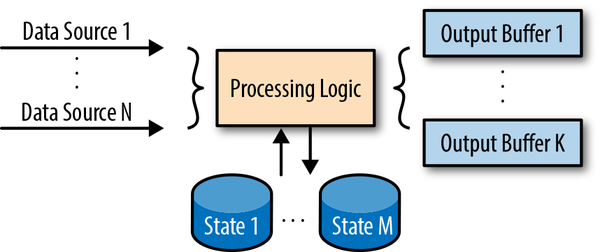

<center><i>图 3-3。流系统阶段的示例系统组件，包含飞行中数据的缓冲区。每个都将具有相关的水印跟踪，并且阶段的整体输出水印将是所有此类缓冲区中水印的最小值。在这种粒度级别上提供水印还可以更好地了解系统的行为。水印跟踪系统中各种缓冲区的消息位置，从而更容易诊断卡滞。</i></center>

我们可以用自己的水印跟踪每个这样的缓冲区。 每个阶段缓冲区中的最小水印构成该阶段的输出水印。 因此，输出水印可能是以下各项中的最小值：

- Per-source watermark——针对每个发送阶段
- Per-external input watermark——用于管道外部的源
- Per-state component watermark——针对每种可以写入的状态
- Per-output buffer watermark——针对每个接收阶段

使水印在此粒度级别可用还可以更好地了解系统的行为。 水印跟踪系统中各种缓冲区中消息的位置，从而更容易诊断卡住。

#### 了解水印传播

为了更好地了解输入和输出水印之间的关系以及它们如何影响水印传播，让我们看一个例子。让我们考虑一下游戏分数，但我们不会计算团队分数的总和，而是要尝试衡量用户参与度。我们将通过首先计算每个用户的会话长度来做到这一点，假设用户与游戏保持互动的时间量是他们享受游戏程度的合理代表。在回答我们的四个问题以计算会话长度后，我们将再次回答它们以计算固定时间段内的平均会话长度。

为了使我们的示例更加有趣，假设我们正在使用两个数据集，一个用于移动分数，一个用于控制台分数。我们希望通过对这两个独立数据集并行的整数求和来执行相同的分数计算。一个管道是为在移动设备上玩游戏的用户计算分数，而另一个是为在家庭游戏机上玩游戏的用户计算分数，这可能是由于不同平台采用了不同的数据收集策略。重要的一点是，这两个阶段执行相同的操作，但针对不同的数据，因此具有非常不同的输出水印。

首先，让我们看一下示例 3-1，看看该管道第一部分的缩写代码可能是什么样的。

*示例 3-1。计算会话长度*

```java
PCollection<Double> mobileSessions = IO.read(new MobileInputSource())
  .apply(Window.into(Sessions.withGapDuration(Duration.standardMinutes(1)))
               .triggering(AtWatermark())
               .discardingFiredPanes())
  .apply(CalculateWindowLength());

PCollection<Double> consoleSessions = IO.read(new ConsoleInputSource())
  .apply(Window.into(Sessions.withGapDuration(Duration.standardMinutes(1)))
               .triggering(AtWatermark())
               .discardingFiredPanes())
  .apply(CalculateWindowLength());
```

在这里，我们独立读取每个输入，而之前我们按团队键入我们的集合，在此示例中，我们按用户键入。之后，对于每个管道的第一阶段，我们进入会话窗口，然后调用名为 CalculateWindowLength 的自定义 PTransform。此 PTransform 仅按键（即用户）分组，然后通过将当前窗口的大小视为该窗口的值来计算每个用户的会话长度。在这种情况下，我们可以使用默认触发器 (AtWatermark) 和累积模式 (discardingFiredPanes) 设置，但为了完整起见，我已经明确列出了它们。两个特定用户的每个管道的输出可能类似于图 3-4。

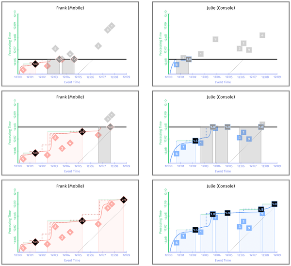

<center><i>图 3-4。跨两个不同输入管道的每用户会话长度</i></center>


因为我们需要跨多个阶段跟踪数据，我们以红色跟踪与移动分数相关的所有内容，以蓝色跟踪与控制台分数相关的所有内容，而图 3-5 中平均会话长度的水印和输出为黄色。

我们已经回答了关于什么、在哪里、何时以及如何计算单个会话长度这四个问题。接下来，我们将再次回答它们，以将这些会话长度转换为固定时间窗口内的全局会话长度平均值。这需要我们先将我们的两个数据源扁平化为一个，然后重新窗口化成固定窗口；我们已经在计算的会话长度值中捕获了会话的重要本质，现在我们想要在一天中的一致时间窗口内计算这些会话的全局平均值。示例 3-2 显示了此操作的代码。

<center><i>示例 3-2。 计算会话长度</i></center>

```java
PCollection<Double> mobileSessions = IO.read(new MobileInputSource())
  .apply(Window.into(Sessions.withGapDuration(Duration.standardMinutes(1)))
               .triggering(AtWatermark())
               .discardingFiredPanes())
  .apply(CalculateWindowLength());

PCollection<Double> consoleSessions = IO.read(new ConsoleInputSource())
  .apply(Window.into(Sessions.withGapDuration(Duration.standardMinutes(1)))
               .triggering(AtWatermark())
               .discardingFiredPanes())
  .apply(CalculateWindowLength());
  
PCollection<Float> averageSessionLengths = PCollectionList
  .of(mobileSessions).and(consoleSessions)
  .apply(Flatten.pCollections())
  .apply(Window.into(FixedWindows.of(Duration.standardMinutes(2)))
               .triggering(AtWatermark())
  .apply(Mean.globally());
```

如果我们要看到这个流水线在运行，它看起来像图 3-5。和以前一样，两个输入管道正在计算移动和控制台播放器的单独会话长度。然后将这些会话长度输入管道的第二阶段，在固定窗口中计算全局会话长度平均值。


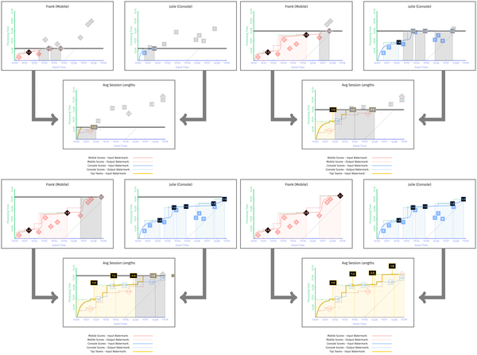

<center><i>图 3-5。移动和主机游戏会话的平均会话长度</i></center>

鉴于有很多事情发生，让我们来看看这个例子。这里有两个重要的点：

- 每个移动会话和控制台会话阶段的输出水印至少与每个阶段的相应输入水印一样旧，实际上稍微旧一点。这是因为在实际系统中计算答案需要时间，并且在对给定输入的处理完成之前，我们不允许输出水印前进。
- 平均会话长度阶段的输入水印是直接上游的两个阶段的输出水印的最小值。

结果是下游输入水印是上游输出水印的最小组成的别名。请注意，这与本章前面对这两种类型的水印的定义相匹配。还要注意下游的水印在过去是如何更远的，捕捉到上游阶段将比其后的阶段在时间上更早的直观概念。

这里值得一提的是，我们能够在示例 3-1 中再次提出问题，从而显着改变流水线的结果。在我们简单地计算每个用户的会话长度之前，我们现在计算两分钟的全局会话长度平均值。这可以让您更深入地了解玩我们游戏的用户的整体行为，并让您大致了解简单数据转换和真实数据科学之间的区别。

更好的是，既然我们了解了该管道如何运行的基础知识，我们可以更仔细地研究与再次提出四个问题相关的更微妙的问题之一：输出时间戳。

#### 水印传播和输出时间戳

在图 3-5 中，我忽略了输出时间戳的一些细节。但是，如果您仔细查看图中的第二阶段，您会发现第一阶段的每个输出都被分配了一个与其窗口结束相匹配的时间戳。尽管这是输出时间戳的一个相当自然的选择，但它并不是唯一有效的选择。正如你在本章前面所知道的，水印永远不允许向后移动。鉴于该限制，您可以推断给定窗口的有效时间戳范围从窗口中最早的非迟到记录的时间戳开始（因为只有非迟到的记录才能保证保持水印）并一直延伸到正无穷大.这是相当多的选择。然而，在实践中，在大多数情况下，往往只有几个选择是有意义的：

- 窗口的尽头[^4]

    如果您希望输出时间戳代表窗口边界，则使用窗口结束是唯一安全的选择。正如我们稍后将看到的，它还允许所有选项中最平滑的水印进展。

- 第一个非迟到元素的时间戳

    当您希望水印尽可能保守时，使用第一个非迟到元素的时间戳是一个不错的选择。然而，权衡是水印的进展可能会受到更大的阻碍，正如我们很快就会看到的那样。

- 特定元素的时间戳

    对于某些用例，其他一些任意（从系统的角度）元素的时间戳是正确的选择。想象一个用例，您将查询流加入到对该查询结果的点击流中。执行 join 后，一些系统会发现查询的时间戳更有用；其他人会更喜欢点击的时间戳。从水印正确性的角度来看，任何此类时间戳都是有效的，只要它对应于没有迟到的元素。

在考虑了一些输出时间戳的替代选项之后，让我们看看输出时间戳的选择会对整个管道产生什么影响。为了使更改尽可能地引人注目，在示例 3-3 和图 3-6 中，我们将切换到使用窗口可能的最早时间戳：第一个非迟到元素的时间戳作为窗口的时间戳。

<center><i>示例 3-3。 平均会话长度管道，输出在最早元素处设置的会话窗口的时间戳</i></center>

```java
PCollection<Double> mobileSessions = IO.read(new MobileInputSource())
  .apply(Window.into(Sessions.withGapDuration(Duration.standardMinutes(1)))
               .triggering(AtWatermark())
               .withTimestampCombiner(EARLIEST)
               .discardingFiredPanes())
  .apply(CalculateWindowLength());

PCollection<Double> consoleSessions = IO.read(new ConsoleInputSource())
  .apply(Window.into(Sessions.withGapDuration(Duration.standardMinutes(1)))
               .triggering(AtWatermark())
               .withTimestampCombiner(EARLIEST)
               .discardingFiredPanes())
  .apply(CalculateWindowLength());
  
PCollection<Float> averageSessionLengths = PCollectionList
  .of(mobileSessions).and(consoleSessions)
  .apply(Flatten.pCollections())
  .apply(Window.into(FixedWindows.of(Duration.standardMinutes(2)))
               .triggering(AtWatermark())
  .apply(Mean.globally());
```


<center><i>图 3-6。 在最早元素的时间戳输出的会话的平均会话长度</i></center>


为了帮助调出输出时间戳选择的效果，请查看第一阶段中的虚线，显示每个阶段的输出水印保持在什么位置。与图 3-7 和 3-8 相比，输出水印被我们选择的时间戳延迟，其中输出时间戳被选择为窗口的结束。从该图中可以看出，第二阶段的输入水印因此随后也被延迟。

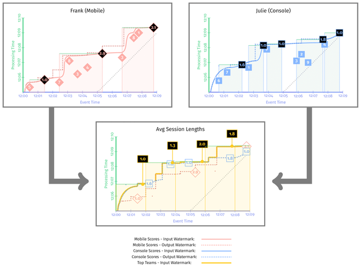

<center><i>图 3-7。不同窗口输出时间戳选择的水印和结果的比较。此图中的水印对应于会话窗口结束时的输出时间戳（即图 3-5）。</i></center>


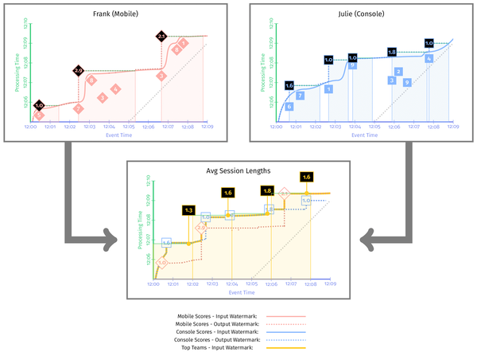

<center><i>图 3-8。在该图中，水印位于会话窗口的开头（即图 3-6）。我们可以看到，这张图中的水印线延迟比较多，得到的平均会话时长也不同。</i></center>


这个版本与图 3-7 相比，有两点值得注意：

- 水印延迟

    与图 3-5 相比，图 3-6 中水印的处理速度要慢得多。这是因为第一阶段的输出水印保留在每个窗口中第一个元素的时间戳，直到该窗口的输入完成。只有在给定窗口实现之后，才允许输出水印（以及下游的输入水印）前进。

- 语义差异

    由于会话时间戳现在被分配以匹配会话中最早的非迟到元素，因此当我们在下一阶段计算会话长度平均值时，各个会话通常最终位于不同的固定窗口桶中。到目前为止，我们所看到的两种选择中的任何一种都没有本质上的对错。他们只是不同。但重要的是要了解它们会有所不同，并对它们的不同方式有直觉，以便您可以在时机成熟时为您的特定用例做出正确的选择。

#### 重叠窗口的棘手案例

关于输出时间戳的另一个微妙但重要的问题是如何处理滑动窗口。将输出时间戳设置为最早元素的简单方法很容易导致下游延迟，因为水印（正确地）被阻止。要了解原因，请考虑一个具有两个阶段的示例管道，每个阶段都使用相同类型的滑动窗口。假设每个元素都出现在三个连续的窗口中。随着输入水印的推进，在这种情况下，滑动窗口所需的语义如下：

- 第一个窗口在第一阶段完成并在下游发出。
- 然后第一个窗口在第二阶段完成，也可以向下游发射。
- 一段时间后，第二个窗口在第一阶段完成……以此类推。

但是，如果选择输出时间戳作为窗格中第一个非迟到元素的时间戳，实际发生的情况如下：

- 第一个窗口在第一阶段完成并在下游发出。
- 第二阶段的第一个窗口仍然无法完成，因为它的输入水印被上游的第二个和第三个窗口的输出水印挡住了。这些水印被正确地阻止了，因为最早的元素时间戳被用作这些窗口的输出时间戳。
- 第二个窗口在第一阶段完成并在下游发出。
- 第二阶段的第一和第二窗口仍然无法完成，被上游的第三窗口阻止。
- 第三个窗口在第一阶段完成并在下游发出。
- 第二阶段的第一、第二和第三个窗口现在都可以完成，最终一举发射所有三个。

尽管此窗口化的结果是正确的，但这会导致结果以不必要的延迟方式实现。因此，Beam 具有用于重叠窗口的特殊逻辑，可确保窗口 N+1 的输出时间戳始终大于窗口 N 的结尾。

#### 百分位水印

到目前为止，我们关注的是通过阶段中活动消息的最小事件时间来衡量的水印。跟踪最小值允许系统知道所有较早的时间戳都已被考虑在内。另一方面，我们可以考虑活动消息的事件时间戳的整个分布，并利用它来创建更细粒度的触发条件。

不考虑分布的最小点，我们可以取分布的任何百分位，并说我们保证已经处理了具有较早时间戳的所有事件的这个百分比[^5]。

这个方案有什么好处？如果业务逻辑“大部分”正确就足够了，百分位水印提供了一种机制，与我们通过丢弃水印分布长尾中的异常值来跟踪最小事件时间相比，水印可以更快、更平稳地推进.图 3-9 显示了事件时间的紧凑分布，其中第 90 个百分位水印接近第 100 个百分位。图 3-10 展示了异常值进一步落后的情况，因此第 90 个百分位水印明显领先于第 100 个百分位。通过丢弃水印中的异常数据，百分位水印仍然可以跟踪大部分分布，而不会被异常值延迟。

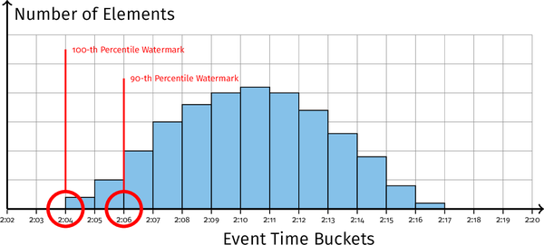
<center><i>图 3-9。看起来正常的水印直方图</i></center>

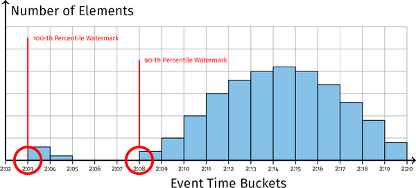
<center><i>图 3-10。带有异常值的水印直方图</i></center>

图 3-11 显示了一个用于为两分钟固定窗口绘制窗口边界的百分位水印示例。我们可以根据由百分位水印跟踪的到达数据的时间戳的百分位来绘制早期边界。


<center><i>图 3-11。不同水印百分位数的影响。随着百分位数的增加，窗口中包含更多的事件：但是他处理时间延迟以实现窗口也增加了。</i></center>


图 3-11 显示了第 33 个百分位、第 66 个百分位和第 100 个百分位（完整）水印，跟踪数据分布中各自的时间戳百分位。正如预期的那样，这些允许在跟踪完整的第 100 个百分位水印之前绘制边界。请注意，第 33 个和第 66 个百分位水印都允许更早地触发窗口，但要权衡将更多数据标记为较晚。例如，对于第一个窗口 \[12:00, 12:02)，基于第 33 个百分位水印关闭的窗口将仅包含四个事件并在 12:06 处理时间实现结果。如果我们使用第 66 个百分位水印，则相同的事件时间窗口将包括 7 个事件，并在 12:07 处理时间实现。使用第 100 个百分位水印包括所有十个事件，并将结果的具体化延迟到 12:08 处理时间。因此，百分位水印提供了一种方法来调整具体化结果的延迟和结果的精度之间的权衡。

### 处理时间水印

到目前为止，我们一直在研究水印，因为它们与流经我们系统的数据有关。我们已经看到查看水印如何帮助我们识别最旧数据与实时数据之间的总体延迟。但是，这不足以区分旧数据和延迟系统。换句话说，仅通过检查我们迄今为止定义的事件时间水印，我们无法区分一个快速且无延迟地处理一小时前数据的系统和一个试图处理实时数据的系统。时间数据，并且在这样做时已经延迟了一个小时。

为了做出这种区分，我们需要更多的东西：处理时间水印。我们已经看到流系统中有两个时间域：处理时间和事件时间。到目前为止，我们已经完全在事件时间域中定义了水印，作为流经系统的数据的时间戳的函数。这是一个事件时间水印。我们现在将相同的模型应用于处理时间域以定义处理时间水印。

我们的流处理系统不断地执行操作，例如在阶段之间混洗消息，读取或写入消息到持久状态，或者根据水印进度触发延迟聚合。所有这些操作都是响应在管道的当前或上游阶段完成的先前操作而执行的。因此，正如数据元素“流动”通过系统一样，处理这些元素所涉及的一系列操作也“流动”通过系统。

我们以与定义事件时间水印完全相同的方式定义处理时间水印，除了使用尚未完成的最旧工作的事件时间时间戳，我们使用最旧操作的处理时间时间戳尚未完成。处理时间水印延迟的一个示例可能是从一个阶段到另一个阶段的消息传递阻塞、读取状态或外部数据的阻塞 I/O 调用，或处理过程中的异常阻止处理完成。

因此，处理时间水印提供了与数据延迟分开的处理延迟的概念。要理解这种区别的价值，请考虑图 3-12 中的图表，其中我们查看了事件时间水印延迟。

我们看到数据延迟是单调增加的，但是没有足够的信息来区分卡住系统和数据卡住的情况。只有通过查看处理时间水印，如图 3-13 所示，我们才能区分这些情况。


<center><i>图 3-12。事件时间水印增加。无法从该信息中知道这是由于数据缓冲还是系统处理延迟造成的。</i></center>


<center><i>图 3-13。处理时间水印也在增加。这表明系统处理有延迟。</i></center>

在第一种情况下（图 3-12），当我们检查处理时间水印延迟时，我们发现它也在增加。这告诉我们，我们系统中的一个操作被卡住了，而这个卡住也是导致数据延迟落后的原因。可能发生这种情况的一些实际示例是存在网络问题，阻止了管道各阶段之间的消息传递，或者发生了故障并正在重试。通常，处理时间水印的增长表明存在阻止操作完成系统功能所必需的问题，并且通常需要用户或管理员干预才能解决。

在第二种情况下，如图 3-14 所示，处理时间水印延迟很小。这告诉我们没有卡住的操作。事件时间水印延迟仍在增加，这表明我们有一些缓冲状态正在等待耗尽。这是可能的，例如，如果我们在等待窗口边界发出聚合时正在缓冲某些状态，并且对应于管道的正常操作，如图 3-15 所示。


<center><i>图 3-14。事件时间水印延迟增加，处理时间水印稳定。这表明数据在系统中缓冲并等待处理，而不是表明系统操作正在阻止数据处理完成。</i></center>


<center><i>图 3-15。固定窗口的水印延迟。事件时间水印延迟随着每个窗口的元素被缓冲而增加，并随着每个窗口的聚合通过准时触发器发出而减少，而处理时间水印只是跟踪系统级延迟（在健康的情况下保持相对稳定）管道）。</i></center>


因此，处理时间水印是区分系统延迟和数据延迟的有用工具。除了可见性之外，我们还可以在系统实现级别将处理时间水印用于诸如临时状态的垃圾收集之类的任务（Reuven 在第 5 章中详细讨论了这方面的一个示例）。

### 实例探究

现在我们已经为水印应该如何表现奠定了基础，是时候看看一些真实的系统来了解水印的不同机制是如何实现的。我们希望这些能够阐明现实世界系统中水印在延迟和正确性以及可扩展性和可用性之间可能存在的权衡。

#### 案例研究：Google Cloud Dataflow中的水印

在流处理系统中实现水印有许多可能的方法。 在这里，我们对 Google Cloud Dataflow 中的实现进行了快速调查，这是一种用于执行 Apache Beam 管道的完全托管服务。 Dataflow 包括用于定义数据处理工作流的 SDK，以及用于在 Google Cloud Platform 资源上运行这些工作流的 Cloud Platform 托管服务。

Dataflow 通过将每个工作人员的可用键空间拆分为键范围并将每个范围分配给工作人员，将其数据处理图中的每个数据处理步骤条带化（分片）。每当遇到具有不同键的 GroupByKey 操作时，必须将数据洗牌到相应的键。

图 3-16 描述了使用 GroupByKey 的处理图的逻辑表示。

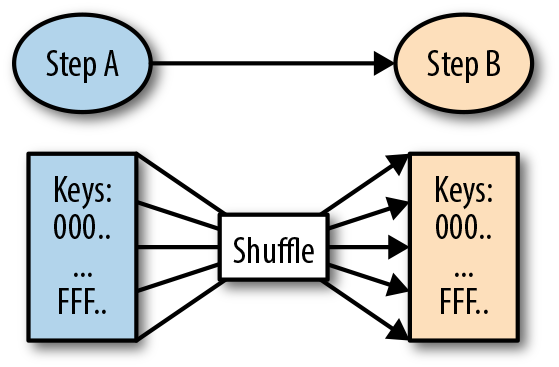

<center><i>图 3-16。 GroupByKey 步骤使用来自另一个 DoFn 的数据。这意味着在第一步的键和第二步的键之间存在数据混洗。</i></center>

而分配给工作人员的键范围的物理分配可能如图 3-17 所示。

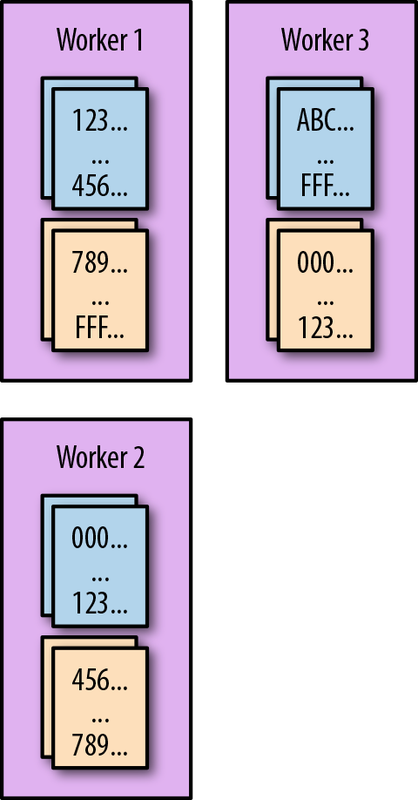
<center><i>图 3-17。两个步骤的键范围在可用工作人员之间分配（条带化）。</i></center>

在水印传播部分，我们讨论了为每个步骤的多个子组件维护水印。 Dataflow 跟踪每个组件的每个范围的水印。然后水印聚合涉及计算所有范围内每个水印的最小值，以确保满足以下保证：

- 所有范围都必须报告水印。如果某个范围不存在水印，则我们无法推进水印，因为必须将未报告的范围视为未知。
- 确保水印单调递增。因为延迟数据是可能的，如果它会导致水印向后移动，我们不能更新水印。

Google Cloud Dataflow 通过集中式聚合器代理执行聚合。我们可以对这个代理进行分片以提高效率。从正确性的角度来看，水印聚合器充当关于水印的“单一事实来源”。

确保分布式水印聚合的正确性提出了一定的挑战。最重要的是不要过早推进水印，因为过早推进水印会将准时数据变成延迟数据。具体来说，当物理分配被执行给工作人员时，工作人员维护附加到密钥范围的持久状态的租约，确保只有单个工作人员可以改变密钥的持久状态。为了保证水印的正确性，我们必须确保只有当工作进程仍然保持其持久状态的租约时，来自工作进程的每个水印更新才被允许进入聚合；因此，水印更新协议必须考虑国家所有权租赁验证。

#### 案例研究：Apache Flink 中的水印

Apache Flink 是一个开源流处理框架，用于分布式、高性能、始终可用和准确的数据流应用程序。可以使用 Flink 运行器运行 Beam 程序。在此过程中，Beam 依赖于 Flink 中的水印等流处理概念的实现。与通过集中式水印聚合器代理实现水印聚合的 Google Cloud Dataflow 不同，Flink 在带内执行水印跟踪和聚合[^6]

为了理解它是如何工作的，让我们看一个 Flink 管道，如图 3-18 所示。

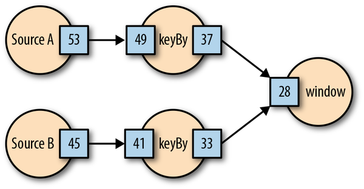
<center><i>图 3-18。具有两个源和事件时间水印的 Flink 管道在带内传播</i></center>


在这个管道中，数据是在两个来源生成的。这些源也都生成与数据流同步发送的水印“检查点”。这意味着当来自源 A 的时间戳为“53”的水印检查点发出时，它保证不会从源 A 发出时间戳在“53”之后的非延迟数据消息。下游的“keyBy”操作符使用输入数据和水印检查点。随着新的水印检查点被消耗，下游运营商对水印的看法被推进，并且可以为下游运营商发出新的水印检查点。

这种与数据流一起在带内发送水印检查点的选择不同于依赖中央聚合的 Cloud Dataflow 方法，并导致一些有趣的权衡。

以下是带内水印的一些优点：

- 减少水印传播延迟和极低延迟水印

    因为不需要让水印数据遍历多个跃点并等待中心聚合，所以使用带内方法可以更轻松地实现非常低的延迟。

- 水印聚合没有单点故障

    中央水印聚合代理不可用将导致整个管道的水印延迟。使用带内方法，部分管道不可用不会导致整个管道的水印延迟。

- 固有的可扩展性

    尽管 Cloud Dataflow 在实践中可以很好地扩展，但与使用带内水印的隐式可扩展性相比，使用集中式水印聚合服务实现可扩展性需要更高的复杂性。

以下是带外水印聚合的一些优点：

- “真相”的单一来源

    对于可调试性、监控和其他应用程序（例如基于管道进度的限制输入），拥有一个可以出售水印值的服务而不是在流中隐含水印是有利的，系统的每个组件都有自己的部分观点。

- 源水印创建

    一些源水印需要全局信息。例如，源可能暂时空闲、具有低数据速率，或者需要有关源或其他系统组件的带外信息来生成水印。这在中央服务中更容易实现。有关示例，请参见后面关于 Google Cloud Pub/Sub 源水印的案例研究。

#### 案例研究：Google Cloud Pub/Sub 的源水印

Google Cloud Pub/Sub 是一项完全托管的实时消息传递服务，可让您在独立应用程序之间发送和接收消息。在这里，我们讨论如何为通过 Cloud Pub/Sub 发送到管道的数据创建合理的启发式水印。

首先，我们需要描述一下 Pub/Sub 的工作原理。消息发布在 Pub/Sub 主题上。任何数量的 Pub/Sub 订阅都可以订阅特定主题。订阅给定主题的所有订阅都会传递相同的消息。传递的方法是让客户端从订阅中提取消息，并通过提供的 ID 确认特定消息的接收。尽管 Pub/Sub 确实尝试首先提供最旧的消息，但客户端无法选择提取哪些消息，但对此没有硬性保证。

为了构建启发式算法，我们对将数据发送到 Pub/Sub 的源进行了一些假设。具体来说，我们假设原始数据的时间戳“表现良好”；换句话说，在将源数据发送到 Pub/Sub 之前，我们期望源数据上有一定数量的乱序时间戳。任何带有超出允许的乱序界限的时间戳发送的数据都将被视为迟到的数据。在我们当前的实现中，此界限至少为 10 秒，这意味着在发送到 Pub/Sub 之前重新排序最多 10 秒的时间戳不会创建延迟数据。我们将此值称为估计范围。另一种看待这一点的方式是，当管道完全赶上输入时，水印将比实时落后 10 秒，以允许从源头重新排序。如果管道积压，则所有积压（不仅仅是 10 秒带）都用于估计水印。

Pub/Sub 面临哪些挑战？因为 Pub/Sub 不保证排序，所以我们必须有某种额外的元数据才能对积压工作有足够的了解。幸运的是，Pub/Sub 根据“最旧的未确认发布时间戳”提供了对积压的测量。这与我们消息的事件时间戳不同，因为 Pub/Sub 与通过它发送的应用程序级元数据无关；相反，这是 Pub/Sub 提取消息时的时间戳。

此测量与事件时间水印不同。它实际上是 Pub/Sub 消息传递的处理时间水印。 Pub/Sub 发布时间戳不等于事件时间戳，在发送历史（过去）数据的情况下，可能距离任意远。这些时间戳的排序也可能不同，因为如前所述，我们允许有限数量的重新排序。

但是，我们可以将其用作积压的衡量标准，以了解有关积压中存在的事件时间戳的足够信息，以便我们可以如下创建合理的水印。

我们为包含输入消息的主题创建了两个订阅：管道将实际用于读取要处理的数据的基本订阅，以及仅用于元数据的跟踪订阅，以执行水印估计。

看一下图 3-19 中的基本订阅，我们看到消息可能会乱序到达。我们用其 Pub/Sub 发布时间戳“pt”和事件时间时间戳“et”标记每条消息。请注意，这两个时域可以不相关。


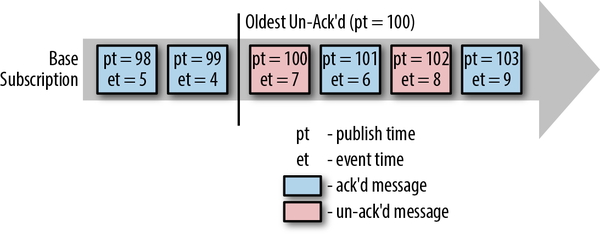
<center><i>图 3-19。到达 Pub/Sub 订阅的消息的处理时间和事件时间时间戳</i></center>


基本订阅上的一些消息未得到确认，形成了积压。这可能是由于它们尚未交付，或者它们可能已交付但尚未处理。还请记住，来自此订阅的拉取分布在多个分片中。因此，仅通过查看基本订阅就不可能说出我们的水印应该是什么。

跟踪订阅，如图 3-20 所示，用于有效检查基本订阅的积压，并采用积压中的最小事件时间戳。通过在跟踪订阅上维护很少或没有积压，我们可以在基本订阅最旧的未确认消息之前检查消息。


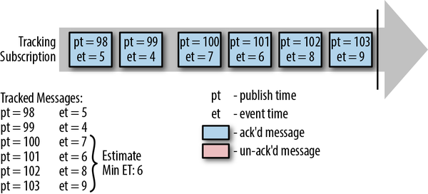
<center><i>图 3-20。额外的“跟踪”订阅接收与“基本”订阅相同的消息</i></center>

我们通过确保从该订阅中提取的计算成本低廉，来保持跟踪订阅的进度。相反，如果我们在跟踪订阅上远远落后，我们将停止推进水印。为此，我们确保至少满足以下条件之一：

- 跟踪订阅远远领先于基本订阅。足够提前意味着跟踪订阅至少提前了估计范围。这确保了估计带内的任何有界重新排序都被考虑在内。
- 跟踪订阅足够接近实时。换句话说，跟踪订阅没有积压。

在我们持久保存有关消息的发布和事件时间戳的元数据后，我们会尽快确认跟踪订阅上的消息。我们以稀疏直方图格式存储此元数据，以最大限度地减少使用的空间量和持久写入的大小。

最后，我们确保我们有足够的数据来做出合理的水印估计。我们从跟踪订阅中读取一组事件时间戳，其中发布时间戳比基本订阅的最早未确认或估计带的宽度更新。这确保我们考虑积压中的所有事件时间戳，或者如果积压很小，则使用最近的估计带来进行水印估计。

最后，水印值被计算为波段中的最小事件时间。

这种方法是正确的，因为在输入的 10 秒重新排序限制内的所有时间戳都将被水印考虑，并且不会显示为迟到的数据。然而，它可能会产生一个过于保守的水印，在第 2 章中描述的意义上“进展太慢”。因为我们考虑所有消息都在跟踪订阅上的基本订阅最旧的未确认消息之前，我们可以在已经确认的消息的水印估计。

以上所有确保只要源数据事件时间戳重新排序在估计范围内，就不会有额外的延迟数据。

### 总结

在这一点上，我们已经探索了如何使用消息的事件时间来给出流处理系统中进度的稳健定义。我们看到了这种进展概念随后如何帮助我们回答事件时间处理发生在哪里以及处理时间结果何时实现的问题。具体来说，我们研究了水印是如何在源头创建的、数据摄取到管道中的点，然后在整个管道中传播，以保留允许何时何地回答问题的基本保证。我们还研究了更改输出窗口时间戳对水印的影响。最后，我们探讨了在大规模构建水印时的一些实际系统注意事项。

现在我们已经对水印如何在幕后工作有了坚实的基础，我们可以深入了解它们可以为我们做什么，因为我们在第 4 章中使用窗口和触发来回答更复杂的查询。


[^1]: 注意额外提到的单调性； 我们尚未讨论如何实现这一点。 事实上，到目前为止的讨论没有提到单调性。 如果我们只考虑最早的飞行事件时间，水印将不会总是单调的，因为我们没有对我们的输入做出任何假设。 我们稍后会回到这个讨论。

[^2]: 准确地说，与其说日志数量需要是静态的，不如说系统先验地知道任何给定时间的日志数量。 由动态选择的输入日志数量组成的更复杂的输入源，例如 [Pravega](http://pravega.io)，也可以用于构建完美的水印。 只有在任何给定时间动态集中存在的日志数量未知时（如下一节中的示例所示），才必须求助于启发式水印。

[^3]: 请注意，我所说的“流经系统”并不一定意味着它们沿着与正常数据相同的路径流动。 它们可能（如在 Apache Flink 中），但它们也可能在带外传输（如在 MillWheel/Cloud Dataflow 中）。

[^4]: 从水印正确性的角度来看，窗口的 *start* 不是一个安全的选择，因为窗口中的第一个元素通常出现在 *之后* 窗口本身，这意味着水印不能保证 一直被推迟到窗口的开始。

[^5]: 这里描述的百分位数水印触发方案目前还没有被 Beam 实现； 但是，其他系统（例如 MillWheel）实现了这一点。

[^6]: 有关 Flink 水印的更多信息，请参阅 [Flink documentation on the subject.](https://ci.apache.org/projects/flink/flink-docs-release-1.3/dev/event_time.html )
