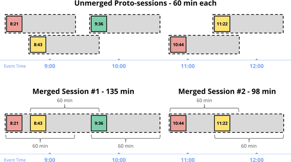
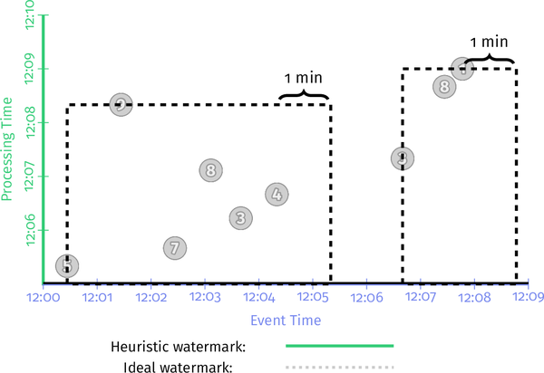

# Chapter4 高级窗口

再一次问好！我希望你和我一样喜欢第 3 章。水印是一个引人入胜的话题，Slava 比地球上任何人都更了解它们。现在我们对水印有了更深入的了解，我想深入探讨一些与内容、地点、时间和方式问题相关的更高级的主题。

我们首先看一下处理时间窗口，这是一个有趣的地点和时间组合，以更好地理解它与事件时间窗口的关系，并了解它实际上是正确方法的时间。然后，我们深入研究一些更高级的事件时间窗口概念，详细查看会话窗口，最后通过探索三种不同类型的自定义窗口来说明为什么通用自定义窗口是一个有用（而且非常简单）的概念：窗口、按键固定窗口和有界会话窗口。

### 时间/地点：处理时间窗口

处理时间窗口很重要，原因有两个：

- 对于某些用例，例如使用情况监控（例如，Web 服务流量 QPS），您想要分析观察到的传入数据流，处理时间窗口化绝对是合适的方法。

- 对于事件发生时间很重要的用例（例如，分析用户行为趋势、计费、评分等），处理时间窗口化绝对是错误的方法，能够识别这些情况至关重要.

因此，值得深入了解处理时间窗口和事件时间窗口之间的差异，特别是考虑到当今许多流系统中处理时间窗口的普遍性。

在将窗口作为一等概念严格基于事件时间的模型中工作时，例如本书中介绍的模型，您可以使用两种方法来实现处理时间窗口：

触发器

  忽略事件时间（即，使用跨越所有事件时间的全局窗口）并使用触发器在处理时间轴上提供该窗口的快照。

进入时间

  将入口时间分配为数据到达时的事件时间，并从那里开始使用正常的事件时间窗口。这基本上就是 Spark Streaming 1.x 所做的事情。

请注意，这两种方法或多或少是等效的，尽管它们在多级管道的情况下略有不同：在触发器版本中，多级管道将在每个阶段独立地分割处理时间“窗口”，例如，数据在一个阶段的窗口 N 中，可能会在下一阶段的窗口 N-1 或 N+1 中结束；在 ingress-time 版本中，在将数据合并到窗口 N 后，由于阶段之间通过水印（在 Cloud Dataflow 案例中）、微批处理边界（在Spark Streaming 案例），或引擎级别涉及的任何其他协调因素。

正如我已经注意到的那样，处理时间窗口的最大缺点是当输入的观察顺序发生变化时窗口的内容也会发生变化。为了更具体地说明这一点，我们将研究这三个用例：事件时间窗口、通过触发器的处理时间窗口和通过入口时间的处理时间窗口。

每个都将应用于两个不同的输入集（因此总共有六个变体）。这两个输入集将用于完全相同的事件（即，相同的值，发生在相同的事件时间），但具有不同的观察顺序。第一组将是我们一直看到的观察顺序，颜色为白色；第二个将在处理时间轴上移动所有值，如图 4-1 所示，颜色为紫色。你可以简单地想象紫色的例子是另一种现实可能发生的方式，如果风是从东而不是西吹来的（即，底层的复杂分布式系统集以稍微不同的顺序发挥作用）。


<center><i>图 4-1。在处理时间、保持值和事件时间常数中改变输入观察顺序</i></center>

#### 事件时间窗口化

为了建立基线，让我们首先将事件时间的固定窗口与这两个观察顺序上的启发式水印进行比较。我们将重用示例 2-7/图 2-10 中的早/晚代码来获得如图 4-2 所示的结果。左边基本上是我们之前看到的；右侧是第二个观察顺序的结果。这里要注意的重要一点是，即使输出的整体形状不同（由于处理时间的观察顺序不同），四个窗口的最终结果保持不变：14、18、3 和 12。


<center><i>图4-2 相同输入的两个不同处理时间顺序上的事件时间窗口</i></center>

### 通过触发器处理时间窗口

现在让我们将其与刚刚描述的两种处理时间方法进行比较。首先，我们将尝试 triggers 方法。以这种方式使处理时间“窗口化”工作有三个方面：

- 开窗

    我们使用全局事件时间窗口，因为我们本质上是在使用事件时间窗格来模拟处理时间窗口。

- 触发

    我们根据所需的处理时间窗口大小在处理时间域中定期触发。

- 积累

    我们使用丢弃模式来保持窗格彼此独立，从而让它们中的每一个都像一个独立的处理时间“窗口”。

相应的代码类似于示例 4-1；请注意，全局窗口是 Beam 中的默认设置，因此没有特定的窗口策略覆盖。

*示例 4-1。通过全局事件时间窗口的重复丢弃窗格进行处理时间窗口*

```java
PCollection<KV<Team, Integer>> totals = input
  .apply(Window.triggering(Repeatedly(AlignedDelay(ONE_MINUTE)))
               .discardingFiredPanes())
  .apply(Sum.integersPerKey());
```

当在流式运行器上针对我们两种不同的输入数据顺序执行时，结果如图 4-3 所示。以下是有关此图的一些有趣注释：

- 因为我们通过事件时间窗格模拟处理时间窗口，所以“窗口”在处理时间轴上被描绘，这意味着它们的有效宽度是在 y 轴而不是 x 轴上测量的。
 由于处理时间窗口化对遇到输入数据的顺序很敏感，因此对于两个观察顺序中的每一个，每个“窗口”的结果都不同，即使事件本身在技术上在每个版本中发生在同一时间。在左边我们得到 12、18、18，而在右边我们得到 7、36、5。


<center><i>图 4-3。通过触发器的处理时间“窗口化”，相同输入的两个不同处理时间排序</i></center>


### 通过接入时间的处理时间窗口

最后，让我们看看通过将输入数据的事件时间映射为它们的入口时间来实现的处理时间窗口化。代码方面，这里有四个方面值得一提：

- 时移

    当元素到达时，它们的事件时间需要被入口时间覆盖。我们可以在 Beam 中通过提供一个新的 DoFn 来做到这一点，该 DoFn 通过 outputWithTimestamp 方法将元素的时间戳设置为当前时间。

- 开窗

    返回使用标准事件时间固定窗口。

- 触发

    因为进入时间提供了计算完美水印的能力，我们可以使用默认触发器，在这种情况下，当水印通过窗口末尾时，它会隐式触发一次。

- 累积模式

    因为我们每个窗口只有一个输出，所以累积模式无关紧要。

因此，实际代码可能类似于示例 4-2 中的代码。

*示例 4-2。通过重复丢弃全局事件时间窗口的窗格进行处理时间窗口*

```java
PCollection<String> raw = IO.read().apply(ParDo.of(
  new DoFn<String, String>() {
    public void processElement(ProcessContext c) {
      c.outputWithTimestmap(new Instant());
    }
  });
PCollection<KV<Team, Integer>> input =
  raw.apply(ParDo.of(new ParseFn());
PCollection<KV<Team, Integer>> totals = input
  .apply(Window.info(FixedWindows.of(TWO_MINUTES))
  .apply(Sum.integersPerKey());
```

流式引擎上的执行如图 4-4 所示。当数据到达时，它们的事件时间会更新以匹配它们的进入时间（即到达时的处理时间），从而导致向右水平移动到理想的水印线上。以下是有关此图的一些有趣注释：

- 与其他处理时间窗口示例一样，当输入的顺序发生变化时，我们会得到不同的结果，即使输入的值和事件时间保持不变。
- 与另一个示例不同，窗口再次在事件时间域中描绘（因此沿着 x 轴）。尽管如此，它们并不是真正的事件时间窗口。我们只是将处理时间映射到事件时间域，擦除每个输入的原始发生记录，并用一个新记录替换它，而不是代表管道首次观察到数据的时间。
- 尽管如此，多亏了水印，触发器触发仍然发生在与前面的处理时间示例完全相同的时间。此外，生成的输出值与该示例相同，如预测的那样：左侧为 12、18、18，右侧为 7、36、5。
- 因为使用进入时间时可能会出现完美的水印，所以实际水印与理想水印相匹配，向上和向右上升，坡度为 1。


<center><i>图 4-4。通过使用入口时间的处理时间窗口，在相同输入的两个不同处理时间排序上</i></center>


尽管看到可以实现处理时间窗口的不同方式很有趣，但这里的最大收获是我从第一章开始就一直在强调的一个：事件时间窗口与顺序无关，至少在限制范围内（实际在输入完成之前，沿途的窗格可能会有所不同）；处理时窗口不是。如果您关心事件实际发生的时间，则必须使用事件时间窗口，否则您的结果将毫无意义。我现在要离开我的肥皂盒。

## *在哪里*：会话窗口

处理时间窗口就足够了。现在让我们回到久经考验的事件时间窗口，但现在我们要看看我最喜欢的功能之一：动态的、数据驱动的窗口，称为会话。

会话是一种特殊类型的窗口，它捕获数据中的一段活动，该活动因不活动的间隙而终止。它们在数据分析中特别有用，因为它们可以提供特定用户在特定时间段内参与某些活动的活动视图。这允许在会话中关联活动，根据会话的长度推断参与程度，等等。

从窗口的角度来看，会话在两个方面特别有趣：

- 它们是数据驱动窗口的示例：窗口的位置和大小是输入数据本身的直接结果，而不是像固定窗口和滑动窗口那样基于时间内的某些预定义模式。
- 它们也是未对齐窗口的示例；也就是说，一个窗口不会统一应用于数据，而是仅应用于数据的特定子集（例如，每个用户）。这与固定窗口和滑动窗口等对齐窗口形成对比，后者通常均匀地应用于数据。

对于某些用例，可以提前使用通用标识符标记单个会话中的数据（例如，发出具有服务质量的心跳 ping 的视频播放器信息; 对于任何给定的观看，所有的 ping 都可以提前用一个会话 ID 进行标记）。 在这种情况下，会话更容易构建，因为它基本上只是一种按键分组的形式。

然而，在更一般的情况下（即，实际会话本身事先不知道），会话必须仅根据数据在时间内的位置构建。 在处理乱序数据时，这变得特别棘手。

图 4-5 显示了这方面的一个示例，五个独立的记录组合到会话窗口中，间隔超时为 60 分钟。 每条记录都以自己的 60 分钟窗口开始（原始会话）。 将重叠的原始会话合并在一起会产生两个较大的会话窗口，分别包含三个和两个记录。


<center><i>图 4-5。 未合并的原始会话窗口，以及由此产生的合并会话</i></center>

他们在提供一般会话支持方面的关键见解是，根据定义，一个完整的会话窗口是一组较小的重叠窗口的组合，每个窗口包含一条记录，序列中的每个记录与下一个记录之间的间隔为不活动不大于预定义的超时。因此，即使我们观察到会话中的数据乱序，我们也可以简单地通过将任何重叠的窗口合并在一起来构建最终会话，以便在单个数据到达时将它们合并在一起。

换个角度来看，考虑一下我们迄今为止一直在使用的例子。如果我们指定一分钟的会话超时，我们希望在数据中识别两个会话，如图 4-6 中的黑色虚线所示。这些会话中的每一个都捕获来自用户的活动爆发，会话中的每个事件与会话中的至少一个其他事件相隔不到一分钟。


<center><i>图 4-6。我们要计算的会话</i></center>


要了解窗口合并如何在遇到事件时随着时间的推移建立这些会话，让我们看一下它的实际操作。我们将使用示例 2-10 中启用了撤回的早/晚代码，并更新窗口以使用一分钟的间隔持续时间超时来构建会话。示例 4-3 说明了这种情况。

*示例 4-3。带有会话窗口和撤回的早期/准时/延迟触发*

```java
PCollection<KV<Team, Integer>> totals = input
  .apply(Window.into(Sessions.withGapDuration(ONE_MINUTE))
               .triggering(
                 AfterWatermark()
                   .withEarlyFirings(AlignedDelay(ONE_MINUTE))
                   .withLateFirings(AfterCount(1))))
  .apply(Sum.integersPerKey());
```


在流式引擎上执行，你会得到如图 4-7 所示的结果（注意，我在黑色虚线中留下了注释预期的最终会话以供参考）。


<center><i>图 4-7。流媒体引擎上的会话窗口和撤回的早期和晚期触发</i></center>

这里发生了很多事情，所以我将引导您完成其中的一些：

- 当遇到第一个值为 5 的记录时，它被放置在一个原始会话窗口中，该窗口从该记录的事件时间开始，跨越会话间隙持续时间的宽度；例如，比该数据发生的时间点晚一分钟。我们将来遇到的与此窗口重叠的任何窗口都应该是同一会话的一部分，并将被合并到其中。
- 第二个到达的记录是 7，它同样被放置在它自己的原始会话窗口中，因为它不与 5 的窗口重叠。
- 与此同时，水印已经过了第一个窗口的末尾，所以值 5 在 12:06 之前作为准时结果具体化。此后不久，第二个窗口也被具体化为值为 7 的推测结果，就在处理时间达到 12:06 时。
- 我们接下来观察一对记录 3 和 4，它们的原始会话重叠。结果，它们合并在一起，并且在 12:07 的早期触发器触发时，会发出一个值为 7 的单个窗口。
- 当 8 之后不久到达时，它与值为 7 的两个窗口重叠。因此，所有三个窗口都合并在一起，形成一个值为 22 的新组合会话。当水印随后通过此会话结束时，它实现了值 22 的新会话以及先前发出但后来合并到其中的值 7 的两个窗口的撤回。
- 当 9 迟到时会发生类似的舞蹈，将值为 5 的原始会话和值为 22 的会话加入一个更大的值为 36 的会话。 36 以及 5 和 22 窗口的撤回都由延迟数据触发。

这是一些非常强大的东西。真正令人敬畏的是，在一个模型中描述这样的事情是多么容易，该模型将流处理的维度分解为不同的、可组合的部分。最后，您可以更多地关注手头有趣的业务逻辑，而不是关注将数据塑造成某种可用形式的细节。

如果您不相信我，请查看这篇描述如何在 Spark Streaming 1.x 上手动建立会话的博客文章（请注意，这样做并不是为了指责它们；Spark 的人刚刚在其他人真正费心去记录在 Spark 1.x 之上构建特定种类的会话支持所需要的麻烦；对于大多数其他系统，你不能这么说）。它非常复杂，他们甚至没有进行适当的事件时间会话，或者提供投机或延迟解雇，或撤回。

## *在哪里*：自定义窗口

到目前为止，我们主要讨论了预定义类型的窗口策略：固定、滑动和会话。您可以从标准类型的窗口中获得很多好处，但是有很多真实的用例能够定义自定义窗口策略可以真正节省时间（我们现在将看到其中三个）。

今天的大多数系统不支持自定义窗口，其支持程度与 Beam [^1] 不同，因此我们专注于 Beam 方法。在 Beam 中，自定义窗口策略由两部分组成：

- 窗口分配

    这会将每个元素放入初始窗口。在极限情况下，这允许将每个元素放置在一个独特的窗口中，这非常强大。

- （可选）窗口合并

    这允许窗口在分组时间合并，这使得窗口可以随着时间的推移而演变，我们之前在会话窗口中看到了这一点。

为了让您了解窗口策略到底有多简单，以及自定义窗口支持有多么有用，我们将详细研究 Beam 中固定窗口和会话的库存实现，然后考虑一些现实世界需要对这些主题进行自定义变体的用例。在此过程中，我们将看到创建自定义窗口策略是多么容易，以及当您的用例不太适合现有方法时，如何限制缺乏自定义窗口支持。

#### 固定窗口上的变化

首先，让我们看一下固定窗口的相对简单的策略。普通的固定窗口实现和你想象的一样简单，由以下逻辑组成：

- 任务

    元素根据其时间戳以及窗口的大小和偏移参数放置到适当的固定窗口中。

- 合并

    没有任何。

代码的缩写版本如示例 4-4 所示。

*示例 4-4。缩写的 FixedWindows 实现*

```java
public class FixedWindows extends WindowFn<Object, IntervalWindow> {
  private final Duration size;
  private final Duration offset;
  public Collection<IntervalWindow> assignWindow(AssignContext c) {
    long start = c.timestamp().getMillis() - c.timestamp()
                   .plus(size)
                   .minus(offset)
                   .getMillis() % size.getMillis();
    return Arrays.asList(IntervalWindow(new Instant(start), size));
  }
}
```

请记住，在这里向您展示代码的目的并不是教您如何编写窗口策略（尽管揭开它们的神秘面纱并指出它们是多么简单）。这确实有助于对比支持一些相对基本的用例的相对难易程度，分别有和没有自定义窗口。现在让我们考虑两个这样的用例，它们是固定窗口主题的变体。

#### 未对齐的固定窗口

我们之前提到的默认固定窗口实现的一个特征是窗口在所有数据中对齐。在我们运行的示例中，任何给定团队从中午到下午 1 点的窗口与所有其他团队的相应窗口对齐，这些窗口也从中午延伸到下午 1 点。在您想要在另一个维度上比较类似窗口的用例中，例如团队之间，这种对齐非常有用。然而，它的代价有些微妙。从中午到下午 1 点的所有活动窗口大约在同一时间完成，这意味着系统每小时都会遇到大量窗口负载以实现。

为了明白我的意思，让我们看一个具体的例子（例 4-5）。我们将从在大多数示例中使用的分数求和管道开始，具有固定的两分钟窗口和单个水印触发器。

*示例 4-5。水印完整性触发（同例 2-6）*

```java
PCollection<KV<Team, Integer>> totals = input
  .apply(Window.into(FixedWindows.of(TWO_MINUTES))
               .triggering(AfterWatermark()))
  .apply(Sum.integersPerKey()); 
```
但在本例中，我们将并行查看来自同一数据集的两个不同键（见图 4-8）。我们将看到这两个键的输出都是对齐的，因为窗口在所有键上都是对齐的。结果，每次水印通过窗口末尾时，我们最终都会实现 N 个窗格，其中 N 是该窗口中具有更新的键的数量。在此示例中，N 为 2，这可能不会太痛苦。但是，当 N 开始订购数千、数百万或更多时，这种同步突发性可能会成为问题。


<center><i>图 4-8。对齐的固定窗口</i></center>

在不需要跨窗口比较的情况下，通常更希望将窗口完成负载均匀分布在时间上。这使得系统负载更加可预测，从而可以减少处理峰值负载的配置要求。然而，在大多数系统中，未对齐的固定窗口仅如果系统为它们提供开箱即用的支持，则可用。[^2] 但是使用自定义窗口支持，这是对默认固定窗口实现的相对简单的修改，以提供未对齐的固定窗口支持。我们要做的是继续保证组合在一起的所有元素的窗口（即具有相同键的窗口）具有相同的对齐方式，同时放宽不同键之间的对齐限制。代码更改为默认的固定窗口策略，类似于示例 4-6。

*示例 4-6。缩写 UnalignedFixedWindows 实现*

```java
public class UnalignedFixedWindows
    extends WindowFn<KV<K, V>, IntervalWindow> {
  private final Duration size;
  private final Duration offset;
  public Collection<IntervalWindow> assignWindow(AssignContext c) {
    long perKeyShift = hash(c.element().key()) % size;
    long start = perKeyShift + c.timestamp().getMillis()
                   - c.timestamp()
                      .plus(size)
                      .minus(offset)
    return Arrays.asList(IntervalWindow(new Instant(start), size));
  }
}
```

通过此更改，具有相同键的所有元素的窗口都对齐了，[^3] 但具有不同键的元素的窗口（通常）将不对齐，因此分散了窗口完成负载，但代价是键之间的比较也不太有意义.我们可以切换管道以使用我们的新窗口策略，如示例 4-7 所示。

*示例 4-7。带有单个水印触发器的未对齐固定窗口*
```java
PCollection<KV<Team, Integer>> totals = input
  .apply(Window.into(UnalignedFixedWindows.of(TWO_MINUTES))
               .triggering(AfterWatermark()))
  .apply(Sum.integersPerKey());
```
然后你可以通过比较同一个数据集上的不同固定窗口对齐（在这种情况下，我选择了两个对齐之间的最大相移来最清楚地显示好处，因为在大量密钥中随机选择的阶段会产生类似的效果）。


<center><i>图 4-9。未对齐的固定窗口</i></center>


请注意，我们没有同时为多个键发出多个窗格的情况。相反，窗格以更均匀的节奏单独到达。这是在用例允许的情况下，能够在一个维度（跨键比较的能力）以换取另一个维度的收益（减少峰值资源供应要求）的另一个示例。当您尝试尽可能高效地处理大量数据时，这种灵活性至关重要。

现在让我们看一下固定窗口的第二种变体，它与正在处理的数据更内在地联系在一起。

#### 每个元素/键固定窗口

我们的第二个示例来自 Cloud Dataflow 的早期采用者之一。该公司为其客户生成分析数据，但每个客户都可以配置其希望聚合其指标的窗口大小。换句话说，每个客户都可以定义其固定窗口的具体大小。

只要可用窗口大小的数量本身是固定的，支持这样的用例就不会太困难。例如，您可以想象提供选择 30 分钟、60 分钟和 90 分钟固定窗口的选项，然后为每个选项运行单独的管道（或管道的分支）。不理想，但也不算太可怕。然而，随着选项数量的增加，这很快变得棘手，并且在提供对真正任意窗口大小的支持（这是该客户的用例所需要的）的限制下是完全不切实际的。

幸运的是，因为客户处理的每条记录都已经用元数据进行了注释，描述了用于聚合的所需窗口大小，支持任意的、每个用户的固定窗口大小就像从股票固定窗口实现中更改几行一样简单，如如例 4-8 所示。

*示例 4-8。支持每个元素窗口大小的修改（和缩写）FixedWindows 实现*

```java
public class PerElementFixedWindows<T extends HasWindowSize%gt;
    extends WindowFn<T, IntervalWindow> {
  private final Duration offset;
  public Collection<IntervalWindow> assignWindow(AssignContext c) {
    long perElementSize = c.element().getWindowSize();
    long start = perKeyShift + c.timestamp().getMillis()
                   - c.timestamp()
                      .plus(size)
                      .minus(offset)
                      .getMillis() % size.getMillis();
    return Arrays.asList(IntervalWindow(
        new Instant(start), perElementSize));
  }
}
```
通过此更改，每个元素都被分配到具有适当大小的固定窗口，如元素本身携带的元数据所指示的那样。[^4] 更改管道代码以使用此新策略再次变得微不足道，如示例 4-9所示。

*示例 4-9。 具有单个水印触发器的每个元素的固定窗口大小*

```java
PCollection<KV<Team, Integer>> totals = input
  .apply(Window.into(PerElementFixedWindows.of(TWO_MINUTES))
               .triggering(AfterWatermark()))
  .apply(Sum.integersPerKey());
```

然后查看运行中的这个管道（图 4-10），很容易看出 Key A 的元素都有两分钟的窗口大小，而 Key B 的元素有一分钟的窗口大小。


<center><i>图 4-10。 每键自定义大小的固定窗口</i></center>


这确实不是您合理期望系统提供给您的东西。 存储窗口大小首选项的性质过于特定于用例，因此尝试将其构建到标准 API 中是有意义的。 然而，正如该客户的需求所展示的那样，确实存在这样的用例。 这就是自定义窗口提供的灵活性如此强大的原因。

### 会话窗口的变化

为了真正了解自定义窗口的有用性，让我们看最后一个示例，它是会话的一种变体。可以理解，会话窗口比固定窗口要复杂一些。它的实现包括以下内容：

- 任务

    每个元素最初都放置在一个原型会话窗口中，该窗口从元素的时间戳开始，并在间隙持续时间内延伸。

- 合并

    在分组时，所有符合条件的窗口都被排序，之后任何重叠的窗口被合并在一起。

会话代码的缩写版本（从许多帮助类手工合并在一起）看起来像示例 4-10 中所示的那样。

*示例 4-10。缩写会话实施*

```java
public class Sessions extends WindowFn<Object, IntervalWindow> {
  private final Duration gapDuration;
  public Collection<IntervalWindow> assignWindows(AssignContext c) {
    return Arrays.asList(
      new IntervalWindow(c.timestamp(), gapDuration));
  }
  public void mergeWindows(MergeContext c) throws Exception {
    List<IntervalWindow> sortedWindows = new ArrayList<>();
    for (IntervalWindow window : c.windows()) {
      sortedWindows.add(window);
    }
    Collections.sort(sortedWindows);
    List<MergeCandidate> merges = new ArrayList<>();
    MergeCandidate current = new MergeCandidate();
    for (IntervalWindow window : sortedWindows) {
      if (current.intersects(window)) {
        current.add(window);
      } else {
        merges.add(current);
        current = new MergeCandidate(window);
      }
    }
    merges.add(current);
    for (MergeCandidate merge : merges) {
      merge.apply(c);
    }
  }
}
```

和以前一样，看代码的目的不是教你如何实现自定义窗口函数，或者甚至是会话的实现是什么样的；这确实是为了展示您可以通过自定义窗口轻松支持新用途。

#### 有界会话

我多次遇到的一个这样的自定义用例是有界会话：不允许在时间、元素计数或其他维度上超过一定大小的会话。这可能是出于语义原因，也可能只是垃圾邮件保护的练习。然而，考虑到限制类型的变化（一些用例关心事件时间的总会话大小，一些关心总元素计数，一些关心元素密度等），很难为有界提供一个简洁明了的 API会议。更实用的是允许用户实现他们自己的自定义窗口逻辑，根据他们的特定用例量身定制。一个这样的用例示例，其中会话窗口是有时间限制的，可能类似于示例 4-11（省略了我们将在此处使用的一些构建器样板）。

*示例 4-11。缩写会话实施*

```java
public class BoundedSessions extends WindowFn<Object, IntervalWindow> {
  private final Duration gapDuration;
  private final Duration maxSize;
  public Collection<IntervalWindow> assignWindows(AssignContext c) {
    return Arrays.asList(
      new IntervalWindow(c.timestamp(), gapDuration));
  }
  private Duration windowSize(IntervalWindow window) {
    return window == null
      ? new Duration(0)
      : new Duration(window.start(), window.end());
  }
  public static void mergeWindows(
      WindowFn<?, IntervalWindow>.MergeContext c) throws Exception {
    List<IntervalWindow> sortedWindows = new ArrayList<>();
    for (IntervalWindow window : c.windows()) {
      sortedWindows.add(window);
    }
    Collections.sort(sortedWindows);
    List<MergeCandidate> merges = new ArrayList<>();
    MergeCandidate current = new MergeCandidate();
    for (IntervalWindow window : sortedWindows) {
      MergeCandidate next = new MergeCandidate(window);
      if (current.intersects(window)) {
        current.add(window);
        if (windowSize(current.union) <= (maxSize - gapDuration))
          continue;
        // Current window exceeds bounds, so flush and move to next
        next = new MergeCandidate();
      }
      merges.add(current);
      current = next;
    }
    merges.add(current);
    for (MergeCandidate merge : merges) {
      merge.apply(c);
    }
  }
}
```

与往常一样，更新我们的管道（在本例中为示例 2-7 中的早期/准时/延迟版本）以使用此自定义窗口策略是微不足道的，如示例 4-12 所示。

*示例 4-12。通过 early/on-time/late API 提前、准时和延迟触发*

```java
PCollection<KV<Team, Integer>> totals = input
  .apply(Window.into(BoundedSessions
                       .withGapDuration(ONE_MINUTE)
                       .withMaxSize(THREE_MINUTES))
               .triggering(
                 AfterWatermark()
                   .withEarlyFirings(AlignedDelay(ONE_MINUTE))
                   .withLateFirings(AfterCount(1))))
  .apply(Sum.integersPerKey());
```

并在我们正在运行的示例中执行，然后可能如图 4-11 所示。


<center><i>图 4-11。 每键自定义大小的固定窗口</i></center>


请注意，在图 2-7 中的无界会话实现中，跨越 \[12:00.26, 12:05.20) 或近五分钟时间的值为 36 的大型会话现在最终分成两个长度为 2 分钟的较短会话和 2 分 53 秒。

鉴于当今很少有系统提供自定义窗口支持，值得指出的是，使用仅支持无界会话实现的系统来实现这样的事情需要付出多少努力。您唯一真正的办法是在会话分组逻辑的下游编写代码，查看生成的会话并在它们超过长度限制时将它们切碎。这将需要在事后分解会话的能力，这将抵消增量聚合的好处（我们将在第 7 章中更详细地讨论这一点），从而增加成本。它还将消除人们希望通过限制会话长度获得的任何垃圾邮件保护好处，因为会话首先需要增长到它们的完整大小，然后才能被截断或截断。

### 一种尺寸并不适合所有人

我们现在研究了三个真实世界的用例，每个用例都是数据处理系统通常提供的常用窗口类型的细微变化：未对齐的固定窗口、每个元素的固定窗口和有界会话。在所有这三种情况下，我们看到通过自定义窗口支持这些用例是多么简单，以及如果没有它支持这些用例将变得多么困难（或昂贵）。尽管自定义窗口尚未在整个行业中得到广泛支持，但在构建需要处理大量数据的复杂真实用例的数据处理管道时，它为平衡权衡提供了急需的灵活性，例如尽可能高效。

## 总结

高级窗口化是一个复杂而多样的主题。在本章中，我们介绍了三个高级概念：

- 处理时间窗口

    我们看到了这与事件时间窗口的关系，指出了它本质上有用的地方，最重要的是，通过特别强调事件时间窗口为我们提供的结果的稳定性来识别那些没有用的地方。

- 会话窗口

    我们首次介绍了合并窗口策略的动态类，并了解系统在提供如此强大的结构方面为我们做了多少繁重的工作，您可以简单地放置到位。

- 自定义窗口

    在这里，我们查看了三个真实世界的自定义窗口示例，这些示例在仅提供一组静态库存窗口策略的系统中难以或不可能实现，但在具有自定义窗口支持的系统中实现相对微不足道：

- 未对齐的固定窗口，当结合固定窗口使用水印触发器时，随着时间的推移提供更均匀的输出分布。
- 每个元素的固定窗口，它提供了动态选择每个元素的固定窗口大小的灵活性（例如，提供可定制的每个用户或每个广告活动的窗口大小），以更好地定制管道语义以供使用手头的案子。
- 有界会话窗口，它限制给定会话可能增长的大小；例如，为了抵制垃圾邮件尝试或限制管道实现的已完成会话的延迟。

在第 3 章中与 Slava 一起深入研究水印并在这里对高级窗口进行了广泛调查之后，我们现在已经远远超出了多维鲁棒流处理的基础知识。至此，我们结束了对 Beam 模型以及本书第一部分的关注。

接下来是 Reuven 关于一致性保证、一次性处理和副作用的第 5 章，之后我们开始进入第 6 章的第二部分，流和表。


[^1]: 据我所知，Apache Flink 是唯一一个像 Beam 一样支持自定义窗口的系统。 公平地说，由于能够提供自定义窗口驱逐器，它的支持甚至超出了 Beam 的支持。 爆头。

[^2]: 目前我实际上并不知道有任何此类系统。

[^3]: 这自然意味着使用键控数据，但由于窗口本质上与键分组相关，因此该限制并不是特别麻烦。

[^4]: 元素本身知道窗口大小并不重要； 无论所需的尺寸是多少，您都可以轻松地查找和缓存适当的窗口大小； 例如，每个用户。
