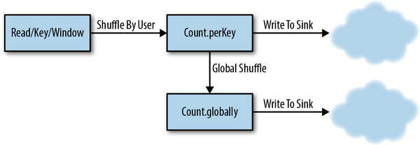
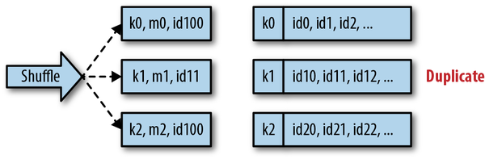
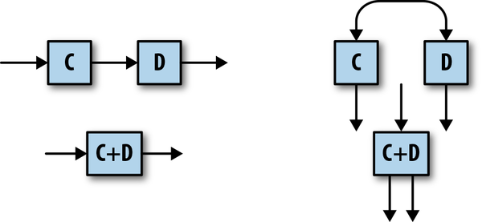
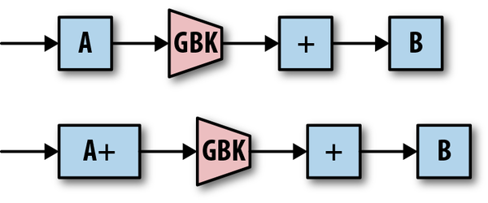
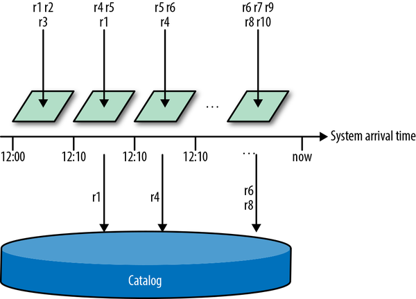

# Chapter5.恰好一次和副作用

我们现在从讨论编程模型和 API 转移到实现它们的系统。模型和 API 允许用户描述他们想要计算的内容。实际上，大规模准确地运行计算需要一个系统——通常是分布式系统。

在本章中，我们将重点关注实施系统如何正确实施 Beam 模型以产生准确的结果。流式系统经常谈论一次性处理。也就是说，确保每条记录都只处理一次。我们将解释我们的意思，以及如何实现它。

作为一个鼓舞人心的例子，本章重点介绍 Google Cloud Dataflow 使用的技术，以有效地保证对记录的一次性处理。在本章的最后，我们还将研究一些其他流行的流系统使用的技术来保证恰好一次。

### 为什么只有一次很重要

几乎不用说，对于许多用户来说，在他们的数据处理管道中丢失记录或数据丢失的任何风险都是不可接受的。即便如此，历史上许多通用流媒体系统并不能保证记录处理——所有处理都只是“尽力而为”。其他系统提供至少一次保证，确保记录总是至少处理一次，但记录可能重复（从而导致不准确的聚合）；在实践中，许多这样的至少一次系统在内存中执行聚合，因此当机器崩溃时它们的聚合仍然可能丢失。这些系统用于低延迟、推测性的结果，但通常不能保证这些结果的真实性。

正如第 1 章所指出的，这导致了一种创造 Lambda 架构的策略——运行一个流系统来获得快速但不准确的结果。稍后（通常在一天结束后），批处理系统运行到正确答案。这仅在数据流可重放时才有效；然而，对于足够多的数据源，这一策略被证明是可行的。 ”

尽管如此，许多尝试过这种方法的人都遇到了 Lambda 架构的一些问题：

- 不准确

  用户倾向于低估故障的影响。他们经常假设一小部分记录会丢失或重复（通常基于他们进行的实验），并且在糟糕的一天当 10%（或更多！）的记录丢失或重复时感到震惊。从某种意义上说，这样的系统只提供了“一半”的保证——没有完整的保证，一切皆有可能。

- 不一致

  用于日终计算的批处理系统通常具有与流系统不同的数据语义。事实证明，让两条管道产生可比较的结果比最初想象的要困难得多。

- 复杂

  根据定义，Lambda 要求您编写和维护两个不同的代码库。您还必须运行和维护两个复杂的分布式系统，每个系统都有不同的故障模式。对于除了最简单的管道之外的任何东西，这很快就会变得不堪重负。

- 不可预测性

  在许多用例中，最终用户会看到与每日结果相差不确定的流媒体结果，这可能会随机变化。在这些情况下，用户将不再信任流数据，而是等待每日批处理结果，从而首先破坏了获得低延迟结果的价值。

- 潜伏

  某些业务用例需要低延迟的正确结果，而 Lambda 架构并非按设计提供。

幸运的是，许多 Beam runner 可以做得更好。在本章中，我们将解释精确一次流处理如何帮助用户在依赖单一代码库和 API 的同时获得准确的结果并避免数据丢失的风险。由于可能影响管道输出的各种问题经常被错误地与精确一次保证混为一谈，当我们在 Beam 和数据处理的上下文中提到“精确一次”时，我们首先准确地解释哪些问题在范围内和范围之外。

#### 准确性与完整性

每当 Beam 管道处理管道的记录时，我们都希望确保该记录永远不会被丢弃或重复。但是，流式管道的性质是，记录有时会在其时间窗口的聚合已被处理后显示较晚。 Beam SDK 允许用户配置系统等待延迟数据到达的时间；任何（且仅）晚于此截止日期到达的记录都将被删除。此功能有助于完整性，而不是准确性：所有及时出现以进行处理的记录都被准确地处理一次，而这些迟到的记录被明确删除。

尽管延迟记录通常在流系统的上下文中讨论，但值得注意的是批处理管道也存在类似的完整性问题。例如，一个常见的批处理范例是在凌晨 2 点对前一天的所有数据运行作业。但是，如果昨天的某些数据直到凌晨 2 点才收集到，则批处理作业不会处理它！因此，批处理管道也提供准确但并不总是完整的结果。

### 副作用

Beam 和 Dataflow 的一个特点是用户注入自定义代码，这些代码作为其管道图的一部分执行。 Dataflow 不保证此代码每条记录仅运行一次，[^1] 无论是由流式运行程序还是批处理运行程序。它可能通过用户转换多次运行给定记录，甚至可能在多个工作人员上同时运行相同的记录；这对于保证在工作人员失败时至少进行一次处理是必要的。这些调用中只有一个可以“获胜”并在管道的下游产生输出。

因此，不能保证非幂等副作用只执行一次；如果您编写的代码具有管道外部的副作用，例如联系外部服务，则这些影响可能会针对给定记录执行多次。这种情况通常是不可避免的，因为没有办法自动提交 Dataflow 的处理，会对外部服务产生副作用。管道确实需要最终将结果发送到外部世界，并且这样的调用可能不是幂等的。正如您将在本章后面看到的那样，通常此类接收器能够添加一个额外的阶段来首先将调用重组为幂等操作。

#### 问题定义

所以，我们给出了几个我们没有谈论的例子。那么我们所说的恰好一次处理是什么意思呢？为了激发这一点，让我们从一个简单的流式传输管道[^2] 开始，如示例 5-1 所示。

*示例 5-1。一个简单的流管道*

```java
Pipeline p = Pipeline.create(options);
// Calculate 1-minute counts of events per user.
PCollection<..> perUserCounts = 
      p.apply(ReadFromUnboundedSource.read())
       .apply(new KeyByUser())
       .Window.<..>into(FixedWindows.of(Duration.standardMinutes(1)))
       .apply(Count.perKey());
// Process these per-user counts, and write the output somewhere.
perUserCounts.apply(new ProcessPerUserCountsAndWriteToSink());
// Add up all these per-user counts to get 1-minute counts of all events.
perUserCounts.apply(Values.<..>create())
             .apply(Count.globally())
             .apply(new ProcessGlobalCountAndWriteToSink());
p.run();
```

此管道计算两个不同的窗口聚合。第一个计算一分钟内每个用户有多少事件，第二个计算每分钟有多少事件总数。两个聚合都写入未指定的流接收器。

请记住，Dataflow 在许多不同的工作人员上并行执行管道。在每个 GroupByKey 之后（Count 操作在后台使用 GroupByKey），具有相同键的所有记录都在同一台机器上进行处理，并遵循称为 shuffle 的过程。 Dataflow 工作人员使用远程过程调用 (RPC) 在他们自己之间打乱数据，确保给定键的记录最终都在同一台机器上。

图 5-1 显示了 Dataflow 为示例 5-1.[^3] 中的管道创建的 shuffle全球总和。



<center><i>图 5-1。管道中的随机播放</i></center>


为了让 Dataflow 准确地处理数据，这个 shuffle 过程必须确保每条记录都被正确地 shuffle 一次。正如您稍后将看到的，shuffle 的分布式特性使这成为一个具有挑战性的问题。

此管道还从外部世界读取和写入数据，因此 Dataflow 必须确保此交互不会引入任何不准确性。只要技术上可行，Dataflow 一直支持这项任务——Apache Spark 和 Apache Flink 只调用一次端到端——用于源和接收器。

本章的重点将放在三件事上：

- Shuffle

  Dataflow 如何保证每条记录都被打乱一次。

- Sources

  Dataflow 如何保证每个源记录只处理一次。

- Sinks

  Dataflow 如何保证每个接收器都能产生准确的输出。

### 确保在Shuffle中恰好一次

如前所述，Dataflow 的流式shuffle使用 RPC。现在，任何时候你有两台机器通过 RPC 进行通信，你应该仔细考虑数据完整性。首先，RPC 失败的原因有很多。网络可能中断，RPC 可能在完成之前超时，或者接收服务器可能决定调用失败。为保证记录在 shuffle 中不丢失，Dataflow 采用上游备份。这仅仅意味着发送方将重试 RPC，直到收到肯定的接收确认。 Dataflow 还确保即使发送方崩溃，它也会继续重试这些 RPC。这保证了每条记录至少交付一次。

现在，问题是这些重试本身可能会产生重复。大多数 RPC 框架，包括 Dataflow 使用的框架，都会向发送者提供指示成功或失败的状态。在分布式系统中，您需要注意 RPC 有时即使看似失败也能成功。造成这种情况的原因有很多：RPC 超时的竞争条件，服务器的肯定确认即使 RPC 成功也无法传输，等等。发件人可以真正信任的唯一状态是成功状态。

返回失败状态的 RPC 通常表明调用可能成功也可能不成功。尽管特定的错误代码可以传达明确的故障，但许多常见的 RPC 故障，例如 Deadline Exceeded，都是不明确的。在流式 shuffle 的情况下，[^4] 重试真正成功的 RPC 意味着交付记录两次！数据流需要某种方法来检测和删除这些重复项。

在高层次上，此任务的算法非常简单（见图 5-2）：发送的每条消息都带有唯一标识符。每个接收器都存储一个包含所有已经看到和处理过的标识符的目录。每次收到记录时，都会在此目录中查找其标识符。如果找到，则将该记录作为重复项删除。由于 Dataflow 构建在可扩展的键/值存储之上，因此该存储用于保存重复数据删除目录。



<center><i>图 5-2。在随机播放中检测重复项</i></center>


### 解决决定论

然而，要使这种策略在现实世界中发挥作用需要非常小心。一个直接的问题是 Beam 模型允许用户代码产生不确定的输出。这意味着 ParDo 可以在同一输入记录上执行两次（由于重试），但在每次重试时产生不同的输出。期望的行为是这些输出中只有一个会提交到管道中；然而，所涉及的不确定性使得很难保证两个输出具有相同的确定性 ID。更棘手的是，ParDo 可以输出多条记录，因此每次重试可能会产生不同数量的输出！

那么，为什么我们不简单地要求所有用户处理都是确定性的呢？我们的经验是，在实践中，许多管道都需要非确定性转换。而且很多时候，管道作者没有意识到他们编写的代码是非确定性的。例如，考虑一个在 Cloud Bigtable 中查找补充数据以丰富其输入数据的转换。这是一个不确定的任务，因为外部值可能会在转换的重试之间发生变化。任何依赖于当前时间的代码同样都不是确定性的。我们还看到了需要依赖随机数生成器的转换。即使用户代码是纯确定性的，任何允许延迟数据的事件时间聚合都可能具有不确定的输入。

Dataflow 通过使用检查点使非确定性处理有效地确定性来解决此问题。转换的每个输出都带有检查点，连同它的唯一 ID，在传送到下一个阶段之前进入稳定的存储。[^5] 随机交付中的任何重试都只是重放已设置检查点的输出——用户的不确定性代码不会再次运行重试。换句话说，用户的代码可能会运行多次，但只有一次运行可以“获胜”。此外，Dataflow 使用一致的存储，可以防止将重复项写入稳定的存储。

#### 表现

为了实现一次性的随机交付，记录 ID 的目录存储在每个接收器键中。对于到达的每条记录，Dataflow 都会查找已经看到的 ID 目录，以确定该记录是否重复。一步一步的每个输出都被检查点到存储，以确保生成的记录 ID 是稳定的。

但是，除非仔细实施，否则此过程会导致读取和写入的大量增加，从而显着降低客户的管道性能。因此，为了让 Dataflow 用户能够进行一次精确处理，必须减少 I/O，特别是通过防止每条记录上的 I/O。

Dataflow 通过两个关键技术实现了这一目标：图优化和布隆过滤器。

#### 图优化

Dataflow 服务在执行管道图之前会对其进行一系列优化。一种这样的优化是融合，其中服务将许多逻辑步骤融合到一个执行阶段。图 5-3 显示了一些简单的示例。



<center><i>图 5-3。优化示例：融合</i></center>


所有融合步骤都作为一个进程内单元运行，因此无需为每个步骤存储一次数据。在许多情况下，融合将整个图减少到几个物理步骤，大大减少了所需的数据传输量（并节省了状态使用）。

Dataflow 还通过在将数据发送到主分组操作之前在本地执行部分组合来优化关联和交换组合操作（例如计数和求和），如图 5-4 所示。这种方法可以大大减少要传递的消息数量，从而也减少了读写次数。



<center><i>图 5-4。优化示例：组合器提升</i></center>


#### 布隆过滤器

上述优化是作为副产品提高精确一次性能的通用技术。对于严格旨在改进恰好一次处理的优化，我们求助于布隆过滤器。

在健康的管道中，大多数到达的记录不会重复。我们可以利用这一事实通过布隆过滤器大大提高性能，这是一种紧凑的数据结构，可以快速进行集合成员资格检查。布隆过滤器有一个非常有趣的特性：它们可以返回误报，但不能返回错报。如果过滤器说“是的，元素在集合中”，我们知道元素可能在集合中（概率可以计算）。但是，如果过滤器说某个元素不在集合中，那肯定不是。此功能非常适合手头的任务。

Dataflow 中的实现是这样工作的：每个工作人员都为其看到的每个 ID 保留一个 Bloom 过滤器。每当出现新的记录 ID 时，它都会在过滤器中查找它。如果过滤器返回 false，则该记录不是重复的，并且工作人员可以跳过从稳定存储中进行更昂贵的查找。只有当 Bloom 过滤器返回 true 时，它才需要进行第二次查找，但只要过滤器的误报率较低，就很少需要该步骤。

然而，布隆过滤器往往会随着时间的推移而填满，并且当这种情况发生时，误报率会增加。我们还需要在任何时候通过扫描存储在 state 中的 ID 目录来重新构建这个 Bloom 过滤器。有用的是，Dataflow 为每条记录附加了一个系统时间戳。[^6] 因此，该服务不是创建单个 Bloom 过滤器，而是为每 10 分钟范围创建一个单独的过滤器。当一条记录到达时，Dataflow 会根据系统时间戳查询适当的过滤器。[^7] 此步骤可防止 Bloom 过滤器饱和，因为过滤器会随着时间的推移进行垃圾收集，并且它还限制了启动时需要扫描的数据量。 [^8]

图 5-5 说明了这个过程：记录到达系统并根据到达时间被委托给布隆过滤器。命中第一个过滤器的记录都不是重复的，并且它们的所有目录查找都被过滤了。记录 r1 被第二次传递，因此需要进行目录查找以验证它确实是重复的；记录 r4 和 r6 也是如此。记录 r8 不是重复的；但是，由于其 Bloom 过滤器中的误报，会生成目录查找（这将确定 r8 不是重复的，应该进行处理）。



<center><i>图 5-5。恰好一次的布隆过滤器</i></center>


#### 垃圾收集

每个 Dataflow 工作人员都会永久存储它所看到的唯一记录 ID 的目录。由于 Dataflow 的状态和一致性模型是针对每个键的，因此实际上每个键都存储了已交付给该键的记录目录。我们不能永远存储这些标识符，否则所有可用的存储空间最终都会被填满。为避免该问题，您需要对已确认的记录 ID 进行垃圾收集。

实现这一目标的一种策略是让发送者用严格递增的序列号标记每条记录，以便跟踪仍在飞行中的最早序列号（对应于未确认的记录传递）。然后可以对目录中具有较早序列号的任何标识符进行垃圾收集，因为所有较早的记录都已被确认。

然而，还有一个更好的选择。如前所述，Dataflow 已经用系统时间戳标记了每条记录，该时间戳用于对一次性布隆过滤器进行分桶。因此，Dataflow 不是使用序列号来垃圾收集恰好一次的目录，而是根据这些系统时间戳计算垃圾收集水印（这是第 3 章中讨论的处理时间水印）。这个水印的一个很好的附带好处是基于在给定阶段等待的物理时间量（与基于自定义事件时间的数据水印不同），它提供了对管道哪些部分缓慢的直觉。此元数据是 Dataflow WebUI 中显示的系统滞后指标的基础。

如果一条记录到达时带有旧的时间戳，并且我们已经为这个时间点收集了标识符，会发生什么？这可能是由于我们称为网络残余的影响而发生的，其中旧消息在网络中无限期地卡住，然后突然出现。好吧，触发垃圾收集的低水位线在记录交付被确认之前不会前进，所以我们知道这条记录已经被成功处理。这样的网络残余显然是重复的，被忽略了。

### Sources中的恰好一次

Beam 提供了一个源 API，用于将数据读入 Dataflow 管道[^9]。如果处理失败，Dataflow 可能会重试从源读取，并且需要确保源生成的每条唯一记录都只处理一次。

对于大多数来源，Dataflow 透明地处理此过程；这些来源是确定性的。例如，考虑一个从文件中读取数据的源。无论文件被读取多少次[^10]，文件中的记录始终处于确定的顺序和确定的字节位置。文件名和字节位置唯一标识每条记录，因此服务可以自动为每条记录生成唯一 ID .另一个提供类似确定性保证的来源是 Apache Kafka。每个 Kafka 主题都被划分为一组静态的分区，并且分区中的记录始终具有确定的顺序。这样的确定性来源将在 Dataflow 中无缝工作，没有重复。

然而，并非所有来源都如此简单。例如，Dataflow 管道的一个常见来源是 Google Cloud Pub/Sub。 Pub/Sub 是一个不确定的来源：多个订阅者可以从 Pub/Sub 主题中拉取，但哪些订阅者接收给定消息是不可预测的。如果处理失败，Pub/Sub 将重新传递消息，但消息可能会传递给与最初处理它们的工作人员不同的工作人员，并且以不同的顺序传递。这种不确定的行为意味着 Dataflow 需要帮助来检测重复项，因为服务无法确定性地分配在重试时稳定的记录 ID。 （我们将在本章后面深入探讨 Pub/Sub 的更详细案例研究。）

由于 Dataflow 无法自动分配记录 ID，因此需要非确定性来源来通知系统记录 ID 应该是什么。 Beam 的 Source API 提供了 UnboundedReader.getCurrentRecordId方法[^11]。如果源为每条记录提供唯一 ID 并通知 Dataflow 它需要重复数据删除，则将过滤掉具有相同 ID 的条记录。[^12]

#### Sinks中的恰好一次

在某些时候，每条管道都需要向外部世界输出数据，而接收器只是一个可以做到这一点的转换。请记住，向外部传递数据是一种副作用，我们已经提到 Dataflow 不保证副作用的一次性应用。那么，接收器如何保证输出只发送一次呢？

最简单的答案是作为 Beam SDK 的一部分提供了许多内置接收器。这些接收器经过精心设计，以确保即使执行多次也不会产生重复。只要有可能，鼓励管道作者使用这些内置接收器之一。

但是，有时内置的功能不足，您需要自己编写。最好的方法是确保您的副作用操作是幂等的，因此在面对重放时是稳健的。但是，副作用 DoFn 的某些组件通常是不确定的，因此可能会在重放时发生变化。例如，在窗口聚合中，窗口中的记录集也可以是不确定的！

具体来说，窗口可能会尝试使用元素 e0、e1、e2 触发，但工作程序在提交窗口处理之前崩溃（但不会在这些元素作为副作用发送之前）。当工作人员重新启动时，窗口将再次触发，但现在出现了一个后期元素 e3。因为这个元素在窗口被提交之前就出现了，它不被算作迟到的数据，所以 DoFn 用元素 e0、e1、e2、e3 再次调用。然后将这些发送到副作用操作。幂等性在这里没有帮助，因为差异接收到确定性记录来输出。[^13]

*示例 5-2。改组示例*

```java
c.apply(Window.<..>into(FixedWindows.of(Duration.standardMinutes(1))))
 .apply(GroupByKey.<..>.create())
 .apply(new PrepareOutputData())
 .apply(Reshuffle.<..>of())
 .apply(WriteToSideEffect());
```

前面的管道将接收器分为两个步骤：PrepareOutputData 和 WriteToSideEffect。 PrepareOutputData 输出对应于幂等写入的记录。如果我们只是一个接一个地运行，整个过程可能会在失败时重播，PrepareOutputData 可能会产生不同的结果，并且两者都会被写为副作用。当我们在两者之间添加 Reshuffle 时，Dataflow 保证不会发生这种情况。

当然，Dataflow 可能仍会多次运行 WriteToSideEffect 操作。副作用本身仍然需要是幂等的，否则接收器将收到重复。例如，设置或覆盖数据存储中的值的操作是幂等的，即使运行多次也会生成正确的输出。附加到列表的操作不是幂等的；如果该操作多次运行，则每次都将附加相同的值。

虽然 Reshuffle 提供了一种实现 DoFn 稳定输入的简单方法，但 `GroupByKey` 也同样有效。然而，目前有一个提案不需要添加 `GroupByKey` 来实现对 `DoFn` 的稳定输入。相反，用户可以使用特殊注释 @RequiresStableInput 对 WriteToSideEffect 进行注释，然后系统将确保对该转换的稳定输入。

### 用例

为了说明，让我们检查一些内置的源和接收器，看看它们是如何实现上述模式的。

#### 示例来源：Cloud Pub/Sub

Cloud Pub/Sub 是一个完全托管、可扩展、可靠且低延迟的系统，用于将消息从发布者传递到订阅者。发布者发布有关命名主题的数据，订阅者创建命名订阅以从这些主题中提取数据。可以为单个主题创建多个订阅，在这种情况下，每个订阅都会收到从订阅创建时发布在主题上的所有数据的完整副本。 Pub/Sub 保证记录将继续交付，直到它们被确认；但是，一条记录可能会被传送多次。

Pub/Sub 旨在用于分布式使用，因此许多发布进程可以发布到同一个主题，并且许多订阅进程可以从同一个订阅中提取。拉取记录后，订阅者必须在一定时间内确认，否则拉取到期，Pub/Sub 将把该记录重新交付给另一个订阅进程。

尽管这些特性使 Pub/Sub 具有高度可扩展性，但它们也使其成为像 Dataflow 这样的系统具有挑战性的来源。不可能知道哪个记录将交付给哪个工人，以及以什么顺序。更重要的是，在失败的情况下，重新交付可能会将记录以不同的顺序发送给不同的工人！

Pub/Sub 为每条消息提供了一个稳定的消息 ID，并且该 ID 在重新发送时将保持不变。 Dataflow Pub/Sub 源将默认使用此 ID 从 Pub/Sub 中删除重复项。 （记录根据 ID 的哈希值进行混洗，因此重复的交付总是在同一个工作人员上处理。）然而，在某些情况下，这还不够。用户的发布过程可能会重试发布，结果会将重复项引入 Pub/Sub。从该服务的角度来看，这些是唯一的记录，因此它们将获得唯一的记录 ID。 Dataflow 的 Pub/Sub 源允许用户提供自己的记录 ID 作为自定义属性。只要发布者在重试时发送相同的 ID，Dataflow 就能够检测到这些重复项。

Beam（以及因此的 Dataflow）为 Pub/Sub 提供了参考源实现。但是，请记住，这不是 Dataflow 使用的，而是仅由非 Dataflow 运行程序（例如 Apache Spark、Apache Flink 和 DirectRunner）使用的实现。由于各种原因，Dataflow 在内部处理 Pub/Sub，并且不使用公共 Pub/Sub 源。

#### 示例接收器：文件

流式运行器可以使用 Beam 的文件接收器（TextIO、AvroIO 和任何其他实现 FileBasedSink 的接收器）将记录连续输出到文件。示例 5-3 提供了一个示例用例。

*示例 5-3。窗口文件写入*

```java
c.apply(Window.<..>into(FixedWindows.of(Duration.standardMinutes(1))))
 .apply(TextIO.writeStrings().to(new MyNamePolicy()).withWindowedWrites());
```

示例 5-3 中的代码片段每分钟写入 10 个新文件，其中包含来自该窗口的数据。 MyNamePolicy 是一个用户编写的函数，它根据分片和窗口确定输出文件名。您还可以使用触发器，在这种情况下，每个触发器窗格都将作为新文件输出。

这个过程是使用例 5-3 中的模式的一个变体来实现的。文件被写出到临时位置，这些临时文件名通过 `GroupByKey` 发送到后续转换。 `GroupByKey` 之后是一个 `Finalize` 转换，它以原子方式将临时文件移动到它们的最终位置。例 5-4 中的伪代码提供了如何在 Beam 中实现一致的流文件接收器的草图。 （有关更多详细信息，请参阅 Beam 代码库中的 FileBasedSink 和 WriteFiles。）

*示例 5-4。文件接收器*

```java
c
	// Tag each record with a random shard id.
  .apply("AttachShard", WithKeys.of(new RandomShardingKey(getNumShards())))
  // Group all records with the same shard.
  .apply("GroupByShard", GroupByKey.<..>())
  // For each window, write per-shard elements to a temporary file. This is the 
  // non-deterministic side effect. If this DoFn is executed multiple times, it will
  // simply write multiple temporary files; only one of these will pass on through 
  // to the Finalize stage.
  .apply("WriteTempFile", ParDo.of(new DoFn<..> {
    @ProcessElement
     public void processElement(ProcessContext c, BoundedWindow window) {
       // Write the contents of c.element() to a temporary file.
       // User-provided name policy used to generate a final filename.
      c.output(new FileResult()).
    }
  }))
  // Group the list of files onto a singleton key.
  .apply("AttachSingletonKey", WithKeys.<..>of((Void)null))
  .apply("FinalizeGroupByKey", GroupByKey.<..>create())
  // Finalize the files by atomically renaming them. This operation is idempotent. 
  // Once this DoFn has executed once for a given FileResult, the temporary file  
  // is gone, so any further executions will have no effect. 
  .apply("Finalize", ParDo.of(new DoFn<..>, Void> {
    @ProcessElement
     public void processElement(ProcessContext c)  {
       for (FileResult result : c.element()) { 
         rename(result.getTemporaryFileName(), result.getFinalFilename());
       }
}}));
```

您可以在 `WriteTempFile` 中看到非幂等工作是如何完成的。 `GroupByKey` 完成后，`Finalize` 步骤将始终在重试时看到相同的包。因为文件重命名是幂等的，[^14] 这给了我们一个完全一次的接收器。

#### 接收器示例：Google BigQuery

Google BigQuery 是一个完全托管的云原生数据仓库。 Beam 提供 BigQuery 接收器，BigQuery 提供支持极低延迟插入的流式插入 API。此流式插入 API 允许您使用唯一 ID 标记插入，BigQuery 将尝试过滤具有相同 ID 的重复插入。[^15] 要使用此功能，BigQuery 接收器必须为每条记录生成统计上唯一的 ID。它通过使用 `java.util.UUID` 包来实现这一点，该包生成统计上唯一的 128 位 ID。

生成一个随机的通用唯一标识符 (UUID) 是一个不确定的操作，因此我们必须在插入 BigQuery 之前添加一个 `Reshuffle`。完成此操作后，Dataflow 的任何重试都将始终使用已洗牌的相同 UUID。插入 BigQuery 的重复尝试将始终具有相同的插入 ID，因此 BigQuery 能够过滤它们。示例 5-5 中显示的伪代码说明了 BigQuery 接收器的实现方式。

*示例 5-5。 BigQuery 接收器*

```java
// Apply a unique identifier to each record
c
 .apply(new DoFn<> {
  @ProcessElement
  public void processElement(ProcessContext context) {
   String uniqueId = UUID.randomUUID().toString();
   context.output(KV.of(ThreadLocalRandom.current().nextInt(0, 50),
                                     new RecordWithId(context.element(), uniqueId)));
 }
})
// Reshuffle the data so that the applied identifiers are stable and will not change.
.apply(Reshuffle.<Integer, RecordWithId>of())
// Stream records into BigQuery with unique ids for deduplication.
.apply(ParDo.of(new DoFn<..> {
   @ProcessElement
   public void processElement(ProcessContext context) {
     insertIntoBigQuery(context.element().record(), context.eleme
```

我们再次将接收器拆分为一个非幂等步骤（生成一个随机数），然后是一个幂等步骤。

### 其他系统

现在我们已经详细解释了 Dataflow 的一次，让我们将其与其他流行的流系统的一些简要概述进行对比。每个都以不同的方式实现一次性保证，并因此做出不同的权衡。

#### Apache Spark 流式传输

Spark Streaming 使用微批处理架构进行连续数据处理。用户在逻辑上处理一个流对象；然而，在幕后，Spark 将此流表示为一系列连续的 RDD[^16]。每个 RDD 都作为一个批处理进行处理，Spark 依靠批处理的一次性性质来确保正确性；如前所述，正确的批量混洗技术已经为人所知一段时间了。这种方法可能会导致输出延迟增加——尤其是对于深管道和高输入量——并且通常需要仔细调整才能实现所需的延迟。

Spark 确实假设操作都是幂等的，并且可能会在图中的当前点上重放操作链。但是，提供了一个检查点原语，它会导致 RDD 被物化，从而保证不会重播该 RDD 之前的历史记录。此检查点功能旨在出于性能原因（例如，防止重播昂贵的操作）；但是，您也可以使用它来实现非幂等副作用。

#### Apache Flink

Apache Flink 还为流式管道提供一次性处理，但这样做的方式不同于 Dataflow 或 Spark。 Flink 流式管道会定期计算一致的快照，每个快照都代表整个管道的一致时间点状态。 Flink 快照是逐步计算的，因此在计算快照时无需停止所有处理。这允许记录在拍摄快照的同时继续流经系统，从而缓解 Spark Streaming 方法的一些延迟问题。

Flink 通过将特殊编号的快照标记插入来自源的数据流来实现这些快照。当每个操作员收到一个快照标记时，它会执行一个特定的算法，允许它将其状态复制到外部位置并将快照标记传播给下游操作员。在所有操作员都执行了这个快照算法之后，一个完整的快照是可用的。任何 worker 故障都会导致整个管道从最后一个完整的快照回滚其状态。即时消息不需要包含在快照中。 Flink 中的所有消息传递都是通过有序的基于 TCP 的通道完成的。任何连接失败都可以通过从最后一个好的序列号恢复连接来处理；[^17] 与 Dataflow 不同，Flink 任务是静态分配给工作人员的，因此它可以假设连接将从同一个发送者恢复并重放相同的有效负载。

因为 Flink 可能随时回滚到之前的快照，所以任何尚未在快照中的状态修改都必须被认为是暂定的。向 Flink 管道之外的世界发送数据的接收器必须等到快照完成，然后仅发送该快照中包含的数据。 Flink 提供了一个 `notifySnapshotComplete` 回调，让 sinks 知道每个快照何时完成，并继续发送数据。尽管这确实会影响 Flink 管道的输出延迟[^18]，但这种延迟仅在接收器中引入。在实践中，这允许 Flink 在深度管道中具有比 Spark 更低的端到端延迟，因为 Spark 在管道的每个阶段都引入了批处理延迟。

Flink 的分布式快照是处理流管道一致性的一种优雅方式；但是，对管道进行了一些假设。假设故障很少见，[^19] 因为故障（回滚到之前的快照）的影响很大。为了保持低延迟输出，还假设快照可以快速完成。这是否会导致故障率可能会增加的非常大的集群上出现问题，以及完成快照所需的时间，还有待观察。

通过假设任务被静态分配给工作人员（至少在单个快照时期内），实现也得到了简化。这个假设允许 Flink 在worker之间提供简单的exactly-once传输，因为它知道如果连接失败，可以从同一个worker中按顺序提取相同的数据。相比之下，Dataflow 中的任务在工作人员之间不断地进行负载平衡（并且工作人员的集合不断增长和缩小），因此 Dataflow 无法做出这种假设。这迫使 Dataflow 实现更复杂的传输层，以便提供一次性处理。

### 总结

总而言之，曾经被认为与低延迟结果不兼容的“精确一次”数据处理是完全可能的——Dataflow 在不牺牲延迟的情况下有效地完成了它。这为流处理提供了更丰富的用途。

尽管本章重点介绍了特定于 Dataflow 的技术，但其他流系统也提供了完全一次的保证。 Apache Spark Streaming 将流式管道作为一系列小批量作业运行，依赖于 Spark 批处理运行器中的一次性保证。 Apache Flink 使用 Chandy Lamport 分布式快照的变体来获得运行一致的状态，并且可以使用这些快照来确保一次性处理。 我们也鼓励您了解这些其他系统，以广泛了解不同流处理系统的工作原理！


[^1]: In fact, no system we are aware of that provides at-least once (or better) is able to guarantee this, including all other Beam runners.

[^2]: Dataflow also provides an accurate batch runner; however, in this context we are focused on the streaming runner.

[^3]: The Dataflow optimizer groups many steps together and adds shuffles only where they are needed.

[^4]: Batch pipelines also need to guard against duplicates in shuffle. However the problem is much easier to solve in batch, which is why historical batch systems did do this and streaming systems did not. Streaming runtimes that use a microbatch architecture, such as Spark Streaming, delegate duplicate detection to a batch shuffler.

[^5]: A lot of care is taken to make sure this checkpointing is efficient; for example, schema and access pattern optimizations that are intimately tied to the characteristics of the underlying key/value store.

[^6]: This is not the custom user-supplied timestamp used for windowing. Rather this is a deterministic processing-time timestamp that is assigned by the sending worker.

[^7]: Some care needs to be taken to ensure that this algorithm works. Each sender must guarantee that the system timestamps it generates are strictly increasing, and this guarantee must be maintained across worker restarts.

[^8]: In theory, we could dispense with startup scans entirely by lazily building the Bloom filter for a bucket only when a threshold number of records show up with timestamps in that bucket.

[^9]: At the time of this writing, a new, more-flexible API called [SplittableDoFn](http://bit.ly/2JQa7GJ) is available for Apache Beam.

[^10]: We assume that nobody is maliciously modifying the bytes in the file while we are reading it.

[^11]: Again note that the [SplittableDoFn API](http://bit.ly/2JQa7GJ) has different methods for this.

[^12]: Using the `requiresDedupping` override.

[^13]: Note that these determinism boundaries might become more explicit in the Beam Model at some point. Other Beam runners vary in their ability to handle nondeterministic user code.

[^14]: As long as you properly handle the failure when the source file no longer exists.

[^15]: Due to the global nature of the service, BigQuery does not guarantee that all duplicates are removed. Users can periodically run a query over their tables to remove any duplicates that were not caught by the streaming insert API. See the BigQuery documentation for more information.

[^16]: Resilient Distributed Datasets; Spark's abstraction of a distributed dataset, similar to PCollection in Beam.

[^17]: These sequence numbers are per connection and are unrelated to the snapshot epoch number.

[^18]: Only for nonidempotent sinks. Completely idempotent sinks do not need to wait for the snapshot to complete.

[^19]: Specifically, Flink assumes that the mean time to worker failure is less than the time to snapshot; otherwise, the pipeline would be unable to make progress.
