# Chapter6.流和表

您已经到达了本书中我们讨论流和表的部分。如果您还记得，在 [第 1 章](ch01.html#streaming_one_oh_one) 中，我们简要讨论了两个重要但正交的数据维度：*基数*和*构成*。到目前为止，我们一直严格关注基数方面（有界与无界），而忽略了构成方面（流与表）。这使我们能够了解无界数据集的引入带来的挑战，而不必过多担心真正推动事物运作方式的低级细节。我们现在将扩大我们的视野，看看宪法的附加维度带来了什么。

虽然有点牵强，但考虑这种方法转变的一种方法是将经典力学与量子力学的关系进行比较。你知道他们在物理课上是如何教你一堆经典力学的东西，比如牛顿理论等等，然后在你认为你或多或少地掌握了这些东西之后，他们会过来告诉你，这都是废话，经典物理学只给你部分图片，实际上还有另外一种叫做量子力学的东西，它真正解释了事物在较低层次上是如何工作的，但是试图同时教你两者来使事情复杂化是没有意义的，而且......哦等等......我们还没有完全调和两者之间的一切，所以只是眯着眼看它并相信我们这一切都有意义吗？嗯，这很像，除了你的大脑会受到更少的伤害，因为物理比数据处理更难，而且你不必眯着眼睛看任何东西并假装它是有道理的，因为它最终确实很好地结合在一起，这真的很酷。

因此，在适当设置好舞台的情况下，本章的重点是双重的：

- 试图描述 Beam 模型（正如我们在本书中所描述的那样）和“流和表”理论（由 [Martin Kleppmann](http://bit. ly/2LO0cik) 和 [Jay Kreps](http://bit.ly/2sX0bl8) 等，但基本上起源于数据库世界）。事实证明，流和表理论在描述作为 Beam 模型基础的低级概念方面做得很有启发性。此外，在考虑如何将健壮的流处理概念清晰地集成到 SQL 中（我们在 [第 8 章](ch08.html#streaming_sql) 中考虑的内容）时，清楚地了解它们之间的关系特别有用。
- 用糟糕的物理类比轰炸你，以获得纯粹的乐趣。写一本书是很多工作；你必须在这里和那里找到小快乐才能让你继续前进。


### 流和表基础或：流和表相对论的特殊理论

流和表的基本思想来源于数据库世界。熟悉 SQL 的人都可能熟悉表及其核心属性，大致概括为：表包含数据的行和列，每一行由某种键唯一标识，显式或隐式。

如果您回想起大学时的数据库系统课程，[1](ch06.html#idm139957178943264)，您可能会记得大多数数据库的数据结构是*仅附加日志*。当事务应用于数据库中的表时，这些事务会记录在日志中，然后将其内容串行应用于表以实现这些更新。在流和表命名法中，该日志实际上就是流。

从这个角度来看，我们现在了解如何从流中创建表：该表只是应用流中发现的更新的事务日志的结果。但是我们如何从一个表中创建一个流呢？本质上是相反的：流是表的变更日志。通常用于表到流转换的激励示例是*物化视图*。 SQL 中的物化视图允许您在表上指定查询，然后数据库系统将其本身显示为另一个一流的表。此物化视图本质上是该查询的缓存版本，数据库系统确保随着源表的内容随着时间的推移而始终保持最新状态。也许不出所料，物化视图是通过原始表的变更日志实现的；每当源表更改时，都会记录该更改。然后，数据库在物化视图查询的上下文中评估该更改，并将任何结果更改应用于目标物化视图表。

将这两点结合在一起并使用另一个有问题的物理类比，我们得出了可以称为流和表相对论的狭义理论：

- 流 → 表

  随着时间的推移，更新流的聚合产生了一个表。

- 表格 → 流

   观察表随时间的变化会产生一个流。这是一对非常强大的概念，它们在流处理领域的仔细应用是 Apache Kafka 取得巨大成功的一个重要原因，即构建的生态系统围绕这些基本原则。然而，这些陈述本身并不够通用，无法让我们将流和表与 Beam 模型中的所有概念联系起来。为此，我们必须更深入一点。


### 迈向流和表相对论的广义理论

如果我们想将流/表理论与我们所知道的 Beam 模型相协调，我们需要解决一些松散的问题，特别是：

- 批处理如何适应所有这些？
- 流与有界和无界数据集的关系是什么？
- 四个 *what*、*where*、*when*、*how* 问题如何映射到流/表格世界？

当我们尝试这样做时，对流和表有正确的心态会很有帮助。除了理解它们之间的关系之外，如前面的定义所捕获的那样，将它们相互独立地定义可能会很有启发性。这是一个简单的看待它的方法，它将强调我们未来的一些分析：

- 表格是*静止的数据*。

  这并不是说表格无论如何都是静态的。几乎所有有用的表格都以某种方式随着时间的推移而不断变化。但是在任何给定时间，表格的快照都提供了包含在一个整体中的数据集的某种图片。 [2](ch06.html#idm139957178916384) 这样，表格就充当了数据积累的概念休息场所并随着时间的推移被观察。因此，静态数据。

- 流是*动态*的数据。

  表在*特定时间点*捕获整个数据集的视图，而流捕获数据*随时间*的演变。 Julian Hyde 喜欢说流就像表格的导数，表格就像流的积分，对于那些有数学头脑的人来说，这是一种很好的思考方式。无论如何，流的重要特征是它们在表更改时捕获数据在表中的固有移动。因此，动态数据。


尽管表和流密切相关，但重要的是要记住它们在很大程度上*不是*相同的东西，即使在很多情况下一个可能完全从另一个派生。正如我们将看到的，这些差异是微妙但重要的。


## 批处理与流和表

现在我们众所周知的指关节已经破裂，让我们开始整理一些松散的结局。首先，我们解决第一个问题，关于批处理。最后，我们会发现第二个问题的解决方案，关于流与有界数据和无界数据的关系，自然会从第一个问题的答案中消失。意外获得一分。


### MapReduce 的流和表分析

为了使我们的分析相对简单，但实际上是具体的，让我们看看传统的 [MapReduce](http://bit.ly/2uvKRe6) 作业如何适应流/表世界。正如其名称所暗示的，MapReduce 作业表面上由两个阶段组成：Map 和 Reduce。不过，就我们的目的而言，深入研究并将其视为六是很有用的：

- MapRead

  这会消耗输入数据并将它们预处理为标准的键/值形式以进行映射。

- Map

  这重复（和/或并行）使用来自预处理输入的单个键/值对[3](ch06.html#idm139957178894112)并输出零个或多个键/值对。

- MapWrite

  这将具有相同键的映射阶段输出值集聚集在一起，并将这些键/值列表组写入（临时）持久存储。这样，MapWrite 阶段本质上是一个 group-by-key-and-checkpoint 操作。

- ReduceRead

  这会消耗保存的 shuffle 数据并将它们转换为标准的键/值列表形式以进行缩减。

- Reduce

  这重复（和/或并行）使用单个键及其关联的记录值列表并输出零个或多个记录，所有这些都可以选择保持与同一键相关联。

- ReduceWrite

  这会将 Reduce 阶段的输出写入输出数据存储。

请注意，MapWrite 和 ReduceRead 阶段有时统称为 Shuffle 阶段，但出于我们的目的，最好单独考虑它们。或许还值得注意的是，MapRead 和 ReduceWrite 阶段提供的功能现在更常被称为源和汇。然而，除了题外话，现在让我们看看这一切与流和表有何关系。


### 映射为流/表

因为我们以 static[4](ch06.html#idm139957178884320) 数据集开始和结束，所以应该清楚我们以表格开始并以表格结束。但是我们之间有什么？天真地，人们可能会认为它一直是桌子。毕竟，批处理（在概念上）已知会消耗和生成表。如果您将批处理作业视为执行经典 SQL 查询的粗略模拟，那感觉相对自然。但是，让我们一步一步地更仔细地观察真正发生的事情。

首先，MapRead 使用一个表并生成 *something*。 Map阶段接下来会消耗一些东西，所以如果我们想了解它的性质，一个好的起点是Map阶段API，它在Java中看起来像这样：

 ```java
void map(KI key, VI value, Emit emitter);
 ```

将为输入表中的每个键/值对重复调用 map 调用。如果您认为这听起来很可疑，就像输入表正在作为记录流被使用，那么您是对的。我们稍后会更仔细地查看表是如何转换为流的，但现在，只需说 MapRead 阶段正在迭代输入表中的静止数据并以流的形式将它们放入运动中然后由 Map 阶段使用。

接下来，Map 阶段使用该流，然后做什么？因为 map 操作是一个元素转换，它不会做任何事情来停止移动元素并让它们静止。它可能会通过过滤掉一些元素或将一些元素分解成多个元素来改变流的有效基数，但是在 Map 阶段结束后，这些元素都保持相互独立。因此，可以肯定地说 Map 阶段既消耗流又产生流。

Map阶段完成后，我们进入MapWrite阶段。正如我之前提到的，MapWrite 按键对记录进行分组，然后以该格式将它们写入持久存储。写入的 *persistent* 部分实际上在这一点上并不是绝对必要的，只要存在持久性 *somewhere* （即，如果上游输入被保存并且在失败的情况下可以从它们重新计算中间结果，类似于Spark 采用弹性分布式数据集 [RDD] 的方法）。 *重要的是记录被组合到某种数据存储中，无论是在内存中，在磁盘上，还是在你拥有的任何地方。这很重要，因为由于这种分组操作，以前在流中一个接一个地飞过的记录现在被放置在由它们的键指定的位置，从而允许每个键组作为它们的同调的弟兄姊妹来了。请注意这与前面提供的流到表转换的定义有多么相似：*随着时间的推移聚合更新流产生一个表*。 MapWrite 阶段通过按键对记录流进行分组，将这些数据置于静止状态，从而将流转换回表。[5](ch06.html#idm139957178623584) 酷！

现在我们已经完成了 MapReduce 的一半，因此，使用 [图 6-1](#map_phases_in_a_mapreduce_data_in_a_table_are_converted)，让我们回顾一下到目前为止所看到的内容。

我们已经在三个操作中从表转到流并再次返回。 MapRead 将表格转换为流，然后通过 Map（通过用户的代码）将其转换为新的流，然后通过 MapWrite 将其转换回表格。我们会发现 MapReduce 中接下来的三个操作看起来非常相似，所以我会更快地介绍它们，但我仍然想指出一个重要的细节。

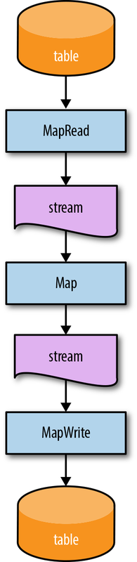

<center><i>图 6-1。 MapReduce 中的映射阶段。表中的数据被转换为流并再次转换回来。</center></i>


### 减少为流/表

在 MapWrite 阶段之后从我们离开的地方开始，ReduceRead 本身相对无趣。它与 MapRead 基本相同，只是读取的值是单例值列表而不是单例值，因为 MapWrite 存储的数据是键/值列表对。但它仍然只是迭代表的快照以将其转换为流。这里没有什么新鲜事。

尽管它*听起来*可能很有趣，但在这种情况下，Reduce 实际上只是一个美化的 Map 阶段，它恰好接收每个键的值列表而不是单个值。所以它仍然只是将单个（复合）记录映射到零个或多个新记录。这里也没有什么特别新的东西。

ReduceWrite 是一个有点值得注意的。我们已经知道这个阶段必须将一个流转换为一个表，因为 Reduce 产生一个流并且最终输出是一个表。但这是怎么发生的？如果我告诉你这是将上一阶段的输出键分组到持久存储中的直接结果，就像我们在 MapWrite 中看到的那样，你可能会相信我，直到你记得我之前提到键关联是*可选的*减少阶段的功能。启用该功能后，ReduceWrite *本质上与 MapWrite 相同。[6](ch06.html#idm139957178611376) 但是如果禁用该功能并且 Reduce 的输出没有关联的键，那么究竟发生了什么让这些数据静止?

要了解发生了什么，重新考虑 SQL 表的语义是很有用的。尽管经常被推荐，但 SQL 表并不严格要求具有唯一标识每一行的主键。在无键表的情况下，插入的每一行都被认为是一个新的、独立的行（即使其中的数据与表中的一个或多个现有行相同），就好像有一个隐含的 AUTO_INCREMENT 字段是用作密钥（顺便说一句，这在大多数实现中实际上是在幕后发生的，即使在这种情况下，“密钥”可能只是一些从未暴露或预期用作逻辑标识符的物理块位置）。这种隐式的唯一键分配正是在 ReduceWrite 中使用无键数据发生的情况。从概念上讲，仍然存在一个按键分组操作；这就是让数据静止的原因。但是由于缺少用户提供的密钥，ReduceWrite 将每条记录视为具有新的、从未见过的密钥，并有效地将每条记录与其自身分组，从而再次产生静止数据。 [7](ch06.html #idm139957178608496)

看一下[图6-2](#map_and_reduce_phases_in_a_mapreduce)，它从流/表的角度展示了整个管道。你可以看到它是一个 TABLE → STREAM → STREAM → TABLE → STREAM → STREAM → TABLE 的序列。即使我们正在处理有界数据，即使我们正在做我们传统上认为的批处理，它实际上只是隐藏在流和表之下。

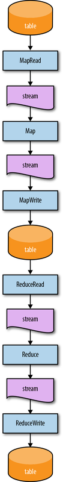

<center><i>图 6-2。从流和表的角度来看，MapReduce 中的 Map 和 Reduce 阶段</i></center>


### 与批处理协调

那么，对于我们的前两个问题，这会给我们带来什么影响呢？

1. **Q：**批处理如何适应流/表理论？

   **A：** 非常好。基本模式如下：

     a. 一个。表被完整读取以成为流。

     b. 流被处理成新的流，直到命中分组操作。

     c. 分组将流变成表格。

     d. 重复步骤 a 到 c，直到您用完管道中的各个阶段。

2. **Q：** 流与有界/无界数据有何关系？

   **A：** 正如我们从 MapReduce 示例中看到的，流只是数据的动态形式，无论它们是有界的还是无界的。

从这个角度来看，很容易看出流/表理论与有界数据的批处理并不矛盾。事实上，它只是进一步支持了我一直在强调的那个批处理的想法，流媒体真的没有那么不同：在一天结束时，它一直是流和表格。

有了这个，我们正在朝着流和表的一般理论迈进。但是为了清楚地总结事情，我们最后需要重新审视流/表上下文中的四个 *what*/*where*/*when*/*how* 问题，以了解它们之间的关系。


## *What*、*Where*、*When* 和 *How* 在 Streams 和 Tables 世界中

在本节中，我们将逐一研究这四个问题，并了解它们与流和表的关系。我们还将回答上一节中可能存在的任何问题，一个重要的问题是：如果分组是使数据静止的东西，那么使它们运动的“取消分组”逆向究竟是什么？稍后再谈。但就目前而言，进行转型。


### *什么*：转换

在 [Chapter 3](ch03.html#watermarks_chapter) 中，我们了解到转换告诉我们*什么*管道正在计算；也就是说，无论是构建模型、计算总和、过滤垃圾邮件等等。我们在前面的 MapReduce 示例中看到，六个阶段中有四个回答了 *what* 问题：

- Map 和 Reduce 都分别对输入流中的每个键/值或键/值列表对应用了管道作者的元素转换，产生了一个新的转换流。
- MapWrite 和 ReduceWrite 都根据该阶段分配的键（可能是隐式的，在可选的 Reduce 情况下）对前一阶段的输出进行分组，并在这样做时将输入流转换为输出表。

从这个角度来看，您可以看到从流/表理论的角度来看，基本上有两种类型的 *what* 转换：

- 非分组

   这些操作（如我们在 Map 和 Reduce 中看到的）只是接受一个记录流并在另一端生成一个新的、转换的记录流。非分组转换的示例是过滤器（例如，删除垃圾邮件）、爆炸器（即，将更大的复合记录拆分为其组成部分）和突变器（例如，除以 100）等等。

- 分组

   这些操作（如我们在 MapWrite 和 ReduceWrite 中看到的）接受记录流并以某种方式将它们组合在一起，从而将流转换为表。分组转换的示例是连接、聚合、列表/集合累积、更改日志应用程序、直方图创建、机器学习模型训练等。

为了更好地了解所有这些是如何联系在一起的，让我们看一下 [图 2-2](ch02.html#types_of_transformations) 的更新版本，我们首先开始研究转换。为了避免您跳回那里查看我们正在讨论的内容，[示例 6-1](#summation_pipeline_key_value_data_are_read) 包含我们正在使用的代码片段。

*示例 6-1。求和管道*

```java
PCollection<String> raw = IO.read(...);
PCollection<KV<Team, Integer>> input = raw.apply(new ParseFn());
PCollection<KV<Team, Integer>> 总计 =
  input.apply(Sum.integersPerKey());
```

该管道只是读取输入数据，解析单个团队成员的分数，然后将每个团队的分数相加。它的事件时间/处理时间可视化看起来像 [图 6-3]（#event_time_processing_time_view_of_classic_batch_processing）中呈现的图表。

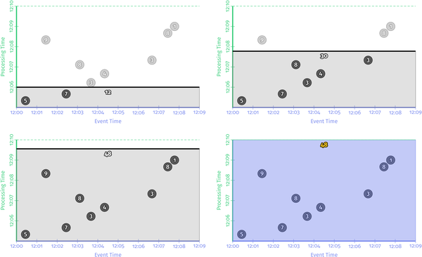

<center><i>图 6-3。经典批处理的事件时间/处理时间视图</i></center>

[图 6-4](#stream_and_tables_view_of_classic_batch_processing) 描绘了该管道随时间推移的更多拓扑视图，从流和表的角度呈现。

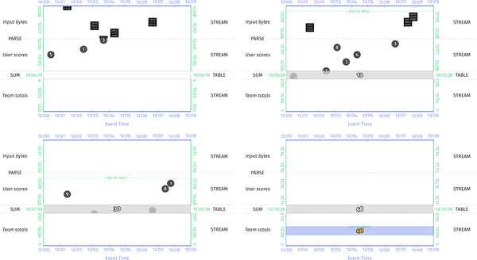

<center><i>图 6-4。经典批处理的流和表视图</i></center>


在此可视化的流和表格版本中，时间的流逝表现为随着时间的推移在处理时间维度（y 轴）中向下滚动图形区域。以这种方式渲染的好处是它非常清楚地指出了非分组操作和分组操作之间的区别。与我们之前的图表不同，其中我省略了管道中除“Sum.integersByKey”之外的所有初始转换，我在这里也包含了初始解析操作，因为解析操作的非分组方面提供了一个很好的对比总和的分组方面。从这个角度来看，很容易看出两者之间的区别。非分组操作不会阻止流中元素的运动，因此会在另一侧产生另一个流。相反，分组操作使流中的所有元素都处于静止状态，因为它将它们一起添加到最终总和中。由于此示例在有界数据的批处理引擎上运行，因此仅在达到输入结束后才会发出最终结果。正如我们在 [Chapter 2](ch02.html#the_what_where_when_and_how) 中所指出的，这个示例对于有界数据来说已经足够了，但是在无界数据的上下文中过于局限，因为理论上输入永远不会结束。但真的不够吗？

查看图表的新流/表部分，如果我们所做的只是计算总和作为我们的最终结果（实际上并没有在管道中以任何其他方式进一步转换这些总和），那么我们使用分组创建的表操作有我们的答案，随着新数据的到来，随着时间的推移而发展。为什么我们不直接从那里读取我们的结果呢？

这正是支持将流处理器作为数据库的人们所提出的观点[8](ch06.html#idm139957178492576)（主要是 Kafka 和 Flink 工作人员）：在管道中进行分组操作的任何地方，您都在创建一个表，其中包括该阶段该部分的有效输出值。如果这些输出值恰好是您的管道正在计算的最后一件事，那么如果您可以直接从该表中读取它们，则无需在其他地方重新实现它们。除了随着时间的推移提供对结果的快速和轻松访问之外，这种方法通过在管道中不需要额外的接收器阶段来实现输出，从而节省了计算资源，通过消除冗余数据存储来节省磁盘，并且不需要任何构建上述接收器阶段的工程工作。[9](ch06.html#idm139957178490944) 唯一的主要警告是，您需要注意确保只有数据处理管道能够对表进行修改。如果表中的值可能由于外部修改而从管道下发生变化，那么所有关于一致性保证的赌注都将失败。

一段时间以来，业内许多人一直在推荐这种方法，并且在各种场景中都得到了很好的应用。我们已经看到 Google 内部的 MillWheel 客户通过直接从基于 Bigtable 的状态表中提供数据来做同样的事情，并且我们正在添加一流的支持，以在 C++ 中从管道外部访问状态——我们在 Google 内部使用的基于 Apache Beam 的等价物（Google Flume）；希望这些概念也能在不久的将来进入 Apache Beam。

现在，如果其中的值是您的最终结果，那么从状态表中读取是很好的。但是，如果你有更多的处理要在管道中执行下游（例如，想象我们的管道实际上是计算得分最高的团队），我们仍然需要一些更好的方法来处理无界数据，允许我们将表转换回流以一种更渐进的方式。为此，我们将回顾剩下的三个问题，从窗口开始，扩展到触发，最后将它们与累积联系在一起。


### *在哪里*：窗口化

正如我们从 [Chapter 3](ch03.html#watermarks_chapter) 中了解到的，窗口化告诉我们事件时间分组发生的*位置*。结合我们之前的经验，我们因此也可以推断它必须在流到表的转换中发挥作用，因为分组是驱动表创建的原因。窗口化实际上有两个方面与流/表理论交互：

- 窗口分配

  这实际上意味着将记录放入一个或多个窗口中。

- 窗口合并

  这是使动态、数据驱动类型的窗口（例如会话）成为可能的逻辑。

窗口分配的效果非常简单。当一条记录在概念上被放置到一个窗口中时，窗口的定义本质上与该记录的用户分配键相结合，以创建一个在分组时使用的隐式复合键。[10](ch06.html#idm139957178468752) 很简单。

为了完整起见，让我们再看一下 [Chapter 3](ch03.html#watermarks_chapter) 中的原始窗口示例，但从流和表的角度来看。如果您还记得，代码片段类似于 [Example 6-2](#summation_pipeline_chap_six_second) （这次省略了解析 *not* ）。

*示例 6-2。求和管道*

```java
PCollection<String> raw = IO.read(...);
PCollection<KV<Team, Integer>> input = raw.apply(new ParseFn());
PCollection<KV<Team, Integer>> 总计 = 输入
  .apply(Window.into(FixedWindows.of(TWO_MINUTES)))
  .apply(Sum.integersPerKey());
```

原始的可视化看起来像 [图 6-5](#event_time_process_time_view_of_windowed_summation_on_a_batch_engine) 中所示。

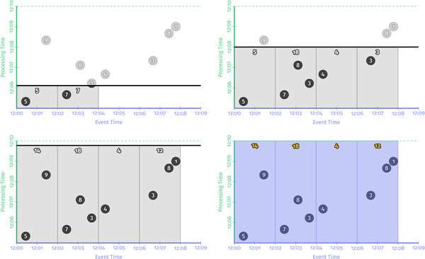

<center><i>图 6-5。批处理引擎上窗口求和的事件时间/处理时间视图</i></center>


现在，[图 6-6](#streams_and_tables_view_of_windowed_summation_on_a_batch_engine) 显示了流和表的版本。

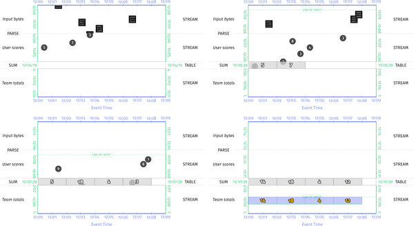

<center><i>图 6-6。批处理引擎上窗口求和的流和表视图</i></center>


如您所料，这看起来与 [图 6-4](#stream_and_tables_view_of_classic_batch_processing) 非常相似，但表中有四个分组（对应于数据占用的四个窗口），而不仅仅是一个。但是和以前一样，我们必须等到有界输入的末尾才发出结果。我们将在下一节中讨论如何解决无界数据的问题，但首先让我们简要介绍一下合并窗口。


#### 窗口合并

继续进行合并，我们会发现窗口合并的效果比窗口分配更复杂，但是当您考虑需要发生的逻辑操作时仍然很简单。在将流分组为可以合并的窗口时，该分组操作必须考虑所有可能合并在一起的窗口。通常，这仅限于数据都具有相同键的窗口（因为我们已经确定，窗口化将分组修改为不仅仅是按键，还包括按键和窗口）。出于这个原因，系统并没有真正将键/窗口对视为平面复合键，而是将其视为分层键，用户分配的键作为根，窗口是该根的子组件。当需要将数据实际分组在一起时，系统首先按层次结构的根（用户分配的键）进行分组。在数据已按键分组后，系统可以继续按该键内的窗口分组（使用分层复合键的子组件）。这种按窗口分组的行为是发生窗口合并的地方。


从流和表的角度来看，有趣的是这个窗口合并如何改变最终应用于表的突变；也就是说，它如何随着时间的推移修改指示表内容的更改日志。对于非合并窗口，每个被分组的新元素都会导致表中的单个突变（将该元素添加到元素的键+窗口的组中）。通过合并窗口，对新元素进行分组的行为可能会导致一个或多个现有窗口与新窗口合并。因此，合并操作必须检查所有现有窗口的当前键，找出哪些窗口可以与这个新窗口合并，然后原子地提交对旧未合并窗口的删除以及将新合并窗口插入到桌子。这就是为什么支持合并窗口的系统通常将原子性/并行化单元定义为键，而不是键+窗口。否则，就不可能（或至少更昂贵）提供正确性保证所需的强一致性。当您开始以这种详细程度查看它时，您会明白为什么让系统来处理处理窗口合并的讨厌事务是一件好事。要更深入地了解窗口合并语义，请参阅 [“数据流模型”] (http://bit.ly/2sXgVJ3) 的第 2.2.2 节。

归根结底，窗口化实际上只是对分组语义的微小改动，这意味着它是对流到表转换语义的微小改动。对于窗口分配，就像将窗口合并到分组时使用的隐式复合键一样简单。当涉及到窗口合并时，该复合键更像是一个分层键，允许系统处理按键分组的讨厌业务，找出该键内的窗口合并，然后原子地将所有必要的突变应用到相应的表为我们。抽象层万岁！

尽管如此，我们仍然没有真正解决在无限数据的情况下以更增量的方式将表转换为流的问题。为此，我们需要重新审视触发器。


### *When*：触发器

我们在 [Chapter 3](ch03.html#watermarks_chapter) 中了解到，我们使用触发器来指示 *何时* 窗口的内容将被具体化（水印为某些类型的触发器提供输入完整性的有用信号）。将数据组合到一个窗口中后，我们使用触发器来指示何时应将数据发送到下游。在流/表术语中，我们理解分组意味着流到表的转换。从那里可以看出触发器是分组的补充，这是一个相对较小的飞跃。换句话说，就是我们之前所掌握的“解组”操作。触发器是驱动表到流转换的原因。

在流/表术语中，触发器是应用于表的特殊过程，允许该表中的数据被具体化以响应相关事件。这么说来，它们实际上听起来与经典的数据库触发器非常相似。确实，这里的名字选择并非巧合。它们本质上是一样的。当您指定一个触发器时，您实际上是在编写代码，然后随着时间的推移对状态表中的每一行进行评估。当该触发器触发时，它会获取当前在表中静止的相应数据并将它们置于运动状态，从而产生一个新流。

让我们回到我们的例子。我们将从 [第 2 章](ch02.html#the_what_where_when_and_how) 中的简单每条记录触发器开始，它只是在每次新记录到达时发出一个新结果。该示例的代码和事件时间/处理时间可视化显示在 [示例 6-3](#triggering_repeatedly_with_every_record_chap_six) 中。 [图 6-7](#per_record_triggering_on_a_streaming_engine_chap_six) 展示了结果。

*示例 6-3。每条记录重复触发*

```java
PCollection<String>> raw = IO.read(...);
PCollection<KV<Team, Integer>> input = raw.apply(new ParseFn());	
PCollection<KV<Team, Integer>> totals = input
  .apply(Window.into(FixedWindows.of(TWO_MINUTES))
               .triggering(Repeatedly(AfterCount(1))));
  .apply(Sum.integersPerKey());
```

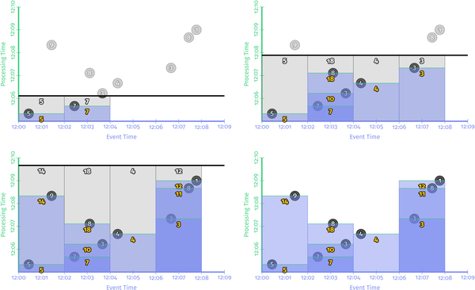

<center><i> 图 6-7。批处理引擎上窗口求和的流和表视图</i></center>


和以前一样，每次遇到新记录时都会产生新的结果。以流和表类型的视图呈现，此图看起来像 [图 6-8](#streams_and_tables_view_of_windowed_summation_with_per_record_triggering_on_a_streaming_engine)。

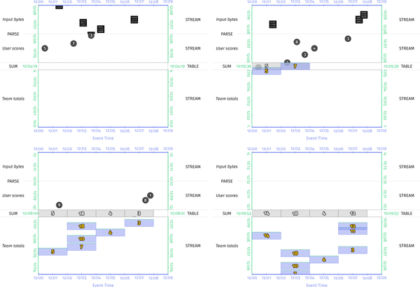

<center><i>图 6-8。在流引擎上按记录触发的窗口求和的流和表视图</i></center>


使用每记录触发器的一个有趣的副作用是它如何在一定程度上掩盖了数据被静止的影响，因为它们随后会立即被触发器再次恢复运动。即便如此，来自分组的聚合工件仍然在表中保持静止，因为未分组的值流从它流出。


为了更好地理解静止/运动中的关系，让我们在触发示例中跳到 [Chapter 2](ch02.html#the_what_where_when_and_how) 中的基本水印完整性流示例，它在完成时简单地发出结果 (由于水印通过了窗口的末端）。该示例的代码和事件时间/处理时间可视化显示在 [Example 6-4](#watermark_completeness_trigger_chap_six) 中（请注意，为了简洁和便于比较，我在这里仅显示启发式水印版本）和 [图 6-9](#event_time_processing_time_view_of_windowed_summation_with_a_heuristic_watermark_on_a_streaming_engine) 说明了结果。

*示例 6-4。水印完整性触发*

```java
PCollection<String> raw = IO.read(...);
PCollection<KV<Team, Integer>> input = raw.apply(new ParseFn());
PCollection<KV<Team, Integer>> totals = input
  .apply(Window.into(FixedWindows.of(TWO_MINUTES))
               .triggering(AfterWatermark()))
  .apply(Sum.integersPerKey());
```


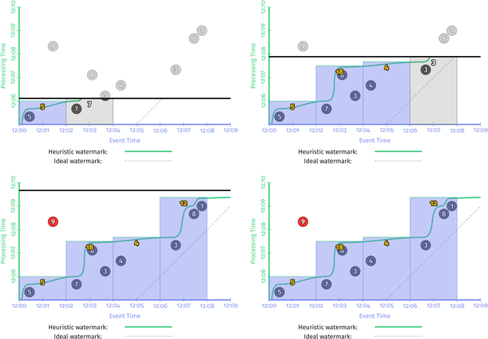

<center><i>图 6-9。流引擎上带有启发式水印的窗口求和的事件时间/处理时间视图</i></center>


多亏了 [Example 6-4](#watermark_completeness_trigger_chap_six) 中指定的触发器，它声明当水印通过窗口时应该物化窗口，系统能够以渐进的方式发出结果，因为管道的其他无界输入变为越来越完整。查看 [图 6-10](#streams_and_tables_view_of_windowed_summation) 中的流和表版本，它看起来与您预期的一样。


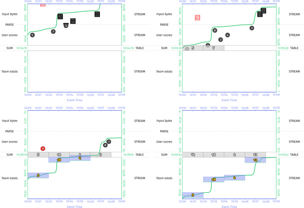

<center><i>图 6-10。流式引擎上带有启发式水印的窗口求和的流和表视图</i></center>

在这个版本中，您可以非常清楚地看到取消分组触发器对状态表的影响。 当水印通过每个窗口的末尾时，它将该窗口的结果从表中拉出并将其设置在下游，与表中的所有其他值分开。 当然，我们仍然有之前的延迟数据问题，我们可以使用[示例 6-5]（#early_on_time_and_late_firings_via_the_early_on_time_late_api_chap_six）中显示的更全面的触发器再次解决。

*示例 6-5。 通过 early/on-time/late API 提前、准时和延迟触发*

```
PCollection<String> raw = IO.read(...);
PCollection<KV<Team, Integer>> input = raw.apply(new ParseFn());
PCollection<KV<Team, Integer>> totals = input
  .apply(Window.into(FixedWindows.of(TWO_MINUTES))
               .triggering(
                 AfterWatermark()
                   .withEarlyFirings(AlignedDelay(ONE_MINUTE))
                   .withLateFirings(AfterCount(1))))
  .apply(Sum.integersPerKey());
```

事件时间/处理时间图类似于 [图 6-11](#even_time_processing_time_view_of_windowed_summation)。


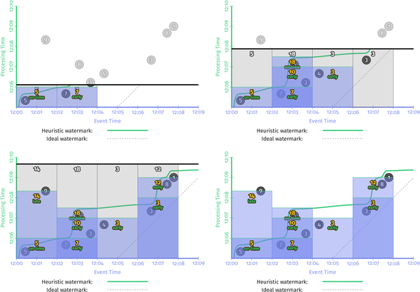

<center><i> 图 6-11。具有早/准/晚触发的流引擎上的窗口求和的事件时间/处理时间视图</i></center>


而流和表版本看起来像 [图 6-12](#streams_and_tables_view_of_windowed_summation_on_a_streaming) 中所示。

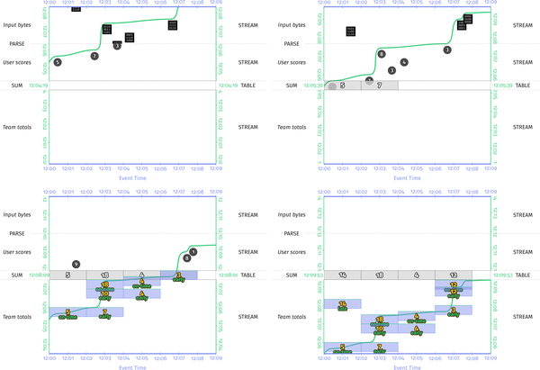

<center><i> 图 6-12。具有早/准/晚触发的流引擎上的窗口求和的流和表视图</i></center>


此版本更清楚地说明了触发器的取消分组效果，将表的各个独立部分的演变视图呈现为流，如 [示例 6-6](#our_full_score_parsing_pipeline) 中指定的触发器所指示的那样。

到目前为止，我们讨论过的所有具体触发器的语义（事件时间、处理时间、计数、早/准/晚等组合）与从流中查看时所期望的一样/表的观点，所以它们不值得进一步讨论。但是，我们还没有花太多时间讨论经典批处理场景中的触发器是什么样的。现在我们了解了批处理管道的底层流/表拓扑是什么样的，这值得简要介绍一下。

归根结底，经典批处理场景中使用的触发器只有一种类型：输入完成时触发的触发器。对于我们之前看到的 MapReduce 作业的初始 MapRead 阶段，该触发器在概念上将在管道启动后立即触发输入表中的所有数据，假设批处理作业的输入从开始吧。[11](ch06.html#idm139957178343024) 因此，输入源表将被转换为单个元素的流，之后 Map 阶段可以开始处理它们。

对于流水线中间的表到流的转换，例如我们示例中的 ReduceRead 阶段，使用相同类型的触发器。然而，在这种情况下，触发器实际上必须等待表中的所有数据都完成（即，更通常所说的所有数据都被写入 shuffle），就像我们的示例批处理管道一样图 [6-4](#stream_and_tables_view_of_classic_batch_processing) 和 [6-6](#streams_and_tables_view_of_windowed_summation_on_a_batch_engine) 在发出最终结果之前等待输入结束。

鉴于经典批处理总是有效地使用输入数据完成触发器，您可能会问管道作者指定的任何自定义触发器在批处理场景中可能意味着什么。这里的答案真的是：这取决于。有两个方面值得讨论：

- 触发保证（或缺乏保证）

  大多数现有的批处理系统在设计时都考虑到了这种锁步读-处理-组-写-重复序列。在这种情况下，很难提供任何更细粒度的触发能力，因为它们唯一会表现出任何类型变化的地方就是管道的最后洗牌阶段。然而，这并不意味着用户指定的触发器不会被执行；触发器的语义使得可以在适当的时候诉诸较低的公分母。

  例如，`AfterWatermark` 触发器意味着在水印通过窗口结束之后触发。它不保证水印在触发时可能超出窗口末尾的*远*。类似地，`AfterCount(N)` 触发器只保证在触发前至少处理了 N 个元素； *N* 很可能是输入集中的所有元素。

  请注意，选择这种巧妙的触发器名称措辞并不是为了适应模型中的经典批处理系统。考虑到触发的自然异步性和不确定性，它是模型本身非常必要的部分。即使在一个微调、低延迟、真正的流媒体系统中，基本上不可能保证在水印恰好在任何给定窗口的末尾时触发 `AfterWatermark` 触发器，除非在最有限的情况下情况（例如，单台机器以相对适中的负载处理管道的所有数据）。即使你能保证，那又有什么意义呢？触发器提供了一种控制从表到流的数据流的方法，仅此而已。

- 批处理和流式的混合

  鉴于我们在这篇文章中学到的知识，应该清楚批处理和流系统之间的主要语义区别在于增量触发表的能力。但即便如此，这并不是真正的语义差异，而是更多的延迟/吞吐量权衡（因为批处理系统通常以更高的结果延迟为代价为您提供更高的吞吐量）。

  这可以追溯到我在 [“批处理和流式传输效率差异”](ch01.html#batch_and_streaming_efficiency_differnces) 中所说的内容：除了效率增量（有利于批处理）和处理无限数据的自然能力（有利于流式传输）。我当时认为，大部分效率增量来自更大的捆绑包大小（为了吞吐量而显式妥协延迟）和更有效的 shuffle 实现（即流→表→流转换）的组合。从这个角度来看，应该有可能提供一个无缝集成两全其美的系统：一个提供自然处理无限数据的能力，但也可以在广泛的使用范围内平衡延迟、吞吐量和成本之间的紧张关系通过在幕后透明地调整包大小、随机播放实现和其他此类实现细节来实现。

  这正是 Apache Beam 在 API 级别所做的事情。[12](ch06.html#idm139957178318224) 这里提出的论点是在执行引擎级别也有统一的空间。在这样的世界中，批处理和流式传输将不再是一回事，我们将能够一劳永逸地告别批处理 * 和 * 流式传输作为独立的概念。我们将只拥有通用数据处理系统，它结合了家族树中两个分支的最佳想法，为手头的特定用例提供最佳体验。某天。

此时，我们可以在扳机部分插入一个叉子。 完成。 在全面了解 Beam 模型和流和表理论之间的关系的过程中，我们只有一个短暂的停留：*累积*。


### *如何*：积累

在 [Chapter 2](ch02.html#the_what_where_when_and_how) 中，我们了解到三种累积模式（丢弃、累积、累积和收回[13](ch06.html#idm139957178308448)）告诉我们，当窗口在其生命过程中多次触发。幸运的是，这里与流和表的关系非常简单：

- *丢弃模式*要求系统在触发时丢弃窗口的先前值或保留先前值的副本并在下次窗口触发时计算增量。[14](ch06.html#idm139957178301392) （这种模式最好称为 Delta 模式。）

- *累积模式*无需额外工作；触发时表中窗口的当前值就是发出的值。 （这种模式最好称为值模式。）

- *累积和收回模式*需要保留所有先前触发（但尚未收回）的窗口值的副本。在合并诸如会话之类的窗口的情况下，此先前值的列表可能会变得非常大，但在新值不能简单地用于覆盖先前值的情况下，对于干净地还原那些先前触发触发的效果至关重要。 （这种模式最好称为价值和撤回模式。）

累积模式的流和表可视化对它们的语义几乎没有增加额外的洞察力，所以我们不会在这里研究它们。


### Beam 模型中流和表的整体视图

解决了这四个问题后，我们现在可以全面了解 Beam 模型管道中的流和表。让我们以我们正在运行的示例（团队得分计算管道）为例，看看它在流和表级别的结构是什么样的。管道的完整代码可能类似于 [Example 6-6](#our_full_score_parsing_pipeline)（重复 [Example 6-4](#watermark_completeness_trigger_chap_six)）。

*示例 6-6。我们的完整分数解析管道*

```java
PCollection<String> raw = IO.read(...);
PCollection<KV<Team, Integer>> input = raw.apply(new ParseFn());
PCollection<KV<Team, Integer>> totals = input
  .apply(Window.into(FixedWindows.of(TWO_MINUTES))
               .triggering(
                 AfterWatermark()
                   .withEarlyFirings(AlignedDelay(ONE_MINUTE))
                   .withLateFirings(AfterCount(1))))
  .apply(Sum.integersPerKey());
```

将其分解为由中间“PCollection”类型分隔的阶段（为了清楚每个阶段发生的情况，我使用了更多语义“类型”名称，如“团队”和“用户分数”而不是真实类型），你会得出类似于 [图 6-13](#logical_phases_of_a_team_score_summation_pipeline_with_intermediate) 中描述的内容。


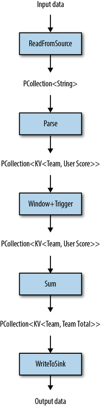

<center><i> 图 6-13。团队得分求和管道的逻辑阶段，具有中间 PCollection 类型</i></center>


当你实际运行这个管道时，它首先经过一个优化器，它的工作是把这个逻辑执行计划转换成一个优化的物理执行计划。每个执行引擎都是不同的，因此实际的物理执行计划会因运行者而异。但是一个可信的稻草人计划可能看起来像 [图 6-14](#theoretical_physical_phases_of_a_team_score_summation_pipeline_with_intermediate_pcollection_types)。

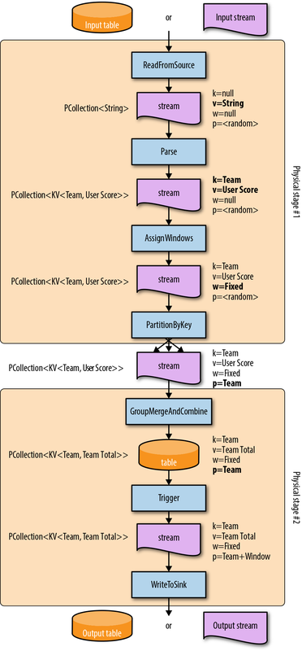

<center><i>图 6-14。团队得分总和管道的理论物理阶段，具有中间 PCollection 类型</i></center>


这里发生了很多事情，所以让我们来看看所有这些。我们将讨论的图 [6-13](#logical_phases_of_a_team_score_summation_pipeline_with_intermediate) 和 [6-14](#theoretical_physical_phases_of_a_team_score_summation_pipeline_with_intermediate_pcollection_types) 之间存在三个主要区别：


- 逻辑与物理操作

  作为构建物理执行计划的一部分，底层引擎必须将用户提供的逻辑操作转换为引擎支持的一系列原始操作。在某些情况下，这些物理等价物看起来基本相同（例如，“Parse”），而在其他情况下，它们却大不相同。

  将每个逻辑阶段作为管道中完全独立的物理阶段执行通常效率低下（伴随着序列化、网络通信和每个之间的反序列化开销）。因此，优化器通常会尝试将尽可能多的物理操作融合到单个物理阶段中。

  为了更清楚每个物理操作在做什么，我用每个点上有效的键、值、窗口和数据分区的类型对中间的“PCollection”进行了注释。


现在让我们详细介绍每个逻辑操作，看看它在物理计划中转换为什么，以及它们如何与流和表相关联：

- ReadFromSource

  除了与紧随其后的物理操作（`Parse`）融合之外，`ReadFromSource` 的翻译没有太多有趣的事情发生。就此时我们数据的特征而言，因为读取本质上是消耗原始输入字节，所以我们基本上拥有没有键、没有窗口和没有（或随机）分区的原始字符串。原始数据源可以是表（例如 Cassandra 表）或流（例如 RabbitMQ）或两者都类似的东西（例如日志压缩模式下的 Kafka）。但无论如何，从输入源读取的最终结果是一个流。

- 解析

  逻辑“解析”操作也以相对直接的方式转换为物理版本。 `Parse` 获取原始字符串并从中提取键（团队 ID）和值（用户分数）。这是一个非分组操作，因此它消耗的流仍然是另一端的流。

- 窗口+触发器

  这种逻辑操作分布在许多不同的物理操作中。第一个是窗口分配，其中每个元素都分配给一组窗口。这在“AssignWindows”操作中立即发生，这是一个非分组操作，它只是用它现在所属的窗口来注释流中的每个元素，在另一侧产生另一个流。

  第二个是窗口合并，我们在本章前面了解到，它是分组操作的一部分。因此，它会在管道的后期陷入“GroupMergeAndCombine”操作。当我们接下来讨论逻辑“Sum”运算时，我们会讨论该运算。

  最后，还有触发。触发发生在分组之后，这是我们将通过分组创建的表转换回流的方式。因此，它陷入了自己的操作，遵循 `GroupMergeAndCombine`。

- 总和

  求和实际上是一个复合操作，由几个部分组成：分区和聚合。分区是一种非分组操作，它重定向流中的元素，使得具有相同键的元素最终进入同一台物理机器。分区的另一个词是 shuffle，尽管这个术语有点重载，因为 MapReduce 意义上的“Shuffle”通常用于表示分区*和*分组（就此而言，*和*排序）。无论如何，分区会以物理方式改变流，使其可分组，但不会做任何事情来真正使数据静止。结果，这是一个非分组操作，在另一侧产生另一个流。

  分区之后是分组。分组本身是一种复合操作。首先是按键分组（由之前的按键分区操作启用）。接下来是窗口合并和按窗口分组，如前所述。最后，因为求和在 Beam 中被实现为“CombineFn”（本质上是增量聚合操作），所以存在组合，其中单个元素在到达时被求和在一起。具体细节对于我们在这里的目的来说并不是非常重要。重要的是，由于这（显然）是一个分组操作，我们的流链现在停留在一个表格中，其中包含随着时间的推移而汇总的团队总数。

- WriteToSink

  最后，我们有写入操作，它获取由触发产生的流（您可能还记得，它位于 `GroupMergeAndCombine` 操作之下）并将其写入我们的输出数据接收器。该数据本身可以是表或流。如果是表，`WriteToSink` 将需要执行某种分组操作，作为将数据写入表的一部分。如果它是一个流，则不需要分组（尽管可能仍然需要分区；例如，在写入 Kafka 之类的东西时）。

这里最大的收获不是物理计划中发生的所有事情的精确细节，而是梁模型与流和表格世界的整体关系。 我们看到了三种类型的操作：非分组（例如，`Parse`）、分组（例如，`GroupMergeAndCombine`）和取消分组（例如，`Trigger`）。 非分组操作总是消耗流并在另一侧产生流。 分组操作总是消耗流并产生表。 取消分组操作消耗了表并产生了流。 这些见解以及我们在此过程中学到的所有其他知识，足以让我们形成一个关于 Beam 模型与流和表的关系的更一般的理论。


## 流和表相对论的一般理论

在调查了流处理、批处理、四个 *what*/*where*/*when*/*how* 问题以及 Beam 模型作为一个整体与流和表理论之间的关系之后，现在让我们尝试阐明一个更一般的流和表相对性的定义。

*流和表相对论的一般理论*：

- *数据处理管道*（批处理和流式处理）由这些表和流上的 *tables*、*streams* 和 *operations* 组成。

- *表*是*静态数据*，并充当数据随着时间的推移而累积和观察的容器。

- *流*是*运动中的数据*，并编码表格随时间演变的离散视图。

- *操作*作用于流或表并产生新的流或表。它们分类如下：

- 流 → 流：非分组（逐元素）操作

    对流应用 *nongrouping* 操作会改变流中的数据，同时让它们处于运动状态，从而产生一个可能具有不同基数的新流。

- 流→表：分组操作

    *分组*流中的数据使这些数据静止，产生一个随时间演变的*表*。

- *Windowing* 将事件时间维度合并到此类分组中。
- *合并窗口*随着时间的推移动态组合，允许它们根据观察到的数据重塑自己，并规定该键仍然是原子性/并行化的单元，窗口是该键中分组的子组件。

- 表→流：取消分组（触发）操作

    *触发*表中的数据将它们分解为运动，产生一个*流*，捕获表随时间演变的视图。

- *Watermarks* 提供了相对于事件时间的输入完整性概念，这是触发事件时间戳数据时的有用参考点，特别是从无界流中分组到事件时间窗口的数据。
- 触发器的*累积模式*确定流的性质，指示它是否包含增量或值，以及是否提供先前增量/值的撤回。

- 表→表：（无）

    没有使用表并产生表的操作，因为数据不可能在没有运动的情况下从静止状态返回静止状态。因此，对表的所有修改都是通过转换为流并再次返回。

我喜欢这些规则的原因是它们很有意义。它们对它们有一种非常自然和直观的感觉，因此它们使理解数据如何通过一系列操作流动（或不流动）变得更加容易。它们将数据在任何给定时间（流或表）存在于两种结构之一中的事实编纂成法，并且它们为推理这些状态之间的转换提供了简单的规则。他们通过展示它如何只是对每个人已经天生理解的东西的轻微修改来揭开窗口的神秘面纱：分组。他们强调了为什么分组操作通常总是流式传输的一个症结所在（因为它们将流中的数据作为表格静止），但也非常清楚需要哪些类型的操作才能让事情脱离困境（触发器；即取消分组操作）。他们强调了在概念层面上真正统一的批处理和流处理。

当我开始写这一章的时候，我并不完全确定我最终会得到什么，但最终的结果比我想象的要令人满意得多。 在接下来的章节中，我们一次又一次地使用流和表相对论来帮助指导我们的分析。 并且每一次，它的应用都会带来清晰和洞察力，否则就很难获得。 流和表是最好的。


## 总结

在本章中，我们首先建立了流和表理论的基础。我们首先相对定义了流和表：

- 流→表

  随着时间的推移，更新流的聚合产生一个

- table.tables → 流

  观察表随时间的变化会产生一个流。

- 我们接下来独立定义它们：

  表格是*静态*的数据。

  流是*动态*的数据。

然后，我们从流和表的角度评估了经典的 MapReduce 批处理计算模型，并得出以下四个步骤从该角度描述批处理的结论：

1. 表被完整读取成为流。
2. 流被处理成新的流，直到命中分组操作。
3. 分组将流变成表格。
4. 重复步骤 1 到 3，直到您用完管道中的操作。

从这个分析中，我们能够看到流是批处理的一部分，就像它们是流处理一样，而且数据是流的想法与所讨论的数据是有界的还是无界的是正交的。 .

接下来，我们花了很多时间考虑流和表之间的关系以及 Beam 模型提供的健壮的、无序的流处理语义，最终得出了我们在前面列举的流和表相对论的广义理论部分。除了流和表的基本定义之外，该理论的关键见解是数据处理管道中有四种（实际上只有三种）类型的操作：

- 流→流

  非分组（逐元素）操作

- 流→表

  分组操作

- 表→流

  取消分组（触发）操作

- 表→表

  （不存在的）

通过以这种方式对操作进行分类，了解数据如何随时间流经（并在其中逗留）给定管道变得微不足道。

最后，也许也是最重要的一点，我们学到了这一点：当你从流和表的角度来看事物时，你会非常清楚地知道批处理和流在概念上实际上是同一个东西。有界或无界，都无所谓。从上到下是流和表格。
