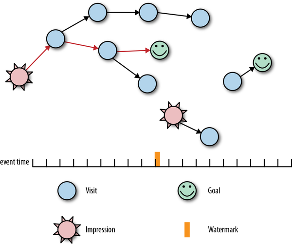

# Chapter7.持久状态的实用性

人们为什么要写书？当你考虑到创造力的乐趣、对语法和标点符号的某种喜爱，以及偶尔的自恋感时，你基本上就会渴望捕捉一个原本短暂的想法，以便将来重新审视它。在非常高的层次上，我刚刚激发并解释了数据处理管道中的持久状态。

持久状态，顾名思义，就是我们刚刚在 [Chapter 6](Chapter6.流和表.md#Chapter6.流和表) 中讨论过的表格，另外还要求表格稳健地存储在相对不会丢失的媒体中。只要您不询问站点可靠性工程师，就存储在本地磁盘计数中。存储在一组复制的磁盘上会更好。存储在不同物理位置的一组复制磁盘上更好。存储在内存中一次绝对不算数。存储在跨多台机器的复制内存中，并带有 UPS 电源备份和现场发电机。你得到图片。

在本章中，我们的目标是执行以下操作：

- 激发对管道内持久状态的需求
- 查看管道中常见的两种形式的隐式状态
- 考虑一个不适合隐式状态的真实用例（广告转换归因），使用它来激发持久状态管理的一般、显式形式的显着特征
- 探索一种此类状态 API 的具体表现，如 Apache Beam 中所示


### 动机

首先，让我们更准确地激发持久状态。我们从 [Chapter 6](Chapter6.流和表.md#Chapter6.流和表) 中知道分组是为我们提供表格的原因。我在本章开头所假设的核心是正确的：持久化这些表的目的是捕获其中包含的其他短暂数据。但为什么这是必要的？


### 失败的必然性

这个问题的答案在处理无界输入数据的情况下最为清楚，所以我们将从那里开始。主要问题是处理无限数据的管道实际上打算永远运行。但是，永远运行是一个比这些管道通常执行的环境要高得多的服务级别目标。由于机器故障、计划维护、代码更改以及偶尔导致整个生产管道集群中断的错误配置命令，长时间运行的管道将不可避免地出现中断。为了确保在发生此类事情时能够从中断的地方恢复，长时间运行的管道需要对中断前的位置进行某种持久的记忆。这就是持久状态的用武之地。

让我们将这个想法扩展到无限数据之外。这仅在无限情况下相关吗？批处理管道是否使用持久状态，为什么或为什么不使用？与我们遇到的几乎所有其他批处理与流处理问题一样，答案与批处理和流处理系统本身的性质关系不大（考虑到我们在 [第 6 章](Chapter6.流和表.md#Chapter6.流和表)），更多地与它们历史上用于处理的数据集类型有关。

有界数据集本质上是有限的。因此，处理有界数据的系统（历史上的批处理系统）已针对该用例进行了定制。他们经常假设输入可以在失败时全部重新处理。换句话说，如果处理管道的某个部分发生故障并且输入数据仍然可用，我们可以简单地重新启动处理管道的相应部分并让它再次读取相同的输入。这称为*重新处理输入*。

他们还可能假设失败很少发生，因此通过尽可能少地持久化来优化常见情况，接受失败时重新计算的额外成本。对于特别昂贵的多阶段管道，可能存在某种每阶段全局检查点，可以更有效地恢复执行（通常作为 shuffle 的一部分），但这不是严格要求，可能不会出现在许多系统中。

另一方面，必须假设无界数据集具有无限大小。因此，处理无限数据的系统（历史上的流式系统）已被构建为匹配。他们从不假设所有数据都可用于再处理，只有其中一些已知的子集。为了提供至少一次或完全一次的语义，任何不再可用于重新处理的数据都必须在持久检查点中加以考虑。如果最多一次就是你想要的，你就不需要检查点。

归根结底，持久状态没有任何特定于批处理或流的内容。状态在这两种情况下都是有用的。在处理无限数据时，它恰好是至关重要的，因此您会发现流系统通常为持久状态提供更复杂的支持。


### 正确性和效率

鉴于失败的必然性和应对失败的需要，持久状态可以被视为提供了两件事：

- 根据临时输入的*正确性基础*。在处理有界数据时，假设输入永远存在通常是安全的；[^1]

- 作为应对故障的一部分，一种*最小化重复工作和持久化数据*的方法。无论您的输入是否是短暂的，当您的管道遇到机器故障时，必须重做故障机器上未在某处检查点的任何工作。根据管道及其输入的性质，这在两个方面可能代价高昂：重新处理期间执行的工作量，以及为支持重新处理而存储的输入数据量。

  减少重复工作相对简单。通过检查管道中的部分进度（计算的中间结果以及在检查点时输入中的当前位置），可以大大减少发生故障时重复的工作量，因为在此之前没有任何操作检查点需要从持久输入中重放。最常见的是，这涉及静态数据（即表），这就是为什么我们通常在表和分组的上下文中引用持久状态。但也有一些持久形式的流（例如 Kafka 及其亲属）也可以提供此功能。

  最小化持久化的数据量是一个更大的讨论，这将占用本章的大部分内容。至少现在可以说，对于许多现实世界的用例，与其记住管道中任何给定阶段的检查点内的所有原始输入，不如记住一些部分的中间形式通常是可行的正在进行的计算比所有原始输入消耗更少的空间（例如，在计算平均值时，看到的值的总和和计数比对总和和计数有贡献的完整值列表更紧凑）。检查点这些中间数据不仅可以大大减少您需要在管道中的任何给定点记住的数据量，它还相应地减少了该特定阶段从故障中恢复所需的重新处理量。

  此外，通过智能地垃圾收集那些不再需要的持久状态位（即，已知已由管道完全处理的记录的状态），给定管道的持久状态中存储的数据量可以即使输入在技术上是无限的，也要随着时间的推移保持在可管理的大小。这就是处理无限数据的管道如何可以继续有效地永远运行，同时仍然提供强大的一致性保证，但不需要完全召回管道的原始输入。


归根结底，持久状态实际上只是在数据处理管道中提供正确性和高效容错的一种手段。在这两个维度中所需的支持量在很大程度上取决于管道输入的性质和正在执行的操作。与有界输入相比，无界输入往往需要更多的正确性支持。计算成本高的操作往往比计算成本低的操作需要更多的效率支持。


## 隐式状态

现在让我们开始讨论持久状态的实用性。在大多数情况下，这基本上归结为在始终坚持一切（有利于一致性，不利于效率）和从不坚持任何事情（不利于一致性，有利于效率）之间找到正确的平衡。我们将从始终坚持一切的一端开始，然后朝着另一个方向努力，寻找在不影响一致性的情况下权衡实现的复杂性以提高效率的方法（因为从不坚持任何东西来妥协一致性是很容易的）对于一致性无关紧要的情况以及非选项的情况下的出路，否则）。和以前一样，我们使用 Apache Beam API 来具体地讨论我们的讨论，但我们讨论的概念适用于当今存在的大多数系统。

此外，由于除了压缩数据之外，您无法减少原始输入的大小，因此我们的讨论集中在作为管道内分组操作的一部分创建的中间状态表中的数据持久化方式。将多条记录组合在一起形成某种组合的内在性质将为我们提供机会，以牺牲实现复杂性为代价来勉强提高效率。


### 原始分组

我们探索的第一步，在始终持续存在的所有方面，是在管道中最直接的分组实现：输入的原始分组。这种情况下的分组操作通常类似于列表追加：任何时候一个新元素到达组中，它都会被追加到该组看到的元素列表中。

在 Beam 中，这正是您将 `GroupByKey` 变换应用于 `PCollection` 时得到的结果。表示运动中的“PCollection”的流按键分组，以生成包含流中记录的静止表，[^2] 组合在一起作为具有相同键的值列表。这显示在 `GroupByKey` 的 `PTransform` 签名中，它将输入声明为 `K`/`V` 对的`PCollection`，并将输出声明为 `K`/`Iterable` 对的集合：

```java
class GroupByKey<K, V> extends PTransform<
    PCollection<KV<K, V>>, PCollection<KV<K, Iterable<V>>>>>
```

每次触发器触发该表中的键+窗口时，它都会为该键+窗口发出一个新窗格，其值是我们在前面的签名中看到的“Iterable”。

让我们看一下 [示例 7-1](#early_on_time_and_late_chap_seven) 中的一个实际示例。我们将从 [Example 6-5](Chapter6.流和表.md#early_on_time_and_late_firings_via_the_early_on_time_late_api_chap_six) （具有固定窗口和早期/准时/延迟触发器）中获取求和管道，并将其转换为使用原始分组而不是增量组合（其中我们将在本章稍后讨论）。为此，我们首先对解析的用户/分数键/值对应用“GroupByKey”转换。 `GroupByKey` 操作执行原始分组，产生一个 `PCollection` 与用户的键/值对和 `Iterable` 组的分数。然后，我们使用一个简单的 `MapElements` lambda 将每个 iterable 中的所有 `Integer` 相加，该 lambda 将 `Iterable` 转换为 `IntStream` 并在其上调用 `sum`。

*示例 7-1。通过 early/on-time/late API 提前、准时和延迟触发*

*

```java
PCollection<String> raw = IO.read(...);
PCollection<KV<Team, Integer>> input = raw.apply(new ParseFn());
PCollection<KV<Team, Integer>> groupedScores = input
  .apply(Window.into(FixedWindows.of(TWO_MINUTES))
               .triggering(
                 AfterWatermark()
                   .withEarlyFirings(AlignedDelay(ONE_MINUTE))
                   .withLateFirings(AfterCount(1))))
  .apply(GroupBy.<String, Integer>create());
PCollection<KV<Team, Integer>> totals = input
  .apply(MapElements.via((KV<String, Iterable<Integer>> kv) ->
    StreamSupport.intStream(
      kv.getValue().spliterator(), false).sum()));
```

观察这个运行中的管道，我们会看到类似于 [图 7-1](#summation_via_raw_grouping_of_input_with_windowing) 中描述的内容。


<center><i>图 7-1。 通过具有窗口和早期/准时/延迟触发的原始输入分组求和。 原始输入通过 GroupByKey 转换组合在一起并存储在表中。 触发后，MapElements lambda 将单个窗格中的原始输入汇总在一起，以得出每个团队的分数。</i></center>

将其与 [图 6-10](Chapter6.流和表.md#streams_and_tables_view_of_windowed_summation) （使用增量合并，稍后讨论）进行比较，很明显这要糟糕得多。首先，我们要存储更多数据：我们现在存储该窗口的所有输入，而不是每个窗口一个整数。其次，如果我们有多个触发器触发，我们通过重新汇总我们已经为之前的触发器触发添加在一起的输入来重复工作。最后，如果分组操作是我们将状态检查点到持久存储的点，那么在机器故障时，我们必须再次重新计算表的任何重新触发的总和。这是很多重复的数据和计算。更好的是增量计算和检查实际总和，这是*增量组合*的一个示例。


### 增量合并

我们为效率而交易实施复杂性的第一步是增量组合。这个概念通过 `CombineFn` 类体现在 Beam API 中。简而言之，增量组合是一种基于用户定义的关联和交换组合运算符的自动状态形式（如果您不确定这两个术语的含义，我稍后会更准确地定义它们）。尽管对于接下来的讨论不是绝对必要的，但是 CombineFn API 的重要部分看起来像 [Example 7-2](#abbreviated_combinefn_api_from_apache_beam)。

*示例 7-2。来自 Apache Beam* 的缩写 CombineFn API

```java
class CombineFn<InputT, AccumT, OutputT> {
    // Returns an accumulator representing the empty value.
    AccumT createAccumulator();

    // Adds the given input value into the given accumulator
    AccumT addInput(AccumT accumulator, InputT input);

    // Merges the given accumulators into a new, combined accumulator
    AccumT mergeAccumulators(Iterable<AccumT> accumulators);

    // Returns the output value for the given accumulator
    OutputT extractOutput(AccumT accumulator);
}
```

CombineFn接受类型为 `InputT` 的输入，这些输入可以组合成称为 *accumulators* 的部分聚合，类型为 `AccumT`。这些蓄能器本身也可以组合成新的蓄能器。最后，累加器可以转换为“OutputT”类型的输出值。对于平均值之类的东西，输入可能是整数，累加器整数对（即“Pair”），输出可能是表示组合输入平均值的单个浮点值。

但是所有这些结构给我们带来了什么？从概念上讲，增量合并的基本思想是许多类型的聚合（总和、均值等）表现出以下属性：

- 增量聚合具有*中间形式*，它捕获*部分进度*，组合一组*N* 输入*比这些输入本身的完整列表更紧凑*（即，`CombineFn` 中的`AccumT` 类型） .如前所述，对于均值，这是一个总和/计数对。基本求和甚至更简单，将单个数字作为累加器。直方图将具有由桶组成的相对复杂的累加器，其中每个桶包含在某个特定范围内看到的值的数量的计数。然而，在所有这三种情况下，表示 *N* 元素聚合的累加器所消耗的空间量仍然明显小于原始 *N* 元素本身所消耗的空间量，尤其是在 *N* 的大小时成长。

- 增量聚合*与两个维度的排序无关*：

  - *个别元素*，意思是：

    `组合（a，b）==组合（b，a）`

  - *元素分组*，意思是：

    `组合（组合（a，b），c）==组合（a，组合（b，c））`

  这些属性分别称为 *commutativity* 和 *associativity*。总之，[^3] 它们实际上意味着我们可以以任意顺序和任意子分组自由组合元素和部分聚合。这允许我们以两种方式优化聚合：

  - 增量

    因为单个输入的顺序无关紧要，我们不需要提前缓冲所有输入，然后以某种严格的顺序处理它们（例如，按照事件时间的顺序；但是请注意，这仍然是独立的在聚合之前按事件时间将*洗牌*元素放入适当的事件时间窗口）；我们可以简单地在它们到达时将它们一一组合起来。这不仅大大减少了必须缓冲的数据量（感谢我们操作的第一个属性，即中间形式比原始输入本身更紧凑地表示部分聚合），而且还分散了更多的计算负载随着时间的推移均匀（而不是在缓冲完整的输入集后一次聚合输入突发）。

  - 并行化

    因为输入的部分子组组合的顺序无关紧要，我们可以随意分配这些子组的计算。更具体地说，我们可以自由地将这些子组的计算分散到多台机器上。这种优化是 MapReduce 的“Combiners”（Beam 的“CombineFn”的起源）的核心。

    MapReduce 的 Combiner 优化对于解决热键问题至关重要，其中某种分组计算是在输入流上执行的，该输入流太大而无法由单个物理机器合理处理。一个典型的例子是在相对较少的维度（例如，通过网络浏览器系列：Chrome、Firefox、Safari 等）分解大量分析数据（例如，流行网站的网络流量）。对于流量特别大的网站，通常很难计算单个机器上任何单个 Web 浏览器系列的统计数据，即使这是该机器唯一致力于做的事情；有太多的流量跟不上。但是通过像求和这样的关联和交换操作，可以将初始聚合分布在多台机器上，每台机器都计算一个部分聚合。然后，这些机器生成的部分聚合集（其大小现在比原始输入小许多数量级）可能会在一台机器上进一步组合在一起，以产生最终的聚合结果。

    顺便说一句，这种并行化能力还产生了一个额外的好处：聚合操作自然与合并窗口兼容。当两个窗口合并时，它们的值也必须以某种方式合并。对于原始分组，这意味着将两个完整的缓冲值列表合并在一起，成本为 O(N)。但是对于“CombineFn”，它是两个部分聚合的简单组合，通常是 O(1) 操作。
    
    

为了完整起见，再次考虑[示例 6-5](Chapter6.流和表.md#early_on_time_and_late_firings_via_the_early_on_time_late_api_chap_six)，如 [示例 7-3](#grouping_and_summation_chap_seven) 所示，它使用增量组合实现了求和管道。

*示例 7-3。 通过增量组合进行分组和求和，如 [示例 6-5](Chapter6.流和表.md#early_on_time_and_late_firings_via_the_early_on_time_late_api_chap_six)*

```java
PCollection<String> raw = IO.read(...);
PCollection<KV<Team, Integer>> input = raw.apply(new ParseFn());
PCollection<KV<Team, Integer>> totals = input
  .apply(Window.into(FixedWindows.of(TWO_MINUTES))
               .triggering(
                 AfterWatermark()
                   .withEarlyFirings(AlignedDelay(ONE_MINUTE))
                   .withLateFirings(AfterCount(1))))
  .apply(Sum.integersPerKey());
```

执行后，我们得到了我们所看到的 [图 6-10](Chapter6.流和表.md#streams_and_tables_view_of_windowed_summation)（此处显示在 [图 7-2](#grouping_and_summation_via_incremental_combination)）。与 [图 7-1](#summation_via_raw_grouping_of_input_with_windowing) 相比，这显然是一个很大的改进，在存储的数据量和执行的计算量方面效率更高。


<center><i>图 7-2。通过增量组合进行分组和求和。在这个版本中，增量总和被计算并存储在表中，而不是输入列表中，这些输入列表以后必须独立地加在一起。</i></center>


通过为分组操作提供更紧凑的中间表示，并通过放宽对排序的要求（在元素和子组级别），Beam 的“CombineFn”以一定数量的实现复杂性换取效率的提高。在这样做的过程中，它为热键问题提供了一个干净的解决方案，并且与合并窗口的概念很好地结合在一起。

然而，一个缺点是您的分组操作必须适合相对受限的结构。这对于总和、均值等来说都很好，但是有很多现实世界的用例需要一种更通用的方法，一种允许精确控制复杂性和效率的权衡的方法。接下来，我们将看看这种通用方法的含义。


## 广义状态

尽管到目前为止我们看到的两种隐式方法都有其优点，但它们都在一个维度上有所不足：灵活性。原始分组方法要求您在整个处理组之前始终缓冲分组操作的原始输入，因此无法在此过程中部分处理部分数据；要么全有，要么全无。增量组合方法特别允许部分处理，但有一个限制，即所讨论的处理是可交换的和关联的，并且在记录一个接一个到达时发生。

如果我们想要支持更通用的流式持久状态方法，我们需要更灵活的方法。具体来说，我们需要三个维度的灵活性：

- 数据结构的灵活性；也就是说，能够以最适合和最有效的方式来构建我们写入和读取的数据，以完成手头的任务。原始分组本质上提供了一个可附加列表，而增量组合本质上提供了一个始终完整写入和读取的单个值。但是还有无数其他方式可以用来构建我们的持久数据，每种方式都有不同类型的访问模式和相关成本：地图、树、图形、集合等等。支持各种持久数据类型对于效率至关重要。

  Beam 允许单个“DoFn”声明多个状态字段，每个字段都具有特定类型，从而支持数据类型的灵活性。通过这种方式，逻辑上独立的状态片段（例如，访问和印象）可以单独存储，并且在语义上不同类型的状态（例如，地图和列表）可以通过给定访问模式类型的自然方式进行访问。

- 读写粒度的灵活性；也就是说，能够调整在任何给定时间写入或读取的数据的数量和类型以获得最佳效率。这归结为在任何给定时间点精确写入和读取必要数量的数据的能力：不多也不少（并且尽可能并行）。

  这与前一点是齐头并进的，因为专用数据类型允许集中类型的访问模式（例如，可以在幕后使用类似于 Bloom 过滤器的东西的集合成员操作，以极大地减少读入的数据量某些情况下）。但它也超越了它；例如，允许并行调度多个大型读取（例如，通过期货）。

  在 Beam 中，通过提供细粒度访问功能的特定数据类型 API 启用灵活的粒度写入和读取，并结合异步 I/O 机制，允许将写入和读取批处理在一起以提高效率。

- 处理时间安排的灵活性；也就是说，能够将特定类型的处理发生的时间与我们关心的两个时间域中的时间进程绑定在一起：事件时间完整性和处理时间。触发器在这里提供了一组有限的灵活性，完整性触发器提供了一种将处理绑定到通过窗口末尾的水印的方法，而重复更新触发器提供了一种将处理绑定到处理时间域中的周期性进度的方法。但是对于某些用例（例如，某些类型的连接，您不必关心整个窗口的输入完整性，只需输入直到连接中特定记录的事件时间的完整性），触发器是不够的灵活的。因此，我们需要一个更通用的解决方案。

  在 Beam 中，通过 *timers* 提供灵活的处理调度。[^4] 计时器是一种特殊类型的状态，它在支持的时间域（事件时间或处理时间）中绑定特定时间点) 以及到达该时间点时要调用的方法。这样，特定的处理位可以延迟到将来更合适的时间。

这三个特征的共同点是*灵活性*。相对不灵活的原始分组或增量组合方法可以很好地服务于特定的用例子集。但是，当处理他们相对狭窄的专业领域之外的任何事情时，这些选择往往会失败。发生这种情况时，您需要一个完全通用状态 API 的强大功能和灵活性，以便您优化对持久状态的利用。

换一种方式来想，原始分组和增量组合是相对高级的抽象，它们可以使管道的简洁表达（至少在组合器的情况下）具有一些用于自动优化的良好属性。但有时您需要降低级别才能获得所需的行为或性能。这就是广义状态可以让你做的事情。

### 案例研究：转化归因

为了看到这一点，现在让我们看一个原始分组和增量组合都不能很好服务的用例：*转化归因*。这是一种在广告界广泛使用的技术，可提供有关广告有效性的具体反馈。虽然相对容易理解，但它的要求有点多样化，但不能很好地适应我们目前考虑的两种隐式状态。

想象一下，您有一个分析管道，用于监控网站流量以及将流量引导至该网站的广告印象。目标是提供向用户展示的特定广告的归属，以实现网站本身的某些目标（这通常可能超出初始广告登陆页面的许多步骤），例如注册邮件列表或购买物品.

[图 7-3](#example_conversion_attribution_in_this_diagram_a_users_traversal) 显示了一组网站访问、目标和广告展示的示例，其中一个归因转化以红色突出显示。在无限制、无序的数据流上建立转化归因需要跟踪迄今为止看到的印象、访问和目标。这就是持久状态的用武之地。



<center><i>图 7-3。 转化归因示例</i></center>

在此图中，用户对网站上各个页面的遍历以图表的形式表示。印象是向用户显示并点击的广告，导致用户访问网站上的页面。访问代表在网站上查看的单个页面。目标是已被确定为用户期望目的地的特定访问页面（例如，完成购买或注册邮件列表）。转化归因的目标是识别导致用户在网站上实现某些目标的广告印象。在此图中，有一个以红色突出显示的此类转换。请注意，事件可能会无序到达，因此图中的事件时间轴和水印参考点指示输入被认为正确的时间。

建立强大的大规模归因管道需要做很多工作，但有几个方面值得明确指出。我们尝试构建的任何此类管道都必须执行以下操作：

- 处理乱序数据

  由于网站流量和广告印象数据来自不同的系统，这两个系统本身都是作为分布式收集服务实现的，因此数据可能会出现乱序。因此，我们的管道必须能够抵御这种混乱。

- 处理大量数据

  我们不仅必须假设此管道将为大量独立用户处理数据，而且根据给定广告活动的数量和给定网站的受欢迎程度，我们可能需要存储大量印象和/或流量数据，因为我们试图建立归因证据。例如，存储每个用户 90 天的访问、印象和目标树[^5] 数据，以便我们建立跨越多个月活动价值的归因，这并非闻所未闻.

- 防止垃圾邮件

  鉴于涉及金钱，正确性至关重要。我们不仅必须确保访问次数和展示次数只计算一次（通过简单地使用支持一次有效处理的执行引擎，我们或多或少地免费获得一些东西），而且我们还必须保护我们的广告商免受垃圾邮件攻击试图不公平地向广告商收费。例如，同一用户连续多次点击的单个广告将作为多次展示到达，但只要这些点击发生在彼此的一定时间内（例如，在同一天），它们只能归因一次。换句话说，即使系统保证我们会看到每个单独的*印象*一次，我们也必须对技术上不同的事件但我们的业务逻辑要求我们将其解释为重复的印象执行一些手动重复数据删除。

- 优化性能

  最重要的是，由于这条管道的潜在规模，我们必须始终关注优化管道的性能。由于写入持久存储的固有成本，持久状态通常可能成为此类管道中的性能瓶颈。因此，我们之前讨论的灵活性特征对于确保我们的设计尽可能高性能至关重要。

### 使用 Apache Beam 进行转换归因

现在我们了解了我们要解决的基本问题并清楚地记住了一些重要的要求，让我们使用 Beam 的 State 和 Timers API 来构建一个基本的转换归因转换。我们将像在 Beam 中编写任何其他 `DoFn` 一样编写它，但我们将利用状态和计时器扩展，允许我们写入和读取持久状态和计时器字段。想要了解实际代码的人可以在 [GitHub](http://bit.ly/2yeAGAQ) 上找到完整的实现。

请注意，与 Beam 中的所有分组操作一样，State API 的使用范围仅限于当前键和窗口，窗口生存期由指定的允许延迟参数决定；在此示例中，我们将在单个全局窗口中进行操作。与大多数“DoFns”一样，每个键的并行性都是线性化的。另请注意，为简单起见，我们将省略 90 天范围之外的访问和印象的手动垃圾收集，这是防止持久状态永远增长所必需的。

首先，让我们为访问、展示、访问/展示联合（用于加入）和完成的归因定义一些 POJO 类，如 [示例 7-4](#pojo_definitions_of_visit_impression_and_attribution_objects) 所示。

*示例 7-4。 Visit、Impression、VisitOrImpression 和 Attribution 对象的 POJO 定义*

```java
@DefaultCoder(AvroCoder.class)
class Visit {
    @Nullable private String url;
    @Nullable private Instant timestamp;
    // The referring URL. Recall that we’ve constrained the problem in this
    // example to assume every page on our website has exactly one possible
    // referring URL, to allow us to solve the problem for simple trees
    // rather than more general DAGs.
    @Nullable private String referer;
    @Nullable private boolean isGoal;

    @SuppressWarnings("unused")
    public Visit() {
    }

    public Visit(String url, Instant timestamp, String referer,
                 boolean isGoal) {
	this.url = url;
	this.timestamp = timestamp;
	this.referer = referer;
	this.isGoal = isGoal;
    }

    public String url() { return url; }
    public Instant timestamp() { return timestamp; }
    public String referer() { return referer; }
    public boolean isGoal() { return isGoal; }

    @Override
    public String toString() {
        return String.format("{ %s %s from:%s%s }", url, timestamp, referer,
                             isGoal ? " isGoal" : "");
    }
}

@DefaultCoder(AvroCoder.class)
class Impression {
    @Nullable private Long id;
    @Nullable private String sourceUrl;
    @Nullable private String targetUrl;
    @Nullable private Instant timestamp;

    public static String sourceAndTarget(String source, String target) { 
        return source + ":" + target;
    }

    @SuppressWarnings("unused")
    public Impression() {
    }

    public Impression(Long id, String sourceUrl, String targetUrl,
                      Instant timestamp) {
        this.id = id;
	this.sourceUrl = sourceUrl;
	this.targetUrl = targetUrl;
	this.timestamp = timestamp;
    }

    public Long id() { return id; }
    public String sourceUrl() { return sourceUrl; }
    public String targetUrl() { return targetUrl; }
    public String sourceAndTarget() {
        return sourceAndTarget(sourceUrl, targetUrl);
    }
    public Instant timestamp() { return timestamp; }

    @Override
    public String toString() {
	return String.format("{ %s source:%s target:%s %s }",
                             id, sourceUrl, targetUrl, timestamp);
    }
}

@DefaultCoder(AvroCoder.class)
class VisitOrImpression {
    @Nullable private Visit visit;
    @Nullable private Impression impression;

    @SuppressWarnings("unused")
    public VisitOrImpression() {
    }

    public VisitOrImpression(Visit visit, Impression impression) {
	this.visit = visit;
	this.impression = impression;
    }

    public Visit visit() { return visit; }
    public Impression impression() { return impression; }
}

@DefaultCoder(AvroCoder.class)
class Attribution {
    @Nullable private Impression impression;
    @Nullable private List<Visit> trail;
    @Nullable private Visit goal;

    @SuppressWarnings("unused")
    public Attribution() {
    }

    public Attribution(Impression impression, List<Visit> trail, Visit goal) {
	this.impression = impression;
	this.trail = trail;
	this.goal = goal;
    }

    public Impression impression() { return impression; }
    public List<Visit> trail() { return trail; }
    public Visit goal() { return goal; }

    @Override
    public String toString() {
	StringBuilder builder = new StringBuilder();
	builder.append("imp=" + impression.id() + " " + impression.sourceUrl());
	for (Visit visit : trail) {
	    builder.append(" → " + visit.url());
	}
	builder.append(" → " + goal.url());
	return builder.toString();
    }
}
```

接下来，我们定义一个 Beam `DoFn` 来使用由用户键入的 `Visit` 和 `Impression` 的扁平集合。 反过来，它将产生一个“属性”的集合。 它的签名看起来像 [示例 7-5](#dofn_signature_for_our_conversation_attribution_transformation)。

*示例 7-5。 我们的转化归因转换的 DoFn 签名*

```java
class AttributionFn extends DoFn<KV<String, VisitOrImpression>, Attribution>
```

在那个 `DoFn` 中，我们需要实现以下逻辑：

1. 将所有访问存储在由其 URL 键入的地图中，以便我们在从目标向后跟踪访问路径时可以轻松查找它们。
2. 将所有印象存储在以它们所引用的 URL 为关键字的地图中，以便我们可以识别引发目标跟踪的印象。
3. 每当我们看到恰好是一个目标的访问时，为目标的时间戳设置一个事件时间计时器。与此计时器相关联的将是一个为待定目标执行目标归属的方法。这将确保归因仅在导致目标的输入完成后才会发生。
4. 由于 Beam 缺乏对动态定时器集的支持（目前所有定时器都必须在流水线定义时声明，尽管每个单独的定时器都可以在运行时的不同时间点设置和重置），我们还需要跟踪我们仍然需要归因的所有目标的时间戳。这将允许我们为所有未决目标的最小时间戳设置一个单一的归因计时器。在我们用最早的时间戳为目标分配后，我们再次用下一个最早目标的时间戳设置计时器。

现在让我们逐个介绍实现。首先，我们需要为 `DoFn` 中的所有状态和计时器字段声明规范。对于状态，规范规定了字段本身的数据结构类型（例如，映射或列表）以及其中包含的数据类型，以及它们相关的编码器；对于计时器，它规定了相关的时域。然后为每个规范分配一个唯一的 ID 字符串（通过 `@StateID`/`@TimerId` 注释），这将允许我们稍后将这些规范与参数和方法动态关联。对于我们的用例，我们将定义（在 [示例 7-6](#state_field_specifications)）以下内容：

- 访问和印象的两个“MapState”规范
- 单一的“SetState”目标规范
- 用于跟踪最小待定目标时间戳的“ValueState”规范
- 我们延迟归因逻辑的“计时器”规范

*示例 7-6。状态字段规范*

```java
class AttributionFn extends DoFn<KV<String, VisitOrImpression>, Attribution> {
    @StateId("visits")
    private final StateSpec<MapState<String, Visit>> visitsSpec =
	StateSpecs.map(StringUtf8Coder.of(), AvroCoder.of(Visit.class));

    // Impressions are keyed by both sourceUrl (i.e., the query) and targetUrl
    // (i.e., the click), since a single query can result in multiple impressions.
    // The source and target are encoded together into a single string by the
    // Impression.sourceAndTarget method.
    @StateId("impressions")
    private final StateSpec<MapState<String, Impression>> impSpec =
	StateSpecs.map(StringUtf8Coder.of(), AvroCoder.of(Impression.class));

    @StateId("goals")
    private final StateSpec<SetState<Visit>> goalsSpec =
	StateSpecs.set(AvroCoder.of(Visit.class));

    @StateId("minGoal")
    private final StateSpec<ValueState<Instant>> minGoalSpec =
	StateSpecs.value(InstantCoder.of());

    @TimerId("attribution")
    private final TimerSpec timerSpec =
	TimerSpecs.timer(TimeDomain.EVENT_TIME);

... continued in Example 7-7 below ...
```

接下来，我们实现我们的核心 `@ProcessElement` 方法。 这是每次新记录到达时都会运行的处理逻辑。 如前所述，我们需要记录对持久状态的访问和印象，并跟踪目标并管理将我们的归因逻辑绑定到水印跟踪的事件时间完整性进度的计时器。 通过传递给我们的`@ProcessElement`方法的参数提供对状态和计时器的访问，并且Beam运行时使用`@StateId`和`@TimerId`注释指示的适当参数调用我们的方法。 逻辑本身就相对简单，如 [示例 7-7](#process_element_implementation) 所示。

*示例 7-7。 @ProcessElement 实现*

```java
... continued from Example 7-6 above ...

@ProcessElement
public void processElement(
        @Element KV<String, VisitOrImpression> kv,
	@StateId("visits") MapState<String, Visit> visitsState,
	@StateId("impressions") MapState<String, Impression> impressionsState,
	@StateId("goals") SetState<Visit> goalsState,
	@StateId("minGoal") ValueState<Instant> minGoalState,
	@TimerId("attribution") Timer attributionTimer) {
    Visit visit = kv.getValue().visit();
    Impression impression = kv.getValue().impression();

    if (visit != null) {
	if (!visit.isGoal()) {
	    LOG.info("Adding visit: {}", visit);
	    visitsState.put(visit.url(), visit);
	} else {
	    LOG.info("Adding goal (if absent): {}", visit);
	    goalsState.addIfAbsent(visit);
	    Instant minTimestamp = minGoalState.read();
	    if (minTimestamp == null || visit.timestamp().isBefore(minTimestamp)) {
                LOG.info("Setting timer from {} to {}",
                         Utils.formatTime(minTimestamp),
                         Utils.formatTime(visit.timestamp()));
                attributionTimer.set(visit.timestamp());
		minGoalState.write(visit.timestamp());
	    }
	    LOG.info("Done with goal");
	}
    }
    if (impression != null) {
        // Dedup logical impression duplicates with the same source and target URL.
	// In this case, first one to arrive (in processing time) wins. A more
	// robust approach might be to pick the first one in event time, but that
        // would require an extra read before commit, so the processing-time
        // approach may be slightly more performant.
        LOG.info("Adding impression (if absent): {} → {}",
                 impression.sourceAndTarget(), impression);
	impressionsState.putIfAbsent(impression.sourceAndTarget(), impression);
    }
}

... continued in Example 7-8 below ...
```

请注意这如何与我们在通用状态 API 中的三个所需功能相关联：

- 数据结构的灵活性

  我们有地图、集合、值和计时器。它们使我们能够以对我们的算法有效的方式有效地操纵我们的状态。

- 写入和读取粒度的灵活性

  我们处理的每一次访问和印象都会调用我们的`@ProcessElement` 方法。因此，我们需要它尽可能高效。我们利用了对我们需要的特定字段进行细粒度、盲写的能力。我们也只在遇到新目标的罕见情况下从我们的 `@ProcessElement` 方法中读取状态。当我们这样做时，我们只读取一个整数值，而不涉及（可能更大的）映射和列表。

- 处理调度的灵活性

  多亏了计时器，我们能够延迟我们复杂的目标归因逻辑（接下来定义），直到我们确信我们已经收到了所有必要的输入数据，从而最大限度地减少重复工作并最大限度地提高效率。

定义了核心处理逻辑之后，现在让我们看看我们的最后一段代码，即目标归因方法。此方法使用 `@TimerId` 注释进行注释，以将其标识为在相应的归因计时器触发时要执行的代码。这里的逻辑比 `@ProcessElement` 方法要复杂得多：

1. 首先，我们需要加载整个访问和印象图，以及我们的目标集。我们需要地图通过我们将要构建的归因线索向后拼凑，我们需要目标知道由于当前计时器触发而我们正在归因的目标，以及我们想要的下一个待定目标安排未来的归属（如果有的话）。
2. 加载完状态后，我们循环处理这个计时器的目标，一次一个，重复：
   - 检查是否有任何印象将用户引向跟踪中的当前访问（从目标开始）。如果是这样，我们已经完成了这个目标的归因，可以跳出循环并发出归因线索。
   - 检查下一步是否有任何访问是当前访问的推荐人。如果是这样，我们在跟踪中找到了一个反向指针，所以我们遍历它并重新开始循环。
   - 如果未找到匹配的展示次数或访问次数，则我们的目标是自然达到的，没有相关的展示次数。在这种情况下，我们只需跳出循环并继续下一个目标，如果有的话。

3. 在我们用完准备归属的目标列表后，我们为列表中的下一个待定目标（如果有）设置一个计时器，并重置相应的 `ValueState` 跟踪最小待定目标时间戳。

为简明起见，我们首先看一下核心目标归因逻辑，如 [Example 7-8](#goal_attribution_logic) 所示，它大致对应于前面列表中的第 2 点。

*示例 7-8。目标归因逻辑*

```java
... continued from Example 7-7 above ...

private Impression attributeGoal(Visit goal,
				 Map<String, Visit> visits,
				 Map<String, Impression> impressions,
				 List<Visit> trail) {
    Impression impression = null;
    Visit visit = goal;
    while (true) {
        String sourceAndTarget = Impression.sourceAndTarget(
            visit.referer(), visit.url());
        LOG.info("attributeGoal: visit={} sourceAndTarget={}",
                 visit, sourceAndTarget);
	if (impressions.containsKey(sourceAndTarget)) {
	    LOG.info("attributeGoal: impression={}", impression);
	    // Walked entire path back to impression. Return success.
	    return impressions.get(sourceAndTarget);
	} else if (visits.containsKey(visit.referer())) {
	    // Found another visit in the path, continue searching.
	    visit = visits.get(visit.referer());
	    trail.add(0, visit);
	} else {
	    LOG.info("attributeGoal: not found");
	    // Referer not found, trail has gone cold. Return failure.
	    return null;
	}
    }
}

... continued in Example 7-9 below ...
```

其余代码（省略了一些简单的辅助方法）处理初始化和获取状态、调用归因逻辑以及处理清理以安排任何剩余的未决目标归因尝试，看起来像 [示例 7-9](#overall_timerid_handling_logic_for_goal_attribution) .

*示例 7-9。 目标归因的整体@TimerId 处理逻辑*

```java
... continued from Example 7-8 above ...

@OnTimer("attribution")
public void attributeGoal(
        @Timestamp Instant timestamp,
	@StateId("visits") MapState<String, Visit> visitsState,
	@StateId("impressions") MapState<String, Impression> impressionsState,
	@StateId("goals") SetState<Visit> goalsState,
	@StateId("minGoal") ValueState<Instant> minGoalState,
	@TimerId("attribution") Timer attributionTimer,
	OutputReceiver<Attribution> output) {
    LOG.info("Processing timer: {}", Utils.formatTime(timestamp));

    // Batch state reads together via futures.
    ReadableState<Iterable<Map.Entry<String, Visit> > > visitsFuture
        = visitsState.entries().readLater();
    ReadableState<Iterable<Map.Entry<String, Impression> > > impressionsFuture
        = impressionsState.entries().readLater();
    ReadableState<Iterable<Visit>> goalsFuture = goalsState.readLater();

    // Accessed the fetched state.
    Map<String, Visit> visits = buildMap(visitsFuture.read());
    Map<String, Impression> impressions = buildMap(impressionsFuture.read());
    Iterable<Visit> goals = goalsFuture.read();

    // Find the matching goal
    Visit goal = findGoal(timestamp, goals);

    // Attribute the goal
    List<Visit> trail = new ArrayList<>();
    Impression impression = attributeGoal(goal, visits, impressions, trail);
    if (impression != null) {
	output.output(new Attribution(impression, trail, goal));
	impressions.remove(impression.sourceAndTarget());
    }
    goalsState.remove(goal);

    // Set the next timer, if any.
    Instant minGoal = minTimestamp(goals, goal);
    if (minGoal != null) {
	LOG.info("Setting new timer at {}", Utils.formatTime(minGoal));
	minGoalState.write(minGoal);
	attributionTimer.set(minGoal);
    } else {
	minGoalState.clear();
    }
}
```

此代码块以与 @ProcessElement 方法非常相似的方式与通用状态 API 的三个所需功能相关联，但有一个值得注意的区别：

写入和读取粒度的灵活性

- 我们能够预先进行单个粗粒度读取，以加载地图中的所有数据并进行设置。这通常比单独加载每个字段更有效，甚至更糟糕的是逐个加载每个字段元素。它还显示了能够遍历从细粒度到粗粒度的访问粒度范围的重要性。

就是这样！我们已经实施了一个基本的转化归因管道，其效率足以使用合理数量的资源在可观的规模上运行。重要的是，它在面对乱序数据时能正常工作。如果您查看 [示例 7-10](#example_dataset_for_validating_conversion_attribution_logic) 中用于 [单元测试](http://bit.ly/2sY4goW) 的数据集，您会发现它提出了许多挑战，即使在这么小的规模：

- 跨一组共享的 URL 跟踪和归因多个不同的转化。
- 无序到达的数据，尤其是在访问之前到达的目标（处理时间）和导致它们的印象，以及更早发生的其他目标。
- 对不同目标 URL 产生多个不同印象的源 URL。
- 物理上不同的印象（例如，对同一广告的多次点击）必须被去重到一个逻辑印象。

*示例 7-10。用于验证转化归因逻辑的示例数据集*

```
private static TestStream<KV<String, VisitOrImpression>> createStream() {
    // Impressions and visits, in event-time order, for two (logical) attributable
    // impressions and one unattributable impression.
    Impression signupImpression = new Impression(
	123L, "http://search.com?q=xyz",
	"http://xyz.com/", Utils.parseTime("12:01:00"));
    Visit signupVisit = new Visit(
	"http://xyz.com/", Utils.parseTime("12:01:10"),
	"http://search.com?q=xyz", false/*isGoal*/);
    Visit signupGoal = new Visit(
	"http://xyz.com/join-mailing-list", Utils.parseTime("12:01:30"),
	"http://xyz.com/", true/*isGoal*/);

    Impression shoppingImpression = new Impression(
	456L, "http://search.com?q=thing",
	"http://xyz.com/thing", Utils.parseTime("12:02:00"));
    Impression shoppingImpressionDup = new Impression(
	789L, "http://search.com?q=thing",
	"http://xyz.com/thing", Utils.parseTime("12:02:10"));
    Visit shoppingVisit1 = new Visit(
	"http://xyz.com/thing", Utils.parseTime("12:02:30"),
	"http://search.com?q=thing", false/*isGoal*/);
    Visit shoppingVisit2 = new Visit(
	"http://xyz.com/thing/add-to-cart", Utils.parseTime("12:03:00"),
	"http://xyz.com/thing", false/*isGoal*/);
    Visit shoppingVisit3 = new Visit(
	"http://xyz.com/thing/purchase", Utils.parseTime("12:03:20"),
	"http://xyz.com/thing/add-to-cart", false/*isGoal*/);
    Visit shoppingGoal = new Visit(
	"http://xyz.com/thing/receipt", Utils.parseTime("12:03:45"),
	"http://xyz.com/thing/purchase", true/*isGoal*/);

    Impression unattributedImpression = new Impression(
	000L, "http://search.com?q=thing",
	"http://xyz.com/other-thing", Utils.parseTime("12:04:00"));
    Visit unattributedVisit = new Visit(
	"http://xyz.com/other-thing", Utils.parseTime("12:04:20"),
	"http://search.com?q=other thing", false/*isGoal*/);

    // Create a stream of visits and impressions, with data arriving out of order.
    return TestStream.create(
	KvCoder.of(StringUtf8Coder.of(), AvroCoder.of(VisitOrImpression.class)))
	.advanceWatermarkTo(Utils.parseTime("12:00:00"))
	.addElements(visitOrImpression(shoppingVisit2, null))
	.addElements(visitOrImpression(shoppingGoal, null))
	.addElements(visitOrImpression(shoppingVisit3, null))
	.addElements(visitOrImpression(signupGoal, null))
	.advanceWatermarkTo(Utils.parseTime("12:00:30"))
	.addElements(visitOrImpression(null, signupImpression))
	.advanceWatermarkTo(Utils.parseTime("12:01:00"))
	.addElements(visitOrImpression(null, shoppingImpression))
	.addElements(visitOrImpression(signupVisit, null))
	.advanceWatermarkTo(Utils.parseTime("12:01:30"))
	.addElements(visitOrImpression(null, shoppingImpressionDup))
	.addElements(visitOrImpression(shoppingVisit1, null))
	.advanceWatermarkTo(Utils.parseTime("12:03:45"))
	.addElements(visitOrImpression(null, unattributedImpression))
	.advanceWatermarkTo(Utils.parseTime("12:04:00"))
	.addElements(visitOrImpression(unattributedVisit, null))
	.advanceWatermarkToInfinity();
}
```

请记住，我们正在研究相对受限的转化归因版本。一个全面的实施将面临额外的挑战（例如，垃圾收集、访问的 DAG 而非树）。无论如何，这个管道与原始分组增量组合提供的通常不够灵活的方法形成了很好的对比。通过权衡一些实现复杂性，我们能够在不影响正确性的情况下找到必要的效率平衡。此外，这个管道突出了状态和计时器提供的更重要的流处理方法（想想 C 或 Java），这是对窗口和触发器提供的更实用的方法（想想 Haskell）的一个很好的补充。


## 总结

在本章中，我们仔细研究了为什么持久状态很重要，得出的结论是，它为长寿命管道的正确性和效率提供了基础。然后，我们研究了数据处理系统中最常见的两种隐式状态类型：原始分组和增量组合。我们了解到原始分组很简单但可能效率低下，并且增量组合极大地提高了交换和关联操作的效率。最后，我们查看了一个基于实际经验的相对复杂但非常实用的用例（并通过 Apache Beam Java 实现），并用它来突出一般状态抽象所需的重要特征：

- *数据结构的灵活性*，允许使用针对特定用例定制的数据类型。

- *写入和读取粒度的灵活性*，允许根据用例调整任意点写入和读取的数据量，酌情最小化或最大化 I/O。

- *处理调度的灵活性*，允许将处理的某些部分延迟到更合适的时间点，例如当输入被认为在事件时间的特定点完成时。


[^1]：对于“永远”的某些定义，通常至少“直到我们成功完成批处理管道的执行并且不再需要输入”。

[^2]：回想一下，Beam 目前不直接公开这些状态表； 您必须将它们触发回流中才能将它们的内容作为新的 PCollection 观察。

[^3]：或者，正如我的同事 Kenn Knowles 指出的那样，如果您将定义定义为跨集合的交换性，则交换性的三参数版本实际上也足以暗示结合性：`COMBINE(a, b, c) == COMBINE(a, c, b) == COMBINE(b, a, c) == COMBINE(b, c, a) == COMBINE(c, a, b) == COMBINE(c, b, a)`。 数学很有趣。

[^4]：事实上，计时器是用于实现我们在[第2章](Chapter2.数据处理的内容、地点、时间和方式.md#the_what_where_when_and_how){data-type="xref"}中讨论的大部分完整性和重复更新触发器的底层功能以及基于允许的迟到的垃圾收集。

[^5]：由于网络浏览的性质，我们将要分析的访问轨迹是由 HTTP 引用字段链接的 URL 树。 实际上，它们最终会成为有向图，但为了简单起见，我们假设我们网站上的每个页面都有来自网站上另一个引用页面的传入链接，从而产生一个更简单的树结构。 推广到图形是基于树的实现的自然扩展，只会进一步推动提出的观点。
