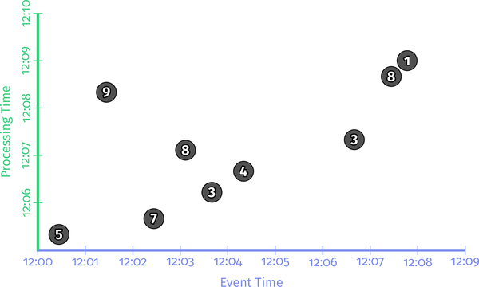

# Chapter8.流 SQL

让我们谈谈SQL。在本章中，我们将从中间的某个地方开始讲妙语，稍微回到过去以建立额外的背景，最后跳回到未来以一个漂亮的鞠躬结束一切。想象一下，昆汀·塔伦蒂诺 (Quentin Tarantino) 拥有计算机科学学位，并且非常乐意向全世界介绍流式 SQL 的优点，因此他主动提出与我代写这一章；有点像那样。减去暴力。

### 什么是流式SQL

我认为这个问题的答案几十年来一直困扰着我们的行业。平心而论，数据库社区现在已经理解了 99% 的答案了。但我还没有看到一个真正令人信服和全面的流式 SQL 定义，它涵盖了强大的流式语义的全部范围。这就是我们将在这里尝试实现的目标，尽管假设我们现在已经 100% 完成了目标是狂妄自大。也许是 99.1%？婴儿步骤。

无论如何，我想预先指出，在撰写本文时，我们将在本章中讨论的大部分内容仍然纯属假设。本章和下一章（涵盖流式连接）都描述了流式 SQL 的理想愿景。有些部分已经在 Apache Calcite、Apache Flink 和 Apache Beam 等系统中实现。许多其他人没有在任何地方实施。在此过程中，我将尝试指出一些确实以具体形式存在的东西，但考虑到这是一个移动的目标，你最好的选择是简单地查阅你感兴趣的特定系统的文档。

在这一点上，还值得强调的是，此处介绍的流式 SQL 愿景是 Calcite、Flink 和 Beam 社区之间协作讨论的结果。 Julian Hyde 是 Calcite 的首席开发人员，[长篇大论](http://bit.ly/2JTzR4V) 提出了他对流式 SQL 的设想。 2016 年，Flink 社区的成员将 Calcite SQL 支持集成到 Flink 本身，并开始向 Calcite SQL 方言添加特定于流的功能，例如窗口结构。然后，在 2017 年，所有三个社区开始了[讨论](http://s.apache.org/streaming-sql-spec)，试图就 Calcite SQL 中健壮的流处理应该使用哪些语言扩展和语义达成一致看起来像。本章试图将讨论中的想法提炼成关于将流式概念集成到 SQL 中的清晰而连贯的叙述，无论是 Calcite 还是其他方言。

### 关系代数

在谈论流对于 SQL 的意义时，重要的是要牢记 SQL 的理论基础：关系代数。关系代数只是一种描述由命名的、类型化的元组组成的数据之间关系的数学方法。关系代数的核心是关系本身，它是这些元组的集合。在经典数据库术语中，关系类似于表，可以是物理数据库表、SQL 查询的结果、视图（物化或其他）等等；它是一组包含命名和类型化数据列的行。

关系代数的一个更重要的方面是它的闭包属性：将关系代数中的任何运算符应用于任何有效关系 [^1] 总是会产生另一个关系。换句话说，关系是关系代数的通用货币，所有运算符都将它们作为输入消费并作为输出产生。

从历史上看，许多在 SQL 中支持流式处理的尝试都未能满足闭包属性。它们将流与经典关系分开处理，提供新的运算符以在两者之间进行转换，并限制可以应用于其中之一的操作。这显着提高了任何此类流式 SQL 系统的采用门槛：潜在用户必须学习新的运算符并了解它们适用的地方和不适用的地方，并且同样地重新学习这个新世界中的适用性规则对于任何老运营商。更糟糕的是，这些系统中的大多数仍然无法提供我们想要的全套流语义，例如支持强大的无序处理和强大的时间连接支持（我们将在第 9 章中介绍后者） ]（Chapter9.流 Joins.md#streaming_joins））。因此，我认为基本上不可能命名任何已经真正广泛采用的现有流式 SQL 实现。此类流式 SQL 系统的额外认知开销和受限功能确保了它们仍然是一个利基企业。

为了改变这种状况，真正将流式 SQL 推向前沿，我们需要一种方法让流式成为关系代数本身的一等公民，这样整个标准关系代数就可以自然地应用于流式和非流式使用个案。这并不是说流和表应该被视为完全相同的东西；它们绝对是不一样的，并且认识到这一事实有助于清晰理解并有助于导航流/表关系，正如我们很快就会看到的那样。但是核心代数应该干净自然地适用于这两个世界，只有在绝对必要的情况下，才对标准关系代数进行最少的扩展。

### 时变关系

切入正题，我在本章开头提到的妙语是：将流自然地集成到 SQL 中的关键是扩展关系，关系代数的核心数据对象，以表示一组数据*随着时间的推移* 而不是*特定时间点*的一组数据。更简洁地说，我们需要的不是*时间点*关系，而是*时变关系*。[^2]

但什么是时变关系？让我们首先根据经典关系代数来定义它们，然后我们还将考虑它们与流和表理论的关系。

就关系代数而言，时变关系实际上只是经典关系随时间的演变。要理解我的意思，请想象一个由用户事件组成的原始数据集。随着时间的推移，随着用户生成新事件，数据集不断增长和演变。如果您在特定时间点观察该集合，那就是经典关系。但是如果你观察集合*随时间*的整体演变，那是一个随时间变化的关系。

换句话说，如果经典关系就像二维表，由 x 轴上的命名类型列和 y 轴上的记录行组成，那么时变关系就像具有 x 轴和 y 轴的三维表和以前一样，但是一个额外的 z 轴随着时间的推移捕获不同版本的二维表。随着关系的变化，关系的新快照将添加到 z 维度中。

让我们看一个例子。想象一下我们的原始数据集是用户和分数；例如，与本书中的大多数其他示例一样，移动游戏的每个用户得分。并假设我们的示例数据集在特定时间点观察时最终看起来像这样，在本例中为 12:07：

```sql
12:07> SELECT * FROM UserScores;
------------------------- 
| Name  | Score | Time  |
------------------------- 
| Julie | 7     | 12:01 | 
| Frank | 3     | 12:03 | 
| Julie | 1     | 12:03 | 
| Julie | 4     | 12:07 |
-------------------------
```

换句话说，随着时间的推移，它记录了四个分数的到来：朱莉在 12:01 的分数是 7，弗兰克的分数是 3，朱莉的第二个分数是 12:03，最后，朱莉的第三个分数是 4，在 12:00 :07（请注意，此处的“时间”列包含处理时间时间戳，表示系统内记录的*到达时间*；稍后我们将讨论事件时间时间戳）。假设这些是此关系唯一到达的数据，它看起来就像我们在 12:07 之后观察到的任何时候的上表。但是，如果我们在 12:01 观察到这种关系，它看起来会像下面这样，因为到那时只有朱莉的第一个分数会到达：

```sql
12:01> SELECT * FROM UserScores;
 ------------------------- 
 | Name  | Score | Time  | 
 ------------------------- 
 | Julie | 7     | 12:01 | 
 ------------------------- 
```

如果我们在 12:03 再次观察它，Frank 的分数和 Julie 的第二个分数也会到达，所以关系会演变为如下所示：


```sql
12:03> SELECT * FROM UserScores;
------------------------- 
| Name  | Score | Time  |
------------------------- 
| Julie | 7     | 12:01 | 
| Frank | 3     | 12:03 | 
| Julie | 1     | 12:03 | 
------------------------- 
```

从这个例子中，我们可以开始了解这个数据集的 *time-varying* 关系必须是什么样子：它将捕获关系随时间的整个演变。因此，如果我们在 12:07 或之后观察时变关系（或 TVR），它看起来如下所示（请注意使用假设的“TVR”关键字表示我们希望查询返回完整的时变关系，而不是经典关系的标准时间点快照）：


```sql
12:07> SELECT TVR * FROM UserScores;
--------------------------------------------------------- 
|       [-inf, 12:01)       |       [12:01, 12:03)      | 
| ------------------------- | ------------------------- | 
| | Name  | Score | Time  | | | Name  | Score | Time  | |
| ------------------------- | ------------------------- | 
| |       |       |       | | | Julie | 7     | 12:01 | | 
| |       |       |       | | |       |       |       | | 
| |       |       |       | | |       |       |       | | 
| |       |       |       | | |       |       |       | | 
| ------------------------- | ------------------------- | 
--------------------------------------------------------- 
|       [12:03, 12:07)      |       [12:07, now)        | 
| ------------------------- | ------------------------- | 
| | Name  | Score | Time  | | | Name  | Score | Time  | |
| ------------------------- | ------------------------- | 
| | Julie | 7     | 12:01 | | | Julie | 7     | 12:01 | | 
| | Frank | 3     | 12:03 | | | Frank | 3     | 12:03 | | 
| | Julie | 1     | 12:03 | | | Julie | 1     | 12:03 | | 
| |       |       |       | | | Julie | 4     | 12:07 | | 
| ------------------------- | ------------------------- | 
---------------------------------------------------------
```

因为印刷/数字页面仍然局限于二维，所以我冒昧地将第三维扁平化为二维关系的网格。但是你可以看到时变关系本质上是如何由一系列经典关系组成的（从左到右，从上到下排序），每个关系都捕获特定时间范围内的关系的完整状态（所有这些，根据定义, 是连续的）。

以这种方式定义时变关系的重要之处在于，就所有意图和目的而言，它们实际上只是一系列经典关系，每个关系都独立存在于自己脱节（但相邻）的时间范围内，每个范围捕获一段关系没有改变的时间。这很重要，因为这意味着将关系运算符应用于时变关系等同于将该运算符单独应用于相应序列中的每个经典关系。更进一步，将关系运算符单独应用于一系列关系的结果，每个关系与一个时间间隔相关联，将始终产生具有相同时间间隔的相应关系序列。换句话说，结果是对应的时变关系。这个定义给了我们两个非常重要的属性：

- 经典关系代数中的*全套运算符*在应用于时变关系时*仍然有效*，并且继续按照您的预期运行。

- 当应用于时变关系时，关系代数的*闭包属性*保持不变*。

或者更简洁地说，*经典关系代数的所有规则在应用于时变关系时都继续成立*。这是巨大的，因为这意味着我们用时变关系代替经典关系并没有以任何方式改变游戏的参数。一切都继续像在经典关系领域那样工作，只是基于经典关系序列而不是单例。回到我们的示例，考虑我们的原始数据集上的另外两个时变关系，它们都是在 12:07 之后的某个时间观察到的。首先是一个使用`WHERE`子句的简单过滤关系：

```sql
12:07> SELECT TVR * FROM UserScores WHERE Name = "Julie";
--------------------------------------------------------- 
|       [-inf, 12:01)       |       [12:01, 12:03)      |
| ------------------------- | ------------------------- |
| | Name  | Score | Time  | | | Name  | Score | Time  | |
| ------------------------- | ------------------------- | 
| |       |       |       | | | Julie | 7     | 12:01 | | 
| |       |       |       | | |       |       |       | | 
| |       |       |       | | |       |       |       | | 
| ------------------------- | ------------------------- |
--------------------------------------------------------- 
|       [12:03, 12:07)      |       [12:07, now)        | 
| ------------------------- | ------------------------- | 
| | Name  | Score | Time  | | | Name  | Score | Time  | |
| ------------------------- | ------------------------- | 
| | Julie | 7     | 12:01 | | | Julie | 7     | 12:01 | | 
| | Julie | 1     | 12:03 | | | Julie | 1     | 12:03 | | 
| |       |       |       | | | Julie | 4     | 12:07 | | 
| ------------------------- | ------------------------- |
--------------------------------------------------------- 
```

如您所料，此关系看起来很像前面的关系，但过滤掉了 Frank 的分数。尽管时变关系捕获了记录此数据集随时间演变所需的额外时间维度，但根据您对 SQL 的理解，查询的行为完全符合您的预期。

对于稍微复杂一点的事情，让我们考虑一个分组关系，在该关系中我们将所有每个用户的分数相加以生成每个用户的总分：

```sql
12:07> SELECT TVR Name, SUM(Score) as Total, MAX(Time) as Time 
       FROM UserScores GROUP BY Name;
---------------------------------------------------------
|       [-inf, 12:01)       |       [12:01, 12:03)      |
| ------------------------- | ------------------------- |
| | Name  | Total | Time  | | | Name  | Total | Time  | |
| ------------------------- | ------------------------- |
| |       |       |       | | | Julie | 7     | 12:01 | |
| |       |       |       | | |       |       |       | |
| ------------------------- | ------------------------- |
---------------------------------------------------------
|       [12:03, 12:07)      |       [12:07, now)        |
| ------------------------- | ------------------------- |
| | Name  | Total | Time  | | | Name  | Total | Time  | |
| ------------------------- | ------------------------- |
| | Julie | 8     | 12:03 | | | Julie | 12    | 12:07 | |
| | Frank | 3     | 12:03 | | | Frank | 3     | 12:03 | |
| ------------------------- | ------------------------- |
---------------------------------------------------------
```

同样，此查询的时变版本的行为与您预期的完全一样，序列中的每个经典关系仅包含每个用户的分数总和。事实上，无论我们选择多么复杂的查询，结果总是与将该查询独立应用于组成输入时变关系的相应经典关系相同。我怎么强调都不为过，这是多么重要！

好吧，这很好，但是时变关系本身更像是一种理论构造，而不是数据的实际物理表现；对于经常变化的大型数据集，很容易看出它们是如何变得非常庞大和笨重的。为了了解它们实际上如何与现实世界的流处理联系起来，现在让我们探讨时变关系与流和表理论之间的关系。

### 流和表

对于这种比较，让我们再次考虑我们之前看到的分组时变关系：

```sql
12:07> SELECT TVR Name, SUM(Score) as Total, MAX(Time) as Time
       FROM UserScores GROUP BY Name;
---------------------------------------------------------
|       [-inf, 12:01)       |       [12:01, 12:03)      |
| ------------------------- | ------------------------- |
| | Name  | Total | Time  | | | Name  | Total | Time  | |
| ------------------------- | ------------------------- |
| |       |       |       | | | Julie | 7     | 12:01 | |
| |       |       |       | | |       |       |       | |
| ------------------------- | ------------------------- |
---------------------------------------------------------
|       [12:03, 12:07)      |       [12:07, now)        |
| ------------------------- | ------------------------- |
| | Name  | Total | Time  | | | Name  | Total | Time  | |
| ------------------------- | ------------------------- |
| | Julie | 8     | 12:03 | | | Julie | 12    | 12:07 | |
| | Frank | 3     | 12:03 | | | Frank | 3     | 12:03 | |
| ------------------------- | ------------------------- |
---------------------------------------------------------
```

我们知道这个序列捕捉了关系随时间变化的完整历史。鉴于我们对 [第 6 章](Chapter6.流和表.md#streams_and_tables) 中的表和流的理解，不难理解时变关系与流和表理论的关系。

表非常简单：因为时变关系本质上是一系列经典关系（每个关系在特定时间点捕获关系的快照），而经典关系类似于表，将时变关系观察为表只是产生观察时间的时间点关系快照。

例如，如果我们在 12:01 将之前分组的时变关系观察为一张表，我们将得到以下结果（注意使用另一个假设的关键字`TABLE`来明确表达我们对查询返回一个表）：


```sql
12:01> SELECT TABLE Name, SUM(Score) as Total, MAX(Time) as Time
       FROM UserScores GROUP BY Name;
-------------------------
| Name  | Total | Time  |
-------------------------
| Julie | 7     | 12:01 |
-------------------------
```

在 12:07 观察会产生预期的结果：

```sql
12:07> SELECT TABLE Name, SUM(Score) as Total, MAX(Time) as Time
       FROM UserScores GROUP BY Name;
-------------------------
| Name  | Total | Time  |
-------------------------
| Julie | 12    | 12:07 |
| Frank | 3     | 12:03 |
-------------------------
```

这里特别有趣的是，在 SQL 中实际上支持时变关系的想法，即使它今天存在。 SQL 2011 标准提供了“时态表”，它存储了表随时间的版本化历史（本质上是随时间变化的关系）以及`AS OF SYSTEM TIME`结构，允许您显式查询和接收快照您指定的任何时间点的时态表/时变关系。例如，即使我们在 12:07 执行查询，我们仍然可以看到关系在 12:03 时的样子：

```sql
12:07> SELECT TABLE Name, SUM(Score) as Total, MAX(Time) as Time
			 FROM UserScores GROUP BY Name AS OF SYSTEM TIME ‘12:03’;
------------------------- 
| Name  | Total | Time  | 
------------------------- 
| Julie | 8     | 12:03 |
| Frank | 3     | 12:03 | 
------------------------- 
```

因此，在 SQL 中已经有一些时变关系的先例。但我离题了。这里的要点是表捕获了特定时间点随时间变化的关系的快照。大多数现实世界的表实现只是简单地跟踪我们观察到的实时情况；其他人维护一些额外的历史信息，这在极限上相当于一个完全保真度的时变关系，它捕获了一个关系随时间的整个历史。

流是略有不同的野兽。我们在 [第 6 章](Chapter6.流和表.md#streams_and_tables) 中了解到，它们也可以捕获表随时间的演变。但它们的做法与我们目前看到的随时间变化的关系有些不同。他们不是在每次关系发生变化时整体捕获整个关系的快照，而是捕获导致这些快照处于时变关系中的*变化序列*。这里的细微差别通过一个例子变得更加明显。

作为复习，再次回顾我们的基线示例`TVR`查询

```
12:07> SELECT TVR Name, SUM(Score) as Total, MAX(Time) as Time
       FROM UserScores GROUP BY Name;
---------------------------------------------------------
|       [-inf, 12:01)       |       [12:01, 12:03)      |
| ------------------------- | ------------------------- |
| | Name  | Total | Time  | | | Name  | Total | Time  | |
| ------------------------- | ------------------------- |
| |       |       |       | | | Julie | 7     | 12:01 | |
| |       |       |       | | |       |       |       | |
| ------------------------- | ------------------------- |
---------------------------------------------------------
|       [12:03, 12:07)      |       [12:07, now)        |
| ------------------------- | ------------------------- |
| | Name  | Total | Time  | | | Name  | Total | Time  | |
| ------------------------- | ------------------------- |
| | Julie | 8     | 12:03 | | | Julie | 12    | 12:07 | |
| | Frank | 3     | 12:03 | | | Frank | 3     | 12:03 | |
| ------------------------- | ------------------------- |
---------------------------------------------------------
```

现在让我们观察我们的时变关系作为一个流，因为它存在于几个不同的时间点。在此过程中的每一步，我们都会将 TVR 在该时间点的原始表格渲染与到该时间点的流的演变进行比较。要查看我们的时变关系的流渲染是什么样的，我们需要引入两个新的假设关键字：

- 一个`STREAM`关键字，类似于我已经介绍过的`TABLE`关键字，它表明我们希望我们的查询返回一个逐个事件的流，以捕获时变关系随时间的演变。您可以将此视为随着时间的推移对关系应用每记录触发器。
- 一个特殊的 `Sys.Undo`[^3] 列，可以从 `STREAM` 查询中引用，以识别撤回的行。稍后会详细介绍这一点。

因此，从 12:01 开始，我们将有以下内容：

```sql
                                          12:01> SELECT STREAM Name, 
12:01> SELECT TABLE Name,                          SUM(Score) as Total,
         SUM(Score) as Total,                      MAX(Time) as Time,
         MAX(Time) as Time                         Sys.Undo as Undo
       FROM UserScores GROUP BY Name;            FROM UserScores GROUP BY Name;
-------------------------                 --------------------------------
| Name  | Total | Time  |                 | Name  | Total | Time  | Undo |
-------------------------                 --------------------------------
| Julie | 7     | 12:01 |                 | Julie | 7     | 12:01 |      |
-------------------------                 ........ [12:01, 12:01] ........
```

此时表格和流渲染看起来几乎相同。修改 `Undo` 列（在下一个示例中更详细地讨论），只有一个区别：表格版本截至 12:01 是完整的（由关闭关系底端的最后一行破折号表示） ，流版本仍然不完整，如最后的类似省略号的句点线所示，它标记了关系的开放尾部（将来可能会出现其他数据）以及到目前为止观察到的数据的处理时间范围.事实上，如果在实际实现中执行，`STREAM`查询将无限期地等待其他数据到达。因此，如果我们等到 12:03，将为`STREAM`查询显示三个新行。将其与 12:03 处 TVR 的全新`TABLE`渲染进行比较：

```sql
                                          12:01> SELECT STREAM Name, 
12:03> SELECT TABLE Name,                          SUM(Score) as Total,
         SUM(Score) as Total,                      MAX(Time) as Time,
         MAX(Time) as Time                         Sys.Undo as Undo
       FROM UserScores GROUP BY Name;            FROM UserScores GROUP BY Name;
-------------------------                 --------------------------------
| Name  | Total | Time  |                 | Name  | Total | Time  | Undo |
-------------------------                 --------------------------------
| Julie | 8     | 12:03 |                 | Julie | 7     | 12:01 |      |
| Frank | 3     | 12:03 |                 | Frank | 3     | 12:03 |      |
-------------------------                 | Julie | 7     | 12:03 | undo |
                                          | Julie | 8     | 12:03 |      |
                                          ........ [12:01, 12:03] ........
```

这是一个值得解决的有趣问题：当我们的原始数据集在该时间段内仅包含 *两行*行（Frank 的 3 和 Julie 的 1）时，为什么流中有 *三* 新行（Frank 的 3 和 Julie 的 undo-7 和 8） ？答案在于我们在这里观察原始输入的*聚合*的变化流；特别是，对于从 12:01 到 12:03 的时间段，流需要捕获关于由于新值 1 的到来而导致的 Julie 总分变化的两个重要信息：

- 先前报告的总数 7 是不正确的。
- 新的总数是 8。

这就是特殊的“Sys.Undo”列允许我们做的事情：区分正常行和*收回*先前报告值的行。[^4]

`STREAM` 查询的一个特别好的特性是您可以开始看到所有这些与经典联机事务处理 (OLTP) 表的世界的关系：此查询的 `STREAM` 呈现本质上是捕获一系列 `INSERT ` 和 `DELETE` 操作，您可以使用它们在 OLTP 世界中随着时间的推移具体化这种关系（实际上，当您考虑它时，OLTP 表本身本质上是随时间变化的关系，通过 `INSERT` 的流随时间发生变化、“更新”和“删除”）。

现在，如果我们不关心流中的撤回，那么不要求它们也完全没问题。在这种情况下，我们的 STREAM 查询将如下所示：

```sql
12:01> SELECT STREAM Name,
         SUM(Score) as Total,
         MAX(Time) as Time
       FROM UserScores GROUP BY Name;
------------------------- 
| Name  | Total | Time  |
------------------------- 
| Julie | 7     | 12:01 | 
| Frank | 3     | 12:03 |
| Julie | 8     | 12:03 |
.... [12:01, 12:03] .....
```

但是理解完整流的样子显然很有价值，所以我们将返回到包括我们最后一个示例的`Sys.Undo`列。说到这一点，如果我们再等四分钟直到 12:07，我们会在 `STREAM` 查询中看到另外两行，而`TABLE` 查询将像以前一样继续发展：


```sql
                                          12:01> SELECT STREAM Name, 
12:07> SELECT TABLE Name,                          SUM(Score) as Total,
         SUM(Score) as Total,                      MAX(Time) as Time,
         MAX(Time) as Time                         Sys.Undo as Undo
       FROM UserScores GROUP BY Name;            FROM UserScores GROUP BY Name;
-------------------------                 --------------------------------
| Name  | Total | Time  |                 | Name  | Total | Time  | Undo |
-------------------------                 --------------------------------
| Julie | 12    | 12:07 |                 | Julie | 7     | 12:01 |      |
| Frank | 3     | 12:03 |                 | Frank | 3     | 12:03 |      |
-------------------------                 | Julie | 7     | 12:03 | undo |
                                          | Julie | 8     | 12:03 |      |
                                          | Julie | 8     | 12:07 | undo |
                                          | Julie | 12    | 12:07 |      |
                                          ........ [12:01, 12:07] ........

```

到这个时候，很明显 [`STREAM`]{.code_purple} 我们的时变关系的版本与 表版本：表捕获整个关系的快照 *在一个特定的时间点*，而流捕获的视图 对关系的个别更改 *over time*.[^5] 有趣的是，这意味着 [`STREAM`]{.code_purple} 渲染与我们的原始渲染有更多共同点， 基于表的 TVR [渲染]{.keep-together}：

``` {data-type="programlisting"}
12:07> SELECT TVR Name, SUM(Score) as Total, MAX(Time) as Time
       FROM UserScores GROUP BY Name;
---------------------------------------------------------
|       [-inf, 12:01)       |       [12:01, 12:03)      |
| ------------------------- | ------------------------- |
| | Name  | Total | Time  | | | Name  | Total | Time  | |
| ------------------------- | ------------------------- |
| |       |       |       | | | Julie | 7     | 12:01 | |
| |       |       |       | | |       |       |       | |
| ------------------------- | ------------------------- |
---------------------------------------------------------
|       [12:03, 12:07)      |       [12:07, now)        |
| ------------------------- | ------------------------- |
| | Name  | Total | Time  | | | Name  | Total | Time  | |
| ------------------------- | ------------------------- |
| | Julie | 8     | 12:03 | | | Julie | 12    | 12:07 | |
| | Frank | 3     | 12:03 | | | Frank | 3     | 12:03 | |
| ------------------------- | ------------------------- |
---------------------------------------------------------
```

事实上，可以肯定地说，`STREAM`查询只是提供了对存在于相应的基于表的`TVR`查询中的整个数据历史记录的替代呈现。 STREAM 渲染的价值在于它的简洁性：它仅捕获 TVR 中每个时间点关系快照之间的变化增量。 表序列`TVR`呈现的价值在于它提供的清晰度：它以突出其与经典关系的自然关系的格式捕获关系随时间的演变，并在这样做时提供简单明了的 流上下文中关系语义的定义以及流带来的额外时间维度。

`STREAM` 和基于表格的 `TVR` 渲染之间的相似之处的另一个重要方面是，它们在编码的整体数据方面本质上是等效的。 这触及了其支持者长期以来鼓吹的流/表二元性的核心：流和表[^6] 实际上只是同一枚硬币的两个不同面。 或者重新使用[第 6 章](Chapter6.流和表.md#Chapter6.流和表) 中的糟糕物理类比，流和表是随时间变化的关系，就像波和粒子是光：[^7] 一个完整的时间 - 可变关系同时是表和流； 表和流只是同一概念的不同物理表现，具体取决于上下文。

现在，重要的是要记住，只有当两个版本都编码相同的信息时，这种流/表的二元性才是正确的； 也就是说，当您拥有完全保真表或流时。 然而，在许多情况下，完全保真是不切实际的。 正如我之前提到的，对时变关系的完整历史进行编码，无论是流形式还是表格形式，对于大型数据源来说都是相当昂贵的。 TVR 的流和表表现以某种方式有损是很常见的。 表格通常只编码最新版本的 TVR； 那些支持临时或版本访问的通常将编码历史压缩到特定的时间点快照，和/或垃圾收集版本早于某个阈值。 类似地，流通常只对 TVR 演变的有限持续时间进行编码，通常是该历史的相对较新的部分。 像 Kafka 这样的持久流提供了对整个 TVR 进行编码的能力，但这同样是相对不常见的，超过某个阈值的数据通常会通过垃圾收集过程被丢弃。

这里的要点是流和表绝对是彼此的对偶，每一种都是对时变关系进行编码的有效方式。 但在实践中，TVR 的物理流/表表现在某种程度上是有损的是很常见的。 这些部分保真流和表以减少总编码信息换取一些好处，通常是降低资源成本。 这些类型的权衡很重要，因为它们通常使我们能够构建在真正大规模的数据源上运行的管道。 但它们也使事情复杂化，需要更深入的理解才能正确使用。 我们将在稍后讨论 SQL 语言扩展时更详细地讨论这个主题。 但在我们尝试对 SQL 扩展进行推理之前，更具体地了解当今常见的 SQL 和非 SQL 数据处理方法中存在的偏差将很有用。

## 回顾过去：流和表偏差

在许多方面，向 SQL 添加强大的流支持的行为主要是尝试将 Beam 模型的 *where*、*when* 和 *how* 语义与经典 SQL 模型的 *what* 语义合并 . 但要干净利落地做到这一点，并以一种忠实于经典 SQL 外观和感觉的方式，需要了解这两个模型之间的关系。 因此，正如我们在 [第 6 章](Chapter6.流和表.md#Chapter6.流和表) 中探索了 Beam 模型与流和表理论的关系一样，我们现在将探索 Beam 模型与经典 SQL 模型的关系，使用流和 表理论作为我们比较的基础框架。 在此过程中，我们将发现每个模型中存在的固有偏见，这将为我们提供一些见解，让我们了解如何以一种干净、自然的方式最好地将两者结合起来。

### Beam 模型：一种偏流的方法

让我们从 Beam 模型开始，建立在 [第6章](Chapter6.流和表.md#Chapter6.流和表) 中的讨论之上。 首先，我想讨论 Beam 模型中固有的流偏差，因为它目前存在于流和表中。

如果您回想一下图 [6-11](Chapter6.流和表.md#even_time_processing_time_view_of_windowed_summation) 和 [6-12](Chapter6.流和表.md#streams_and_tables_view_of_windowed_summation_on_a_streaming)，它们显示了我们用作相同分数求和管道的两个不同视图 本书中的一个示例：在[图 6-11](Chapter6.流和表.md#even_time_processing_time_view_of_windowed_summation) 中是一个逻辑的 Beam-Model 视图，在 [图 6-12](Chapter6.流和表.md#streams_and_tables_view_of_windowed_summation_on_a_streaming) 中是一个物理的流和表—— 导向的观点。 比较两者有助于突出 Beam 模型与流和表的关系。 但是通过将一个叠加在另一个之上，正如我在 [图 8-1](#stream_bias_in_the_beam_model_approach) 中所做的那样，我们可以看到这种关系的另一个有趣的方面：Beam 模型的固有流偏差。


###### Figure 8-1. Stream bias in the Beam Model approach

在此图中，我绘制了红色虚线，将逻辑视图中的转换连接到物理视图中的相应组件。 当以这种方式观察时，突出的一点是所有逻辑转换都由 *streams* 连接，即使是涉及分组的操作（我们从 [第6章](Chapter6.流和表.md#Chapter6.流和表) 中了解到，结果是一个表 创建*某处*）。 用 Beam 的说法，这些转换是“PTransforms”，它们总是应用于`PCollections`以产生新的`PCollections`。 这里重要的一点是 Beam 中的`PCollections`*总是*流。 因此，Beam 模型本质上是一种偏向于流的数据处理方法：流是 Beam 管道（甚至是批处理管道）中的通用货币，而表总是被特殊对待，要么在源后面抽象，要么在边缘处抽象 管道或隐藏在管道中某处的分组和触发操作之下。

由于 Beam 根据流进行操作，因此在涉及表的任何地方（源、汇和任何中间分组/取消分组），都需要进行某种转换以隐藏底层表。 Beam 中的那些转换看起来像这样：

- *消费*表的*来源*通常对这些表被*触发*的方式进行硬编码； 用户无法指定他们想要使用的表的自定义触发。 可以编写源以触发对表的每个新更新作为记录，它可以将更新组一起批处理，或者它可以在某个时间点提供表中数据的单个有界快照。 这实际上仅取决于给定来源的实用性，以及来源作者试图解决的用例。

- *Sinks* *write* 表通常对它们*分组* 输入流的方式进行硬编码。 有时，这是通过给予用户一定程度的控制权的方式完成的； 例如，通过简单地对用户分配的键进行分组。 在其他情况下，分组可能是隐式定义的； 例如，在将没有自然键的输入数据写入分片输出源时，通过随机物理分区号进行分组。 与来源一样，它实际上仅取决于给定接收器的实用性以及接收器的作者试图解决的用例。

- 对于*分组/取消分组操作*，与源和接收器相比，Beam 为用户提供了完全的灵活性，可以让他们将数据分组到表中并将它们取消分组回到流中。 这是设计使然。 分组操作的灵活性是必要的，因为数据分组的方式是定义管道的算法的关键组成部分。 取消分组的灵活性很重要，这样应用程序才能以适合手头用例的方式调整生成的流。[^8]

然而，这里有一个问题。 请记住[图 8-1](#stream_bias_in_the_beam_model_approach)，Beam 模型天生就偏向于流。 因此，尽管可以将分组操作直接干净地应用于流（这是 Beam 的`GroupByKey`操作），但该模型从不提供可以直接应用触发器的一流表对象。 因此，必须在其他地方应用触发器。 这里基本上有两个选项：

 触发器的预先声明
  
   - 这是在管道中指定触发器的地方*在*它们实际应用到的表之前。 在这种情况下，您实际上是在预先指定您希望稍后在遇到分组操作后在管道中看到的行为。 当以这种方式声明时，触发器是*前向传播*的。
  

 触发器声明后
  
   - 这是在管道中指定触发器的地方*跟随*它们应用到的表。 在这种情况下，您要指定希望在声明触发器时看到的行为。 当以这种方式声明时，触发器是*向后传播*的。
  
   因为触发器的后声明允许您在您想要观察它的实际位置指定您想要的行为，所以它更加直观。 不幸的是，现在存在的 Beam（2.x 和更早版本）使用触发器的预声明（类似于预声明窗口的方式）。

尽管 Beam 提供了多种方法来处理表被隐藏的事实，但我们仍然面临这样一个事实，即表必须始终在被观察到之前被触发，即使该表的内容确实是最终数据 你想消费。 这是目前存在的 Beam 模型的一个缺点，可以通过从以流为中心的模型转向将流和表都视为一流实体的模型来解决。

现在让我们看看 Beam 模型的概念逆向：经典 SQL。


### SQL 模型：偏向表的方法

与 Beam 模型的流偏向方法相反，SQL 历来采用表偏向方法：查询应用于表，并且总是产生新表。 这类似于我们在[第 6 章](Chapter6.流和表.md#streams_and_tables) 中使用 MapReduce 看到的批处理模型，[^9] 但是考虑一个像我们这样的具体示例会很有用 刚刚查看了梁模型。

考虑以下非规范化 SQL 表：

```
UserScores (user, team, score, timestamp)
```

它包含用户分数，每个分数都标有相应用户及其相应团队的 ID。 没有主键，因此您可以假设这是一个仅附加表，每一行都由其唯一的物理偏移量隐式标识。 如果我们想从这个表中计算团队得分，我们可以使用如下所示的查询：

```
    SELECT team, SUM(score) as total
    FROM UserScores
    GROUP BY team;
```

当由查询引擎执行时，优化器可能会将此查询分解为大致三个步骤：

1. 扫描输入表（即触发它的快照）
2. 将该表中的字段向下投影到团队和得分
3. 按团队分组行并汇总分数

如果我们使用类似于 [图 8-1](#stream_bias_in_the_beam_model_approach) 的图表来查看它，它看起来像 [图 8-2](#table_bias_in_a_simple_sql_query)。

`SCAN` 操作获取输入表并将其触发到一个有界流中，该流包含查询执行时该表内容的快照。 该流由`SELECT`操作使用，它将四列输入行向下投影到两列输出行。 作为非分组操作，它会产生另一个流。 最后，团队和用户分数的两列流进入“GROUP BY”并按团队分组到一个表中，同一个团队的分数“SUM”在一起，产生我们的团队及其对应团队的输出表 总分。


<center><i>Figure 8-2. Table bias in a simple SQL query</center></i>

这是一个自然以表结尾的相对简单的示例，因此它确实不足以突出经典 SQL 中的表偏差。 但是我们可以通过简单地将此查询的主要部分（投影和分组）拆分为两个单独的查询来梳理出更多证据：

```
    SELECT team, score
    INTO TeamAndScore
    FROM UserScores;

    SELECT team, SUM(score) as total
    INTO TeamTotals
    FROM TeamAndScore
    GROUP BY team;
```

在这些查询中，我们首先将 UserScores 表向下投影到我们关心的两列，将结果存储在临时的 TeamAndScore 表中。 然后我们按团队对该表进行分组，同时汇总分数。 将事情分解为两个查询的管道后，我们的图表看起来像 [图 8-3](#breaking_the_query_into_two_to_surface_more_evidence_of_table_bias) 中所示。


<center><i>Figure 8-3. Breaking the query into two to reveal more evidence of table bias</center></i>

如果经典 SQL 将流公开为一流对象，您会期望第一个查询`TeamAndScore`的结果是一个流，因为`SELECT`操作使用一个流并生成一个流。 但是因为SQL的通用货币是表，它必须先将投影流转换成表。 并且由于用户没有指定任何明确的分组键，它必须简单地根据它们的标识对键进行分组（即附加语义，通常通过按每行的物理存储偏移量分组来实现）。

因为`TeamAndScore`现在是一个表，所以第二个查询必须预先添加一个额外的`SCAN`操作以将表扫描回流中，以允许`GROUP BY`再次将其分组回表中，这次是行 按团队分组，并将他们的个人分数加在一起。 因此，我们看到由于中间表的显式具体化而插入的两个隐式转换（来自流并再次返回）。

也就是说，SQL 中的表并不*总是*明确的； 隐式表也可以存在。 例如，如果我们使用“GROUP BY”语句在查询末尾添加一个`HAVING`子句，以过滤掉得分低于特定阈值的团队，则该图将变为类似于 [图 8] -4]（#table_bias_with_a_final_having_clause）。


<center><i>Figure 8-4. Table bias with a final HAVING clause</center></i>

通过添加`HAVING`子句，以前用户可见的`TeamTotals`表现在是一个隐式的中间表。 要根据 `HAVING` 子句中的规则过滤表的结果，必须将该表触发到可以过滤的流中，然后必须将该流隐式分组回表以产生新的输出表，` LargeTeamTotals`。

这里的重要收获是经典 SQL 中明显的表偏差。 流总是隐式的，因此对于任何物化流都需要从/到表的转换。 此类转换的规则大致可分为以下几类：

输入表（即源，在梁模型术语中）

- 这些总是在特定时间点[^10]（通常是查询执行时间）隐式触发，以生成包含当时表快照的有界流。 这也与经典批处理所获得的相同； 例如，我们在 [第 6 章](Chapter6.流和表.md#streams_and_tables) 中看到的 MapReduce 案例。

输出表（即汇，梁模型术语）

- 这些表要么是查询中最终分组操作创建的表的直接表现，要么是应用于查询终端流的隐式分组（通过行的某些唯一标识符）的结果，用于不结束的查询 在分组操作中（例如，前面示例中的投影查询，或后跟`HAVING`子句的`GROUP BY`）。 与输入一样，这与经典批处理中的行为相匹配。

分组/取消分组操作

- 与 Beam 不同，这些操作仅在一个维度上提供了完全的灵活性：分组。 尽管经典 SQL 查询提供了全套分组操作（`GROUP BY`、`JOIN`、`CUBE` 等），但它们仅提供一种类型的隐式取消分组操作：在所有操作之后触发整个中间表 对它有贡献的上游数据已被合并（同样，MapReduce 中提供的完全相同的隐式触发器作为洗牌操作的一部分）。 因此，SQL 在通过分组塑造算法方面提供了极大的灵活性，但在塑造查询执行期间隐藏在幕后的隐式流方面的灵活性基本上为零。


**物化视图**

鉴于经典 SQL 查询与经典批处理的相似程度，可能很容易将 SQL 固有的表偏差视为不以任何方式支持流处理的 SQL 产物。 但这样做会忽略这样一个事实，即数据库支持特定类型的流处理已经有一段时间了：*物化视图*。 物化视图是一种视图，它被物理地物化为一个表，并随着源表的发展由数据库*随*时间保持最新。 请注意，这听起来与我们对时变关系的定义非常相似。 物化视图的迷人之处在于，它们向 SQL 添加了一种非常有用的流处理形式，而没有显着改变其操作方式，包括其固有的表偏差。

例如，让我们考虑一下我们在 [图 8-4](#table_bias_with_a_final_having_clause) 中看到的查询。 我们可以将这些查询更改为`CREATE MATERIALIZED VIEW`[^11] 语句：

```
    CREATE MATERIALIZED VIEW TeamAndScoreView AS
    SELECT team, score
    FROM UserScores;

    CREATE MATERIALIZED VIEW LargeTeamTotalsView AS
    SELECT team, SUM(score) as total
    FROM TeamAndScoreView
    GROUP BY team
    HAVING SUM(score) > 100;
```

这样做时，我们将它们转换为连续的、常设的查询，以流式方式连续处理对 `UserScores` 表的更新。 即便如此，视图的最终物理执行图*看起来几乎与一次性查询完全相同*； 为了支持这种流式实体化视图的想法，没有任何地方将流变成显式的一流对象。 物理执行计划中*唯一*值得注意的变化是替换了不同的触发器：`SCAN-AND-STREAM` 而不是 `SCAN`，如 [图 8-5](#table_bias_in_materialized_views) 所示。


<center><i>Figure 8-5. Table bias in materialized views</center></i>

这个`SCAN-AND-STREAM`触发器是什么？ `SCAN-AND-STREAM` 开始时类似于 `SCAN` 触发器，将表在某个时间点的全部内容发送到流中。 但是，它不会停在那里并声明要完成的流（即有界），它还会继续触发对输入表的所有后续修改，从而产生一个无界流，该流会捕获表随时间的演变。 在一般情况下，这些修改不仅包括新值的“插入”，还包括先前值的`DELETE`和对现有值的`UPDATE`（实际上，这被视为同时的`DELETE`/`INSERT` 对，或 `undo`/`redo` 值，因为它们在 Flink 中被称为）。

此外，如果我们考虑物化视图的表/流转换规则，唯一真正的区别是使用的触发器：

- *输入表*通过`SCAN-AND-STREAM`触发器而不是`SCAN`触发器隐式触发。 其他一切都与经典的批量查询相同。

- *输出表*被视为与经典批处理查询相同。

- *分组/取消分组操作* 与经典批处理查询的功能相同，唯一的区别是使用 `SCAN-AND-STREAM` 触发器而不是 `SNAPSHOT` 触发器来进行隐式取消分组操作。


在这个例子中，很明显 SQL 固有的表偏差不仅仅是 SQL 仅限于批处理的产物：[^12] 物化视图赋予 SQL 执行特定类型流处理的能力 方法没有任何重大变化，包括对表格的固有偏见。 经典 SQL 只是一个偏表模型，无论您是将它用于批处理还是流处理。


## 展望未来：走向强大的流式 SQL

我们现在已经研究了时变关系，表和流提供时变关系的不同呈现方式，以及 Beam 和 SQL 模型相对于流和表理论的固有偏差。 那么，这一切将我们置于何地？ 也许更重要的是，我们需要在 SQL 中更改或添加什么以支持强大的流处理？ 令人惊讶的答案是：如果我们有良好的默认值，则不会太多。

我们知道关键的概念变化是用时变关系代替经典的时间点关系。 我们之前看到这是一个非常无缝的替代，它适用于已经存在的所有关系运算符，这要归功于保持关系代数的关键闭包属性。 但我们也看到，直接处理时变关系通常是不切实际的； 我们需要能够根据我们两种更常见的物理表现形式进行操作：表和流。 这就是一些具有良好默认值的简单扩展的用武之地。我们还需要一些工具来可靠地推理时间，特别是事件时间。 这就是时间戳、窗口和触发等功能发挥作用的地方。 但同样，明智地选择默认值对于最小化这些扩展在实践中的必要频率非常重要。很棒的是我们真的不需要比这更多的东西。 因此，现在让我们最终花一些时间详细研究这两类扩展：*流/表选择*和*时间运算符*。


### 流和表选择

当我们处理时变关系示例时，我们已经遇到了与流和表选择相关的两个关键扩展。 它们是我们放在`SELECT`关键字之后的`TABLE`和`STREAM`关键字，用于指示我们对给定时变关系的期望物理视图：

```sql
12:07> SELECT TABLE Name,                 12:01> SELECT STREAM Name
         SUM(Score) as Total,                      SUM(Score) as Total,                      
         MAX(Time)                                 MAX(Time) 
       FROM UserScores                           FROM UserScores
       GROUP BY Name;                            GROUP BY Name;
-------------------------                 -------------------------
| Name  | Total | Time  |                 | Name  | Total | Time  |
-------------------------                 -------------------------
| Julie | 12    | 12:07 |                 | Julie | 7     | 12:01 |
| Frank | 3     | 12:03 |                 | Frank | 3     | 12:03 |
-------------------------                 | Julie | 8     | 12:03 |
                                          | Julie | 12    | 12:07 |
                                          ..... [12:01, 12:07] ....
```

这些扩展在必要时相对简单易用。 但是关于流和表选择的真正重要的事情是在没有明确提供时选择好的默认值。 这样的默认值应该尊重每个人都习以为常的经典的、偏表的 SQL 行为，同时在包含流的世界中也能直观地操作。 它们也应该很容易记住。 这里的目标是帮助保持对系统的自然感觉，同时大大降低我们必须使用显式扩展的频率。 满足所有这些要求的默认值的一个很好的选择是：

- 如果*所有*输入都是*表*，则输出是*`TABLE`*。
- 如果*任何*输入是*流*，则输出是*`STREAM`*。

在这里特别需要指出的是，这些时变关系的物理渲染实际上仅在您想要以某种方式具体化 TVR 时才是必需的，无论是直接查看它还是将其写入某个输出表或流。 给定一个根据完全保真时变关系在幕后运行的 SQL 系统，中间结果（例如，`WITH AS`或`SELECT INTO`语句）可以保留为系统自然处理的任何格式的完全保真 TVR 在，无需将它们呈现为其他更有限的具体表现形式。

这就是流和表选择的真正含义。 除了直接处理流和表的能力之外，如果我们想要在 SQL 中支持健壮的、无序的流处理，我们还需要一些更好的工具来进行时间推理。 现在让我们更详细地了解这些内容。


### 时间运算符

健壮的无序处理的基础是事件时间戳：捕获事件发生时间而不是事件观察时间的一小段元数据。 在 SQL 世界中，事件时间通常只是给定 TVR 的另一列数据，它本身就存在于源数据本身中。[^13] 从这个意义上说，实现记录的想法 记录本身内的事件时间是 SQL 已经通过在常规列中放置时间戳来自然处理的。

在我们继续之前，让我们看一个例子。 为了帮助将所有这些 SQL 内容与我们之前在本书中探索过的概念联系起来，我们恢复了运行示例，即对团队不同成员的九个分数求和以获得该团队的总分。 如果您还记得的话，当绘制在 X = 事件时间/Y = 处理时间轴上时，这些分数看起来像 [图 8-6](#data_points_in_our_running_example)。



<center><i>Figure 8-6. Data points in our running example</center></i>

If we were to imagine these data as a classic SQL table, they might look something like this, ordered by event time (left-to-right in [Figure 8-6](#data_points_in_our_running_example)):

```
12:10> SELECT TABLE *, Sys.MTime as ProcTime
       FROM UserScores ORDER BY EventTime;
------------------------------------------------
| Name  | Team  | Score | EventTime | ProcTime |
------------------------------------------------
| Julie | TeamX |     5 |  12:00:26 | 12:05:19 |
| Frank | TeamX |     9 |  12:01:26 | 12:08:19 |
| Ed    | TeamX |     7 |  12:02:26 | 12:05:39 |
| Julie | TeamX |     8 |  12:03:06 | 12:07:06 |
| Amy   | TeamX |     3 |  12:03:39 | 12:06:13 |
| Fred  | TeamX |     4 |  12:04:19 | 12:06:39 |
| Naomi | TeamX |     3 |  12:06:39 | 12:07:19 |
| Becky | TeamX |     8 |  12:07:26 | 12:08:39 |
| Naomi | TeamX |     1 |  12:07:46 | 12:09:00 |
------------------------------------------------
```

如果您还记得的话，我们在 [第 2 章](Chapter2.数据处理的内容、地点、时间和方式.md#the_what_where_when_and_how) 中第一次介绍这个数据集时就看到了这个表。 此渲染提供了比我们通常显示的更多的数据细节，明确强调了九个分数本身属于七个不同用户的事实，每个用户都是同一团队的成员。 在我们开始深入研究示例之前，SQL 提供了一种简洁明了的方式来查看完整的数据布局。

这种数据视图的另一个好处是它完全捕获了每条记录的事件时间和处理时间。 您可以将事件时间列想象成只是原始数据的另一部分，而处理时间列是系统提供的东西（在这种情况下，使用一个假设的`Sys.MTime`列来记录处理- 给定行的时间修改时间戳；即该行到达源表的时间），捕获记录本身进入系统的进入时间。

SQL 的有趣之处在于它以不同的方式查看数据是多么容易。 例如，如果我们希望按处理时间顺序查看数据（[图 8-6](#data_points_in_our_running_example) 中的自下而上），我们可以简单地更新`ORDER BY`子句：

```
12:10> SELECT TABLE *, Sys.MTime as ProcTime
       FROM UserScores ORDER BY ProcTime;
-----------------------------------------------
| Name  | Team  | Score | EventTime | ProcTime |
-----------------------------------------------
| Julie | TeamX |     5 |  12:00:26 | 12:05:19 |
| Ed    | TeamX |     7 |  12:02:26 | 12:05:39 |
| Amy   | TeamX |     3 |  12:03:39 | 12:06:13 |
| Fred  | TeamX |     4 |  12:04:19 | 12:06:39 |
| Julie | TeamX |     8 |  12:03:06 | 12:07:06 |
| Naomi | TeamX |     3 |  12:06:39 | 12:07:19 |
| Frank | TeamX |     9 |  12:01:26 | 12:08:19 |
| Becky | TeamX |     8 |  12:07:26 | 12:08:39 |
| Naomi | TeamX |     1 |  12:07:46 | 12:09:00 |
------------------------------------------------
```

正如我们之前了解到的，这些数据的表格渲染实际上是完整底层 TVR 的部分保真视图。 如果我们改为查询完整的面向表的“TVR”（但为了简洁起见，只查询最重要的三个列），它将扩展为如下所示：

```
12:10> SELECT TVR Score, EventTime, Sys.MTime as ProcTime
       FROM UserScores ORDER BY ProcTime;
-----------------------------------------------------------------------
|         [-inf, 12:05:19)         |       [12:05:19, 12:05:39)       | 
| -------------------------------- | -------------------------------- | 
| | Score | EventTime | ProcTime | | | Score | EventTime | ProcTime | |
| -------------------------------- | -------------------------------- |
| -------------------------------- | |     5 |  12:00:26 | 12:05:19 | |
|                                  | -------------------------------- |
|                                  |                                  |
-----------------------------------------------------------------------
|       [12:05:39, 12:06:13)       |       [12:06:13, 12:06:39)       | 
| -------------------------------- | -------------------------------- | 
| | Score | EventTime | ProcTime | | | Score | EventTime | ProcTime | |
| -------------------------------- | -------------------------------- |
| |     5 |  12:00:26 | 12:05:19 | | |     5 |  12:00:26 | 12:05:19 | |
| |     7 |  12:02:26 | 12:05:39 | | |     7 |  12:02:26 | 12:05:39 | |
| -------------------------------- | |     3 |  12:03:39 | 12:06:13 | |
|                                  | -------------------------------- |
-----------------------------------------------------------------------
|       [12:06:39, 12:07:06)       |       [12:07:06, 12:07:19)       |
| -------------------------------- | -------------------------------- |
| | Score | EventTime | ProcTime | | | Score | EventTime | ProcTime | |
| -------------------------------- | -------------------------------- |
| |     5 |  12:00:26 | 12:05:19 | | |     5 |  12:00:26 | 12:05:19 | |
| |     7 |  12:02:26 | 12:05:39 | | |     7 |  12:02:26 | 12:05:39 | |
| |     3 |  12:03:39 | 12:06:13 | | |     3 |  12:03:39 | 12:06:13 | |
| |     4 |  12:04:19 | 12:06:39 | | |     4 |  12:04:19 | 12:06:39 | |
| -------------------------------- | |     8 |  12:03:06 | 12:07:06 | |
|                                  | -------------------------------- |
-----------------------------------------------------------------------
|       [12:07:19, 12:08:19)       |       [12:08:19, 12:08:39)       | 
| -------------------------------- | -------------------------------- | 
| | Score | EventTime | ProcTime | | | Score | EventTime | ProcTime | |
| -------------------------------- | -------------------------------- |
| |     5 |  12:00:26 | 12:05:19 | | |     5 |  12:00:26 | 12:05:19 | |
| |     7 |  12:02:26 | 12:05:39 | | |     7 |  12:02:26 | 12:05:39 | |
| |     3 |  12:03:39 | 12:06:13 | | |     3 |  12:03:39 | 12:06:13 | |
| |     4 |  12:04:19 | 12:06:39 | | |     4 |  12:04:19 | 12:06:39 | |
| |     8 |  12:03:06 | 12:07:06 | | |     8 |  12:03:06 | 12:07:06 | |
| |     3 |  12:06:39 | 12:07:19 | | |     3 |  12:06:39 | 12:07:19 | |
| -------------------------------- | |     9 |  12:01:26 | 12:08:19 | |
|                                  | -------------------------------- |
|                                  |                                  |
-----------------------------------------------------------------------
|       [12:08:39, 12:09:00)       |         [12:09:00, now)          |
| -------------------------------- | -------------------------------- |
| | Score | EventTime | ProcTime | | | Score | EventTime | ProcTime | |
| -------------------------------- | -------------------------------- |
| |     5 |  12:00:26 | 12:05:19 | | |     5 |  12:00:26 | 12:05:19 | |
| |     7 |  12:02:26 | 12:05:39 | | |     7 |  12:02:26 | 12:05:39 | |
| |     3 |  12:03:39 | 12:06:13 | | |     3 |  12:03:39 | 12:06:13 | |
| |     4 |  12:04:19 | 12:06:39 | | |     4 |  12:04:19 | 12:06:39 | |
| |     8 |  12:03:06 | 12:07:06 | | |     8 |  12:03:06 | 12:07:06 | |
| |     3 |  12:06:39 | 12:07:19 | | |     3 |  12:06:39 | 12:07:19 | |
| |     9 |  12:01:26 | 12:08:19 | | |     9 |  12:01:26 | 12:08:19 | |
| |     8 |  12:07:26 | 12:08:39 | | |     8 |  12:07:26 | 12:08:39 | |
| -------------------------------- | |     1 |  12:07:46 | 12:09:00 | |
|                                  | -------------------------------- |
-----------------------------------------------------------------------
```

这是很多数据。 或者，在这种情况下，“STREAM”版本会呈现得更加紧凑； 由于关系中没有明确的分组，它看起来与之前的时间点“TABLE”渲染基本相同，添加了尾随页脚描述到目前为止在流中捕获的处理时间范围，加上 请注意，系统仍在等待流中的更多数据（假设我们将流视为无界；我们很快就会看到流的有界版本）：

```
12:00> SELECT STREAM Score, EventTime, Sys.MTime as ProcTime FROM UserScores;
--------------------------------
| Score | EventTime | ProcTime |
--------------------------------
|     5 |  12:00:26 | 12:05:19 |
|     7 |  12:02:26 | 12:05:39 |
|     3 |  12:03:39 | 12:06:13 |
|     4 |  12:04:19 | 12:06:39 |
|     8 |  12:03:06 | 12:07:06 |
|     3 |  12:06:39 | 12:07:19 |
|     9 |  12:01:26 | 12:08:19 |
|     8 |  12:07:26 | 12:08:39 |
|     1 |  12:07:46 | 12:09:00 |
........ [12:00, 12:10] ........
```

但这只是查看原始输入记录，没有进行任何类型的转换。 更有趣的是当我们开始改变关系时。 当我们过去探索这个例子时，我们总是从经典的批处理开始，对整个数据集的分数求和，所以让我们在这里做同样的事情。 第一个示例管道（以前作为 [Example 6-1](Chapter6.流和表.md#summation_pipeline_key_value_data_are_read) 提供）看起来像 Beam 中的 [Example 8-1](#summation_pipeline_chap_eight)。

*Example 8-1. Summation pipeline*

```java
PCollection<String> raw = IO.read(...);
PCollection<KV<Team, Integer>> input = raw.apply(new ParseFn());
PCollection<KV<Team, Integer>> totals =
  input.apply(Sum.integersPerKey());
```

在世界的流和表视图中呈现，该管道的执行看起来像 [图 8-7](#streams_and_tables_view_of_classic_batch_processing)。


<center><i>Figure 8-7. Streams and tables view of classic batch processing</center></i>

鉴于我们已经将数据放入适当的模式中，我们将不会在 SQL 中进行任何解析； 相反，我们专注于解析转换后管道中的所有内容。 因为我们使用的是经典的批处理模型，即仅在所有输入数据都已处理后才检索单个答案，求和关系的“TABLE”和“STREAM”视图看起来基本相同（回想一下我们 为这些初始的批处理式示例处理我们数据集的有界版本；因此，这个“STREAM”查询实际上以一行破折号和一个“END-OF-STREAM”标记结束：

```sql
12:10> SELECT TABLE SUM(Score) as Total, MAX(EventTime),
       MAX(Sys.MTime) as "MAX(ProcTime)" FROM UserScores GROUP BY Team;
------------------------------------------
| Total | MAX(EventTime) | MAX(ProcTime) |
------------------------------------------
|    48 |       12:07:46 |      12:09:00 |
------------------------------------------
12:00> SELECT STREAM SUM(Score) as Total, MAX(EventTime),
       MAX(Sys.MTime) as "MAX(ProcTime)" FROM UserScores GROUP BY Team;
------------------------------------------
| Total | MAX(EventTime) | MAX(ProcTime) |
------------------------------------------
|    48 |       12:07:46 |      12:09:00 |
------ [12:00, 12:10] END-OF-STREAM ------
```


更有趣的是当我们开始将窗口添加到组合中时。 这将使我们有机会开始更仔细地研究需要添加到 SQL 以支持强大的流处理的时间操作。


### *Where*: windowing

正如我们在[第 6 章](Chapter6.流和表.md#streams_and_tables) 中了解到的，开窗是按键分组的一种修改，其中窗口成为分层键的次要部分。 与经典的程序化批处理一样，您可以在 SQL 中很容易地将数据窗口化到更简单的窗口中，就像现在存在的那样，只需将时间作为“GROUP BY”参数的一部分。 或者，如果相关系统提供了它，您可以使用内置的窗口操作。 我们稍后会查看两者的 SQL 示例，但首先，让我们回顾一下 [第 3 章](Chapter3.水印.md#watermarks_chapter) 中的编程版本。 回想一下 [Example 6-2](Chapter6.流和表.md#summation_pipeline_chap_six_second)，带窗口的 Beam 管道看起来像 [Example 8-2](#example_eight_two) 中所示的那样。

*Example 8-2. Summation pipeline*

```java
PCollection<String> raw = IO.read(...);
PCollection<KV<Team, Integer>> input = raw.apply(new ParseFn());
PCollection<KV<Team, Integer>> totals = input
  .apply(Window.into(FixedWindows.of(TWO_MINUTES)))
  .apply(Sum.integersPerKey());
```

该管道的执行（在 [图 6-5](Chapter6.流和表.md#event_time_process_time_view_of_windowed_summation_on_a_batch_engine) 中呈现的流和表中）看起来像 [图 8-8]（#streams_and_tables_view_of_windowed_summation_on_a_batch_engine_chap_eight）中的图表。


<center><i>Figure 8-8. Streams and tables view of windowed summation on a batch engine</center></i>

正如我们之前看到的，从图 [8-7](#streams_and_tables_view_of_classic_batch_processing) 到 [8-8](#streams_and_tables_view_of_windowed_summation_on_a_batch_engine_chap_eight) 的唯一重大变化是“SUM”操作创建的表现在被划分为固定的两分钟 时间窗口，最后产生四个窗口答案，而不是我们之前的单一全局总和。

要在 SQL 中做同样的事情，我们有两个选择：通过在 `GROUP BY` 语句中包含窗口的一些独特特征（例如，结束时间戳）来隐式窗口，或者使用内置的窗口操作。 让我们看看两者。

首先，临时窗口。 在这种情况下，我们在 SQL 语句中自己执行计算窗口的数学运算：

```
12:10> SELECT TABLE SUM(Score) as Total, 
         "[" || EventTime / INTERVAL '2' MINUTES || ", " || 
           (EventTime / INTERVAL '2' MINUTES) + INTERVAL '2' MINUTES ||
           ")" as Window, 
         MAX(Sys.MTime) as "MAX(ProcTime)"
       FROM UserScores
       GROUP BY Team, EventTime / INTERVAL '2' MINUTES;
------------------------------------------------
| Total | Window               | MAX(ProcTime) |
------------------------------------------------
| 14    | [12:00:00, 12:02:00) | 12:08:19      |
| 18    | [12:02:00, 12:04:00) | 12:07:06      |
| 4     | [12:04:00, 12:06:00) | 12:06:39      |
| 12    | [12:06:00, 12:08:00) | 12:09:00      |
------------------------------------------------
```

我们还可以使用显式窗口语句（例如 Apache Calcite 支持的语句）来获得相同的结果：

```
12:10> SELECT TABLE SUM(Score) as Total,
         TUMBLE(EventTime, INTERVAL '2' MINUTES) as Window,
         MAX(Sys.MTime) as 'MAX(ProcTime)' 
       FROM UserScores
       GROUP BY Team, TUMBLE(EventTime, INTERVAL '2' MINUTES);
------------------------------------------------
| Total | Window               | MAX(ProcTime) |
------------------------------------------------
| 14    | [12:00:00, 12:02:00) | 12:08:19      |
| 18    | [12:02:00, 12:04:00) | 12:07:06      |
| 4     | [12:04:00, 12:06:00) | 12:06:39      |
| 12    | [12:06:00, 12:08:00) | 12:09:00      |
------------------------------------------------
```

这就引出了一个问题：如果我们可以使用现有的 SQL 结构隐式窗口化，为什么还要费心支持显式窗口化结构呢？ 有两个原因，在这个例子中只有第一个是显而易见的（我们将在本章后面看到另一个原因）：

1. 窗口化为您处理窗口计算数学。 当您直接指定宽度和滑动等基本参数而不是自己计算窗口数学时，始终如一地把事情做好要容易得多。[^14]
2. 窗口化允许更复杂的动态分组（如会话）的简洁表达。 尽管 SQL 在技术上能够表达定义会话窗口的每个元素在某些时间间隙的另一个元素关系，但相应的咒语是分析函数、自连接和数组取消嵌套的混乱 不能合理地期望凡人能够自己召唤。

除了已经存在的临时窗口功能之外，两者都是在 SQL 中提供一流窗口结构的令人信服的论据。

至此，我们已经从经典的批处理/经典关系的角度看到了将数据作为表使用时的窗口是什么样子的。 但是，如果我们想以流的形式使用数据，我们又回到了 Beam 模型的第三个问题：在处理时间内，我们什么时候具体化输出？


### *When*: triggers

和以前一样，这个问题的答案是触发器和水印。 然而，在 SQL 的上下文中，有一个强有力的论据是有一组不同的默认值，而不是我们在 [第 3 章](Chapter3.水印.md#watermarks_chapter) 中引入的 Beam 模型：而不是默认使用单个 水印触发器，一个更像 SQL 的默认设置是从物化视图中获取提示并在每个元素上触发。 换句话说，每当有新输入到达时，我们都会产生相应的新输出。

#### 类似 SQL 的默认值：每记录触发器

使用 trigger-every-record 作为默认值有两个引人注目的好处：

- 简单

   每条记录更新的语义很容易理解； 物化视图多年来一直以这种方式运行。

- 保真度

   与变更数据捕获系统一样，按记录触发会产生给定时变关系的全保真流呈现； 作为转换的一部分，不会丢失任何信息。

缺点主要是成本：触发器总是在分组操作之后应用，分组的性质通常提供了一个机会来减少流经系统的数据的基数，从而相应地减少进一步处理下游聚合结果的成本。 即便如此，对于成本不高的用例来说，清晰和简单的好处可以说超过了预先默认为非完全保真触发器的认知复杂性。

因此，对于我们第一次将团队总得分作为流使用，让我们看看使用每记录触发器会是什么样子。 Beam 本身没有精确的每条记录触发器，因此，如 [示例 8-3](#per_record_trigger_chap_eight) 中所示，我们改为使用重复的 `AfterCount(1)` 触发器，它会在任何新的记录时立即触发 记录到达。

*Example 8-3. Per-record trigger*

```java
PCollection<String> raw = IO.read(...);
PCollection<KV<Team, Integer>> input = raw.apply(new ParseFn());
PCollection<KV<Team, Integer>> totals = input
  .apply(Window.into(FixedWindows.of(TWO_MINUTES))
               .triggering(Repeatedly(AfterCount(1)))
  .apply(Sum.integersPerKey());
```

该管道的流和表渲染看起来类似于 [图 8-9](#streams_and_tables_view_of_windowed_summation_chap_eight) 中描述的内容。


<center><i>Figure 8-9. Streams and tables view of windowed summation on a streaming engine with per-record triggering</center></i>

使用每记录触发器的一个有趣的副作用是它如何在某种程度上掩盖了数据被静止的影响，因为它们随后会立即被触发器重新启动。 即便如此，当未分组的值流从它流走时，来自分组的聚合工件仍保留在表中。

回到 SQL，我们现在可以看到将相应的时间值关系呈现为流的效果。 它（不出所料）看起来很像 [图 8-9](#streams_and_tables_view_of_windowed_summation_chap_eight) 中动画中的值流：

```
12:00> SELECT STREAM SUM(Score) as Total, 
         TUMBLE(EventTime, INTERVAL '2' MINUTES) as Window,
         MAX(Sys.MTime) as 'MAX(ProcTime)'' 
       FROM UserScores
       GROUP BY Team, TUMBLE(EventTime, INTERVAL '2' MINUTES);
------------------------------------------------
| Total | Window               | MAX(ProcTime) |
------------------------------------------------
| 5     | [12:00:00, 12:02:00) | 12:05:19      |
| 7     | [12:02:00, 12:04:00) | 12:05:39      |
| 10    | [12:02:00, 12:04:00) | 12:06:13      |
| 4     | [12:04:00, 12:06:00) | 12:06:39      |
| 18    | [12:02:00, 12:04:00) | 12:07:06      |
| 3     | [12:06:00, 12:08:00) | 12:07:19      |
| 14    | [12:00:00, 12:02:00) | 12:08:19      |
| 11    | [12:06:00, 12:08:00) | 12:08:39      |
| 12    | [12:06:00, 12:08:00) | 12:09:00      |
................ [12:00, 12:10] ................
```

但即使对于这个简单的用例，它也很啰嗦。 如果我们正在构建一个管道来处理大型移动应用程序的数据，我们可能不想为每个上游用户评分支付处理下游更新的成本。 这就是自定义触发器的用武之地。

#### 水印触发器

例如，如果我们要将 Beam 管道切换为使用水印触发器，我们可以在 TVR 的流版本中为每个窗口准确获得一个输出，如 [示例 8-4](#watermark_trigger_chap_eight) 中所示，并显示在 [ 图 8-10]（#windowed_summation_with_watermark_triggering_chap_eight）。

*Example 8-4. Watermark trigger*

```java
PCollection<String> raw = IO.read(...);
PCollection<KV<Team, Integer>> input = raw.apply(new ParseFn());
PCollection<KV<Team, Integer>> totals = input
  .apply(Window.into(FixedWindows.of(TWO_MINUTES))
               .triggering(AfterWatermark())
  .apply(Sum.integersPerKey());
```


<center><i>Figure 8-10. Windowed summation with watermark triggering</center></i>

要在 SQL 中获得相同的效果，我们需要语言支持来指定自定义触发器。 类似于 `EMIT` ** 语句的东西，例如 `EMIT WHEN WATERMARK PAST`  。 这将向系统发出信号，当表的输入水印超过指定列中的时间戳值（在本例中恰好是 窗户）。

让我们看看这种呈现为流的关系。 从理解何时触发触发器的角度来看，停止依赖原始输入中的“MTime”值并捕获流中行被发出的当前时间戳也很方便：

```
12:00> SELECT STREAM SUM(Score) as Total,
         TUMBLE(EventTime, INTERVAL '2' MINUTES) as Window,
         CURRENT_TIMESTAMP as EmitTime
       FROM UserScores
       GROUP BY Team, TUMBLE(EventTime, INTERVAL '2' MINUTES)
       EMIT WHEN WATERMARK PAST WINDOW_END(Window);
-------------------------------------------
| Total | Window               | EmitTime |
-------------------------------------------
| 5     | [12:00:00, 12:02:00) | 12:06:00 |
| 18    | [12:02:00, 12:04:00) | 12:07:30 |
| 4     | [12:04:00, 12:06:00) | 12:07:41 |
| 12    | [12:06:00, 12:08:00) | 12:09:22 |
............. [12:00, 12:10] ..............
```

这里的主要缺点是由于使用启发式水印而导致的延迟数据问题，正如我们在前面的章节中遇到的那样。 鉴于延迟数据，一个更好的选择可能是在延迟记录出现时立即输出更新，使用支持重复延迟触发的水印触发器的变体，如 [示例 8-5](#watermark_trigger_with_late_firing_chap_eight ) 和 [图 8-11](#windowed_summation_with_on_time_late_triggering_chap_eght)。

*Example 8-5. Watermark trigger with late firings*

```
PCollection<String> raw = IO.read(...);
PCollection<KV<Team, Integer>> input = raw.apply(new ParseFn());
PCollection<KV<Team, Integer>> totals = input
  .apply(Window.into(FixedWindows.of(TWO_MINUTES))
               .triggering(AfterWatermark()
                   .withLateFirings(AfterCount(1))))
  .apply(Sum.integersPerKey());
```


<center><i>Figure 8-11. Windowed summation with on-time/late triggering</center></i>

通过允许指定两个触发器，我们可以在 SQL 中做同样的事情：

- 给我们一个初始值的水印触发器：`WHEN WATERMARK PAST **`，窗口的末尾用作时间戳 *\<column\>*。
- 延迟数据的重复延迟触发器：`AND THEN AFTER **`，带有 0 的 `**` 为我们提供每条记录的语义。

现在我们在每个窗口中获得多行，让另外两个系统列可用也很有用：给定窗口的每一行/窗格相对于水印的时间（`Sys.EmitTiming`），以及索引 给定窗口的窗格/行（`Sys.EmitIndex`，用于标识给定行/窗口的修订顺序）：

```sql
12:00> SELECT STREAM SUM(Score) as Total,
         TUMBLE(EventTime, INTERVAL '2' MINUTES) as Window,
         CURRENT_TIMESTAMP as EmitTime,
         Sys.EmitTiming, Sys.EmitIndex 
       FROM UserScores
       GROUP BY Team, TUMBLE(EventTime, INTERVAL '2' MINUTES)
       EMIT WHEN WATERMARK PAST WINDOW_END(Window)
         AND THEN AFTER 0 SECONDS;
----------------------------------------------------------------------------
| Total | Window               | EmitTime | Sys.EmitTiming | Sys.EmitIndex |
----------------------------------------------------------------------------
| 5     | [12:00:00, 12:02:00) | 12:06:00 | on-time        | 0             |
| 18    | [12:02:00, 12:04:00) | 12:07:30 | on-time        | 0             |
| 4     | [12:04:00, 12:06:00) | 12:07:41 | on-time        | 0             |
| 14    | [12:00:00, 12:02:00) | 12:08:19 | late           | 1             |
| 12    | [12:06:00, 12:08:00) | 12:09:22 | on-time        | 0             |
.............................. [12:00, 12:10] ..............................
```

对于每个窗格，使用这个触发器，我们能够得到一个可能正确的准时答案，这要归功于我们的启发式水印。 对于任何迟到的数据，我们可以获得行的更新版本来修改我们之前的结果。


### 重复延迟触发

您可能需要的另一个主要时间触发用例是重复延迟更新； 也就是说，在任何新数据到达后一分钟（在处理时间内）触发一个窗口。 请注意，这不同于在对齐边界上触发，就像您使用微批处理系统那样。 正如 [Example 8-6](#repeated_triggering_with_one_minute_delays_chap_eight) 所示，通过相对于到达窗口/行的最近新记录的延迟触发有助于比突发的对齐触发器更均匀地分散触发负载。 它也不需要任何类型的水印支持。 [图 8-12](#windowed_summation_chap_eight_twelve) 呈现结果。

*Example 8-6. Repeated triggering with one-minute delays*

```
PCollection<String> raw = IO.read(...);
PCollection<KV<Team, Integer>> input = raw.apply(new ParseFn());
PCollection<KV<Team, Integer>> totals = input
  .apply(Window.into(FixedWindows.of(TWO_MINUTES))
               .triggering(Repeatedly(UnalignedDelay(ONE_MINUTE)))
  .apply(Sum.integersPerKey());
```


<center><i>Figure 8-12. Windowed summation with repeated one-minute-delay triggering</center></i>

使用这种触发器的效果与我们开始时使用的按记录触发非常相似，但由于在触发中引入了额外的延迟，因此稍微不那么啰嗦，这允许系统省略一些正在生成的行。 调整延迟使我们能够调整生成的数据量，从而根据用例适当地平衡成本和及时性之间的紧张关系。

呈现为 SQL 流，它看起来像这样：

```
12:00> SELECT STREAM SUM(Score) as Total,
         TUMBLE(EventTime, INTERVAL '2' MINUTES) as Window,
         CURRENT_TIMESTAMP as EmitTime,
         Sys.EmitTiming, SysEmitIndex
       FROM UserScores
       GROUP BY Team, TUMBLE(EventTime, INTERVAL '2' MINUTES)
       EMIT AFTER 1 MINUTE;
----------------------------------------------------------------------------
| Total | Window               | EmitTime | Sys.EmitTiming | Sys.EmitIndex |
----------------------------------------------------------------------------
| 5     | [12:00:00, 12:02:00) | 12:06:19 | n/a            | 0             |
| 10    | [12:02:00, 12:04:00) | 12:06:39 | n/a            | 0             |
| 4     | [12:04:00, 12:06:00) | 12:07:39 | n/a            | 0             |
| 18    | [12:02:00, 12:04:00) | 12:08:06 | n/a            | 1             |
| 3     | [12:06:00, 12:08:00) | 12:08:19 | n/a            | 0             |
| 14    | [12:00:00, 12:02:00) | 12:09:19 | n/a            | 1             |
| 12    | [12:06:00, 12:08:00) | 12:09:22 | n/a            | 1             |
.............................. [12:00, 12:10] ..............................
```

#### 数据驱动触发器

在继续讨论 Beam 模型中的最后一个问题之前，有必要简要讨论一下 *data-driven triggers* 的概念。 由于 SQL 中处理类型的动态方式，数据驱动的触发器似乎是对提议的 `EMIT **` 子句的一个非常自然的补充。 例如，如果我们想在总分超过 10 时触发我们的求和怎么办？ 像 `EMIT WHEN Score > 10` 这样的东西不会很自然地工作吗？

好吧，是的，不是。 是的，这样的结构很自然。 但是当你考虑这样一个构造实际会发生什么时，你基本上会触发每条记录，然后执行“Score > 10”谓词来决定是否应该将触发的行传播到下游。 您可能还记得，这听起来很像 `HAVING` 子句的情况。 事实上，您只需在查询末尾添加`HAVING Score > 10`即可获得完全相同的效果。 在这一点上，它引出了一个问题：是否值得添加明确的数据驱动触发器？ 可能不会。 即便如此，看到使用标准 SQL 和精心选择的默认值获得数据驱动触发器的预期效果是多么容易，这仍然令人鼓舞。


#### *如何*：积累

到目前为止，在本节中，我们一直忽略了我在本章开头介绍的`Sys.Undo`列。 因此，我们默认使用*累积模式*来回答窗口/行的*如何*优化相互关联的问题。 换句话说，任何时候我们观察到聚合行的多个修订，后来的修订建立在以前的修订之上，将新输入与旧输入一起累积。 我选择这种方法是因为它与前面一章中使用的方法相匹配，而且它是对表世界中事物工作方式的相对直接的转换。

也就是说，累积模式有一些主要缺点。 事实上，正如我们在 [第 2 章](Chapter2.数据处理的内容、地点、时间和方式.md#the_what_where_when_and_how) 中所讨论的那样，由于过度计数，对于具有两个或多个分组操作序列的任何查询/管道来说，它都是完全错误的。 允许在允许包含多个串行分组操作的查询的系统中使用一行的多个修订的唯一明智的方法是它是否在默认情况下以 *accumulating 和 retracting* 模式运行。 否则，由于盲目合并单个行的多个修订，您会遇到给定输入记录多次包含在单个聚合中的问题。

因此，当我们谈到将累积模式语义合并到 SQL 世界中的问题时，最符合我们提供直观和自然体验的目标的选项是系统是否在幕后默认使用撤回。[^15]正如我之前介绍“Sys.Undo”专栏时所指出的那样，如果您不关心撤回（如本节之前的示例所示），则无需请求撤回 . 但如果你真的要他们，他们应该在那里。


### SQL 世界中的撤回

为了明白我的意思，让我们看另一个例子。 为了适当地激发这个问题，让我们看一个在没有撤回的情况下相对不切实际的用例：构建会话窗口并将它们增量写入像 HBase 这样的键/值存储。 在这种情况下，我们将在构建时从我们的聚合中生成增量会话。 但在许多情况下，给定的会话只是一个或多个先前会话的演变。 在这种情况下，您真的很想删除以前的会话并将其替换为新会话。 但是，你是怎么做的？ 判断给定会话是否替换另一个会话的唯一方法是比较它们以查看新会话是否与旧会话重叠。 但这意味着在管道的单独部分复制一些会话构建逻辑。 而且，更重要的是，这意味着您不再具有幂等输出，因此如果您想要保持端到端的恰好一次语义，则需要跳过一堆额外的环节。 更好的方法是让管道简单地告诉您删除了哪些会话以及添加了哪些会话。 这就是撤回给你的。

为了在实际中（以及在 SQL 中）看到这一点，让我们修改我们的示例管道以计算间隔持续时间为一分钟的会话窗口。 为了简单明了，我们回到使用默认的每条记录触发器。 请注意，我还在这些会话示例的处理时间内移动了一些数据点，以使图表更清晰； 事件时间戳保持不变。 更新后的数据集如下所示（转移的处理时间时间戳以黄色突出显示）：

```
12:00> SELECT STREAM Score, EventTime, Sys.MTime as ProcTime 
       FROM UserScoresForSessions;
--------------------------------
| Score | EventTime | ProcTime |
--------------------------------
|     5 |  12:00:26 | 12:05:19 |
|     7 |  12:02:26 | 12:05:39 |
|     3 |  12:03:39 | 12:06:13 |
|     4 |  12:04:19 | 12:06:46 |  # Originally 12:06:39
|     3 |  12:06:39 | 12:07:19 |
|     8 |  12:03:06 | 12:07:33 |  # Originally 12:07:06
|     8 |  12:07:26 | 12:08:13 |  # Originally 12:08:39
|     9 |  12:01:26 | 12:08:19 |
|     1 |  12:07:46 | 12:09:00 |
........ [12:00, 12:10] ........
```


首先，让我们看看没有撤回的管道。 在清楚为什么该管道对于将增量会话写入键/值存储的用例有问题之后，我们将查看带有撤回的版本。

非回缩管道的 Beam 代码类似于 [示例 8-7](#session_windows_with_per_record_triggering_and_accumulation_but_no_retractions)。 [图 8-13](#session_window_summation_with_accumulation_but_no_retractions) 显示结果。

*示例 8-7。 具有按记录触发和累积但没有撤回的会话窗口*

```
PCollection<String> raw = IO.read(...);
PCollection<KV<Team, Integer>> input = raw.apply(new ParseFn());
PCollection<KV<Team, Integer>> totals = input
  .apply(Window.into(Sessions.withGapDuration(ONE_MINUTE))
               .triggering(Repeatedly(AfterCount(1))
               .accumulatingFiredPanes())
  .apply(Sum.integersPerKey());
```


<center><i>Figure 8-13. Session window summation with accumulation but no retractions</center></i>

最后，在 SQL 中呈现，输出流将如下所示：

```
12:00> SELECT STREAM SUM(Score) as Total,
         SESSION(EventTime, INTERVAL '1' MINUTE) as Window,
         CURRENT_TIMESTAMP as EmitTime
       FROM UserScoresForSessions
       GROUP BY Team, SESSION(EventTime, INTERVAL '1' MINUTE);
-------------------------------------------
| Total | Window               | EmitTime |
-------------------------------------------
| 5     | [12:00:26, 12:01:26) | 12:05:19 |
| 7     | [12:02:26, 12:03:26) | 12:05:39 |
| 3     | [12:03:39, 12:04:39) | 12:06:13 |
| 7     | [12:03:39, 12:05:19) | 12:06:46 |
| 3     | [12:06:39, 12:07:39) | 12:07:19 |
| 22    | [12:02:26, 12:05:19) | 12:07:33 |
| 11    | [12:06:39, 12:08:26) | 12:08:13 |
| 36    | [12:00:26, 12:05:19) | 12:08:19 |
| 12    | [12:06:39, 12:08:46) | 12:09:00 |
............. [12:00, 12:10] ..............
```

此处（在动画和 SQL 呈现中）需要注意的重要事项是增量会话流的外观。 从我们的整体观点来看，很容易在动画中直观地识别出哪些后面的会话取代了前面的会话。 但是想象一下，一个接一个地接收此流中的元素（如在 SQL 清单中），并需要以最终导致 HBase 表仅包含两个最终会话（值为 36 和 12）的方式将它们写入 HBase。 你会怎么做？ 好吧，您需要执行一系列读取-修改-写入操作来读取所有现有会话的密钥，将它们与新会话进行比较，确定哪些重叠，为过时的会话发出删除，最后 为新会话发出一个写操作——所有这些都需要付出显着的额外成本，并且会失去幂等性，这最终会让您无法提供端到端的、恰好一次的语义。 这只是不实用。

将此与相同的管道进行对比，但启用了撤回，如 [示例 8-8](#session_windows_with_per_record_triggering_accumulation_and_retractions) 和 [图 8-14](#session_window_summation_with_accumulation_and_retractions) 中所示。

*示例 8-8。 具有按记录触发、累积和撤回的会话窗口*

```java
PCollection<String> raw = IO.read(...);
PCollection<KV<Team, Integer>> input = raw.apply(new ParseFn());
PCollection<KV<Team, Integer>> totals = input
  .apply(Window.into(Sessions.withGapDuration(ONE_MINUTE))
               .triggering(Repeatedly(AfterCount(1))
               .accumulatingAndRetractingFiredPanes())
  .apply(Sum.integersPerKey());
```


<center><i>Figure 8-14. Session window summation with accumulation and retractions</center></i>

最后，以 SQL 形式。 对于 SQL 版本，我们假设系统默认在幕后使用撤回，然后每当我们请求特殊的“Sys.Undo”列时，单独的撤回行就会在流中具体化。[^16]正如我最初描述的那样，该列的价值在于它允许我们区分撤回行（在 `Sys.Undo` 列中标记为 `undo`）和正常行（在 `Sys.Undo` 列中未标记） 在这里为了更清晰的对比，尽管它们可以很容易地标记为“重做”，而不是）：

```
12:00> SELECT STREAM SUM(Score) as Total,
         SESSION(EventTime, INTERVAL '1' MINUTE) as Window,
         CURRENT_TIMESTAMP as EmitTime,
         Sys.Undo as Undo
       FROM UserScoresForSessions
       GROUP BY Team, SESSION(EventTime, INTERVAL '1' MINUTE);
--------------------------------------------------
| Total | Window               | EmitTime | Undo |
--------------------------------------------------
| 5     | [12:00:26, 12:01:26) | 12:05:19 |      |
| 7     | [12:02:26, 12:03:26) | 12:05:39 |      |
| 3     | [12:03:39, 12:04:39) | 12:06:13 |      |
| 3     | [12:03:39, 12:04:39) | 12:06:46 | undo |
| 7     | [12:03:39, 12:05:19) | 12:06:46 |      |
| 3     | [12:06:39, 12:07:39) | 12:07:19 |      |
| 7     | [12:02:26, 12:03:26) | 12:07:33 | undo |
| 7     | [12:03:39, 12:05:19) | 12:07:33 | undo |
| 22    | [12:02:26, 12:05:19) | 12:07:33 |      |
| 3     | [12:06:39, 12:07:39) | 12:08:13 | undo |
| 11    | [12:06:39, 12:08:26) | 12:08:13 |      |
| 5     | [12:00:26, 12:01:26) | 12:08:19 | undo |
| 22    | [12:02:26, 12:05:19) | 12:08:19 | undo |
| 36    | [12:00:26, 12:05:19) | 12:08:19 |      |
| 11    | [12:06:39, 12:08:26) | 12:09:00 | undo |
| 12    | [12:06:39, 12:08:46) | 12:09:00 |      |
................. [12:00, 12:10] .................
```

包括撤回在内，会话流不再仅包括新会话，还包括已被替换的旧会话的撤回。 使用这个流，随着时间的推移在 HBase 中正确地建立会话集是微不足道的 [^17]：您只需在新会话到达时编写它们（未标记的“重做”行）并在它们到达时删除旧会话 被缩回（`undo` 行）。 好多了！


### 丢弃模式，或缺少模式

通过这个示例，我们展示了如何简单自然地将收回合并到 SQL 中以提供*累积模式*和*累积和收回模式*语义。 但是*丢弃模式*呢？

对于特定的用例，例如非常简单的管道，通过单个分组操作部分聚合大量输入数据，然后将它们写入本身支持聚合的存储系统（例如，类似数据库的系统），丢弃模式可能非常 作为一种节省资源的选择很有价值。 但在那些相对狭窄的用例之外，丢弃模式令人困惑且容易出错。 因此，它可能不值得直接合并到 SQL 中。 需要它的系统可以将它作为 SQL 语言本身之外的选项提供。 那些不需要的可以简单地提供更自然的*累积和收回模式*默认值，并可以选择在不需要时忽略收回。


## 总结

这是一段漫长的旅程，但却是一段迷人的旅程。 我们在本章中介绍了大量信息，所以让我们花点时间回顾一下。

首先，我们推断流式和非流式数据处理之间的主要区别是*增加的时间维度*。 我们观察到关系（关系代数中的基础数据对象，它本身是 SQL 的基础）本身会随着时间的推移而演变，并从中得出 *TVR* 的概念，它将关系的演变捕获为一系列经典的 随着时间的推移快照关系。 从该定义中，我们能够看到关系代数的*闭包属性*在 TVR 的世界中*保持不变*，这意味着整套关系运算符（以及 SQL 构造）继续按预期运行 当我们从时间点快照关系的世界进入流媒体兼容的 TVR 世界时。

其次，我们探讨了 Beam 模型和当今存在的经典 SQL 模型中固有的偏见，得出的结论是 Beam 采用面向流的方法，而 SQL 采用面向表的方法。

最后，我们研究了向 SQL 添加对强大流处理的支持所需的假设语言扩展，[^18] 以及一些精心选择的默认值，这些默认值可以大大减少对这些扩展的使用需求 :

- 表/流选择

   鉴于任何时变关系都可以以两种不同的方式（表或流）呈现，我们需要能够在具体化查询结果时选择我们想要的呈现方式。 我们引入了“TABLE”、“STREAM”和“TVR”关键字，以提供一种很好的显式方式来选择所需的渲染。

   更好的是不需要明确指定一个选择，这就是好的默认值的用武之地。如果所有的输入都是表格，那么好的默认值就是输出也是一个表格； 这为您提供了每个人都习以为常的经典关系查询行为。 相反，如果任何输入是流，则合理的默认输出也是流。

- 开窗

   尽管您可以使用现有的 SQL 结构以声明方式声明某些类型的简单窗口，但使用显式窗口运算符仍然有价值：

   - 窗口运算符封装了窗口计算数学。
   - 窗口允许简洁地表达复杂的、动态的分组，如会话。

   因此，添加用于分组的简单窗口结构可以帮助减少查询出错的可能性，同时还提供了在当今存在的声明性 SQL 中无法表达的功能（如会话）。

- 水印

   这与其说是一个 SQL 扩展，不如说是一个系统级功能。 如果所讨论的系统在幕后集成了水印，则它们可以与触发器结合使用，以仅在相信该行的输入已完成后生成包含该行的单个权威版本的流。 这对于轮询物化视图表以获取结果不切实际的用例至关重要，而管道的输出必须直接作为流使用。 例如通知和异常检测。

- 触发器

   触发器定义从 TVR 创建的流的形状。 如果未指定，默认值应该是按记录触发，它提供与物化视图相匹配的直接和自然的语义。 除了默认值之外，基本上有两种主要类型的有用触发器：

   - *Watermark triggers*，用于在每个窗口的输入被认为已完成时为每个窗口产生一个输出。
   - *重复延迟触发器*，用于提供定期更新。

   这两者的组合也很有用，特别是在启发式水印的情况下，以提供我们之前看到的早/准时/晚模式。

- 特殊系统列

  当将 TVR 作为流使用时，有一些有趣的元数据可能很有用，并且最容易作为系统级列公开。 我们看了四个：

   `Sys.MTime`

   - 在 TVR 中最后修改给定行的处理时间。

   `Sys.EmitTiming`

   - 相对于水印的行发射时间（早、准时、晚）。

   `Sys.EmitIndex`

   - 此行的发射版本的从零开始的索引。[^19]

   `Sys.Undo`

   - 该行是正常行还是撤回（`undo`）。 默认情况下，系统应该在幕后操作撤回，因为任何时候可能存在一系列多个分组操作都是必要的。 如果在将 TVR 渲染为流时未投影`Sys.Undo`列，则只会返回普通行，从而提供一种在*累积*和*累积和缩回*模式之间切换的简单方法。

使用 SQL 进行流处理并不困难。 事实上，SQL 中的流处理已经以物化视图的形式非常普遍。 重要的部分实际上归结为捕获数据集/关系随时间的演变（通过时变关系），提供在物理表或这些时变关系的流表示之间进行选择的方法，并提供对时间进行推理的工具 （开窗、水印和触发器）我们在整本书中一直在讨论。 而且，至关重要的是，您需要良好的默认设置，以最大限度地减少这些扩展在实践中需要使用的频率。


[^1]：我在这里所说的“有效关系”的意思只是给定运算符的应用程序格式正确的关系。 例如，对于 SQL 查询`SELECT x FROM y`，有效关系 y 是包含名为 x 的属性/列的任何关系。 任何不包含此类命名属性的关系都是无效的，并且在真实数据库系统的情况下，会产生查询执行错误。

[^2]：朱利安·海德 (Julian Hyde) 为这个名称和对概念的简洁呈现表示了极大的敬意。

[^3]：请注意，此处使用的“Sys.Undo”名称借鉴了简洁的[undo/redo nomenclature from Apache Flink](https://flink.apache.org/news/2017/04/04/dynamic -tables.html)，我认为这是一种非常简洁的方式来捕捉撤回行和非撤回行的想法。

[^4]：现在，在此示例中，假设映射为 1:1，则不难发现新值 8 应替换旧值 7。 但是我们稍后会看到一个更复杂的例子，当我们谈论在没有撤回作为指导的情况下更难以处理的会议时。

[^5]：确实，这是要记住的关键点。 有一些系统主张将流和表视为相同的，声称我们可以简单地将流视为永无止境的表。 该陈述是准确的，因为真正的底层原语是时变关系，并且所有关系操作都可以同等地应用于任何时变关系，而不管实际的物理表现是流还是表。 但是这种方法将表和流为给定的时变关系提供的两种截然不同的视图混为一谈。 假装两个截然不同的事物是相同的，表面上看起来很简单，但这并不是通向理解、清晰和正确的道路。

[^6]：这里指的是可以随时间变化的表格意义上的表格； 也就是说，我们一直在研究的基于表格的 TVR。

[^7]：本文由 Julian Hyde 友情提供。

[^8]：尽管各种项目都在努力简化触发/取消分组语义的规范。 在 Flink 和 Beam 社区中独立提出的最引人注目的提议是，触发器应该简单地在管道的输出中指定，并自动向上传播到整个管道。 这样，人们将只描述实际创建物化输出的流的所需形状； 管道中所有其他流的形状将从那里隐式导出。

[^9]：当然，单个 SQL 查询比单个 MapReduce 具有更强大的表达能力，因为可用的操作和组合选项的限制要少得多。

[^10]：请注意，我们在这里是从概念上讲的； 当然，在实际执行中可以应用大量优化； 例如，通过索引查找特定行而不是扫描整个表。

[^11]：我多次注意到这些查询的“`MATERIALIZED`”方面只是一种优化：从语义上讲，这些查询可以很容易地替换为通用的`CREATE VIEW`语句，其中 在这种情况下，数据库可能会在每次引用时简单地重新实现整个视图。 这是真实的。 我在这里使用 `MATERIALIZED` 变体的原因是物化视图的语义是增量更新视图表以响应变化流，这表明它们背后的流特性。 也就是说，您可以通过每次访问视图时重新执行有界查询来提供类似的体验，这一事实提供了流和表之间的良好链接，以及流系统和批处理系统历史上的方式之间的链接 用于处理随时间变化的数据。 您可以在发生变化时以增量方式处理变化，也可以不时地重新处理整个输入数据集。 两者都是处理不断变化的数据表的有效方法。

[^12]：尽管可以公平地说，SQL 的表偏差很可能是批处理中 SQL *roots* 的产物。

[^13]：对于某些用例，捕获给定记录的当前处理时间并将其用作其未来的事件时间可能很有用（例如，当将事件直接记录到 TVR 时，进入时间很自然 该记录的事件时间）。

[^14]：数学很容易出错。

[^15]：默认情况下使用撤回就足够了，而不是总是因为系统只需要*选项*来使用撤回。 有特定的用例； 例如，具有单个分组操作的查询，其结果被写入支持每个键更新的外部存储系统，其中系统可以检测不需要撤回并将它们作为优化禁用。

[^16]：请注意，在 `SELECT` 语句中简单添加一个新列会导致查询中出现新行，这有点奇怪。 一个很好的替代方法是要求在不需要时通过`WHERE`子句过滤掉`Sys.Undo`行。

[^17]：并不是说这种微不足道的事情只适用于最终一致性足够的情况。 如果您需要在任何给定时间始终拥有所有会话的全局一致视图，则必须 1) 确保在每个会话发出时写入/删除（通过逻辑删除），以及 2) 仅在以下时间从 HBase 表中读取 一个小于管道输出水印的时间戳（同步读取与会话合并时发生的多个独立写入/删除）。 或者更好的是，去掉中间人并直接从状态表为会话提供服务。

[^18]：需要明确的是，它们并不都是假设的。 Calcite 支持本章中描述的窗口结构。

[^19]: 请注意，在像会话一样合并窗口的情况下，“索引”的定义变得复杂。 一种合理的方法是将所有先前会话中的最大值合并在一起并递增 1。
